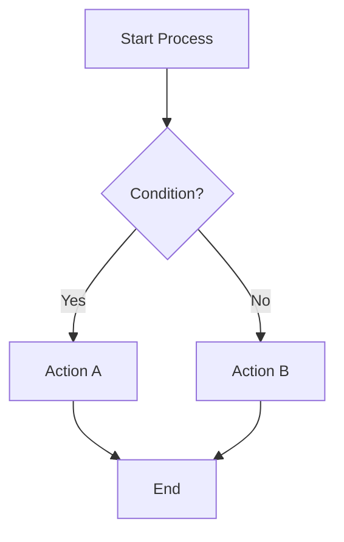
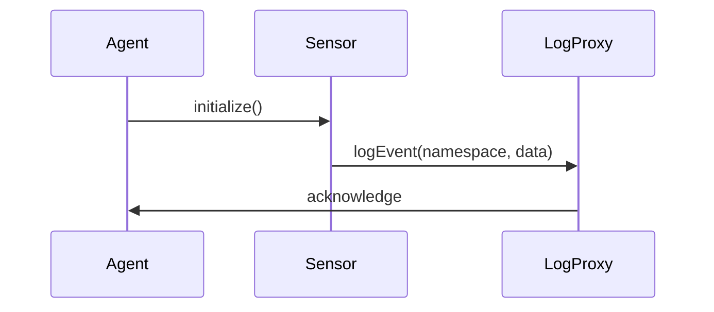
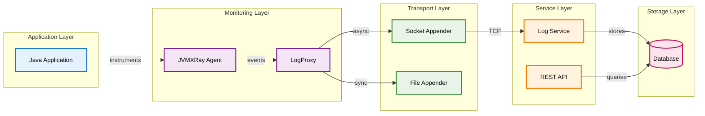
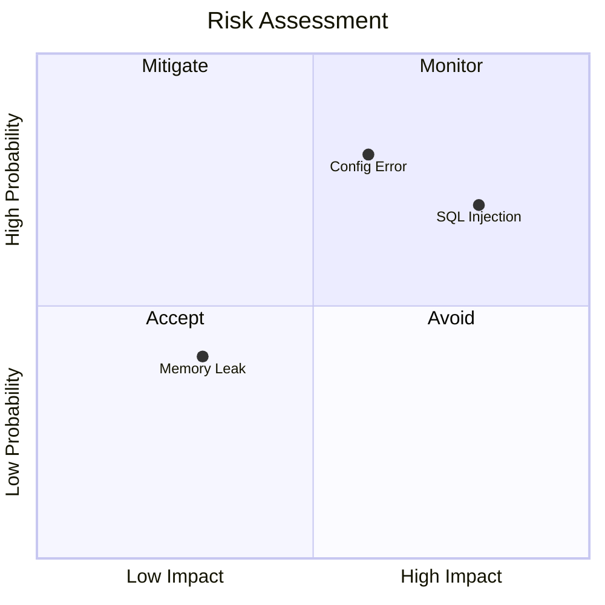
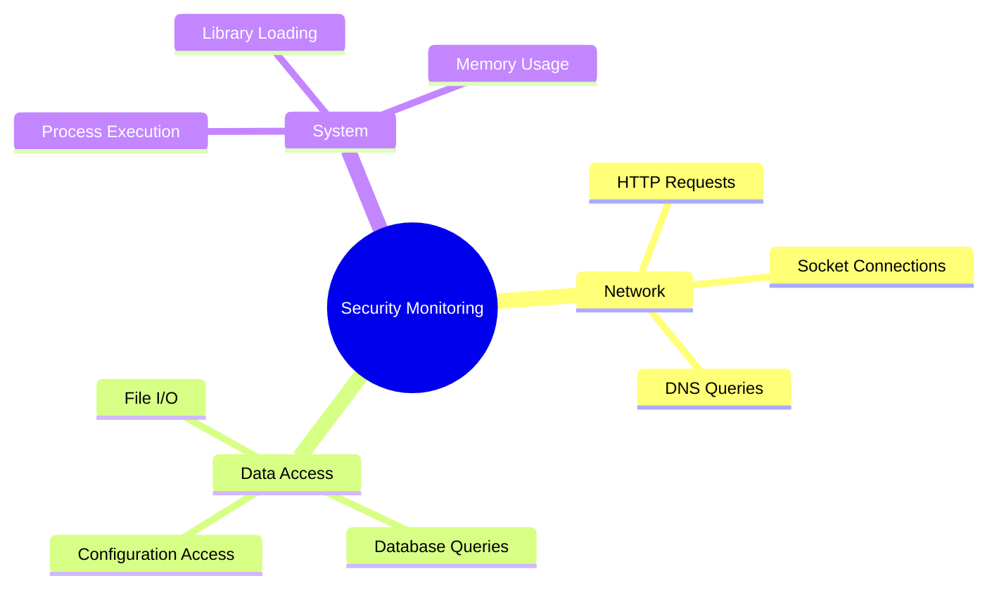

# {component name} ({project-name})
<!-- Example: JVMXRay Agent (prj-agent) -->

## Table of Contents

1. [Background and Purpose](#background-and-purpose)
2. [Architecture](#architecture)
3. [CLI Commands](#cli-commands)
4. [Properties](#properties)
   - 4.1 [Environment Variables](#environment-variables)
   - 4.2 [System Properties](#system-properties)
   - 4.3 [Component Properties](#component-properties)
   - 4.4 [Logback XML Settings](#logback-xml-settings)
5. [REST API Endpoints](#rest-api-endpoints)
6. [Database Tables](#database-tables)
7. [Common Errors](#common-errors)
8. [Developer Guide](#developer-guide) (optional)

---

## Background and Purpose

### Project Overview
<!-- Brief 2-3 sentence description of what the project does -->

### Core Mission
<!-- Single sentence stating the primary goal -->

### Key Capabilities
<!-- Bullet list of 3-5 main features -->
-
-
-

---

## Architecture

### Module Structure
<!-- Table or tree showing module hierarchy -->

| Module | Purpose | Dependencies |
|--------|---------|--------------|
|        |         |              |

### Component Relationships
<!-- Simple ASCII diagram or bullet hierarchy -->

### Data Flow
<!-- Concise description of how data moves through the system -->

---

## CLI Commands

### Command Reference

#### [Tool Name]
**Purpose:** <!-- One line description -->

**Usage:**
```bash
# Basic syntax
```

**Options:**

| Option | Description | Default |
|--------|-------------|---------|

**Examples:**
```bash
# Example 1: Description

# Example 2: Description
```

<!-- Repeat for each CLI tool -->

---

## Properties

### Environment Variables

#### Runtime Environment

**Common Variables:**

| Variable | Description | Default | Required |
|----------|-------------|---------|----------|
|          |             |         |          |

### System Properties

#### JVM System Properties

**Location:** Set via `-D` flag at JVM startup

**Core Properties:**

| Property | Description | Default | Required |
|----------|-------------|---------|----------|
| -Djvmxray.home |  |  |  |
| -Dlogback.configurationFile |  |  |  |

### Component Properties

#### [Component Name].properties

**Location:** `path/to/properties`

**Core Settings:**

| Property | Description | Default Value | Required |
|----------|-------------|---------------|----------|
|          |             |               |          |

<!-- Repeat for each component -->

### Logback XML Settings

#### [Component] Logback Configuration

**Location:** `path/to/logback.xml`

**Key Appenders:**

| Appender | Purpose | Log File |
|----------|---------|----------|

**Properties:**

| Property | Description | Example |
|----------|-------------|---------|
---

## REST API Endpoints

### API Reference

#### [Resource Name]

**Endpoint:** `/api/v1/[resource]`

```yaml
method: GET
authentication: required
description: Brief description of what this endpoint does
parameters:
  - name: param1
    type: string
    required: true
    description: What this parameter controls
  - name: param2
    type: integer
    required: false
    default: 100
    description: Optional parameter description
responses:
  200:
    description: Success
    schema:
      type: object
      properties:
        data: array
        total: integer
  400:
    description: Bad Request
    schema:
      type: object
      properties:
        error: string
  401:
    description: Unauthorized
```

**Example Request:**
```bash
curl -X GET \
  'https://api.example.com/api/v1/resource?param1=value' \
  -H 'Authorization: Bearer YOUR_API_KEY' \
  -H 'Accept: application/json'
```

**Example Response:**
```json
{
  "data": [...],
  "total": 42
}
```

<!-- Repeat for each endpoint -->

---

## Database Tables

### Schema Overview
<!-- Brief description of database architecture -->

### Table Definitions

#### [TABLE_NAME]

**Purpose:** <!-- One line description -->

**Columns:**
```
+-------------+------+-------------+-------------+
| Column Name | Type | Description | Constraints |
+-------------+------+-------------+-------------+
|             |      |             |             |
+-------------+------+-------------+-------------+
```

**Indexes:**

| Index Name | Columns | Purpose |
|------------|---------|---------|

**Sample Data:**
```sql
-- Example query or data
```

<!-- Repeat for each table -->

---

## Common Errors

### Error Reference

#### [Error Category]

**Error Message:**
```
Brief error message as shown to user
```

**Cause:** One-line explanation of why this occurs

**Resolution:**
```bash
# Command or action to resolve
```

**Prevention:** Brief note on how to avoid this error

<!-- Include only most common/critical errors -->

---

## Developer Guide

**Note:** This section is optional. Include it when the component has developer-facing APIs, utilities, or patterns that require documentation beyond the architecture section.

### Development Patterns

#### [Pattern Name]
**Purpose:** <!-- One line description of what this pattern solves -->

**Location:** `path/to/implementation`

**Design:**
<!-- Brief description of the design pattern and architecture -->
- Key design decision 1
- Key design decision 2

**Usage:**
```java
// Example code showing how developers use this pattern
```

**Best Practices:**
- Guideline 1
- Guideline 2

<!-- Repeat for each significant pattern -->

### Utility Classes

#### [Utility Class Name]
**Purpose:** <!-- One line description -->

**Location:** `path/to/class`

**Key Methods:**

| Method | Parameters | Returns | Description |
|--------|------------|---------|-------------|
| methodName() | type param | type | What it does |

**Integration Example:**
```java
// Example showing how to integrate this utility
```

<!-- Repeat for each utility class -->

### Extension Points

#### [Extension Point Name]
**Purpose:** <!-- How developers can extend this component -->

**Interface/Base Class:** `path.to.ExtensionInterface`

**Implementation Steps:**
1. Extend/implement the base
2. Override required methods
3. Register with component

**Example:**
```java
// Example implementation
```

---

## Documentation Guidelines

### Format Standards
- Use Markdown tables for all structured data except database schemas
- Use ASCII tables with `+` borders only for database schemas and SQL-related content
- Keep descriptions to one line where possible
- Include practical examples for all commands
- Use consistent terminology throughout
- Use YAML format for REST endpoint definitions
- Include curl examples for REST endpoints
- Use Mermaid diagrams for architecture/flow visualization where appropriate
- Keep documentation lightweight and focused
- When a section is not required (e.g., no rest endpoints), mark it `[Not Applicable]`.

### Markdown Table Format
Use standard Markdown tables for most structured data:

| Column | Description | Type | Required |
|--------|-------------|------|----------|
| value  | description | string | Yes |

### Database Schema Tables
For database schemas, use ASCII format with `+` borders:
```
+----------+-------------+------+-----+---------+-------+
| Field    | Type        | Null | Key | Default | Extra |
+----------+-------------+------+-----+---------+-------+
| id       | uuid        | NO   | PRI | NULL    |       |
| username | varchar(50) | NO   | UNI | NULL    |       |
| email    | varchar(100)| YES  | UNI | NULL    |       |
+----------+-------------+------+-----+---------+-------+
```

### Mermaid Usage Guidelines

**Diagram Selection:**
- **Flowcharts**: Business processes, conditional logic, user workflows
- **Sequence Diagrams**: Technical API interactions, method calls, temporal relationships
- **Architecture Diagrams**: System overview, service relationships, deployment topology
- **Quadrant Charts**: Risk matrices, prioritization, comparison analysis
- **Mind Maps**: Domain modeling, feature exploration, concept hierarchies

**Best Practices:**
- Keep diagrams focused on a single concept
- Use consistent node naming conventions
- Include width configuration for complex diagrams
- Prefer multiple simple diagrams over one complex diagram

### Content Principles
- **Minimal**: Only essential information
- **Relevant**: Focus on what users need to know
- **Practical**: Include working examples
- **Maintainable**: Easy to update as project evolves
- **Lightweight**: Keep context tight for both AI and human readers

### Mermaid Diagram Examples

#### Process Flowcharts
**Use for:** Business processes, decision workflows, user journeys



#### Sequence Diagrams
**Use for:** Technical interactions, API calls, method invocations between components



#### Architecture Diagrams
**Use for:** System architecture, component relationships, data flow across multiple services



#### Quadrant Charts
**Use for:** Risk assessment, feature prioritization, impact vs effort analysis



#### Mind Maps
**Use for:** Domain exploration, feature brainstorming, concept relationships

