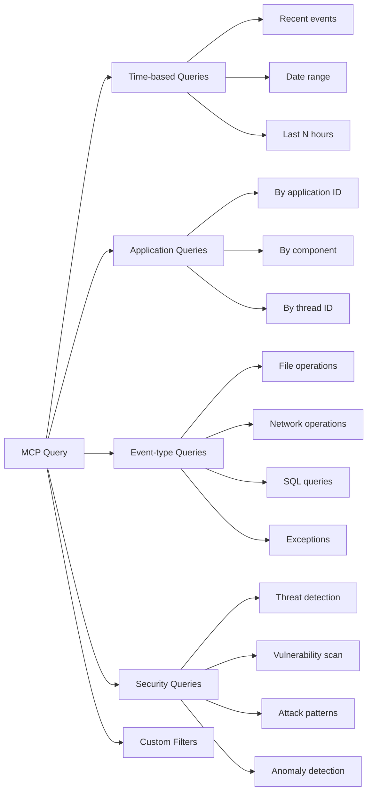
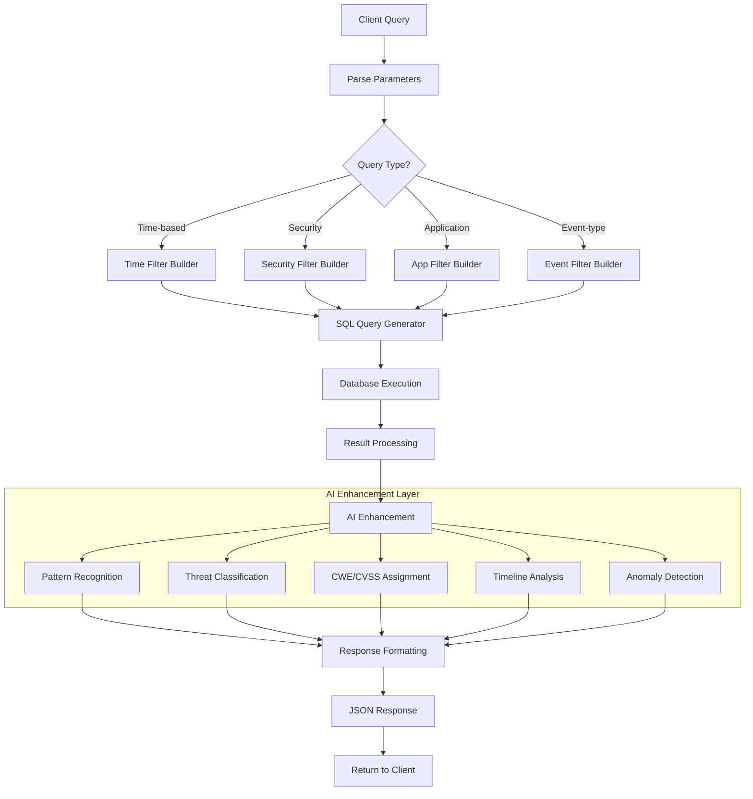
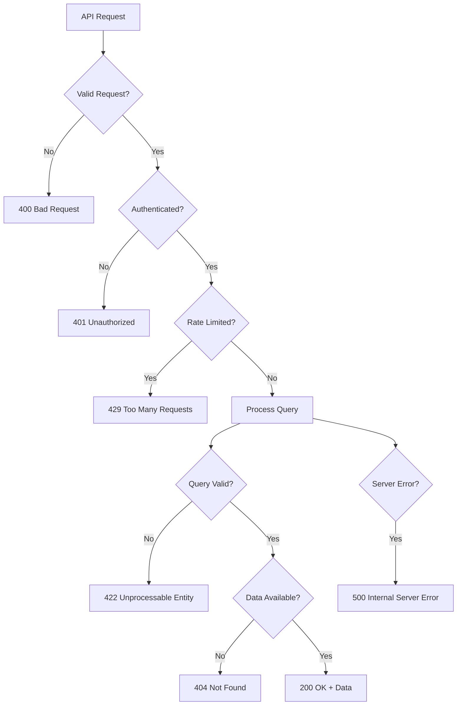
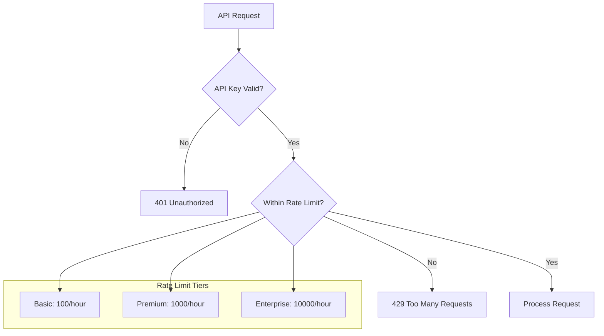
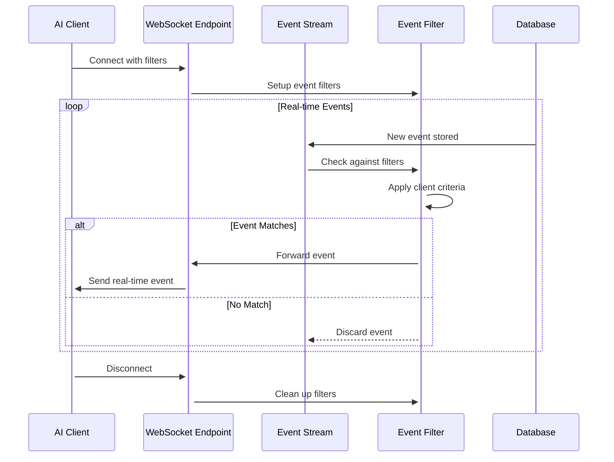

# MCP Server API Documentation

## Overview
The JVMXRay MCP (Model Context Protocol) Server provides AI clients with intelligent access to security event data through structured queries and enhanced analysis capabilities.

## API Request Flow
```mermaid
sequenceDiagram
    participant Client as AI Client
    participant MCP as MCP Server
    participant Auth as Authentication
    participant Query as Query Engine
    participant DB as Database
    participant AI as AI Analyzer
    
    Client->>+MCP: API Request with key
    MCP->>+Auth: Validate API key
    Auth-->>-MCP: Authentication result
    
    alt Authentication Success
        MCP->>+Query: Parse query parameters
        Query->>Query: Build database query
        Query->>+DB: Execute with filters
        DB-->>-Query: Raw event data
        Query->>+AI: Analyze patterns
        AI->>AI: Apply security intelligence
        AI-->>-Query: Enhanced metadata
        Query-->>-MCP: Structured response
        MCP-->>-Client: JSON response with intelligence
    else Authentication Failed
        MCP-->>-Client: 401 Unauthorized
    end
```

## Query Types and Parameters


## Authentication Flow
```mermaid
sequenceDiagram
    participant Client as AI Client
    participant MCP as MCP Server
    participant KeyStore as API Key Store
    participant Session as Session Manager
    
    Client->>+MCP: Request with API key
    MCP->>+KeyStore: Validate key format
    KeyStore->>KeyStore: Check key exists
    KeyStore->>KeyStore: Check key expiration
    KeyStore->>KeyStore: Check rate limits
    KeyStore-->>-MCP: Validation result
    
    alt Valid Key
        MCP->>+Session: Create session
        Session-->>-MCP: Session token
        MCP-->>-Client: 200 OK + session
    else Invalid Key
        MCP-->>-Client: 401 Unauthorized
    else Rate Limited
        MCP-->>-Client: 429 Too Many Requests
    end
```

## Query Processing Pipeline


## API Endpoints

### Event Query Endpoint
```yaml
endpoint: /api/v1/events
method: GET
description: "Query security events with filters and pagination"

parameters:
  time_start:
    type: datetime
    description: "Start time for event range"
    example: "2025-09-07T10:00:00Z"
  time_end:
    type: datetime
    description: "End time for event range"
    example: "2025-09-07T11:00:00Z"
  application_id:
    type: string
    description: "Filter by application identifier"
    example: "web-server-prod"
  event_type:
    type: string
    description: "Filter by event namespace"
    example: "org.jvmxray.events.io.fileread"
  severity:
    type: enum[low|medium|high|critical]
    description: "Filter by security severity"
    example: "high"
  limit:
    type: integer
    description: "Maximum events to return"
    default: 100
    maximum: 1000
  offset:
    type: integer
    description: "Pagination offset"
    default: 0

response:
  type: object
  properties:
    events:
      type: array
      items:
        $ref: "#/components/schemas/SecurityEvent"
    metadata:
      type: object
      properties:
        total_count:
          type: integer
        filtered_count:
          type: integer
        ai_analysis:
          type: object
```

### Threat Analysis Endpoint
```yaml
endpoint: /api/v1/threats
method: GET
description: "Get AI-enhanced threat analysis"

parameters:
  time_range:
    type: string
    description: "Time range for analysis"
    enum: ["1h", "24h", "7d", "30d"]
    default: "24h"
  application_filter:
    type: string
    description: "Application to analyze"
    example: "payment-service"
  threat_types:
    type: array
    items:
      type: string
      enum: ["sql_injection", "file_traversal", "command_injection", "data_exfiltration"]

response:
  type: object
  properties:
    threats:
      type: array
      items:
        type: object
        properties:
          threat_type:
            type: string
          severity:
            type: string
          confidence:
            type: number
          events:
            type: array
          timeline:
            type: array
          mitre_tactics:
            type: array
          cwe_classifications:
            type: array
```

## Response Format Examples

### Standard Event Query Response
```json
{
  "events": [
    {
      "event_id": "evt_abc123def456",
      "timestamp": "2025-09-07T10:15:30.123Z",
      "namespace": "org.jvmxray.events.io.fileread",
      "application_id": "web-server-01",
      "thread_id": "http-nio-8080-exec-1",
      "priority": "INFO",
      "fields": {
        "caller": "com.example.FileProcessor:145",
        "target": "/etc/passwd",
        "status": "denied"
      },
      "ai_analysis": {
        "severity": "high",
        "cwe": ["CWE-22", "CWE-200"],
        "mitre_tactics": ["T1005", "T1083"],
        "confidence": 0.94,
        "threat_indicators": [
          "system_file_access",
          "sensitive_file_read"
        ]
      }
    }
  ],
  "metadata": {
    "total_count": 1247,
    "filtered_count": 23,
    "query_time_ms": 45,
    "ai_analysis_summary": {
      "high_severity_events": 3,
      "potential_threats": 1,
      "anomalies_detected": 0
    }
  }
}
```

### Threat Analysis Response
```json
{
  "analysis_period": {
    "start": "2025-09-07T09:00:00Z",
    "end": "2025-09-07T10:00:00Z"
  },
  "threats": [
    {
      "threat_id": "thr_file_traversal_001",
      "type": "file_traversal",
      "severity": "high",
      "confidence": 0.89,
      "events_count": 15,
      "timeline": [
        {
          "timestamp": "2025-09-07T09:15:00Z",
          "event": "Initial probe attempt"
        },
        {
          "timestamp": "2025-09-07T09:16:30Z",
          "event": "Escalated to system files"
        }
      ],
      "mitre_mapping": {
        "tactics": ["TA0007"],
        "techniques": ["T1005", "T1083"]
      },
      "cwe_classifications": ["CWE-22", "CWE-200"],
      "affected_applications": ["web-server-01", "api-gateway-02"],
      "recommendations": [
        "Implement input validation",
        "Add file access controls",
        "Monitor system file access"
      ]
    }
  ],
  "summary": {
    "total_threats": 1,
    "high_severity": 1,
    "medium_severity": 0,
    "applications_affected": 2,
    "recommendation_priority": "immediate"
  }
}
```

## Error Handling


## Rate Limiting


## Security Headers
```yaml
required_headers:
  Authorization:
    format: "Bearer {api_key}"
    example: "Bearer jvmx_abc123def456ghi789"
  Content-Type:
    value: "application/json"
  User-Agent:
    format: "{client_name}/{version}"
    example: "Claude-Desktop/1.0"

response_headers:
  X-Rate-Limit-Remaining:
    description: "Requests remaining in current window"
  X-Rate-Limit-Reset:
    description: "Unix timestamp when rate limit resets"
  X-Response-Time:
    description: "Query processing time in milliseconds"
```

## WebSocket Real-Time Events


## See Also
- [Event Format Reference](../reference/all-events.md)
- [Authentication Guide](../guides/authentication.md)
- [Query Examples](../examples/mcp-queries.md)
- [AI Enhancement Details](ai-analysis.md)