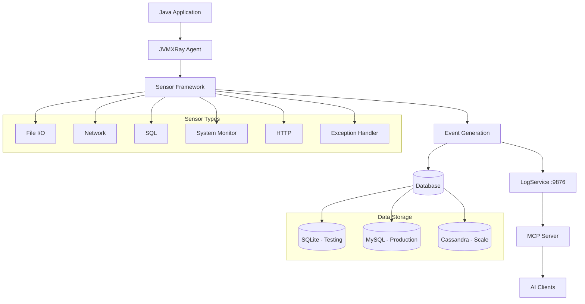
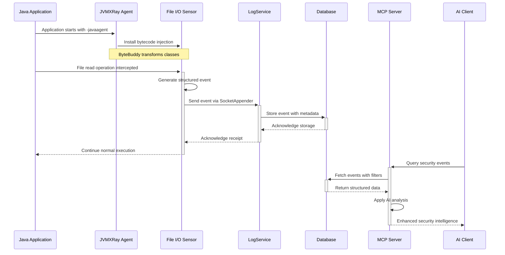
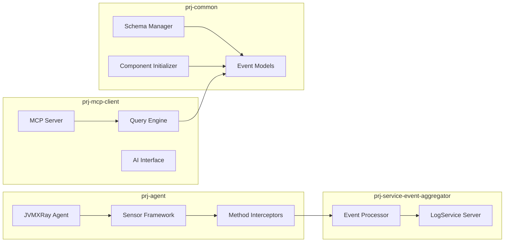
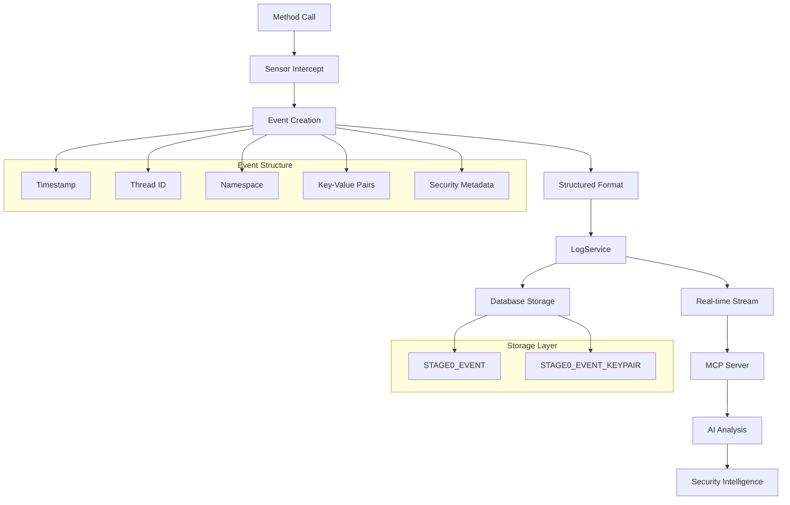
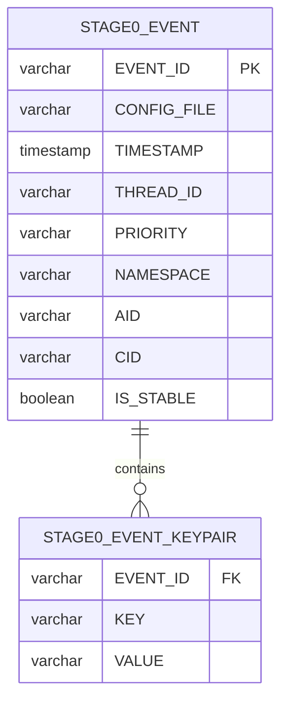
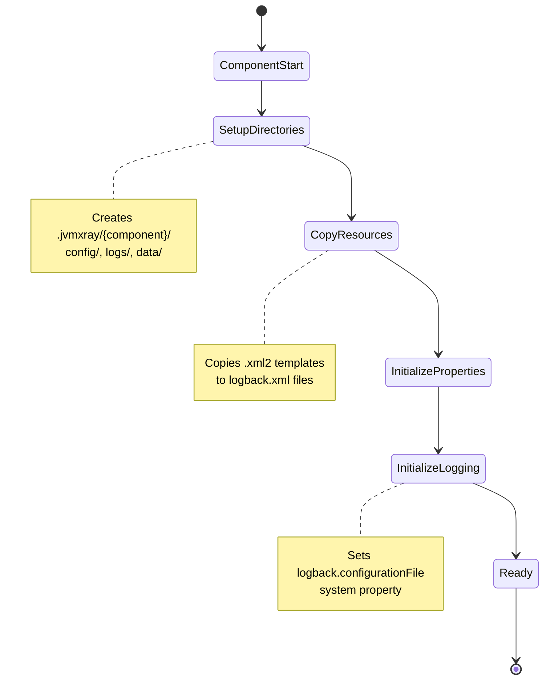

# JVMXRay Architecture Overview

## Overview
JVMXRay uses bytecode injection to install sensors that monitor Java applications in real-time, generating structured security events without requiring application code changes.

## System Architecture


## Component Interaction Flow


## Multi-Module Architecture


## Data Flow Architecture


## Database Schema Design


## Component Initialization System


## Key Architectural Principles

### Zero Application Impact
- **Bytecode Injection**: Uses ByteBuddy to modify classes at load time
- **Non-Intrusive**: Applications run normally with monitoring layer
- **Performance Optimized**: Minimal overhead (<3% typical)

### Structured Event Generation
- **Machine-Readable**: YAML/JSON compatible event format
- **Consistent Schema**: All events follow standardized structure
- **AI-Ready**: Structured data enables intelligent analysis

### Enterprise Integration
- **Logging Framework**: Built on Logback/SLF4J standards
- **Database Agnostic**: Supports SQLite, MySQL, Cassandra
- **Scalable Design**: From single apps to enterprise deployments

### Real-Time Intelligence
- **Live Streaming**: SocketAppender for immediate event delivery
- **AI Enhancement**: MCP server provides intelligent analysis
- **Pattern Detection**: Automated threat and vulnerability identification

## Component Directory Structure
```
.jvmxray/
├── agent/
│   ├── config/
│   │   ├── logback.xml
│   │   └── agent.properties
│   ├── logs/
│   └── data/
├── common/
│   ├── config/
│   │   ├── logback.xml
│   │   └── common.properties
│   ├── logs/
│   └── data/
│       └── jvmxray-test.db
└── integration/
    ├── config/
    ├── logs/
    └── data/
```

## See Also
- [Sensor Development Guide](../guides/sensor-development.md)
- [Database Schema Documentation](database-schema.md)
- [Event Data Flow](data-flow.md)
- [MCP Server API](../api/mcp-server.md)