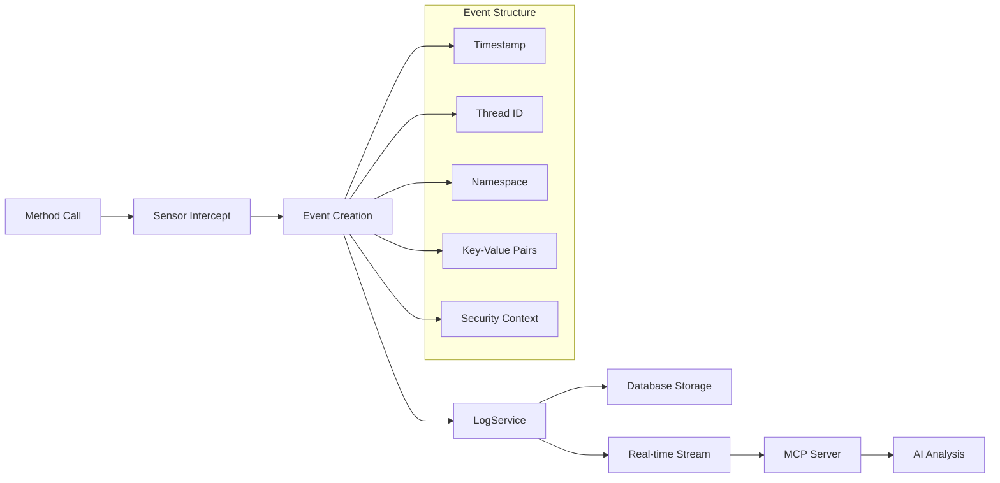
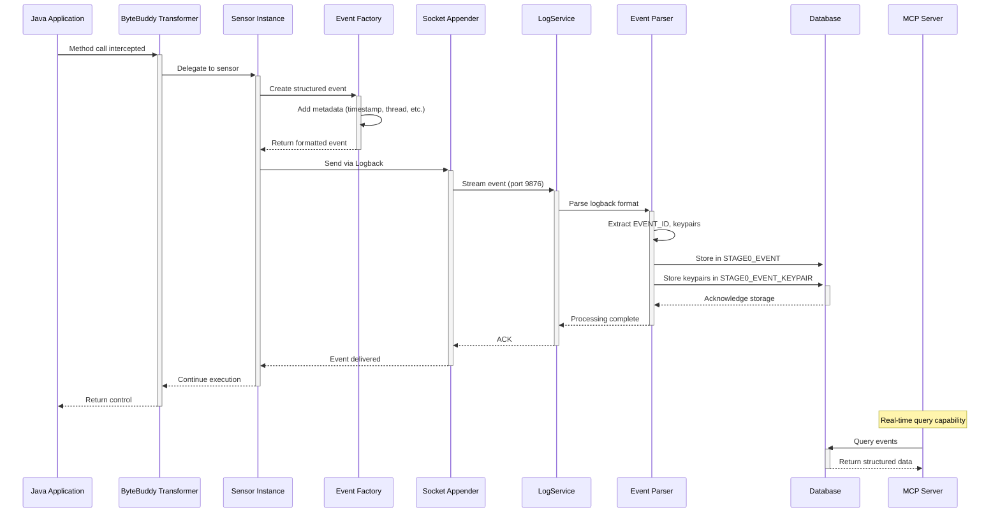
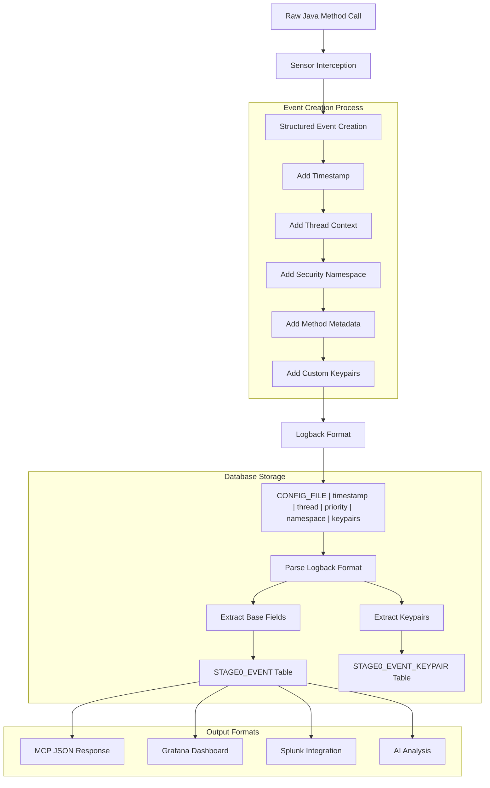
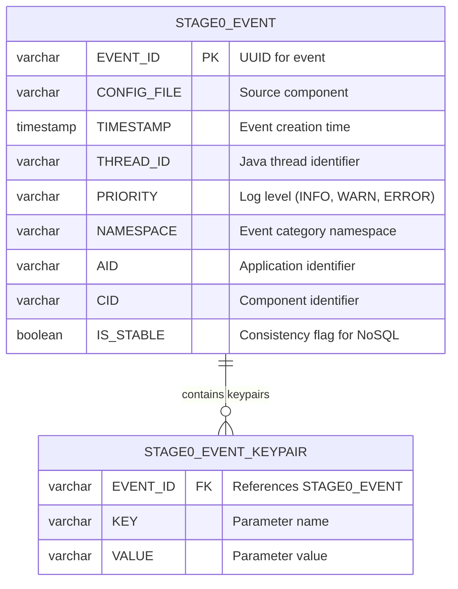
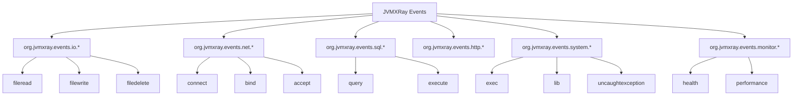
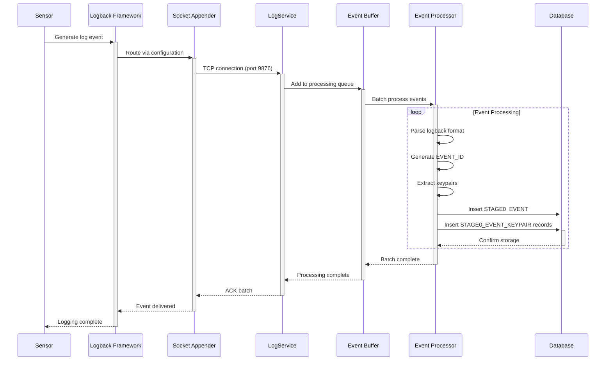
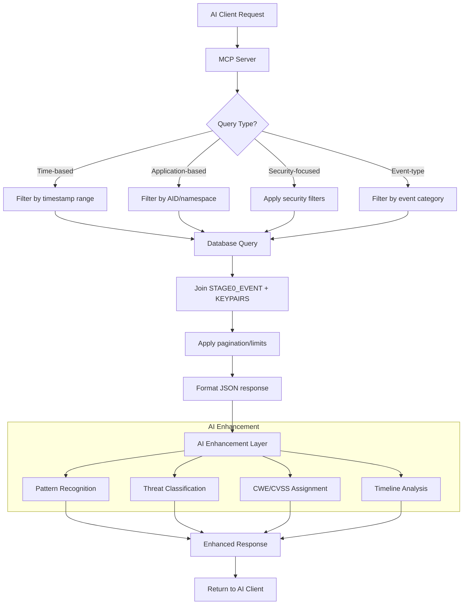
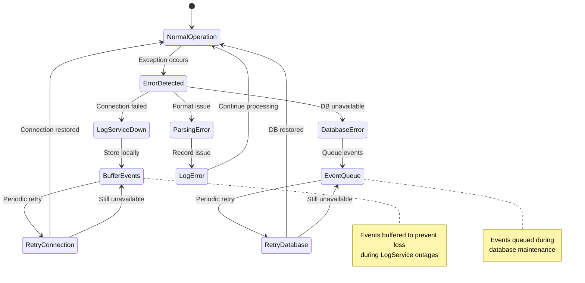
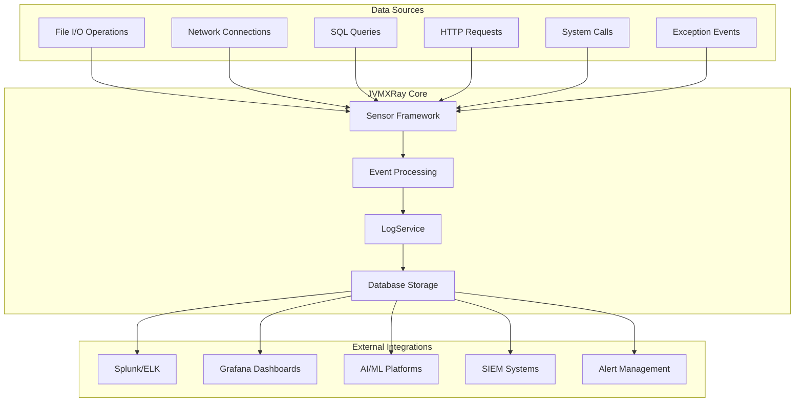

# JVMXRay Data Flow Architecture

## Overview
This document details how data flows through the JVMXRay system from method interception to AI-enhanced security analysis.

## Event Lifecycle Overview

## Detailed Event Processing Flow

## Event Format Transformation

## Database Storage Pattern

## Event Categories and Namespaces

## Real-Time Data Streaming

## MCP Server Query Processing

## Performance Optimization Flow

```mermaid
graph LR
    subgraph "Sensor Layer"
        A[Method Interception] --> B[Minimal Processing]
        B --> C[Async Event Creation]
    end
    
    subgraph "Transport Layer"
        C --> D[SocketAppender Buffer]
        D --> E[Batch Transmission]
    end
    
    subgraph "Processing Layer"
        E --> F[LogService Queue]
        F --> G[Batch Processing]
        G --> H[Database Batch Insert]
    end
    
    subgraph "Query Layer"
        H --> I[Indexed Tables]
        I --> J[Optimized Queries]
        J --> K[Result Caching]
    end
```

## Error Handling and Recovery

## Integration Points

## See Also
- [Architecture Overview](README.md)
- [Database Schema Documentation](database-schema.md)
- [MCP Server API](../api/mcp-server.md)
- [Event Format Reference](../reference/all-events.md)