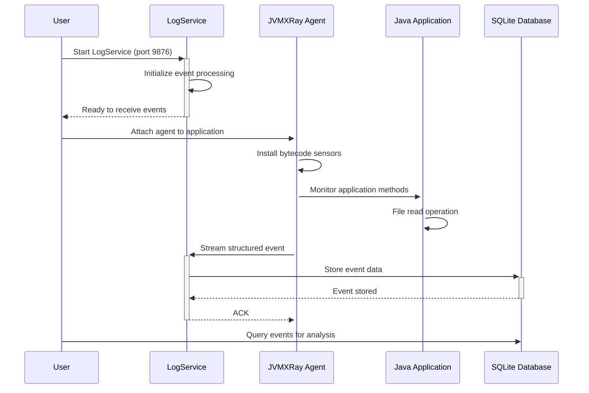

# JVMXRay Quick Start Guide

## Overview
Get JVMXRay running in **under 5 minutes** with SQLite demo data and optional AI integration.

## Prerequisites
- Java 11+ (JDK)
- Maven 3.6+
- 2GB available RAM
- 500MB disk space

## Quick Installation

### 1. Clone and Build
```bash
# Clone the repository
cd {your-github-folder}/
git clone https://github.com/spoofzu/jvmxray.git
cd jvmxray

# Build the project (includes integration tests)
mvn clean install
```

**Expected Output**: Build completes successfully with integration tests showing sensor events.

### 2. Verify Build Artifacts
```bash
# Check agent JAR
ls -la prj-agent/target/prj-agent-0.0.1-shaded.jar

# Check LogService JAR  
ls -la prj-service-event-aggregator/target/prj-service-event-aggregator-0.0.1.jar

# Check test database created
ls -la .jvmxray/common/data/jvmxray-test.db
```

## Basic Usage

### Option A: Quick Demo (Recommended)
```bash
# Run the integration test to see JVMXRay in action
./test-integration.sh
```

This demonstrates:
- Agent attachment to Java application
- Real-time sensor event generation
- LogService event collection
- Database storage of structured events

### Option B: Manual Setup

#### 1. Start LogService
```bash
# Terminal 1: Start LogService (port 9876)
java -cp prj-service-event-aggregator/target/prj-service-event-aggregator-0.0.1.jar \
     org.jvmxray.service.eventAggregator.bin.LogService
```

#### 2. Run Application with Agent
```bash
# Terminal 2: Run your application with JVMXRay agent
java -javaagent:prj-agent/target/prj-agent-0.0.1-shaded.jar \
     -jar your-application.jar
```

#### 3. Monitor Events
```bash
# Terminal 3: Watch real-time events
tail -f .jvmxray/agent/logs/agent.log | grep "org.jvmxray.events"
```

## Event Monitoring Setup


## Configuration Files

### Agent Configuration
File: `.jvmxray/agent/config/logback.xml`
```xml
<?xml version="1.0" encoding="UTF-8"?>
<configuration>
    <appender name="SOCKET" class="ch.qos.logback.classic.net.SocketAppender">
        <remoteHost>localhost</remoteHost>
        <port>9876</port>
        <reconnectionDelay>10000</reconnectionDelay>
        <includeCallerData>false</includeCallerData>
    </appender>
    
    <root level="INFO">
        <appender-ref ref="SOCKET"/>
    </root>
</configuration>
```

### LogService Configuration  
File: `.jvmxray/common/config/common.properties`
```properties
# Database settings
database.type=sqlite
database.url=jdbc:sqlite:.jvmxray/common/data/jvmxray-test.db

# LogService settings
logservice.port=9876
logservice.buffer.size=1000
```

## Verify Installation

### 1. Check Sensor Events
```bash
# Look for file I/O events
grep "org.jvmxray.events.io" .jvmxray/*/logs/*.log

# Look for network events
grep "org.jvmxray.events.net" .jvmxray/*/logs/*.log

# Count total events
grep -c "org.jvmxray.events" .jvmxray/*/logs/*.log
```

### 2. Database Verification
```bash
# Check database schema
sqlite3 .jvmxray/common/data/jvmxray-test.db ".schema"

# Count stored events
sqlite3 .jvmxray/common/data/jvmxray-test.db "SELECT COUNT(*) FROM STAGE0_EVENT;"

# View recent events
sqlite3 .jvmxray/common/data/jvmxray-test.db "SELECT * FROM STAGE0_EVENT ORDER BY TIMESTAMP DESC LIMIT 5;"
```

### 3. Health Checks
```bash
# Check Java processes
ps aux | grep -E "(jvmxray|LogService)"

# Check port usage
netstat -an | grep 9876

# Check log files
ls -la .jvmxray/*/logs/
```

## AI Integration (Optional)

### Setup MCP Server
```bash
# Generate API key for AI clients
./scripts/generate-api-key.sh

# Start MCP Server
./scripts/start-mcp-server.sh
```

### Configure Claude Desktop
Add to your Claude Desktop MCP configuration:
```json
{
  "mcp": {
    "servers": {
      "jvmxray": {
        "command": "node",
        "args": ["path/to/jvmxray/mcp-server.js"],
        "env": {
          "JVMXRAY_API_KEY": "your-generated-key",
          "JVMXRAY_DB_PATH": "path/to/.jvmxray/common/data/jvmxray-test.db"
        }
      }
    }
  }
}
```

## Common Event Examples

### File Access Events
```
2025.09.07 at 16:38:52 CDT | INFO | org.jvmxray.events.io.fileread | caller=java.io.FileInputStream:189, target=/etc/hosts, status=success
```

### Network Connection Events
```
2025.09.07 at 16:38:51 CDT | INFO | org.jvmxray.events.net.connect | caller=java.net.Socket:189, destination=google.com:443, status=connected
```

### SQL Query Events
```
2025.09.07 at 16:38:50 CDT | INFO | org.jvmxray.events.sql.query | caller=PreparedStatement:123, query=SELECT * FROM users WHERE id = ?, status=executed
```

## Next Steps

### Production Deployment
1. **Database Setup**: Configure MySQL or Cassandra for production
2. **Scaling**: Deploy LogService cluster for high availability
3. **Monitoring**: Set up Grafana dashboards for event visualization
4. **Integration**: Connect to existing SIEM/logging infrastructure

### Development
1. **Custom Sensors**: [Create new sensors](sensor-development.md) for specific monitoring needs
2. **Event Analysis**: Use [MCP queries](../examples/mcp-queries.md) for security analysis
3. **Performance Tuning**: Optimize for your application's specific patterns

### Security Analysis
Try these AI prompts with your MCP-enabled client:
- *"Show me all file access events in the last hour"*
- *"Find potential security vulnerabilities in network connections"* 
- *"Analyze SQL queries for injection attempts"*
- *"Create a security timeline for the last 24 hours"*

## Troubleshooting

### Build Issues
```bash
# Clean rebuild
mvn clean install -U

# Check Java version
java -version

# Verify Maven settings
mvn -version
```

### Runtime Issues  
```bash
# Check agent attachment
java -javaagent:prj-agent/target/prj-agent-0.0.1-shaded.jar -version

# Verify LogService connectivity
telnet localhost 9876

# Check log file permissions
ls -la .jvmxray/*/logs/
```

### No Events Generated
```bash
# Enable debug logging
java -Djvmxray.debug=true -javaagent:prj-agent/target/prj-agent-0.0.1-shaded.jar -jar app.jar

# Check sensor initialization
grep "Sensor.*initialized" .jvmxray/agent/logs/agent.log

# Verify bytecode injection
grep "ByteBuddy" .jvmxray/agent/logs/agent.log
```

## Performance Expectations

| Component | Memory Usage | CPU Overhead | Disk Usage |
|-----------|--------------|--------------|------------|
| Agent | 50-100MB | <3% | Minimal |
| LogService | 100-200MB | <5% | Log rotation |
| Database | 50MB+ | <2% | Event storage |

## Directory Structure
```
.jvmxray/
├── agent/
│   ├── config/
│   │   └── logback.xml
│   ├── logs/
│   │   └── agent.log
│   └── data/
├── common/
│   ├── config/
│   │   ├── logback.xml
│   │   └── common.properties
│   ├── logs/
│   │   └── common.log
│   └── data/
│       └── jvmxray-test.db
└── integration/
    ├── config/
    ├── logs/
    └── data/
```

## See Also
- [Complete Command Reference](../reference/all-commands.md)
- [Troubleshooting Guide](troubleshooting.md)
- [Architecture Overview](../architecture/README.md)
- [Sensor Reference](../reference/all-sensors.md)