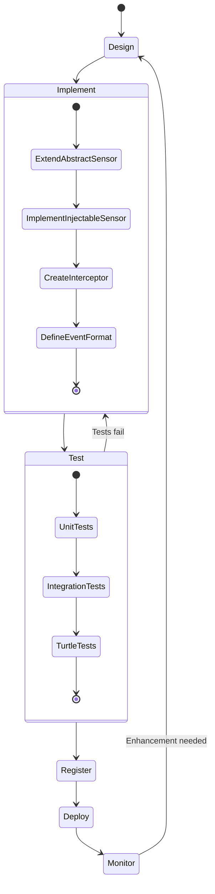
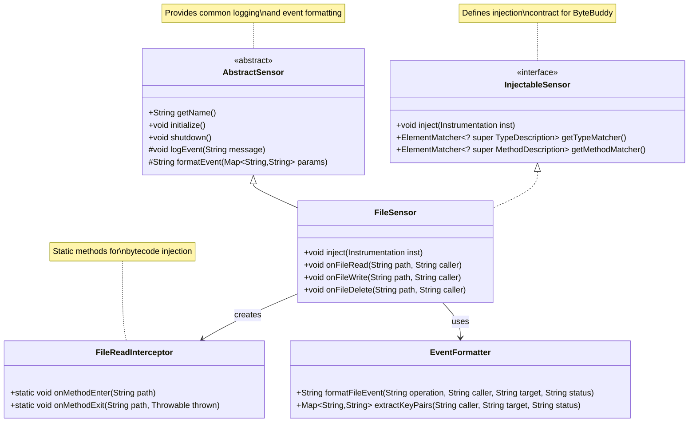
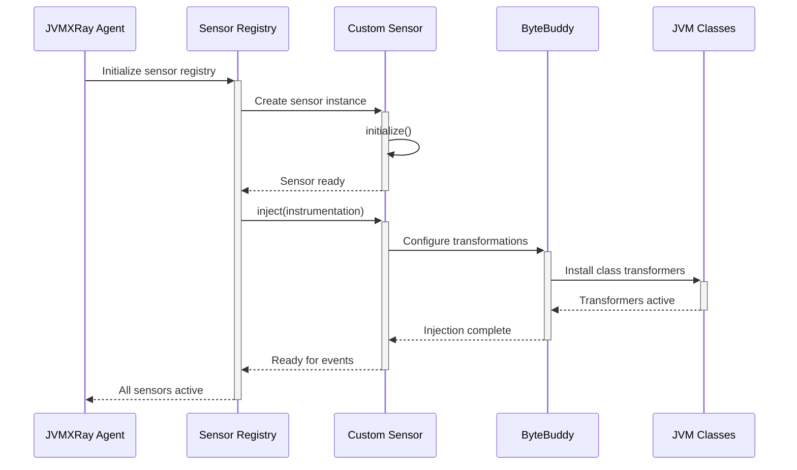
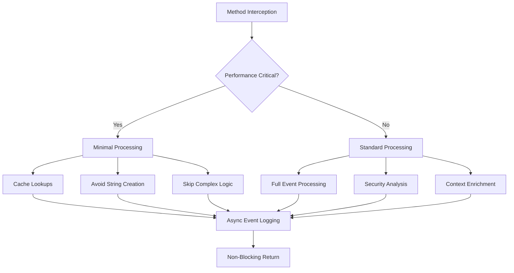
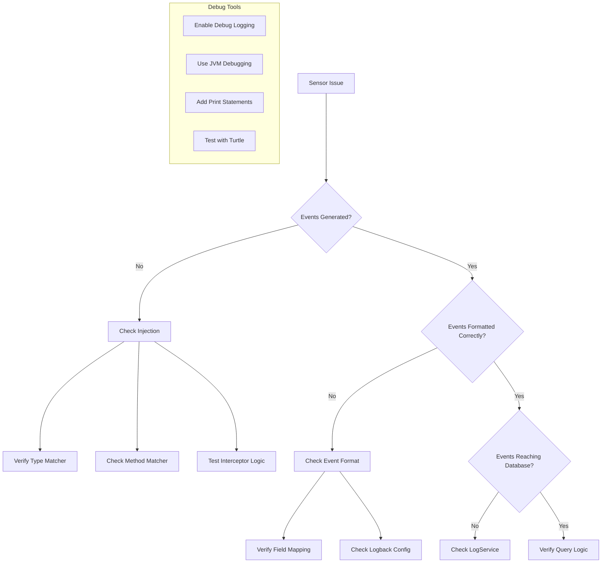

# Sensor Development Guide

## Overview
This guide walks through creating custom sensors for JVMXRay using bytecode injection patterns and structured event generation.

## Prerequisites
- Java 11+ development environment  
- Understanding of bytecode injection concepts
- Familiarity with ByteBuddy framework
- Knowledge of JVMXRay event format

## Sensor Development Lifecycle


## Sensor Architecture


## Step-by-Step Implementation

### 1. Extend AbstractSensor
```java
package org.jvmxray.agent.sensors.io;

import org.jvmxray.agent.core.AbstractSensor;
import org.jvmxray.agent.core.InjectableSensor;

public class FileSensor extends AbstractSensor implements InjectableSensor {
    
    private static final String SENSOR_NAME = "FileSensor";
    private static final String EVENT_NAMESPACE = "org.jvmxray.events.io";
    
    @Override
    public String getName() {
        return SENSOR_NAME;
    }
    
    @Override
    public void initialize() {
        super.initialize();
        // Sensor-specific initialization
        logInfo("FileSensor initialized successfully");
    }
    
    @Override
    public void shutdown() {
        logInfo("FileSensor shutting down");
        super.shutdown();
    }
}
```

### 2. Implement Injection Logic
```java
import net.bytebuddy.agent.builder.AgentBuilder;
import net.bytebuddy.asm.Advice;
import net.bytebuddy.matcher.ElementMatchers;

public class FileSensor extends AbstractSensor implements InjectableSensor {
    
    @Override
    public void inject(Instrumentation instrumentation) {
        new AgentBuilder.Default()
            .type(getTypeMatcher())
            .transform((builder, typeDescription, classLoader, module) ->
                builder.method(getMethodMatcher())
                       .intercept(Advice.to(FileReadInterceptor.class)))
            .installOn(instrumentation);
    }
    
    @Override
    public ElementMatcher<? super TypeDescription> getTypeMatcher() {
        return ElementMatchers.nameStartsWith("java.io")
               .or(ElementMatchers.nameStartsWith("java.nio"));
    }
    
    @Override
    public ElementMatcher<? super MethodDescription> getMethodMatcher() {
        return ElementMatchers.named("read")
               .or(ElementMatchers.named("write"))
               .or(ElementMatchers.named("delete"));
    }
}
```

### 3. Create Method Interceptor
```java
import net.bytebuddy.asm.Advice;

public class FileReadInterceptor {
    
    @Advice.OnMethodEnter
    public static void onMethodEnter(
            @Advice.Origin String method,
            @Advice.AllArguments Object[] args) {
        
        try {
            String caller = extractCaller();
            String target = extractTarget(args);
            
            // Generate structured event
            FileSensor.getInstance().onFileRead(target, caller);
            
        } catch (Exception e) {
            // Never break application flow
            logError("Error in file read interception", e);
        }
    }
    
    @Advice.OnMethodExit(onThrowable = Throwable.class)
    public static void onMethodExit(
            @Advice.Origin String method,
            @Advice.Return Object result,
            @Advice.Thrown Throwable thrown) {
        
        try {
            String status = (thrown != null) ? "error" : "success";
            // Log completion status if needed
            
        } catch (Exception e) {
            logError("Error in file read exit", e);
        }
    }
    
    private static String extractCaller() {
        StackTraceElement[] stack = Thread.currentThread().getStackTrace();
        // Find the real caller (skip interceptor frames)
        for (StackTraceElement element : stack) {
            if (!element.getClassName().contains("jvmxray") && 
                !element.getClassName().contains("ByteBuddy")) {
                return element.getClassName() + ":" + element.getLineNumber();
            }
        }
        return "unknown:0";
    }
    
    private static String extractTarget(Object[] args) {
        // Extract file path from method arguments
        if (args != null && args.length > 0) {
            return args[0].toString();
        }
        return "unknown";
    }
}
```

### 4. Define Event Format
```java
public class FileSensor extends AbstractSensor implements InjectableSensor {
    
    public void onFileRead(String target, String caller) {
        String eventMessage = formatFileEvent("read", caller, target, "success");
        logEvent(EVENT_NAMESPACE + ".fileread", eventMessage);
    }
    
    public void onFileWrite(String target, String caller) {
        String eventMessage = formatFileEvent("write", caller, target, "success");
        logEvent(EVENT_NAMESPACE + ".filewrite", eventMessage);
    }
    
    public void onFileDelete(String target, String caller) {
        String eventMessage = formatFileEvent("delete", caller, target, "success");
        logEvent(EVENT_NAMESPACE + ".filedelete", eventMessage);
    }
    
    private String formatFileEvent(String operation, String caller, String target, String status) {
        Map<String, String> params = new HashMap<>();
        params.put("operation", operation);
        params.put("caller", caller);
        params.put("target", target);
        params.put("status", status);
        
        return formatEvent(params);
    }
}
```

## Event Format Specification
```yaml
file_read_event:
  namespace: "org.jvmxray.events.io.fileread"
  format: "caller={class}:{line}, target={path}, status={result}"
  example: "caller=com.example.FileProcessor:189, target=/etc/passwd, status=success"
  
  fields:
    caller:
      type: string
      description: "Calling class and line number"
      required: true
      format: "{className}:{lineNumber}"
    target:
      type: string
      description: "Absolute file path being accessed"
      required: true
    status:
      type: enum[success|denied|error]
      description: "Operation result"
      required: true
      
  security:
    cwe: ["CWE-22", "CWE-200"]
    mitre: ["T1005", "T1083"]
    severity: medium
    indicators:
      - "system_file_access"
      - "sensitive_data_read"
```

## Testing Your Sensor

### 1. Unit Test Structure
```java
public class FileSensorTest {
    
    private FileSensor sensor;
    private MockInstrumentation instrumentation;
    
    @Before
    public void setUp() {
        sensor = new FileSensor();
        instrumentation = new MockInstrumentation();
        sensor.initialize();
    }
    
    @Test
    public void testSensorInitialization() {
        assertEquals("FileSensor", sensor.getName());
        assertTrue(sensor.isInitialized());
    }
    
    @Test
    public void testEventGeneration() {
        // Capture log events
        LogCapture logCapture = LogCapture.start();
        
        // Trigger sensor event
        sensor.onFileRead("/test/file.txt", "TestClass:123");
        
        // Verify event format
        List<String> events = logCapture.getEvents();
        assertEquals(1, events.size());
        assertTrue(events.get(0).contains("org.jvmxray.events.io.fileread"));
        assertTrue(events.get(0).contains("caller=TestClass:123"));
        assertTrue(events.get(0).contains("target=/test/file.txt"));
    }
    
    @Test
    public void testBytecodeInjection() {
        // Test that injection doesn't throw exceptions
        assertDoesNotThrow(() -> sensor.inject(instrumentation));
        
        // Verify interceptors were registered
        assertTrue(instrumentation.hasTransformers());
    }
}
```

### 2. Integration Test with Turtle
```java
// Add to TurtleIntegrationTest.java
public void testFileOperations() throws Exception {
    // Trigger file operations that should be detected
    File testFile = new File("/tmp/jvmxray-test.txt");
    
    // File write operation
    try (FileOutputStream fos = new FileOutputStream(testFile)) {
        fos.write("test data".getBytes());
    }
    
    // File read operation  
    try (FileInputStream fis = new FileInputStream(testFile)) {
        byte[] buffer = new byte[1024];
        fis.read(buffer);
    }
    
    // File delete operation
    testFile.delete();
    
    // Verify events were generated
    Thread.sleep(1000); // Allow events to be processed
    
    // Check logs for expected events
    assertTrue("Should detect file write", 
               logContains("org.jvmxray.events.io.filewrite"));
    assertTrue("Should detect file read", 
               logContains("org.jvmxray.events.io.fileread"));
    assertTrue("Should detect file delete", 
               logContains("org.jvmxray.events.io.filedelete"));
}
```

## Sensor Registration Flow


## Performance Considerations


## Best Practices

### 1. Error Handling
```java
public class SafeInterceptor {
    
    @Advice.OnMethodEnter
    public static void onMethodEnter() {
        try {
            // Sensor logic here
            
        } catch (Throwable t) {
            // NEVER let sensor errors break application
            // Log to sensor-specific logger only
            logSensorError("Interception failed", t);
        }
    }
    
    private static void logSensorError(String message, Throwable t) {
        // Use LogProxy for agent logging
        LogProxy.getLogger().error(message, t);
    }
}
```

### 2. Memory Management
```java
public class MemoryEfficientSensor extends AbstractSensor {
    
    // Use object pools for frequent allocations
    private final ObjectPool<StringBuilder> stringBuilderPool = 
        new ObjectPool<>(StringBuilder::new);
    
    // Reuse string builders
    private String formatEvent(String caller, String target) {
        StringBuilder sb = stringBuilderPool.borrow();
        try {
            sb.setLength(0); // Clear previous content
            sb.append("caller=").append(caller)
              .append(", target=").append(target);
            return sb.toString();
        } finally {
            stringBuilderPool.returnObject(sb);
        }
    }
}
```

### 3. Thread Safety
```java
public class ThreadSafeSensor extends AbstractSensor {
    
    // Use thread-local storage for per-thread state
    private final ThreadLocal<EventContext> contextLocal = 
        ThreadLocal.withInitial(EventContext::new);
    
    @Override
    public void onEvent(String data) {
        EventContext context = contextLocal.get();
        context.setTimestamp(System.currentTimeMillis());
        context.setThreadId(Thread.currentThread().getId());
        
        // Process with thread-local context
        processEvent(context, data);
    }
}
```

## Debugging Sensor Issues


## Common Pitfalls and Solutions

| Issue | Cause | Solution |
|-------|-------|----------|
| No events generated | Wrong type/method matcher | Use `ElementMatchers.nameContains()` |
| ClassCastException | Wrong argument types | Check method signatures |
| Memory leaks | Retaining references | Use weak references or cleanup |
| Performance impact | Heavy processing | Move to async processing |
| Thread deadlocks | Synchronized blocks | Avoid synchronization |

## Sensor Deployment Checklist

- [ ] Sensor extends `AbstractSensor`
- [ ] Implements `InjectableSensor` interface  
- [ ] Unit tests pass with 100% coverage
- [ ] Integration test with Turtle passes
- [ ] Event format follows specification
- [ ] Performance impact < 3% overhead
- [ ] Error handling prevents app crashes
- [ ] Memory usage is bounded
- [ ] Thread safety verified
- [ ] Documentation updated

## See Also
- [Architecture Overview](../architecture/README.md)
- [Event Format Reference](../reference/all-events.md)
- [Testing Guide](testing-guide.md)
- [Performance Optimization](performance-guide.md)