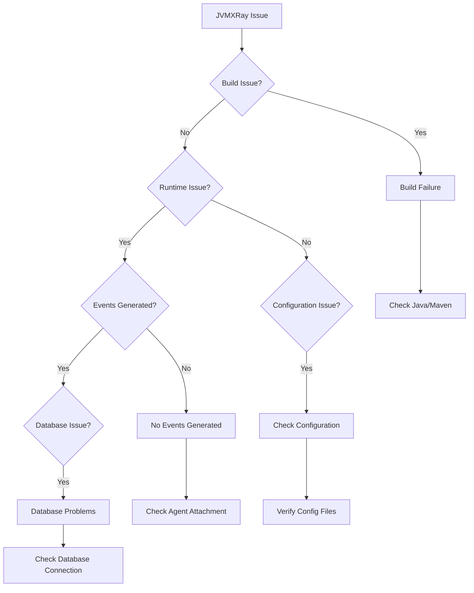
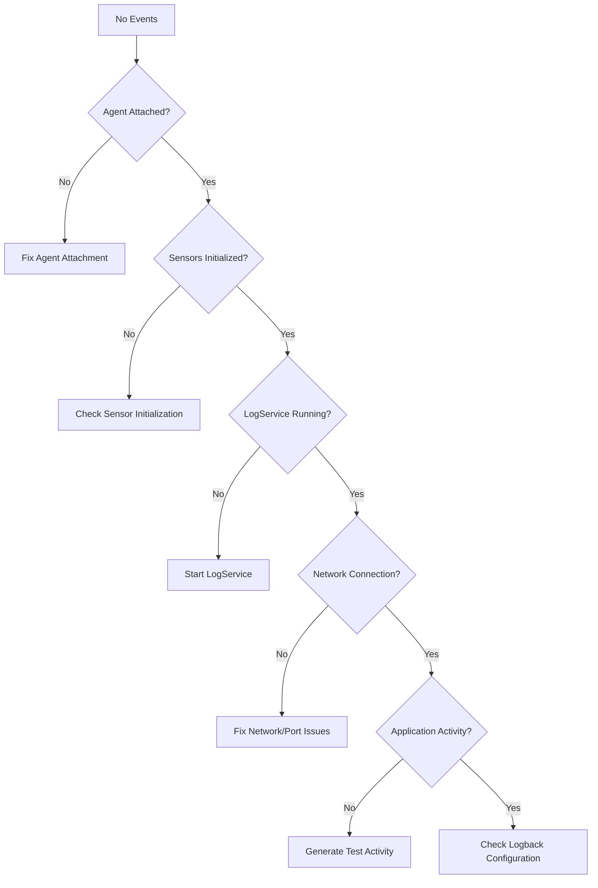

# JVMXRay Troubleshooting Guide

## Overview
This guide helps diagnose and resolve common JVMXRay issues, from build problems to runtime errors.

## Common Issues Decision Tree


## Build Issues

### Build Failure
```bash
# Symptoms
mvn clean install
# [ERROR] BUILD FAILURE
# [ERROR] Failed to execute goal...
```

#### Solutions
```bash
# 1. Clean rebuild with dependency refresh
mvn clean install -U

# 2. Check Java version (must be 11+)
java -version
# Ensure: java version "11" or higher

# 3. Check Maven version
mvn -version
# Ensure: Apache Maven 3.6.0+

# 4. Verify JAVA_HOME
echo $JAVA_HOME
export JAVA_HOME=/path/to/jdk11

# 5. Clear local Maven repository
rm -rf ~/.m2/repository/org/jvmxray/
mvn clean install

# 6. Build with increased memory
MAVEN_OPTS="-Xmx2g -XX:MaxMetaspaceSize=512m" mvn clean install
```

### Integration Test Failures
```bash
# Symptoms
[ERROR] org.jvmxray.integration.TurtleIntegrationTest.testIntegration Failed
```

#### Solutions
```bash
# 1. Check port availability
netstat -an | grep 9876
# If port in use:
pkill -f LogService
# Or use different port:
mvn test -Dlogservice.port=9877

# 2. Run with more memory
MAVEN_OPTS="-Xmx1g -XX:MaxMetaspaceSize=256m" mvn test

# 3. Run integration test standalone
./test-integration.sh --verbose

# 4. Check test database permissions
ls -la .jvmxray/common/data/
chmod 755 .jvmxray/common/data/

# 5. Clean test environment
rm -rf .jvmxray/
mvn clean test
```

### Dependency Issues
```bash
# Symptoms
[ERROR] Could not resolve dependencies for project...
```

#### Solutions
```bash
# 1. Update dependency tree
mvn dependency:tree
mvn dependency:resolve

# 2. Force dependency download
mvn clean install -U -Dmaven.resolver.transport=wagon

# 3. Clear corrupted dependencies
rm -rf ~/.m2/repository/net/bytebuddy/
rm -rf ~/.m2/repository/ch/qos/logback/
mvn clean install

# 4. Check proxy settings (if behind corporate firewall)
mvn clean install -Dhttp.proxyHost=proxy.company.com -Dhttp.proxyPort=8080
```

## Runtime Issues

### Agent Attachment Problems
```bash
# Symptoms
java -javaagent:prj-agent/target/prj-agent-0.0.1-shaded.jar -jar app.jar
# No sensor events generated
```

#### Diagnosis
```bash
# 1. Verify agent JAR exists and is executable
ls -la prj-agent/target/prj-agent-0.0.1-shaded.jar
file prj-agent/target/prj-agent-0.0.1-shaded.jar

# 2. Check agent initialization logs
mkdir -p .jvmxray/agent/logs/
java -Djvmxray.debug=true \
     -javaagent:prj-agent/target/prj-agent-0.0.1-shaded.jar \
     -jar app.jar
grep -i "agent" .jvmxray/agent/logs/agent.log

# 3. Verify ByteBuddy installation
grep -i "bytebuddy\|transform" .jvmxray/agent/logs/agent.log

# 4. Check sensor initialization
grep -i "sensor.*initialized" .jvmxray/agent/logs/agent.log
```

#### Solutions
```bash
# 1. Rebuild agent JAR
mvn clean package -pl prj-agent

# 2. Use absolute path for agent
java -javaagent:$(pwd)/prj-agent/target/prj-agent-0.0.1-shaded.jar -jar app.jar

# 3. Check Java compatibility
java -javaagent:prj-agent/target/prj-agent-0.0.1-shaded.jar -version

# 4. Enable premain debugging
java -XX:+TraceClassLoading \
     -javaagent:prj-agent/target/prj-agent-0.0.1-shaded.jar \
     -jar app.jar

# 5. Test with simple application
java -javaagent:prj-agent/target/prj-agent-0.0.1-shaded.jar \
     -cp . HelloWorld
```

### No Events Generated


#### Diagnosis
```bash
# 1. Check if any events are generated
find .jvmxray -name "*.log" -exec grep -l "org.jvmxray.events" {} \;

# 2. Check sensor registration
grep "Sensor.*registered" .jvmxray/agent/logs/agent.log

# 3. Check method interception
grep -i "intercept\|advice" .jvmxray/agent/logs/agent.log

# 4. Test with file operations
touch /tmp/jvmxray-test.txt
echo "test" > /tmp/jvmxray-test.txt
rm /tmp/jvmxray-test.txt
# Check for file events
grep "fileread\|filewrite\|filedelete" .jvmxray/*/logs/*.log
```

#### Solutions
```bash
# 1. Force sensor activity with test operations
java -javaagent:prj-agent/target/prj-agent-0.0.1-shaded.jar \
     -cp prj-integration/target/test-classes \
     org.jvmxray.integration.TurtleIntegrationTest

# 2. Enable verbose agent logging
java -Djvmxray.debug=true \
     -Djvmxray.log.level=DEBUG \
     -javaagent:prj-agent/target/prj-agent-0.0.1-shaded.jar \
     -jar app.jar

# 3. Check bytecode transformation
java -XX:+UnlockDiagnosticVMOptions \
     -XX:+TraceClassLoading \
     -XX:+LogVMOutput \
     -XX:LogFile=jvm.log \
     -javaagent:prj-agent/target/prj-agent-0.0.1-shaded.jar \
     -jar app.jar

# 4. Test individual sensors
grep -A 5 -B 5 "FileSensor\|NetworkSensor" .jvmxray/agent/logs/agent.log
```

### LogService Connection Issues
```bash
# Symptoms
# Agent starts but no events reach LogService
# Connection refused errors
```

#### Diagnosis
```bash
# 1. Check if LogService is running
ps aux | grep LogService
netstat -an | grep 9876

# 2. Test port connectivity
telnet localhost 9876
nc -zv localhost 9876

# 3. Check LogService logs
tail -f .jvmxray/common/logs/logservice.log

# 4. Verify socket appender configuration
cat .jvmxray/agent/config/logback.xml | grep -A 5 SocketAppender
```

#### Solutions
```bash
# 1. Start LogService manually
java -cp prj-service-event-aggregator/target/prj-service-event-aggregator-0.0.1.jar \
     org.jvmxray.service.eventAggregator.bin.LogService

# 2. Use different port if 9876 is occupied
java -Dlogservice.port=9877 \
     -cp prj-service-event-aggregator/target/prj-service-event-aggregator-0.0.1.jar \
     org.jvmxray.service.eventAggregator.bin.LogService

# Update agent logback.xml to match new port

# 3. Check firewall settings
sudo ufw status
sudo iptables -L | grep 9876

# 4. Test with local socket appender
# Modify .jvmxray/agent/config/logback.xml:
<appender name="FILE" class="ch.qos.logback.core.FileAppender">
    <file>.jvmxray/agent/logs/events.log</file>
    <encoder>
        <pattern>%msg%n</pattern>
    </encoder>
</appender>
```

### Database Issues
```bash
# Symptoms
# Events generated but not stored in database
# Database connection errors
```

#### Diagnosis
```bash
# 1. Check database file exists and is writable
ls -la .jvmxray/common/data/jvmxray-test.db
file .jvmxray/common/data/jvmxray-test.db

# 2. Test database connection
java -cp "prj-common/target/classes:$(mvn dependency:build-classpath -q -Dmdep.outputFile=/dev/stdout -f prj-common/pom.xml)" \
     org.jvmxray.platform.shared.bin.SchemaManager \
     --test-connection \
     --database-type sqlite \
     --connection-url jdbc:sqlite:.jvmxray/common/data/jvmxray-test.db

# 3. Check schema exists
sqlite3 .jvmxray/common/data/jvmxray-test.db ".tables"
sqlite3 .jvmxray/common/data/jvmxray-test.db ".schema STAGE0_EVENT"

# 4. Check for database locks
lsof .jvmxray/common/data/jvmxray-test.db
```

#### Solutions
```bash
# 1. Recreate database schema
rm -f .jvmxray/common/data/jvmxray-test.db
java -cp "prj-common/target/classes:$(mvn dependency:build-classpath -q -Dmdep.outputFile=/dev/stdout -f prj-common/pom.xml)" \
     org.jvmxray.platform.shared.bin.SchemaManager \
     --create-schema \
     --database-type sqlite \
     --connection-url jdbc:sqlite:.jvmxray/common/data/jvmxray-test.db

# 2. Fix permissions
chmod 755 .jvmxray/common/data/
chmod 664 .jvmxray/common/data/jvmxray-test.db

# 3. Check disk space
df -h .jvmxray/

# 4. Test with different database location
mkdir -p /tmp/jvmxray-test
java -Djvmxray.database.url=jdbc:sqlite:/tmp/jvmxray-test/test.db \
     -cp prj-service-event-aggregator/target/prj-service-event-aggregator-0.0.1.jar \
     org.jvmxray.service.eventAggregator.bin.LogService
```

## Configuration Issues

### Logback Configuration Problems
```bash
# Symptoms
# Logback configuration errors
# Events not formatted correctly
```

#### Solutions
```bash
# 1. Validate logback.xml syntax
xmllint --noout .jvmxray/agent/config/logback.xml
xmllint --noout .jvmxray/common/config/logback.xml

# 2. Reset to default configuration
# Agent logback.xml:
cat > .jvmxray/agent/config/logback.xml << 'EOF'
<?xml version="1.0" encoding="UTF-8"?>
<configuration>
    <appender name="SOCKET" class="ch.qos.logback.classic.net.SocketAppender">
        <remoteHost>localhost</remoteHost>
        <port>9876</port>
        <reconnectionDelay>10000</reconnectionDelay>
        <includeCallerData>false</includeCallerData>
    </appender>
    <root level="INFO">
        <appender-ref ref="SOCKET"/>
    </root>
</configuration>
EOF

# 3. Test logback configuration
java -Dlogback.configurationFile=.jvmxray/agent/config/logback.xml \
     -cp "$(mvn dependency:build-classpath -q -Dmdep.outputFile=/dev/stdout)" \
     ch.qos.logback.classic.util.ContextInitializer

# 4. Enable logback debug
java -Dlogback.debug=true \
     -Dlogback.configurationFile=.jvmxray/agent/config/logback.xml \
     -javaagent:prj-agent/target/prj-agent-0.0.1-shaded.jar \
     -jar app.jar
```

### Directory Permission Issues
```bash
# Symptoms
# Permission denied creating .jvmxray directories
# Cannot write log files
```

#### Solutions
```bash
# 1. Fix directory permissions
chmod -R 755 .jvmxray/
chown -R $(whoami) .jvmxray/

# 2. Use alternative directory
java -Djvmxray.test.home=/tmp/jvmxray-$(whoami) \
     -javaagent:prj-agent/target/prj-agent-0.0.1-shaded.jar \
     -jar app.jar

# 3. Check SELinux context (if applicable)
ls -Z .jvmxray/
setsebool -P allow_execstack 1

# 4. Create directories manually
mkdir -p .jvmxray/{agent,common,integration}/{config,logs,data}
chmod 755 .jvmxray/{agent,common,integration}/{config,logs,data}
```

## Performance Issues

### High Memory Usage
```bash
# Symptoms
# OutOfMemoryError
# High heap usage
```

#### Diagnosis
```bash
# 1. Monitor memory usage
jstat -gc <pid> 1s
jmap -histo <pid> | head -20

# 2. Create heap dump
jmap -dump:format=b,file=heap.hprof <pid>

# 3. Check JVMXRay memory usage
jmap -histo <pid> | grep jvmxray
```

#### Solutions
```bash
# 1. Increase heap size
java -Xmx2g -XX:MaxMetaspaceSize=512m \
     -javaagent:prj-agent/target/prj-agent-0.0.1-shaded.jar \
     -jar app.jar

# 2. Tune garbage collection
java -XX:+UseG1GC -XX:MaxGCPauseMillis=200 \
     -javaagent:prj-agent/target/prj-agent-0.0.1-shaded.jar \
     -jar app.jar

# 3. Reduce event buffer sizes
# Edit .jvmxray/common/config/common.properties:
logservice.buffer.size=500
event.batch.size=100

# 4. Enable memory monitoring sensor
grep "monitor" .jvmxray/agent/logs/agent.log
```

### High CPU Usage
```bash
# Symptoms
# Application runs slowly
# High CPU utilization
```

#### Diagnosis
```bash
# 1. Profile with JFR
java -XX:+FlightRecorder \
     -XX:StartFlightRecording=duration=60s,filename=profile.jfr \
     -javaagent:prj-agent/target/prj-agent-0.0.1-shaded.jar \
     -jar app.jar

# 2. Check thread activity
jstack <pid> > thread-dump.txt
grep -A 5 "jvmxray" thread-dump.txt

# 3. Monitor sensor overhead
# Enable timing logs in agent configuration
```

#### Solutions
```bash
# 1. Disable high-overhead sensors
# Edit sensor configuration to disable reflection sensor
# or other CPU-intensive sensors

# 2. Reduce sensor sampling rate
# Implement sampling in sensor interceptors

# 3. Use async logging
# Ensure SocketAppender is non-blocking

# 4. Optimize database writes
# Batch database operations
# Use prepared statements
```

## Environment-Specific Issues

### Docker Issues
```bash
# Container networking problems
docker run --network host jvmxray:latest

# Volume mount issues
docker run -v $(pwd)/.jvmxray:/app/.jvmxray jvmxray:latest

# Memory limits
docker run --memory=2g --memory-swap=4g jvmxray:latest
```

### Kubernetes Issues
```bash
# Pod security policies
kubectl describe pod jvmxray-pod | grep -i security

# Resource limits
kubectl describe pod jvmxray-pod | grep -A 5 Limits

# Network policies
kubectl get networkpolicy
```

## Diagnostic Commands Summary

```bash
# Quick health check script
cat > jvmxray-health-check.sh << 'EOF'
#!/bin/bash
echo "=== JVMXRay Health Check ==="

echo "1. Java Version:"
java -version

echo -e "\n2. Build Artifacts:"
ls -la prj-agent/target/prj-agent-*-shaded.jar
ls -la prj-service-event-aggregator/target/prj-service-event-aggregator-*.jar

echo -e "\n3. Directory Structure:"
find .jvmxray -type f -name "*.log" | head -10

echo -e "\n4. Process Status:"
ps aux | grep -E "(jvmxray|LogService)" | grep -v grep

echo -e "\n5. Port Status:"
netstat -an | grep 9876

echo -e "\n6. Recent Events:"
find .jvmxray -name "*.log" -exec tail -5 {} \; 2>/dev/null | grep "org.jvmxray.events" | head -5

echo -e "\n7. Database Status:"
if [ -f .jvmxray/common/data/jvmxray-test.db ]; then
    sqlite3 .jvmxray/common/data/jvmxray-test.db "SELECT COUNT(*) AS total_events FROM STAGE0_EVENT;"
else
    echo "Database not found"
fi
EOF

chmod +x jvmxray-health-check.sh
./jvmxray-health-check.sh
```

## Getting Help

### Enable Debug Logging
```bash
# Full debug mode
java -Djvmxray.debug=true \
     -Djvmxray.log.level=DEBUG \
     -Dlogback.debug=true \
     -javaagent:prj-agent/target/prj-agent-0.0.1-shaded.jar \
     -jar app.jar
```

### Collect Diagnostic Information
```bash
# Create diagnostic package
mkdir jvmxray-diagnostics
cp -r .jvmxray/*/logs/ jvmxray-diagnostics/
cp -r .jvmxray/*/config/ jvmxray-diagnostics/
java -version > jvmxray-diagnostics/java-version.txt
mvn -version > jvmxray-diagnostics/maven-version.txt
ps aux | grep java > jvmxray-diagnostics/processes.txt
netstat -an | grep 9876 > jvmxray-diagnostics/network.txt
tar czf jvmxray-diagnostics.tar.gz jvmxray-diagnostics/
```

### Community Support
- GitHub Issues: https://github.com/spoofzu/jvmxray/issues
- Documentation: [Complete docs index](../README.md)
- Examples: [Integration examples](../examples/)

## See Also
- [Quick Start Guide](quick-start.md)
- [Complete Command Reference](../reference/all-commands.md)
- [Architecture Overview](../architecture/README.md)
- [Performance Tuning Guide](performance-tuning.md)