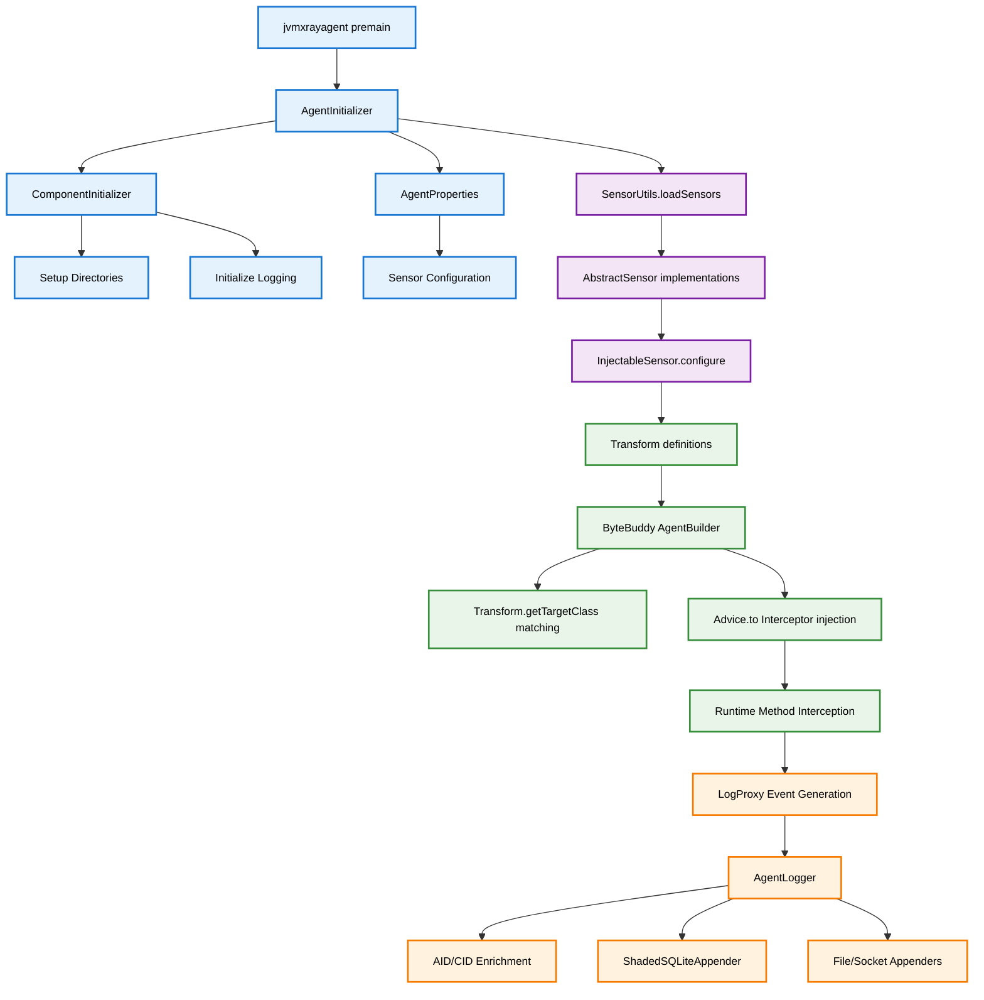
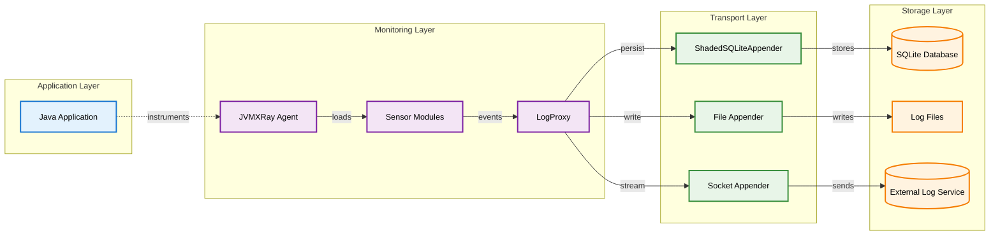
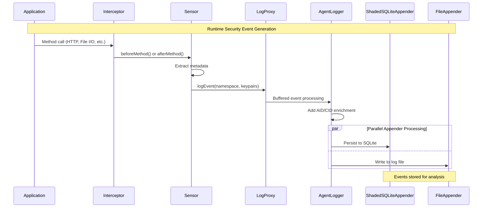

# JVMXRay Agent (prj-agent)

## Table of Contents

1. [Background and Purpose](#background-and-purpose)
2. [Architecture](#architecture)
3. [CLI Commands](#cli-commands)
4. [Properties](#properties)
   - 4.1 [Environment Variables](#environment-variables)
   - 4.2 [System Properties](#system-properties)
   - 4.3 [Component Properties](#component-properties)
   - 4.4 [Logback XML Settings](#logback-xml-settings)
5. [REST API Endpoints](#rest-api-endpoints)
6. [Database Tables](#database-tables)
7. [Common Errors](#common-errors)

---

## Background and Purpose

### Project Overview
The JVMXRay Agent is a runtime security monitoring tool that uses bytecode injection to instrument Java applications without requiring code changes. It monitors file access, network connections, system calls, and other security-relevant operations in real-time.

### Core Mission
Monitor Java applications for security vulnerabilities and suspicious activity through transparent bytecode injection with zero application modifications.

### Key Capabilities
- 17+ modular sensors monitoring different aspects of application behavior
- Real-time bytecode injection using ByteBuddy framework
- Structured event generation for AI-enhanced security analysis
- Enterprise logging integration (Logback/SLF4J) with Splunk/ELK compatibility
- Zero-performance-impact monitoring with configurable sensor activation

---

## Architecture

### Module Structure
```
+------------------+------------------------------------------------------+---------------------------+
| Module           | Purpose                                              | Dependencies              |
+------------------+------------------------------------------------------+---------------------------+
| prj-agent        | Java agent with bytecode injection sensors          | prj-common, ByteBuddy     |
| sensor packages  | Modular monitoring components for different ops     | Agent core, LogProxy      |
| interceptors     | Method interception classes for bytecode injection  | Sensors, ByteBuddy Advice |
| LogProxy         | Agent-safe logging proxy for bootloader context     | ShadedSQLiteAppender      |
+------------------+------------------------------------------------------+---------------------------+
```

### Component Relationships

#### Initialization Flow


#### Agent Architecture Overview


### Data Flow
1. Agent premain() initializes sensors from properties
2. InjectableSensor.inject() adds classes to bootstrap classloader
3. ByteBuddy transforms target classes with method interceptors
4. Interceptors generate structured events via LogProxy
5. Events flow to specialized appenders (file, database, socket)

#### Runtime Event Flow Sequence


---

## CLI Commands

### Command Reference

#### JVMXRay Agent Attachment
**Purpose:** Attach agent to JVM for runtime security monitoring

**Usage:**
```bash
# Basic agent attachment
java -javaagent:prj-agent/target/prj-agent-0.0.1-shaded.jar MyApplication

# With agent arguments
java -javaagent:prj-agent/target/prj-agent-0.0.1-shaded.jar=config-override MyApplication

# With custom JVMXRay home
java -Djvmxray.home=/opt/jvmxray -javaagent:prj-agent/target/prj-agent-0.0.1-shaded.jar MyApplication
```

**Options:**

| Option | Description | Default |
|--------|-------------|---------|
| agentArgs | Optional configuration override arguments | null |
| -Djvmxray.home | Production mode base directory | ${user.home} |
| -Djvmxray.test.home | Test mode base directory (does NOT append /jvmxray/ subdirectory) | null |

**Examples:**
```bash
# Example 1: Basic monitoring with default sensors
java -javaagent:prj-agent/target/prj-agent-0.0.1-shaded.jar -cp myapp.jar com.example.Application

# Example 2: Test mode with custom directory
java -Djvmxray.test.home=/tmp/jvmxray-test -javaagent:prj-agent/target/prj-agent-0.0.1-shaded.jar MyApp

# Example 3: Production deployment
java -Djvmxray.home=/opt/security -javaagent:/opt/jvmxray/prj-agent-0.0.1-shaded.jar -jar application.jar
```

---

## Properties

### Environment Variables

#### Runtime Environment

**Common Variables:**

| Variable | Description | Default | Required |
|----------|-------------|---------|----------|
| JAVA_HOME | Path to JDK/JRE installation | system default | No |
| PATH | System path including java binary | system default | No |

### System Properties

#### JVM System Properties

**Location:** Set via `-D` flag at JVM startup

**Core Properties:**

| Property | Description | Default | Required |
|----------|-------------|---------|----------|
| -Djvmxray.home | Production mode base directory (creates ${home}/jvmxray/agent/logs/) | ${user.home} | No |
| -Djvmxray.test.home | Test mode base directory (creates ${test.home}/agent/logs/ directly) | null | No |
| -Djvmxray.agent.logs | Agent logs directory path | auto-detected | No |
| -Djvmxray.agent.config | Agent config directory path | auto-detected | No |
| -Dlogback.agent.configurationFile | Override logback config path | auto-detected | No |
| -Dorg.jvmxray.agent.mcc.ttl.seconds | MCC ThreadLocal cleanup TTL (seconds) - defensive cleanup for leaked scopes | 300 | No |

**Directory Structure Examples:**
```bash
# Production mode (-Djvmxray.home=/opt/jvmxray)
/opt/jvmxray/jvmxray/agent/logs/          # Note: extra /jvmxray/ subdirectory
/opt/jvmxray/jvmxray/agent/config/

# Test mode (-Djvmxray.test.home=/tmp/jvmxray-test)
/tmp/jvmxray-test/agent/logs/             # Note: no extra subdirectory
/tmp/jvmxray-test/agent/config/
```

### Component Properties

#### agent.properties

**Location:** `prj-agent/src/main/resources/agent.properties`

**Core Settings:**

| Property | Description | Default Value | Required |
|----------|-------------|---------------|----------|
| AID | Agent Instance ID - Unique identifier for this agent instance, essential for cloud deployments to distinguish events from different servers/containers | ${generated.aid} | Yes |
| CID | Configuration ID - Identifies the configuration profile (production, staging, development) for operational categorization and event filtering | production | Yes |
| log.message.encoding | Enable log message encoding for special characters and binary data | true | No |
| monitor.interval | Interval (milliseconds) for logging periodic system metrics including memory usage, thread counts, GC statistics, CPU load, and other application health indicators | 60000 | No |

**Monitoring Metrics:**

The MonitorSensor logs comprehensive system and sensor statistics every 60 seconds (configurable via monitor.interval). Metrics are aggregated from multiple sources:

**MCC (Mapped Correlation Context) Metrics:**
- `mcc_contexts_created`: Total correlation contexts created (lifetime counter)
- `mcc_active_contexts`: Current active contexts across all threads
- `mcc_max_context_size`: Largest context size ever seen (max fields in any context)
- `mcc_ttl_cleanups`: Defensive cleanups triggered (**should be 0** - non-zero indicates sensor bugs)
- `mcc_ttl_seconds`: Configured TTL value for defensive cleanup

**LibSensor (JAR Loading) Metrics:**
- `lib_static_loaded`: Number of static classpath JARs detected at startup
- `lib_dynamic_loaded`: Number of dynamically loaded JARs detected at runtime
- `lib_total_packages`: Total unique Java packages discovered across all JARs
- `lib_cache_size`: Current size of known JARs cache (bounded to 10,000 entries)

**System Metrics:**
- Memory: MemoryTotal, MemoryFree, MemoryMax, NonHeapUsed
- Threads: ThreadNew, ThreadRunnable, ThreadBlocked, ThreadWaiting, ThreadTerminated
- GC: GCCount, GCTime
- CPU: ProcessCpuLoad
- Files: OpenFiles (Unix systems only)
- Deadlocks: DeadlockedThreads

**LogProxy Metrics:**
- LogBufferUtilization, LogQueueSize, LogDiscardCount
- LogFlushRate, LogFlushTime, LogOverflowStrategy, LogTotalEvents

**Sensor Configuration:**

| Property | Description | Default Value | Required |
|----------|-------------|---------------|----------|
| jvmxray.sensor.http | HTTP request monitoring | org.jvmxray.agent.sensor.http.HttpSensor | No |
| jvmxray.sensor.fileio | File I/O operations | org.jvmxray.agent.sensor.io.FileIOSensor | No |
| jvmxray.sensor.monitor | System monitoring | org.jvmxray.agent.sensor.monitor.MonitorSensor | No |
| jvmxray.sensor.sql | Database queries | org.jvmxray.agent.sensor.sql.SQLSensor | No |
| jvmxray.sensor.socket | Network operations | org.jvmxray.agent.sensor.net.SocketSensor | No |
| jvmxray.sensor.crypto | Cryptographic ops | org.jvmxray.agent.sensor.crypto.CryptoSensor | No |
| jvmxray.sensor.serialization | Object serialization | org.jvmxray.agent.sensor.serialization.SerializationSensor | No |
| jvmxray.sensor.reflection | Reflection API calls | org.jvmxray.agent.sensor.reflection.ReflectionSensor | No |
| jvmxray.sensor.configuration | Configuration access | org.jvmxray.agent.sensor.configuration.ConfigurationSensor | No |
| jvmxray.sensor.auth | Authentication events | org.jvmxray.agent.sensor.auth.AuthenticationSensor | No |
| jvmxray.sensor.script | Script engine execution | org.jvmxray.agent.sensor.script.ScriptEngineSensor | No |
| jvmxray.sensor.uncaughtexception | Uncaught exceptions | org.jvmxray.agent.sensor.uncaughtexception.UncaughtExceptionSensor | No |

**File I/O Aggregate Statistics Configuration:**

The File I/O sensor uses a three-tier filtering strategy to reduce log noise while maintaining visibility into security-relevant file operations.

| Property | Description | Default Value | Required |
|----------|-------------|---------------|----------|
| jvmxray.agent.sensor.fileio.captures | Operations to capture: C=Create, R=Read, U=Update, D=Delete | CUD | No |
| jvmxray.io.threshold.bytes.read | Minimum bytes read to log (Tier 3) | 10485760 (10MB) | No |
| jvmxray.io.threshold.bytes.write | Minimum bytes written to log (Tier 3) | 10485760 (10MB) | No |
| jvmxray.io.monitor.patterns | Case-insensitive regex for sensitive files (Tier 2 - always logged) | (?i).\*(password\|credential\|secret\|token\|key\|auth\|private).\* | No |
| jvmxray.io.ignore.patterns | Case-insensitive regex for files to ignore (Tier 1 - never logged) | (?i).\*[\\\\\\/](temp\|tmp\|cache)[\\\\\\/].\*\|.\*\\.(tmp\|cache\|swp)$ | No |

**Filtering Strategy:**
1. **Tier 1 (Ignore)**: Files matching `jvmxray.io.ignore.patterns` are never tracked or logged (e.g., temp files, cache files)
2. **Tier 2 (Monitor)**: Files matching `jvmxray.io.monitor.patterns` are always logged regardless of size (e.g., credential files, private keys)
3. **Tier 3 (Threshold)**: All other files are logged only if they exceed read/write thresholds

**Platform-Agnostic Patterns:**
- Patterns use `[\\\\\\/]` to match both Windows (`\`) and Unix (`/`) path separators
- Case-insensitive matching with `(?i)` prefix ensures consistent behavior across operating systems
- Default patterns cover common temporary and cache file locations on all platforms

**Aggregate Statistics:**
Instead of logging every byte read/write operation, the sensor tracks:
- Total bytes read/written
- Number of read/write operations
- Operation duration (from file open to close)
- File operation type (create, read, write, read_write, open)
- Sensitive file flag based on monitor patterns

Events are logged when files are closed, providing complete operation statistics in a single log entry.

**LogProxy Configuration:**

| Property | Description | Default Value | Required |
|----------|-------------|---------------|----------|
| org.jvmxray.agent.logproxy.buffer.size | LogProxy buffer size | 10000 | No |
| org.jvmxray.agent.logproxy.buffer.flush.interval | Flush interval (seconds) | 10 | No |
| org.jvmxray.agent.logproxy.buffer.overflow.strategy | Buffer overflow handling | wait | No |

### Logback XML Settings

#### Agent Logback Configuration

**Location:** `prj-agent/src/main/resources/agent-logback-production.xml2`

**Key Appenders:**

| Appender | Purpose | Log File |
|----------|---------|----------|
| IOEVENTS | File I/O operations | agent-IO-events.log |
| HTTPEVENTS | HTTP requests | agent-HTTP-events.log |
| MONITOREVENTS | System monitoring | agent-MONITOR-events.log |
| NETEVENTS | Network operations | agent-NET-events.log |
| SQLEVENTS | Database queries | agent-SQL-events.log |
| CRYPTOEVENTS | Cryptographic operations | agent-CRYPTO-events.log |
| AUTHEVENTS | Authentication events | agent-AUTH-events.log |
| APILEVENTS | API calls | agent-API-events.log |
| CONFIGEVENTS | Configuration access | agent-CONFIG-events.log |
| EXCEPTIONEVENTS | Exception handling | agent-EXCEPTION-events.log |
| REFLECTIONEVENTS | Reflection operations | agent-REFLECTION-events.log |
| SCRIPTEVENTS | Script execution | agent-SCRIPT-events.log |
| SERIALIZATIONEVENTS | Serialization operations | agent-SERIALIZATION-events.log |
| SYSTEMEVENTS | System operations | agent-SYSTEM-events.log |
| THREADEVENTS | Thread operations | agent-THREAD-events.log |
| PLATFORM | Platform/agent logs | agent-PLATFORM.log |

**Properties:**

| Property | Description | Example |
|----------|-------------|---------|
| LOG_HOME | Agent logs directory | ${jvmxray.agent.logs} |
| MSG_FMT_LG | Message format | C:AP \| %d{YYYY.MM.dd 'at' HH:mm:ss z} \| %thread \| %5level \| %logger \| %X \| %msg%n |

---

## REST API Endpoints

**[Not Applicable]**

The JVMXRay Agent does not expose REST API endpoints. It operates as a passive monitoring agent that instruments bytecode and logs events through configured appenders.

---

## Database Tables

### Schema Overview
The agent posts structured events directly to database tables¹ for processing by log aggregation services. Events contain metadata and key-value pairs for security analysis.

**¹** *SQLite is used for development and testing. Production deployments support MySQL and Cassandra databases via SchemaManager configuration.*

### Table Definitions

#### STAGE0_EVENT

**Purpose:** Raw agent events with structured metadata and key-value pairs

**Columns:**
```
+-------------+------------------+------+-----+---------+-------+
| Field       | Type             | Null | Key | Default | Extra |
+-------------+------------------+------+-----+---------+-------+
| EVENT_ID    | uuid             | NO   | PRI | NULL    |       |
| CONFIG_FILE | varchar(255)     | YES  |     | NULL    |       |
| TIMESTAMP   | timestamp        | NO   |     | NULL    |       |
| THREAD_ID   | varchar(100)     | YES  |     | NULL    |       |
| PRIORITY    | varchar(10)      | YES  |     | NULL    |       |
| NAMESPACE   | varchar(255)     | NO   |     | NULL    |       |
| AID         | varchar(50)      | NO   |     | NULL    |       |
| CID         | varchar(50)      | NO   |     | NULL    |       |
| IS_STABLE   | boolean          | NO   |     | false   |       |
| KEYPAIRS    | text             | YES  |     | NULL    |       |
+-------------+------------------+------+-----+---------+-------+
```

**Indexes:**

| Index Name | Columns | Purpose |
|------------|---------|---------|
| idx_stage0_timestamp | TIMESTAMP | Time-based queries |
| idx_stage0_namespace | NAMESPACE | Sensor-type filtering |
| idx_stage0_aid_cid | AID, CID | Agent instance queries |

**Sample Data:**
```sql
-- HTTP sensor event example
INSERT INTO STAGE0_EVENT (EVENT_ID, CONFIG_FILE, TIMESTAMP, THREAD_ID, PRIORITY, NAMESPACE, AID, CID, IS_STABLE, KEYPAIRS)
VALUES (
  '550e8400-e29b-41d4-a716-446655440000',
  'C:AP',
  '2024-09-15 14:30:25.123',
  'http-nio-8080-exec-1',
  'INFO',
  'org.jvmxray.agent.sensor.http.HttpSensor',
  'agent-001',
  'production',
  true,
  'method=GET|url=https://api.example.com/users|statusCode=200|responseTime=145ms'
);
```

#### Event Format Details

**Message Structure:** `CONFIG_FILE | timestamp | thread | priority | namespace | keypairs`

**Key-Value Pairs:** Pipe-separated key=value pairs containing sensor-specific data
- HTTP: method, url, statusCode, responseTime, userAgent
- File I/O: operation, path, size, permissions
- Crypto: algorithm, keySize, operation, provider
- Network: localPort, remoteHost, remotePort, protocol
- SQL: query, parameters, executionTime, rowCount

---

## Common Errors

### Error Reference

#### Configuration Errors

**Error Message:**
```
Unable to determine a working directory. Set -Djvmxray.home=/path/to/home or -Djvmxray.test.home=/path/to/test/home
```

**Cause:** Neither jvmxray.home nor jvmxray.test.home system properties are set

**Resolution:**
```bash
# For production use
java -Djvmxray.home=/opt/jvmxray -javaagent:prj-agent-0.0.1-shaded.jar MyApp

# For testing
java -Djvmxray.test.home=/tmp/test -javaagent:prj-agent-0.0.1-shaded.jar MyApp
```

**Prevention:** Always set exactly one of the home directory properties

#### Logging Initialization Errors

**Error Message:**
```
AgentLogger singleton failed to initialize. Check startup logs.
```

**Cause:** LogProxy initialization failed during agent startup

**Resolution:**
```bash
# Check agent logs directory permissions
chmod 755 /path/to/jvmxray/agent/logs/
```

**Prevention:** Ensure agent has write permissions to logs directory

#### Property Conflicts

**Error Message:**
```
Both jvmxray.test.home and jvmxray.home are set. Only one should be specified.
```

**Cause:** Conflicting system properties set simultaneously

**Resolution:**
```bash
# Remove one property - keep only production OR test
java -Djvmxray.home=/opt/jvmxray -javaagent:agent.jar MyApp
```

**Prevention:** Set only one home directory property per JVM instance

#### Sensor Loading Errors

**Error Message:**
```
Class resource not found: org/jvmxray/agent/sensor/SensorClass.class
```

**Cause:** Missing sensor dependency or corrupted agent JAR

**Resolution:**
```bash
# Rebuild agent with all dependencies
mvn clean install -f prj-agent/pom.xml
```

**Prevention:** Use the shaded JAR (prj-agent-0.0.1-shaded.jar) for deployments

---