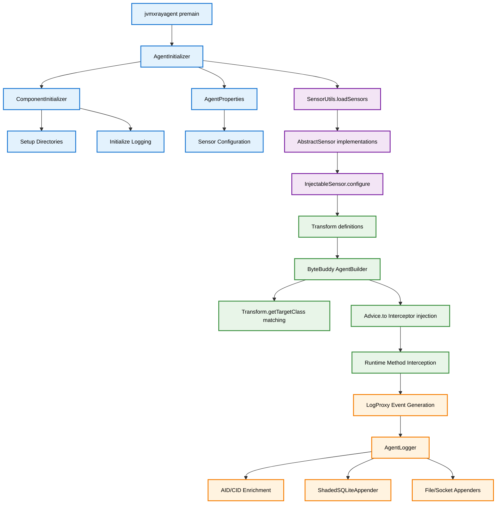
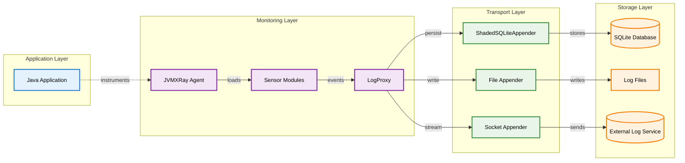
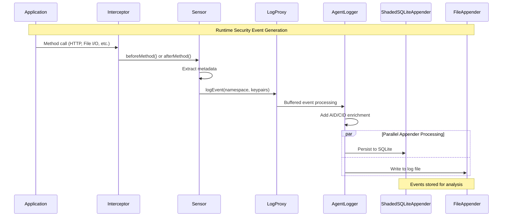

# JVMXRay Agent (prj-agent)

## Table of Contents

1. [Background and Purpose](#background-and-purpose)
2. [Architecture](#architecture)
3. [CLI Commands](#cli-commands)
4. [Properties](#properties)
   - 4.1 [Environment Variables](#environment-variables)
   - 4.2 [System Properties](#system-properties)
   - 4.3 [Component Properties](#component-properties)
   - 4.4 [Logback XML Settings](#logback-xml-settings)
5. [REST API Endpoints](#rest-api-endpoints)
6. [Database Tables](#database-tables)
7. [Log Message Reference](#log-message-reference)
   - 7.1 [Common Fields](#common-fields)
   - 7.2 [CONFIG Events](#config-events-configuration-sensor)
   - 7.3 [CRYPTO Events](#crypto-events-cryptographic-sensor)
   - 7.4 [HTTP Events](#http-events-http-sensor)
   - 7.5 [IO Events](#io-events-file-io-sensor)
   - 7.6 [MONITOR Events](#monitor-events-system-monitor-sensor)
   - 7.7 [NET Events](#net-events-network-sensor)
   - 7.8 [SERIALIZATION Events](#serialization-events-serialization-sensor)
   - 7.9 [SQL Events](#sql-events-sql-sensor)
   - 7.10 [SYSTEM Events](#system-events-system-sensor)
   - 7.11 [Risk Level Classification](#risk-level-classification)
8. [Common Errors](#common-errors)
9. [Developer Guide](#developer-guide)

---

## Background and Purpose

### Project Overview
The JVMXRay Agent is a runtime security monitoring tool that uses bytecode injection to instrument Java applications without requiring code changes. It monitors file access, network connections, system calls, and other security-relevant operations in real-time.

### Core Mission
Monitor Java applications for security vulnerabilities and suspicious activity through transparent bytecode injection with zero application modifications.

### Key Capabilities
- 17+ modular sensors monitoring different aspects of application behavior
- Real-time bytecode injection using ByteBuddy framework
- Structured event generation for AI-enhanced security analysis
- Enterprise logging integration (Logback/SLF4J) with Splunk/ELK compatibility
- Zero-performance-impact monitoring with configurable sensor activation

---

## Architecture

### Module Structure
```
+------------------+------------------------------------------------------+---------------------------+
| Module           | Purpose                                              | Dependencies              |
+------------------+------------------------------------------------------+---------------------------+
| prj-agent        | Java agent with bytecode injection sensors          | prj-common, ByteBuddy     |
| sensor packages  | Modular monitoring components for different ops     | Agent core, LogProxy      |
| interceptors     | Method interception classes for bytecode injection  | Sensors, ByteBuddy Advice |
| LogProxy         | Agent-safe logging proxy for bootloader context     | ShadedSQLiteAppender      |
+------------------+------------------------------------------------------+---------------------------+
```

### Component Relationships

#### Initialization Flow

```mermaid
%%{init: {'themeVariables': {'fontSize': '13px'}, 'flowchart': {'width': '900px'}}}%%
flowchart TD
    A[jvmxrayagent premain] --> B[AgentInitializer]
    B --> C[ComponentInitializer]
    B --> D[AgentProperties]
    B --> E[SensorUtils.loadSensors]

    C --> F[Setup Directories]
    C --> G[Initialize Logging]
    D --> H[Sensor Configuration]

    E --> I[AbstractSensor implementations]
    I --> J[InjectableSensor.configure]
    J --> K[Transform definitions]

    K --> L[ByteBuddy AgentBuilder]
    L --> M[Transform.getTargetClass matching]
    L --> N[Advice.to Interceptor injection]

    N --> O[Runtime Method Interception]
    O --> P[LogProxy Event Generation]

    P --> Q[AgentLogger]
    Q --> R[AID/CID Enrichment]
    Q --> S[ShadedSQLiteAppender]
    Q --> T[File/Socket Appenders]

    classDef initClass fill:#e3f2fd,stroke:#1976d2,stroke-width:2px,color:#000000
    classDef sensorClass fill:#f3e5f5,stroke:#7b1fa2,stroke-width:2px,color:#000000
    classDef bytecodeClass fill:#e8f5e8,stroke:#388e3c,stroke-width:2px,color:#000000
    classDef loggingClass fill:#fff3e0,stroke:#f57c00,stroke-width:2px,color:#000000

    class A,B,C,D,F,G,H initClass
    class E,I,J sensorClass
    class K,L,M,N,O bytecodeClass
    class P,Q,R,S,T loggingClass
```

#### Agent Architecture Overview

```mermaid
%%{init: {'themeVariables': {'fontSize': '13px'}, 'flowchart': {'width': '1000px'}}}%%
flowchart LR
    subgraph "Application Layer"
        A[Java Application]
    end

    subgraph "Monitoring Layer"
        B[JVMXRay Agent]
        C[Sensor Modules]
        D[LogProxy]
    end

    subgraph "Transport Layer"
        E[ShadedSQLiteAppender]
        F[File Appender]
        G[Socket Appender]
    end

    subgraph "Storage Layer"
        H[(SQLite Database)]
        I[Log Files]
        J[(External Log Service)]
    end

    A -.->|instruments| B
    B -->|loads| C
    C -->|events| D
    D -->|persist| E
    D -->|write| F
    D -->|stream| G
    E -->|stores| H
    F -->|writes| I
    G -->|sends| J

    classDef appLayer fill:#e3f2fd,stroke:#1976d2,stroke-width:2px,color:#000000
    classDef monitorLayer fill:#f3e5f5,stroke:#7b1fa2,stroke-width:2px,color:#000000
    classDef transportLayer fill:#e8f5e8,stroke:#388e3c,stroke-width:2px,color:#000000
    classDef storageLayer fill:#fff3e0,stroke:#f57c00,stroke-width:2px,color:#000000

    class A appLayer
    class B,C,D monitorLayer
    class E,F,G transportLayer
    class H,I,J storageLayer
```

### Data Flow
1. Agent premain() initializes sensors from properties
2. InjectableSensor.inject() adds classes to bootstrap classloader
3. ByteBuddy transforms target classes with method interceptors
4. Interceptors generate structured events via LogProxy
5. Events flow to specialized appenders (file, database, socket)

#### Runtime Event Flow Sequence

```mermaid
%%{init: {'themeVariables': {'fontSize': '13px'}}}%%
sequenceDiagram
    participant A as Application
    participant I as Interceptor
    participant S as Sensor
    participant L as LogProxy
    participant AG as AgentLogger
    participant DB as ShadedSQLiteAppender
    participant F as FileAppender

    Note over A,F: Runtime Security Event Generation

    A->>I: Method call (HTTP, File I/O, etc.)
    I->>S: beforeMethod() or afterMethod()
    S->>S: Extract metadata
    S->>L: logEvent(namespace, keypairs)

    L->>AG: Buffered event processing
    AG->>AG: Add AID/CID enrichment

    par Parallel Appender Processing
        AG->>DB: Persist to SQLite
        and
        AG->>F: Write to log file
    end

    Note over DB,F: Events stored for analysis
```

---

## CLI Commands

### Command Reference

#### JVMXRay Agent Attachment
**Purpose:** Attach agent to JVM for runtime security monitoring

**Usage:**
```bash
# Basic agent attachment
java -javaagent:prj-agent/target/prj-agent-0.0.1-shaded.jar MyApplication

# With agent arguments
java -javaagent:prj-agent/target/prj-agent-0.0.1-shaded.jar=config-override MyApplication

# With custom JVMXRay home
java -Djvmxray.home=/opt/jvmxray -javaagent:prj-agent/target/prj-agent-0.0.1-shaded.jar MyApplication
```

**Options:**

| Option | Description | Default |
|--------|-------------|---------|
| agentArgs | Optional configuration override arguments | null |
| -Djvmxray.home | Production mode base directory | ${user.home} |
| -Djvmxray.test.home | Test mode base directory (does NOT append /jvmxray/ subdirectory) | null |

**Examples:**
```bash
# Example 1: Basic monitoring with default sensors
java -javaagent:prj-agent/target/prj-agent-0.0.1-shaded.jar -cp myapp.jar com.example.Application

# Example 2: Test mode with custom directory
java -Djvmxray.test.home=/tmp/jvmxray-test -javaagent:prj-agent/target/prj-agent-0.0.1-shaded.jar MyApp

# Example 3: Production deployment
java -Djvmxray.home=/opt/security -javaagent:/opt/jvmxray/prj-agent-0.0.1-shaded.jar -jar application.jar
```

---

## Properties

### Environment Variables

#### Runtime Environment

**Common Variables:**

| Variable | Description | Default | Required |
|----------|-------------|---------|----------|
| JAVA_HOME | Path to JDK/JRE installation | system default | No |
| PATH | System path including java binary | system default | No |

### System Properties

#### JVM System Properties

**Location:** Set via `-D` flag at JVM startup

**Core Properties:**

| Property | Description | Default | Required |
|----------|-------------|---------|----------|
| -Djvmxray.home | Production mode base directory (creates ${home}/jvmxray/agent/logs/) | ${user.home} | No |
| -Djvmxray.test.home | Test mode base directory (creates ${test.home}/agent/logs/ directly) | null | No |
| -Djvmxray.agent.logs | Agent logs directory path | auto-detected | No |
| -Djvmxray.agent.config | Agent config directory path | auto-detected | No |
| -Dlogback.agent.configurationFile | Override logback config path | auto-detected | No |
| -Dorg.jvmxray.agent.mcc.ttl.seconds | MCC ThreadLocal cleanup TTL (seconds) - defensive cleanup for leaked scopes | 300 | No |

**Directory Structure Examples:**
```bash
# Production mode (-Djvmxray.home=/opt/jvmxray)
/opt/jvmxray/jvmxray/agent/logs/          # Note: extra /jvmxray/ subdirectory
/opt/jvmxray/jvmxray/agent/config/

# Test mode (-Djvmxray.test.home=/tmp/jvmxray-test)
/tmp/jvmxray-test/agent/logs/             # Note: no extra subdirectory
/tmp/jvmxray-test/agent/config/
```

### Component Properties

#### agent.properties

**Location:** `prj-agent/src/main/resources/agent.properties`

**Core Settings:**

| Property | Description | Default Value | Required |
|----------|-------------|---------------|----------|
| AID | Agent Instance ID - Unique identifier for this agent instance, essential for cloud deployments to distinguish events from different servers/containers | ${generated.aid} | Yes |
| CID | Configuration ID - Identifies the configuration profile (production, staging, development) for operational categorization and event filtering | production | Yes |
| log.message.encoding | Enable log message encoding for special characters and binary data | true | No |
| monitor.interval | Interval (milliseconds) for logging periodic system metrics including memory usage, thread counts, GC statistics, CPU load, and other application health indicators | 60000 | No |

**Monitoring Metrics:**

The MonitorSensor logs comprehensive system and sensor statistics every 60 seconds (configurable via monitor.interval). Metrics are aggregated from multiple sources:

**MCC (Mapped Correlation Context) Metrics:**
- `mcc_contexts_created`: Total correlation contexts created (lifetime counter)
- `mcc_active_contexts`: Current active contexts across all threads
- `mcc_max_context_size`: Largest context size ever seen (max fields in any context)
- `mcc_ttl_cleanups`: Defensive cleanups triggered (**should be 0** - non-zero indicates sensor bugs)
- `mcc_ttl_seconds`: Configured TTL value for defensive cleanup

**LibSensor (JAR Loading) Metrics:**
- `lib_static_loaded`: Number of static classpath JARs detected at startup
- `lib_dynamic_loaded`: Number of dynamically loaded JARs detected at runtime
- `lib_total_packages`: Total unique Java packages discovered across all JARs
- `lib_cache_size`: Current size of known JARs cache (bounded to 10,000 entries)

**System Metrics:**
- Memory: MemoryTotal, MemoryFree, MemoryMax, NonHeapUsed
- Threads: ThreadNew, ThreadRunnable, ThreadBlocked, ThreadWaiting, ThreadTerminated
- GC: GCCount, GCTime
- CPU: ProcessCpuLoad
- Files: OpenFiles (Unix systems only)
- Deadlocks: DeadlockedThreads

**LogProxy Metrics:**
- LogBufferUtilization, LogQueueSize, LogDiscardCount
- LogFlushRate, LogFlushTime, LogOverflowStrategy, LogTotalEvents

**Sensor Configuration:**

| Property | Description | Default Value | Required |
|----------|-------------|---------------|----------|
| jvmxray.sensor.http | HTTP request monitoring | org.jvmxray.agent.sensor.http.HttpSensor | No |
| jvmxray.sensor.fileio | File I/O operations | org.jvmxray.agent.sensor.io.FileIOSensor | No |
| jvmxray.sensor.monitor | System monitoring | org.jvmxray.agent.sensor.monitor.MonitorSensor | No |
| jvmxray.sensor.sql | Database queries | org.jvmxray.agent.sensor.sql.SQLSensor | No |
| jvmxray.sensor.socket | Network operations | org.jvmxray.agent.sensor.net.SocketSensor | No |
| jvmxray.sensor.crypto | Cryptographic ops | org.jvmxray.agent.sensor.crypto.CryptoSensor | No |
| jvmxray.sensor.serialization | Object serialization | org.jvmxray.agent.sensor.serialization.SerializationSensor | No |
| jvmxray.sensor.reflection | Reflection API calls | org.jvmxray.agent.sensor.reflection.ReflectionSensor | No |
| jvmxray.sensor.configuration | Configuration access | org.jvmxray.agent.sensor.configuration.ConfigurationSensor | No |
| jvmxray.sensor.auth | Authentication events | org.jvmxray.agent.sensor.auth.AuthenticationSensor | No |
| jvmxray.sensor.script | Script engine execution | org.jvmxray.agent.sensor.script.ScriptEngineSensor | No |
| jvmxray.sensor.uncaughtexception | Uncaught exceptions | org.jvmxray.agent.sensor.uncaughtexception.UncaughtExceptionSensor | No |

**File I/O Aggregate Statistics Configuration:**

The File I/O sensor uses a three-tier filtering strategy to reduce log noise while maintaining visibility into security-relevant file operations.

| Property | Description | Default Value | Required |
|----------|-------------|---------------|----------|
| jvmxray.agent.sensor.fileio.captures | Operations to capture: C=Create, R=Read, U=Update, D=Delete | CUD | No |
| jvmxray.io.threshold.bytes.read | Minimum bytes read to log (Tier 3) | 10485760 (10MB) | No |
| jvmxray.io.threshold.bytes.write | Minimum bytes written to log (Tier 3) | 10485760 (10MB) | No |
| jvmxray.io.monitor.patterns | Case-insensitive regex for sensitive files (Tier 2 - always logged) | (?i).\*(password\|credential\|secret\|token\|key\|auth\|private).\* | No |
| jvmxray.io.ignore.patterns | Case-insensitive regex for files to ignore (Tier 1 - never logged) | (?i).\*[\\\\\\/](temp\|tmp\|cache)[\\\\\\/].\*\|.\*\\.(tmp\|cache\|swp)$ | No |

**Filtering Strategy:**
1. **Tier 1 (Ignore)**: Files matching `jvmxray.io.ignore.patterns` are never tracked or logged (e.g., temp files, cache files)
2. **Tier 2 (Monitor)**: Files matching `jvmxray.io.monitor.patterns` are always logged regardless of size (e.g., credential files, private keys)
3. **Tier 3 (Threshold)**: All other files are logged only if they exceed read/write thresholds

**Platform-Agnostic Patterns:**
- Patterns use `[\\\\\\/]` to match both Windows (`\`) and Unix (`/`) path separators
- Case-insensitive matching with `(?i)` prefix ensures consistent behavior across operating systems
- Default patterns cover common temporary and cache file locations on all platforms

**Aggregate Statistics:**
Instead of logging every byte read/write operation, the sensor tracks:
- Total bytes read/written
- Number of read/write operations
- Operation duration (from file open to close)
- File operation type (create, read, write, read_write, open)
- Sensitive file flag based on monitor patterns

Events are logged when files are closed, providing complete operation statistics in a single log entry.

**LogProxy Configuration:**

| Property | Description | Default Value | Required |
|----------|-------------|---------------|----------|
| org.jvmxray.agent.logproxy.buffer.size | LogProxy buffer size | 10000 | No |
| org.jvmxray.agent.logproxy.buffer.flush.interval | Flush interval (seconds) | 10 | No |
| org.jvmxray.agent.logproxy.buffer.overflow.strategy | Buffer overflow handling | wait | No |

### Logback XML Settings

#### Agent Logback Configuration

**Location:** `prj-agent/src/main/resources/agent-logback-production.xml2`

**Key Appenders:**

| Appender | Purpose | Log File |
|----------|---------|----------|
| IOEVENTS | File I/O operations | agent-IO-events.log |
| HTTPEVENTS | HTTP requests | agent-HTTP-events.log |
| MONITOREVENTS | System monitoring | agent-MONITOR-events.log |
| NETEVENTS | Network operations | agent-NET-events.log |
| SQLEVENTS | Database queries | agent-SQL-events.log |
| CRYPTOEVENTS | Cryptographic operations | agent-CRYPTO-events.log |
| AUTHEVENTS | Authentication events | agent-AUTH-events.log |
| APILEVENTS | API calls | agent-API-events.log |
| CONFIGEVENTS | Configuration access | agent-CONFIG-events.log |
| EXCEPTIONEVENTS | Exception handling | agent-EXCEPTION-events.log |
| REFLECTIONEVENTS | Reflection operations | agent-REFLECTION-events.log |
| SCRIPTEVENTS | Script execution | agent-SCRIPT-events.log |
| SERIALIZATIONEVENTS | Serialization operations | agent-SERIALIZATION-events.log |
| SYSTEMEVENTS | System operations | agent-SYSTEM-events.log |
| THREADEVENTS | Thread operations | agent-THREAD-events.log |
| PLATFORM | Platform/agent logs | agent-PLATFORM.log |

**Properties:**

| Property | Description | Example |
|----------|-------------|---------|
| LOG_HOME | Agent logs directory | ${jvmxray.agent.logs} |
| MSG_FMT_LG | Message format | C:AP \| %d{YYYY.MM.dd 'at' HH:mm:ss z} \| %thread \| %5level \| %logger \| %X \| %msg%n |

---

## REST API Endpoints

**[Not Applicable]**

The JVMXRay Agent does not expose REST API endpoints. It operates as a passive monitoring agent that instruments bytecode and logs events through configured appenders.

---

## Database Tables

### Schema Overview
The agent posts structured events directly to database tables¹ for processing by log aggregation services. Events contain metadata and key-value pairs for security analysis.

**¹** *SQLite is used for development and testing. Production deployments support MySQL and Cassandra databases via SchemaManager configuration.*

### Table Definitions

#### STAGE0_EVENT

**Purpose:** Raw agent events with structured metadata and key-value pairs

**Columns:**
```
+-------------+------------------+------+-----+---------+-------+
| Field       | Type             | Null | Key | Default | Extra |
+-------------+------------------+------+-----+---------+-------+
| EVENT_ID    | uuid             | NO   | PRI | NULL    |       |
| CONFIG_FILE | varchar(255)     | YES  |     | NULL    |       |
| TIMESTAMP   | timestamp        | NO   |     | NULL    |       |
| THREAD_ID   | varchar(100)     | YES  |     | NULL    |       |
| PRIORITY    | varchar(10)      | YES  |     | NULL    |       |
| NAMESPACE   | varchar(255)     | NO   |     | NULL    |       |
| AID         | varchar(50)      | NO   |     | NULL    |       |
| CID         | varchar(50)      | NO   |     | NULL    |       |
| TRACE_ID    | varchar(255)     | YES  | IDX | NULL    |       |
| KEYPAIRS    | text             | YES  |     | NULL    |       |
+-------------+------------------+------+-----+---------+-------+
```

**Indexes:**

| Index Name | Columns | Purpose |
|------------|---------|---------|
| idx_stage0_timestamp | TIMESTAMP | Time-based queries |
| idx_stage0_namespace | NAMESPACE | Sensor-type filtering |
| idx_stage0_aid_cid | AID, CID | Agent instance queries |
| idx_stage0_trace_id | TRACE_ID | Event correlation queries |

**Sample Data:**
```sql
-- HTTP sensor event example
INSERT INTO STAGE0_EVENT (EVENT_ID, CONFIG_FILE, TIMESTAMP, THREAD_ID, PRIORITY, NAMESPACE, AID, CID, IS_STABLE, KEYPAIRS)
VALUES (
  '550e8400-e29b-41d4-a716-446655440000',
  'C:AP',
  '2024-09-15 14:30:25.123',
  'http-nio-8080-exec-1',
  'INFO',
  'org.jvmxray.agent.sensor.http.HttpSensor',
  'agent-001',
  'production',
  true,
  'method=GET|url=https://api.example.com/users|statusCode=200|responseTime=145ms'
);
```

#### Event Format Details

**Message Structure:** `CONFIG_FILE | timestamp | thread | priority | namespace | keypairs`

**Key-Value Pairs:** Pipe-separated key=value pairs containing sensor-specific metadata specific to each sensor type. See the [Log Message Reference](#log-message-reference) section below for detailed field documentation.

---

## Log Message Reference

This section provides comprehensive documentation for each agent log message type, including message structure, sample entries, and detailed field explanations.

### Common Fields

The following fields appear across multiple log message types:

#### Automatically Added by LogProxy

These fields are automatically enriched by LogProxy for every log message:

| Field | Type | Description | Format/Example |
|-------|------|-------------|----------------|
| `caller` | String | Application code location that triggered the event. Automatically captured from the stack trace, filtering out JDK, ByteBuddy, and JVMXRay framework classes to identify the actual application caller. | `com.example.MyClass:42` (className:lineNumber)<br>`unknown:0` if no application frame found |
| `AID` | String | Agent Instance ID - unique identifier for this agent instance, configured in agent.properties | `agent-001`, `prod-server-1` |
| `CID` | String | Configuration ID - identifies the configuration profile, configured in agent.properties | `production`, `staging`, `development` |

#### Event Correlation Fields

These fields are automatically maintained by MCC (Mapped Correlation Context) and appear in events from all sensors that participate in correlation:

| Field | Type | Description | Example Values |
|-------|------|-------------|----------------|
| `trace_id` | String | Unique correlation ID linking all events within the same execution context. Generated on first scope entry, inherited by nested scopes. Also stored as dedicated TRACE_ID column in STAGE0_EVENT. | `a1b2c3d4e5f6` |
| `scope_chain` | String | Nested sensor activation path from root to current scope, delimited by `>`. Shows how execution flowed through sensors — the "security stacktrace". | `HTTP>SQL>FileIO`, `HTTP>Serialization>Reflection>Process` |
| `parent_scope` | String | Name of the immediate parent sensor scope. Enables event tree reconstruction. | `HTTP`, `SQL`, `none` (for root scope) |
| `scope_depth` | String | Integer nesting level. Normal requests nest 2-3 deep; depth 6+ warrants investigation as potential attack chain. | `1`, `3`, `6` |

**Correlation example:** An HTTP request triggers a SQL query which triggers file I/O:
```
trace_id=ABC123, scope_chain=HTTP,                 scope_depth=1, parent_scope=none
trace_id=ABC123, scope_chain=HTTP>SQL,              scope_depth=2, parent_scope=HTTP
trace_id=ABC123, scope_chain=HTTP>SQL>FileIO,       scope_depth=3, parent_scope=SQL
```

All three events share `trace_id=ABC123` and can be queried efficiently via the TRACE_ID index:
```sql
SELECT * FROM STAGE0_EVENT WHERE TRACE_ID = 'ABC123' ORDER BY TIMESTAMP;
```

#### Sensor-Specific Common Fields

| Field | Type | Description | Example Values |
|-------|------|-------------|----------------|
| `error` | String | Exception class name when an error occurs | `IOException`, `SecurityException` |
| `error_message` | String | Detailed error message when an exception is thrown | `Permission denied` |
| `risk_level` | String | Security risk classification for the event | `CRITICAL`, `HIGH`, `MEDIUM`, `LOW` |

#### Caller Field Details

The `caller` field uses stack trace analysis to identify the application code that triggered a security event:

**Filtered Out (Framework Code):**
- JDK packages: `java.*`, `javax.*`, `sun.*`, `jdk.*`
- ByteBuddy framework: `net.bytebuddy.*`
- JVMXRay agent code: `org.jvmxray.*` (except test/integration packages)

**Kept (Application Code):**
- User application classes
- Test code: `org.jvmxray` packages containing `.test.` or `.integration.`

**Format:** `fullyQualifiedClassName:lineNumber`

**Example Values:**
- `com.example.service.UserService:127` - Method at line 127
- `org.myapp.security.AuthFilter:45` - Security filter at line 45
- `unknown:0` - No application frame found (all frames were framework code)

---

### CONFIG Events (Configuration Sensor)

**Log File:** `agent-CONFIG-events.log`
**Namespace:** `org.jvmxray.events.config.property`

Monitors system property access and modifications, environment variable access, and configuration file operations.

#### Sample Log Entry
```
C:AP | 2024.09.15 at 14:30:25 EDT | main | INFO | org.jvmxray.events.config.property |
operation=system_getProperty|property_key=java.security.policy|value_retrieved=true|
sensitive_property=true|risk_level=HIGH|security_property_access=true
```

#### Field Reference

| Field | Type | Description | Possible Values |
|-------|------|-------------|-----------------|
| `operation` | String | Type of configuration operation performed | `system_getProperty` - Reading a system property<br>`system_setProperty` - Modifying a system property<br>`system_getenv` - Reading an environment variable |
| `property_key` | String | Name of the system property being accessed | Any Java system property name (e.g., `java.home`, `user.dir`, `java.security.policy`) |
| `value_retrieved` | Boolean | Whether a value was successfully retrieved (not null) | `true` - Property exists and has a value<br>`false` - Property does not exist or is null |
| `property_value` | String | The value of the property (truncated to 100 chars). **Omitted for sensitive properties** | Property value or `...[truncated]` if over 100 chars |
| `sensitive_property` | Boolean | Whether this is classified as a sensitive property | `true` - Property is security-sensitive (contains password, secret, key, token, or is in SENSITIVE_PROPERTIES list) |
| `security_property_access` | Boolean | Whether this is a security-related property | `true` - Property name contains "security" or "policy" |
| `modification_success` | Boolean | Whether a setProperty operation succeeded | `true` - Property was successfully set<br>`false` - Operation failed (exception thrown) |
| `new_value` | String | The new value being set (truncated). **Omitted for sensitive properties** | New property value |
| `previous_value_existed` | Boolean | Whether the property had a previous value before modification | `true` - Property existed before setProperty call |
| `sensitive_property_modification` | Boolean | Indicates modification of a sensitive property | `true` - A sensitive property was modified |
| `critical_security_modification` | Boolean | Indicates modification of critical security properties | `true` - Modification of `java.security.manager` or `java.security.policy` |
| `path_modification` | Boolean | Indicates modification of path-related properties | `true` - Property name contains "path" or "dir" |
| `threat_type` | String | Classification of potential threat | `privilege_escalation` - Attempting to modify security boundaries |

#### Sensitive Properties List
The following properties are automatically classified as sensitive:
- `java.security.policy`, `java.security.manager`, `java.security.auth.login.config`
- `java.library.path`, `java.class.path`, `java.ext.dirs`, `java.endorsed.dirs`
- `user.dir`, `user.home`, `java.io.tmpdir`
- Any property containing: `password`, `secret`, `key`, `token`

#### Enhanced Security Metadata Fields

The CONFIG sensor now includes OWASP and CWE mappings for security-relevant properties:

| Field | Type | Description | Example Values |
|-------|------|-------------|----------------|
| `owasp_category` | String | OWASP Top 10 (2021) category mapping | `A01` (Broken Access Control), `A05` (Security Misconfiguration), `A08` (Software and Data Integrity Failures) |
| `cwe_id` | String | Common Weakness Enumeration ID | `CWE-426` (Untrusted Search Path), `CWE-250` (Execution with Unnecessary Privileges) |
| `remediation_guidance` | String | Actionable fix suggestion | `Use application-specific policy files`, `Avoid modifying classpath at runtime` |
| `risk_level` | String | Risk classification | `CRITICAL`, `HIGH`, `MEDIUM`, `LOW` |
| `modification_impact` | String | Impact assessment for property changes | `Describes potential security impact of the modification` |
| `access_context` | String | Classification of the calling code | `framework`, `application`, `test` |

#### OWASP/CWE Mappings

| Property | OWASP Category | CWE ID | Risk Level |
|----------|---------------|--------|------------|
| `java.security.policy` | A05 (Security Misconfiguration) | CWE-732 | CRITICAL |
| `java.security.manager` | A05 (Security Misconfiguration) | CWE-250 | CRITICAL |
| `java.class.path` | A08 (Software Integrity Failures) | CWE-426 | HIGH |
| `java.library.path` | A08 (Software Integrity Failures) | CWE-426 | HIGH |
| `javax.net.ssl.trustStore` | A02 (Cryptographic Failures) | CWE-295 | HIGH |
| `java.io.tmpdir` | A01 (Broken Access Control) | CWE-377 | MEDIUM |

---

### CRYPTO Events (Cryptographic Sensor)

**Log File:** `agent-CRYPTO-events.log`
**Namespaces:**
- `org.jvmxray.events.crypto.cipher` - Cipher operations
- `org.jvmxray.events.crypto.digest` - Message digest/hash operations
- `org.jvmxray.events.crypto.keystore` - KeyStore operations

Monitors cryptographic operations including cipher instantiation, message digest creation, and keystore access.

#### Sample Log Entries

**Cipher Operation:**
```
C:AP | 2024.09.15 at 14:30:25 EDT | main | INFO | org.jvmxray.events.crypto.cipher |
operation=cipher_getInstance|transformation=DES/ECB/PKCS5Padding|algorithm=DES|
weak_algorithm=true|risk_level=HIGH|weakness_type=deprecated_algorithm|
cipher_class=javax.crypto.Cipher
```

**Message Digest Operation:**
```
C:AP | 2024.09.15 at 14:30:25 EDT | main | INFO | org.jvmxray.events.crypto.digest |
operation=messageDigest_getInstance|algorithm=MD5|weak_algorithm=true|
risk_level=CRITICAL|weakness_type=collision_vulnerable|
digest_class=java.security.MessageDigest
```

**KeyStore Operation:**
```
C:AP | 2024.09.15 at 14:30:25 EDT | main | INFO | org.jvmxray.events.crypto.keystore |
operation=keyStore_load|keystore_class=java.security.KeyStore|has_inputstream=true|
has_password=true|keystore_file=/etc/pki/java/cacerts|weak_password=true|risk_level=HIGH
```

#### Field Reference

| Field | Type | Description | Possible Values |
|-------|------|-------------|-----------------|
| `operation` | String | Type of cryptographic operation | `cipher_getInstance` - Creating a Cipher instance<br>`messageDigest_getInstance` - Creating a MessageDigest<br>`keyStore_load` - Loading a KeyStore |
| `transformation` | String | Full cipher transformation string | `AES/CBC/PKCS5Padding`, `DES/ECB/NoPadding`, etc. |
| `algorithm` | String | Cryptographic algorithm name (uppercase) | `AES`, `DES`, `RSA`, `MD5`, `SHA-256`, etc. |
| `weak_algorithm` | Boolean | Whether the algorithm is considered cryptographically weak | `true` - Algorithm is deprecated or vulnerable |
| `weakness_type` | String | Specific type of cryptographic weakness | `deprecated_algorithm` - Algorithm is outdated (DES, RC4, 3DES)<br>`collision_vulnerable` - Hash has known collisions (MD5)<br>`deprecated_hash` - Hash is no longer recommended (SHA1) |
| `incomplete_transformation` | Boolean | Whether the cipher transformation is missing mode or padding | `true` - Transformation has fewer than 3 parts (missing mode or padding) |
| `cipher_class` | String | Fully qualified class name of the Cipher implementation | `javax.crypto.Cipher`, provider-specific class |
| `digest_class` | String | Fully qualified class name of the MessageDigest implementation | `java.security.MessageDigest` |
| `keystore_class` | String | Fully qualified class name of the KeyStore implementation | `java.security.KeyStore` |
| `has_inputstream` | Boolean | Whether keystore load was called with an InputStream | `true` - Loading from a file/stream<br>`false` - Creating an empty keystore |
| `has_password` | Boolean | Whether a password was provided for keystore operations | `true` - Password provided<br>`false` - No password (security concern) |
| `keystore_file` | String | Fully qualified path to the keystore file (when loaded from FileInputStream) | `/etc/pki/java/cacerts`, `/app/config/keystore.jks` |
| `stream_class` | String | Class name of the InputStream (when file path unavailable) | `java.io.BufferedInputStream`, `java.io.ByteArrayInputStream` |
| `weak_password` | Boolean | Whether the provided password is considered weak | `true` - Password length is less than 8 characters |

#### Weak Algorithm Detection
The following algorithms trigger `weak_algorithm=true`:
- **Ciphers:** DES, RC4, 3DES, DESede, RC2, ARCFOUR
- **Digests:** MD5 (CRITICAL), SHA1/SHA (HIGH)

#### Compliance Framework Fields

The CRYPTO sensor now includes regulatory compliance metadata:

| Field | Type | Description | Example Values |
|-------|------|-------------|----------------|
| `fips_140_compliant` | Boolean | Whether the algorithm meets FIPS 140-2/3 requirements | `true`, `false` |
| `fips_140_status` | String | Detailed FIPS compliance status | `approved`, `deprecated`, `not_approved` |
| `pci_dss_compliant` | Boolean | Whether the configuration meets PCI-DSS requirements | `true`, `false` |
| `pci_dss_notes` | String | PCI-DSS compliance notes | `Minimum 128-bit key required`, `Algorithm prohibited` |
| `nist_status` | String | NIST recommendation status | `current`, `deprecated`, `prohibited` |
| `nist_deprecation_year` | String | Year algorithm was deprecated by NIST | `2015`, `2020`, etc. |
| `suggested_replacement` | String | Recommended alternative algorithm | `AES-256-GCM`, `SHA-256` |
| `key_length_bits` | Integer | Key length in bits (for cipher operations) | `128`, `256` |
| `digest_length_bits` | Integer | Digest output length in bits | `256`, `512` |
| `mode` | String | Cipher mode of operation | `CBC`, `GCM`, `ECB` |
| `padding` | String | Cipher padding scheme | `PKCS5Padding`, `NoPadding` |

#### Compliance Status Reference

| Algorithm | FIPS 140 | PCI-DSS | NIST Status |
|-----------|----------|---------|-------------|
| AES-128/192/256 | Approved | Compliant (128+ bits) | Current |
| SHA-256/384/512 | Approved | Compliant | Current |
| RSA (2048+ bits) | Approved | Compliant | Current |
| DES | Not Approved | Non-Compliant | Prohibited (2015) |
| 3DES/DESede | Deprecated | Non-Compliant | Deprecated (2020) |
| MD5 | Not Approved | Non-Compliant | Prohibited (2010) |
| SHA-1 | Deprecated | Non-Compliant | Deprecated (2015) |
| RC4 | Not Approved | Non-Compliant | Prohibited (2015) |

---

### HTTP Events (HTTP Sensor)

**Log File:** `agent-HTTP-events.log`
**Namespaces:**
- `org.jvmxray.events.http.request` - Incoming HTTP requests
- `org.jvmxray.events.http.response` - Outgoing HTTP responses

Monitors HTTP servlet request/response cycles, capturing client information, URIs, status codes, and headers.

#### Sample Log Entries

**Request Event:**
```
C:AP | 2024.09.15 at 14:30:25 EDT | http-nio-8080-exec-1 | INFO | org.jvmxray.events.http.request |
request_id=a1b2c3|client_ip=192.168.1.100|uri=/api/users|user-agent=Mozilla/5.0
```

**Response Event:**
```
C:AP | 2024.09.15 at 14:30:25 EDT | http-nio-8080-exec-1 | INFO | org.jvmxray.events.http.response |
request_id=a1b2c3|request_uri=/api/users|status=200
```

#### Field Reference

| Field | Type | Description | Possible Values |
|-------|------|-------------|-----------------|
| `request_id` | String | Unique identifier for this request/response pair | Short GUID (e.g., `a1b2c3d4`) |
| `client_ip` | String | IP address of the requesting client | IPv4 or IPv6 address |
| `uri` | String | Request URI path (without query string) | `/api/users`, `/login`, etc. |
| `request_uri` | String | Request URI (used in response to correlate back to request) | Same as `uri` |
| `user-agent` | String | Client's User-Agent header (INFO level only) | Browser/client identification string |
| `status` | Integer | HTTP response status code | `200`, `404`, `500`, etc. |
| `Content-Type` | String | Response Content-Type header (DEBUG level) | `application/json`, `text/html` |
| `Content-Length` | String | Response Content-Length header (DEBUG level) | Numeric string (bytes) |

**Note:** At DEBUG log level, all HTTP headers are included in both request and response events.

#### Enhanced Request Analysis Fields

| Field | Type | Description | Example Values |
|-------|------|-------------|----------------|
| `request_method` | String | HTTP method of the request | `GET`, `POST`, `PUT`, `DELETE` |
| `query_string_present` | Boolean | Whether the request has a query string | `true`, `false` |
| `request_size_bytes` | Long | Size of the request body in bytes | `0`, `1024`, etc. |
| `response_time_ms` | Long | Time to process the request in milliseconds | `125`, `1500`, etc. |
| `status_class` | String | HTTP status classification | `success`, `redirect`, `client_error`, `server_error` |
| `sensitive_content_type` | Boolean | Whether response contains sensitive data type | `true` for JSON, XML, form data |

#### Security Headers Analysis Fields

| Field | Type | Description | Example Values |
|-------|------|-------------|----------------|
| `csp_present` | Boolean | Content-Security-Policy header present | `true`, `false` |
| `hsts_present` | Boolean | Strict-Transport-Security header present | `true`, `false` |
| `xss_protection_present` | Boolean | X-XSS-Protection header present | `true`, `false` |
| `content_type_options` | String | X-Content-Type-Options header value | `nosniff`, `missing` |
| `frame_options` | String | X-Frame-Options header value | `DENY`, `SAMEORIGIN`, `missing` |
| `security_headers_missing` | String | Comma-separated list of missing security headers | `Content-Security-Policy,Strict-Transport-Security` |
| `security_headers_missing_count` | Integer | Number of missing security headers | `0` to `7` |

#### Attack Pattern Detection Fields

| Field | Type | Description | Example Values |
|-------|------|-------------|----------------|
| `suspicious_user_agent` | Boolean | User-Agent matches known attack tool | `true` - Detected sqlmap, nikto, burp, etc. |
| `path_traversal_attempt` | Boolean | Path contains traversal patterns (../) | `true` - Path traversal detected |
| `sql_injection_pattern` | Boolean | Input contains SQL injection patterns | `true` - SQL keywords detected |
| `xss_pattern` | Boolean | Input contains XSS attack patterns | `true` - Script tags or event handlers detected |
| `command_injection_pattern` | Boolean | Input contains command injection patterns | `true` - Shell metacharacters detected |
| `attack_patterns_detected` | String | Comma-separated list of detected patterns | `path_traversal,sql_injection,xss` |
| `risk_indicators_count` | Integer | Number of attack patterns detected | `0` to `5` |

#### Detected Attack Tools
The HTTP sensor detects user agents from known security/attack tools:
- sqlmap, nikto, nessus, nmap, burp, dirbuster, gobuster
- wfuzz, havij, acunetix, appscan, webscarab, paros
- w3af, arachni, skipfish, zaproxy, metasploit, hydra, openvas

#### MCC (Mapped Correlation Context) Fields
The HTTP sensor enriches the correlation context with:
- `user_id` - Authenticated user name (from Principal or RemoteUser)
- `session_id` - HTTP session ID (if session exists)
- `client_ip` - Client IP address
- `request_uri` - Request URI path
- `request_method` - HTTP method (GET, POST, etc.)

---

### IO Events (File I/O Sensor)

**Log File:** `agent-IO-events.log`
**Namespace:** `org.jvmxray.events.io.fileio`

Monitors file system operations including create, read, update, and delete operations. Supports aggregate statistics for high-volume operations.

#### Sample Log Entries

**File Operation Event:**
```
C:AP | 2024.09.15 at 14:30:25 EDT | main | INFO | org.jvmxray.events.io.fileio |
operation=CREATE|file=/tmp/data/output.txt|status=created
```

**Aggregate Statistics Event:**
```
C:AP | 2024.09.15 at 14:30:25 EDT | main | INFO | org.jvmxray.events.io.fileio |
operation=read_write|file=/var/log/app.log|is_new_file=false|is_sensitive=false|
bytes_read=1048576|bytes_written=0|read_operations=15|write_operations=0|duration_ms=125
```

#### Field Reference

| Field | Type | Description | Possible Values |
|-------|------|-------------|-----------------|
| `operation` | String | Type of file operation performed | `CREATE` - File or directory creation<br>`DELETE` - File deletion<br>`READ` - File read access<br>`UPDATE` - File write access<br>`RENAME` - File rename operation<br>`MOVE` - File move operation<br>`SYMLINK_CREATE` - Symbolic link creation<br>`CHMOD` - Permission change<br>`CHOWN` - Owner change<br>`read` - Aggregate read stats<br>`write` - Aggregate write stats<br>`read_write` - Mixed read/write stats<br>`open` - File opened without R/W |
| `file` | String | Absolute path to the file | Full filesystem path |
| `status` | String | Result of the operation | `created` - File successfully created<br>`created_dir` - Directory created<br>`deleted` - File successfully deleted<br>`create_failed` - Creation failed<br>`delete_failed` - Deletion failed<br>`read_access` - Read stream opened<br>`write_access` - Write stream opened<br>`read_string` - String read via Files.readString<br>`read_bytes` - Bytes read via Files.readAllBytes<br>`written` - Written via Files.write<br>`copied_from` / `copied_to` - Copy operation<br>`renamed`, `moved`, `symlink_created`, `permissions_changed`, `owner_changed` |
| `is_new_file` | Boolean | Whether this was a newly created file | `true` - File did not exist before operation |
| `is_sensitive` | Boolean | Whether file matches sensitive patterns | `true` - Matches monitor patterns (password, credential, key, etc.) |
| `bytes_read` | Long | Total bytes read from the file | Numeric value (0 to file size) |
| `bytes_written` | Long | Total bytes written to the file | Numeric value |
| `read_operations` | Integer | Number of individual read() calls | Count of read operations |
| `write_operations` | Integer | Number of individual write() calls | Count of write operations |
| `duration_ms` | Long | Time from file open to close in milliseconds | Numeric value |

#### Path Resolution Fields

| Field | Type | Description | Example Values |
|-------|------|-------------|----------------|
| `original_path` | String | Path as provided by the application | `./config/../secrets/key.pem` |
| `absolute_path` | String | Absolute path (may contain ../) | `/app/config/../secrets/key.pem` |
| `canonical_path` | String | Fully resolved path (symlinks and ../ resolved) | `/app/secrets/key.pem` |
| `path_normalized` | Boolean | Whether path normalization changed the path | `true` - Path traversal sequences were resolved |
| `is_symlink` | Boolean | Whether the file is a symbolic link | `true`, `false` |
| `symlink_target` | String | Target of the symbolic link | `/etc/passwords` |
| `file_name` | String | File name without directory | `key.pem` |
| `parent_directory` | String | Parent directory path | `/app/secrets` |
| `file_extension` | String | File extension (lowercase) | `pem`, `xml`, `properties` |

#### File Metadata Fields

| Field | Type | Description | Example Values |
|-------|------|-------------|----------------|
| `file_exists` | Boolean | Whether the file exists | `true`, `false` |
| `is_directory` | Boolean | Whether the path is a directory | `true`, `false` |
| `is_regular_file` | Boolean | Whether the path is a regular file | `true`, `false` |
| `is_readable` | Boolean | Whether the file is readable | `true`, `false` |
| `is_writable` | Boolean | Whether the file is writable | `true`, `false` |
| `is_executable` | Boolean | Whether the file is executable | `true`, `false` |
| `is_hidden` | Boolean | Whether the file is hidden | `true`, `false` |
| `file_size_bytes` | Long | File size in bytes | `0`, `1048576`, etc. |
| `last_modified_time` | String | Last modification timestamp | `2024-09-15T14:30:25Z` |
| `creation_time` | String | File creation timestamp | `2024-09-15T10:00:00Z` |
| `last_access_time` | String | Last access timestamp | `2024-09-15T14:30:25Z` |
| `posix_permissions` | String | POSIX permission string (Unix/Linux/Mac) | `rwxr-xr-x`, `rw-r--r--` |
| `world_writable` | Boolean | Whether file is world-writable (security risk) | `true` - Others have write permission |
| `file_owner` | String | File owner username | `root`, `appuser` |

#### Rename/Move Operation Fields

| Field | Type | Description | Example Values |
|-------|------|-------------|----------------|
| `source_path` | String | Original file path | `/tmp/data/old.txt` |
| `target_path` | String | Destination file path | `/var/data/new.txt` |
| `source_canonical_path` | String | Resolved source path | `/tmp/data/old.txt` |
| `target_canonical_path` | String | Resolved destination path | `/var/data/new.txt` |
| `source_file_name` | String | Original file name | `old.txt` |
| `target_file_name` | String | New file name | `new.txt` |
| `extension_changed` | Boolean | Whether file extension changed | `true` - e.g., `.txt` to `.exe` |
| `source_extension` | String | Original file extension | `txt` |
| `target_extension` | String | New file extension | `exe` |
| `directory_changed` | Boolean | Whether file was moved to different directory | `true` |
| `source_directory` | String | Original parent directory | `/tmp/data` |
| `target_directory` | String | New parent directory | `/var/data` |

#### Filtering Tiers
1. **Tier 1 (Ignore):** Files matching `jvmxray.io.ignore.patterns` are never logged
2. **Tier 2 (Monitor):** Files matching `jvmxray.io.monitor.patterns` are always logged regardless of size
3. **Tier 3 (Threshold):** Other files are logged only if bytes exceed configured thresholds

---

### MONITOR Events (System Monitor Sensor)

**Log File:** `agent-MONITOR-events.log`
**Namespace:** `org.jvmxray.events.monitor`

Collects and logs JVM health metrics every 60 seconds including memory, threads, CPU, garbage collection, and sensor statistics.

#### Sample Log Entry
```
C:AP | 2024.09.15 at 14:30:25 EDT | jvmxray.monitor-1 | INFO | org.jvmxray.events.monitor |
MemoryTotal=512MB|MemoryFree=256MB|MemoryMax=1GB|ThreadNew=0|ThreadRunnable=15|
ThreadBlocked=0|ThreadWaiting=8|ThreadTerminated=0|OpenFiles=42|ProcessCpuLoad=12.5%|
GCCount=25|GCTime=150ms|NonHeapUsed=64MB|DeadlockedThreads=0|
LogBufferUtilization=5%|LogQueueSize=50|LogDiscardCount=0|
mcc_contexts_created=1250|mcc_active_contexts=3|mcc_ttl_cleanups=0|
lib_static_loaded=45|lib_dynamic_loaded=2|lib_total_packages=128|lib_cache_size=47
```

#### Field Reference

**Memory Metrics:**

| Field | Type | Description | Format/Range |
|-------|------|-------------|--------------|
| `MemoryTotal` | String | Total memory allocated to JVM | `NNNmb` or `N.Ngb` |
| `MemoryFree` | String | Free memory available in JVM heap | `NNNmb` or `N.Ngb` |
| `MemoryMax` | String | Maximum memory JVM can allocate | `NNNmb` or `N.Ngb` |
| `NonHeapUsed` | String | Non-heap memory usage (metaspace, code cache) | `NNNmb` or `N.Ngb` |

**Thread Metrics:**

| Field | Type | Description | Range |
|-------|------|-------------|-------|
| `ThreadNew` | Integer | Threads in NEW state (created but not started) | 0+ |
| `ThreadRunnable` | Integer | Threads in RUNNABLE state (executing) | 0+ |
| `ThreadBlocked` | Integer | Threads in BLOCKED state (waiting for monitor) | 0+ (high values indicate contention) |
| `ThreadWaiting` | Integer | Threads in WAITING or TIMED_WAITING state | 0+ |
| `ThreadTerminated` | Integer | Threads in TERMINATED state | 0+ |
| `DeadlockedThreads` | Integer | Number of threads in deadlock | 0 (should always be 0 in healthy systems) |

**System Metrics:**

| Field | Type | Description | Range |
|-------|------|-------------|-------|
| `ProcessCpuLoad` | String | CPU usage percentage for JVM process | `0%` to `100%` (or multiple of 100% for multi-core) |
| `OpenFiles` | String | Open file descriptor count (Unix only) | Numeric or `Unavailable` on Windows |
| `GCCount` | Integer | Total garbage collection events since JVM start | 0+ (cumulative) |
| `GCTime` | String | Total time spent in garbage collection | `NNNms` (cumulative) |

**LogProxy Buffer Metrics:**

| Field | Type | Description | Range |
|-------|------|-------------|-------|
| `LogBufferUtilization` | String | Percentage of log buffer currently in use | `0%` to `100%` |
| `LogQueueSize` | String | Current number of events in buffer | 0 to buffer size (default 10000) |
| `LogDiscardCount` | String | Number of events discarded due to buffer overflow | 0+ (should be 0 in healthy systems) |
| `LogFlushRate` | String | Rate of log flushes per interval | Events per second |
| `LogFlushTime` | String | Average time to flush log buffer | Milliseconds |
| `LogOverflowStrategy` | String | Current overflow handling strategy | `wait`, `discard` |
| `LogTotalEvents` | String | Total events processed since start | Cumulative count |

**MCC (Correlation Context) Metrics:**

| Field | Type | Description | Expected Values |
|-------|------|-------------|-----------------|
| `mcc_contexts_created` | Integer | Total correlation contexts created (lifetime) | Cumulative count |
| `mcc_active_contexts` | Integer | Currently active contexts across all threads | 0+ (matches concurrent requests) |
| `mcc_max_context_size` | Integer | Largest context seen (max fields in any context) | Typically 5-20 |
| `mcc_ttl_cleanups` | Integer | Defensive cleanups triggered for leaked contexts | **Should be 0** - non-zero indicates sensor bugs |
| `mcc_ttl_seconds` | Integer | Configured TTL for defensive cleanup | Default: 300 |

**LibSensor (JAR Loading) Metrics:**

| Field | Type | Description | Range |
|-------|------|-------------|-------|
| `lib_static_loaded` | Integer | Static classpath JARs detected at startup | Count of JARs on classpath |
| `lib_dynamic_loaded` | Integer | JARs loaded dynamically at runtime | 0+ (runtime additions) |
| `lib_total_packages` | Integer | Unique Java packages discovered | Count across all JARs |
| `lib_cache_size` | Integer | Current size of known JARs cache | 0-10000 (bounded) |

**Classloader Metrics:**

| Field | Type | Description | Range |
|-------|------|-------------|-------|
| `classloader_loaded_count` | Integer | Currently loaded class count | 0+ |
| `classloader_total_loaded` | Long | Total classes loaded since JVM start | Cumulative count |
| `classloader_unloaded_count` | Long | Total classes unloaded since JVM start | Cumulative count |

**Native Memory Metrics:**

| Field | Type | Description | Range |
|-------|------|-------------|-------|
| `native_memory_used_bytes` | Long | Total native (direct + mapped) memory used | Bytes |
| `direct_buffer_count` | Long | Number of direct byte buffers | 0+ |
| `direct_buffer_memory_bytes` | Long | Memory used by direct buffers | Bytes |
| `mapped_buffer_count` | Long | Number of memory-mapped buffers | 0+ |
| `mapped_buffer_memory_bytes` | Long | Memory used by mapped buffers | Bytes |

**Rate-Based Metrics:**

| Field | Type | Description | Range |
|-------|------|-------------|-------|
| `gc_frequency_per_minute` | String | Garbage collections per minute | `0.00` to `N.NN` |
| `gc_time_percent` | String | Percentage of time spent in GC | `0.00` to `100.00` |
| `thread_creation_rate_per_minute` | String | New threads created per minute | `0.00` to `N.NN` |
| `total_threads_started` | Long | Total threads started since JVM start | Cumulative count |

**Anomaly Detection Metrics:**

| Field | Type | Description | Range |
|-------|------|-------------|-------|
| `baseline_status` | String | Baseline establishment status | `establishing`, `established` |
| `memory_leak_indicator` | String | Possible memory leak detected | `possible` if consistent heap growth |
| `memory_increase_percent` | String | Heap increase percentage | `0.00` to `N.NN%` |
| `memory_baseline_deviation` | String | Deviation from baseline heap usage | `0.00%` to `N.NN%` |
| `cpu_baseline_deviation` | String | Deviation from baseline CPU load | `0.00%` to `N.NN%` |
| `thread_baseline_deviation` | String | Deviation from baseline thread count | `0.00%` to `N.NN%` |
| `anomaly_detected` | Boolean | Whether any anomaly was detected | `true`, `false` |
| `anomaly_type` | String | Types of anomalies detected | `memory_spike`, `cpu_spike`, `thread_anomaly` |

**Security Metrics:**

| Field | Type | Description | Range |
|-------|------|-------------|-------|
| `security_manager_present` | Boolean | Whether a SecurityManager is active | `true`, `false` |
| `security_manager_class` | String | SecurityManager implementation class | Fully qualified class name |
| `jmx_remote_enabled` | Boolean | Whether JMX remote access is enabled | `true`, `false` |
| `debug_mode_enabled` | Boolean | Whether JVM debug mode is active | `true`, `false` |

**Agent Health Metrics:**

| Field | Type | Description | Range |
|-------|------|-------------|-------|
| `agent_health_score` | Integer | Overall agent health score | `0` to `100` |
| `agent_health_status` | String | Health status classification | `healthy` (80+), `degraded` (50-79), `critical` (<50) |
| `agent_health_issues` | String | Comma-separated list of health issues | `high_memory_pressure`, `deadlocks_detected`, `high_gc_overhead`, `high_thread_count` |
| `peak_thread_count` | Integer | Peak thread count since JVM start | 0+ |
| `heap_utilization_percent` | String | Current heap utilization | `0.0` to `100.0` |

---

### NET Events (Network Sensor)

**Log File:** `agent-NET-events.log`
**Namespaces:**
- `org.jvmxray.events.net.socket.connect` - Socket connect operations
- `org.jvmxray.events.net.socket.bind` - Server socket bind operations
- `org.jvmxray.events.net.socket.close` - Socket close operations

Monitors network socket operations including connections, bindings, and closures.

#### Sample Log Entries

**Connect Event:**
```
C:AP | 2024.09.15 at 14:30:25 EDT | main | INFO | org.jvmxray.events.net.socket.connect |
bind_src=192.168.1.10:54321|dst=93.184.216.34:443|status=connected
```

**Bind Event:**
```
C:AP | 2024.09.15 at 14:30:25 EDT | main | INFO | org.jvmxray.events.net.socket.bind |
bind_src=0.0.0.0:8080|status=accepted
```

**Close Event:**
```
C:AP | 2024.09.15 at 14:30:25 EDT | main | INFO | org.jvmxray.events.net.socket.close |
bind_src=192.168.1.10:54321|dst=93.184.216.34:443|status=closed
```

#### Field Reference

| Field | Type | Description | Format |
|-------|------|-------------|--------|
| `bind_src` | String | Local address and port | `<ip_address>:<port>` or `localhost:0` if not bound |
| `dst` | String | Remote/destination address and port | `<ip_address>:<port>` or `unknown:0` if not connected |
| `status` | String | Result of the socket operation | `connected` - Successfully connected<br>`bound` - Server socket bound<br>`accepted` - Ready to accept connections<br>`closed` - Socket closed successfully<br>`threw <ExceptionClass>: <message>` - Operation failed |

#### Enhanced Socket Metadata Fields

| Field | Type | Description | Example Values |
|-------|------|-------------|----------------|
| `operation_type` | String | Type of socket operation | `CONNECT`, `BIND`, `ACCEPT` |
| `protocol` | String | Network protocol | `TCP`, `SSL/TLS` |
| `local_address` | String | Local IP address | `192.168.1.10` |
| `local_port` | Integer | Local port number | `54321` |
| `remote_address` | String | Remote IP address | `93.184.216.34` |
| `remote_port` | Integer | Remote port number | `443`, `8080` |
| `remote_hostname` | String | Remote hostname | `api.example.com` |
| `connection_direction` | String | Direction of the connection | `OUTBOUND`, `INBOUND` |
| `connection_time_ms` | Long | Time to establish connection | `150`, `2500` |
| `socket_timeout_ms` | Integer | Socket timeout setting | `30000` |

#### IP Classification Fields

| Field | Type | Description | Example Values |
|-------|------|-------------|----------------|
| `is_loopback` | Boolean | Connection to localhost | `true`, `false` |
| `is_private_ip` | Boolean | Connection to RFC 1918 private address | `true` for 10.x, 172.16-31.x, 192.168.x |
| `is_ipv6` | Boolean | IPv6 address | `true`, `false` |
| `is_multicast` | Boolean | Multicast address | `true`, `false` |

#### TLS/SSL Metadata Fields

| Field | Type | Description | Example Values |
|-------|------|-------------|----------------|
| `ssl_protocol` | String | TLS/SSL protocol version | `TLSv1.3`, `TLSv1.2`, `SSLv3` |
| `ssl_protocol_deprecated` | Boolean | Whether protocol is deprecated | `true` for SSLv3, TLSv1, TLSv1.1 |
| `ssl_cipher_suite` | String | Negotiated cipher suite | `TLS_AES_256_GCM_SHA384` |
| `ssl_cipher_weak` | Boolean | Whether cipher is considered weak | `true` for NULL, EXPORT, DES, RC4, MD5 ciphers |
| `ssl_handshake_success` | Boolean | Whether SSL handshake completed | `true`, `false` |
| `ssl_peer_certificate_subject` | String | Peer certificate subject DN | `CN=example.com,O=Example Inc` |
| `ssl_peer_certificate_issuer` | String | Peer certificate issuer DN | `CN=DigiCert,O=DigiCert Inc` |
| `ssl_certificate_expiry` | String | Certificate expiration date | `Sat Dec 31 23:59:59 UTC 2025` |
| `ssl_certificate_expired` | Boolean | Whether certificate is expired | `true`, `false` |

#### Inbound Connection Fields (ACCEPT operations)

| Field | Type | Description | Example Values |
|-------|------|-------------|----------------|
| `client_address` | String | Connecting client IP | `192.168.1.50` |
| `client_port` | Integer | Client source port | `51234` |
| `server_address` | String | Server's listening IP | `0.0.0.0` |
| `server_port` | Integer | Server's listening port | `8443` |
| `is_client_loopback` | Boolean | Client is localhost | `true`, `false` |
| `is_client_private_ip` | Boolean | Client is from private network | `true`, `false` |

---

### SERIALIZATION Events (Serialization Sensor)

**Log File:** `agent-SERIALIZATION-events.log`
**Namespaces:**
- `org.jvmxray.events.serialization.deserialize` - Object deserialization
- `org.jvmxray.events.serialization.resolve` - Class resolution during deserialization
- `org.jvmxray.events.serialization.json` - JSON deserialization (Jackson, Gson)

Monitors serialization and deserialization operations to detect dangerous class loading and potential deserialization attacks.

#### Sample Log Entries

**Java Native Deserialization:**
```
C:AP | 2024.09.15 at 14:30:25 EDT | main | INFO | org.jvmxray.events.serialization.deserialize |
operation=deserialize|serialization_type=java_native|deserialized_class=com.example.UserData
```

**Dangerous Class Detection:**
```
C:AP | 2024.09.15 at 14:30:25 EDT | main | INFO | org.jvmxray.events.serialization.deserialize |
operation=deserialize|serialization_type=java_native|
deserialized_class=org.apache.commons.collections.functors.InvokerTransformer|
dangerous_class=org.apache.commons.collections.functors.InvokerTransformer|
risk_level=CRITICAL|suspicious_pattern=true
```

**Class Resolution Event:**
```
C:AP | 2024.09.15 at 14:30:25 EDT | main | INFO | org.jvmxray.events.serialization.resolve |
operation=resolve_class|class_name=java.util.HashMap serialVersionUID: 362498820763181265|
dangerous_class=null
```

**Jackson JSON Deserialization:**
```
C:AP | 2024.09.15 at 14:30:25 EDT | main | INFO | org.jvmxray.events.serialization.json |
operation=deserialize|serialization_type=json_jackson|input_type=String|
result_class=com.example.UserData
```

#### Field Reference

| Field | Type | Description | Possible Values |
|-------|------|-------------|-----------------|
| `operation` | String | Type of serialization operation | `deserialize` - Reading object from stream/JSON<br>`serialize` - Writing object to stream<br>`resolve_class` - Resolving class during deserialization |
| `serialization_type` | String | Serialization framework being used | `java_native` - Java ObjectInputStream/ObjectOutputStream<br>`json_jackson` - Jackson ObjectMapper<br>`json_gson` - Google Gson<br>`xml_xstream` - XStream XML |
| `serialized_class` | String | Class being serialized (for serialize ops) | Fully qualified class name |
| `deserialized_class` | String | Class of the deserialized object | Fully qualified class name |
| `class_name` | String | Class being resolved (for resolve_class ops) | Class name with serialVersionUID |
| `dangerous_class` | String | Name of dangerous/gadget class detected | Known gadget chain class name or `null` |
| `suspicious_pattern` | Boolean | Whether class name matches suspicious patterns | `true` - Contains "Transformer", "Handler", or "Factory" |
| `polymorphic_deserialization` | Boolean | JSON contains type info (@type or @class) | `true` - Polymorphic type handling detected (security risk) |
| `dangerous_class_reference` | String | Dangerous class reference found in JSON input | Class name pattern matched |
| `input_type` | String | Type of input being deserialized | `String`, `InputStream`, etc. |
| `result_class` | String | Class of the deserialized result object | Fully qualified class name |
| `potential_attack` | String | Classification of potential attack type | `gadget_chain_attempt` - ClassNotFoundException during deserialization (possible attack probe) |
| `threat_type` | String | Specific threat classification | `deserialization_gadget` - Known gadget chain class |

#### Dangerous Classes Detected
The sensor detects known deserialization gadget chain classes including:
- Apache Commons Collections transformers
- Spring framework objects
- Apache Xalan templates
- Hibernate objects
- JBoss/Wildfly components
- And many more (see `SerializationUtils.DANGEROUS_CLASSES`)

#### CVE and Gadget Chain Reference Fields

| Field | Type | Description | Example Values |
|-------|------|-------------|----------------|
| `cve_id` | String | Associated CVE identifier | `CVE-2015-4852`, `CVE-2017-9805` |
| `gadget_chain_name` | String | ysoserial payload name | `CommonsCollections1`, `Spring1`, `Hibernate1` |
| `ysoserial_payload` | String | Associated ysoserial payload identifier | `CommonsCollections1-7`, `Spring1-2`, `Hibernate1-2` |
| `is_jdk_class` | Boolean | Whether class is from JDK | `true`, `false` |
| `class_package` | String | Package name of the class | `org.apache.commons.collections.functors` |
| `untrusted_source` | String | Likely source of untrusted data | `network_stream`, `file_input`, `unknown` |

#### CVE Mapping Reference

| Dangerous Class | CVE ID | Gadget Chain |
|-----------------|--------|--------------|
| `InvokerTransformer` | CVE-2015-4852 | CommonsCollections1-7 |
| `InstantiateTransformer` | CVE-2015-4852 | CommonsCollections1-7 |
| `ChainedTransformer` | CVE-2015-4852 | CommonsCollections1-7 |
| `ConstantTransformer` | CVE-2015-4852 | CommonsCollections1-7 |
| `TemplatesImpl` | CVE-2015-4852 | Various chains |
| `AbstractTranslet` | CVE-2015-4852 | Various chains |
| `JdbcRowSetImpl` | CVE-2017-3248 | JRMP/RMI attacks |
| `SpringBeanWrapper` | CVE-2017-9805 | Spring1-2 |
| `BeanComparator` | CVE-2015-6420 | CommonsBeanutils1 |
| `XStream` classes | CVE-2020-26217 | XStream attacks |
| `ObjectFactoryDelegatingInvocationHandler` | CVE-2018-1273 | Spring attacks |

#### Threat Classification

| Field Value | Description | Severity |
|-------------|-------------|----------|
| `deserialization_gadget` | Known gadget chain class detected | CRITICAL |
| `gadget_chain_attempt` | ClassNotFoundException during deserialization | HIGH |
| `polymorphic_type_handling` | JSON @type/@class annotations detected | HIGH |
| `dangerous_class_reference` | Dangerous class name in JSON input | HIGH |
| `suspicious_pattern` | Class name matches risky patterns | MEDIUM |

---

### SQL Events (SQL Sensor)

**Log File:** `agent-SQL-events.log`
**Namespace:** `org.jvmxray.events.sql.query`

Monitors JDBC PreparedStatement executions including query metadata, execution duration, and results.

#### Sample Log Entries

**Query Start:**
```
C:AP | 2024.09.15 at 14:30:25 EDT | main | INFO | org.jvmxray.events.sql.query |
correlation_id=abc123|class=com.mysql.jdbc.PreparedStatement|
query=com.mysql.jdbc.PreparedStatement@7e3b0b0e|db_url=jdbc:mysql://localhost:3306/mydb|
db_user=appuser
```

**Query Completion:**
```
C:AP | 2024.09.15 at 14:30:25 EDT | main | INFO | org.jvmxray.events.sql.query |
correlation_id=abc123|class=com.mysql.jdbc.PreparedStatement|duration_ms=12.50|
status=success|result_type=ResultSet
```

**Query Error:**
```
C:AP | 2024.09.15 at 14:30:25 EDT | main | ERROR | org.jvmxray.events.sql.query |
correlation_id=abc123|class=com.mysql.jdbc.PreparedStatement|duration_ms=5.25|
status=error|error_message=Table 'users' doesn't exist
```

#### Field Reference

| Field | Type | Description | Possible Values |
|-------|------|-------------|-----------------|
| `correlation_id` | String | Unique ID linking query start and completion events | GUID string |
| `class` | String | JDBC PreparedStatement implementation class | Driver-specific class name |
| `query` | String | Query representation from PreparedStatement | **Note:** Currently logs object reference, not SQL text |
| `db_url` | String | JDBC connection URL | `jdbc:mysql://host:port/db`, etc. |
| `db_user` | String | Database username from connection metadata | Database user name |
| `duration_ms` | String | Query execution time in milliseconds | Decimal value (e.g., `12.50`) |
| `status` | String | Query execution result | `success` - Query completed normally<br>`error` - Query threw exception |
| `result_type` | String | Type of result returned (for successful queries) | `ResultSet` - Query returned a result set |
| `update_count` | String | Number of rows affected (for DML statements) | Numeric string |
| `error_message` | String | Exception message for failed queries | Database error message |
| `parameters` | String | Bound parameter values (DEBUG level only) | `unavailable` or parameter details |

#### Enhanced SQL Metadata Fields

The SQL sensor now captures actual SQL text and provides enhanced analysis:

| Field | Type | Description | Example Values |
|-------|------|-------------|----------------|
| `sql_text` | String | The actual SQL statement text | `SELECT * FROM users WHERE id = ?` |
| `sql_operation_type` | String | Type of SQL operation | `SELECT`, `INSERT`, `UPDATE`, `DELETE`, `DDL`, `CALL`, `UNKNOWN` |
| `is_parameterized` | Boolean | Whether statement uses parameters | `true` for PreparedStatement with `?` placeholders |
| `parameter_count` | Integer | Number of parameter placeholders | `0`, `3`, `10`, etc. |
| `sql_hash` | String | SHA-256 hash of SQL text (first 16 chars) | `a1b2c3d4e5f6g7h8` |
| `schema_name` | String | Database schema/catalog name | `mydb`, `information_schema` |
| `batch_size` | Integer | Number of statements in batch execution | `1`, `100`, etc. |

#### Error Analysis Fields

| Field | Type | Description | Example Values |
|-------|------|-------------|----------------|
| `error_class` | String | Exception class name | `SQLException`, `SQLSyntaxErrorException` |
| `sql_state` | String | SQLSTATE error code | `42S02`, `23505` |
| `error_code` | Integer | Vendor-specific error code | `1045`, `1146` |

#### SQL Text Capture Mechanism

The SQL sensor uses a caching mechanism to capture SQL text:

1. **PrepareStatement Interception**: When `Connection.prepareStatement(sql)` is called, the SQL text is captured and associated with the PreparedStatement instance
2. **Execute Correlation**: When `PreparedStatement.executeQuery()` or `executeUpdate()` is called, the cached SQL text is retrieved
3. **Statement Close Cleanup**: When `Statement.close()` is called, the cached SQL is removed to prevent memory leaks

#### SQL Operation Types

| Operation Type | Detected Keywords |
|----------------|-------------------|
| `SELECT` | SELECT, SHOW, DESCRIBE, EXPLAIN |
| `INSERT` | INSERT |
| `UPDATE` | UPDATE |
| `DELETE` | DELETE |
| `DDL` | CREATE, ALTER, DROP, TRUNCATE |
| `CALL` | CALL, EXECUTE |
| `UNKNOWN` | Unrecognized statements |

---

### SYSTEM Events (System Sensor)

**Log File:** `agent-SYSTEM-events.log`
**Namespace:** `org.jvmxray.events.system`

Logs environment variables, system configuration, JVM context, and container/cloud detection at JVM startup.

#### Sample Log Entry
```
C:AP | 2024.09.15 at 14:30:25 EDT | main | INFO | org.jvmxray.events.system |
message=JAVA_HOME=/usr/lib/jvm/java-11-openjdk|AID=agent-001|CID=production
```

#### Field Reference

| Field | Type | Description | Possible Values |
|-------|------|-------------|-----------------|
| `message` | String | Environment variable name and value | `ENV_NAME=value` format |
| `AID` | String | Agent Instance ID | Configured agent identifier |
| `CID` | String | Configuration ID | Configuration profile name |

#### JVM Context Fields

| Field | Type | Description | Example Values |
|-------|------|-------------|----------------|
| `jvm_vendor` | String | JVM vendor name | `Oracle Corporation`, `Eclipse Adoptium` |
| `jvm_version` | String | JVM version | `17.0.8`, `11.0.20` |
| `jvm_name` | String | JVM implementation name | `OpenJDK 64-Bit Server VM` |
| `jvm_spec_version` | String | JVM specification version | `17`, `11` |
| `jvm_start_time` | String | JVM start time (epoch ms) | `1694789425000` |
| `jvm_start_time_iso` | String | JVM start time (ISO 8601) | `2024-09-15T14:30:25Z` |
| `jvm_uptime_ms` | String | JVM uptime in milliseconds | `3600000` |
| `jvm_args` | String | JVM command line arguments | `-Xmx2g -XX:+UseG1GC` |
| `jvm_args_count` | Integer | Number of JVM arguments | `5` |
| `debug_enabled` | Boolean | Whether JVM is in debug mode | `true` if `-agentlib:jdwp` or `-Xdebug` present |

#### Process Context Fields

| Field | Type | Description | Example Values |
|-------|------|-------------|----------------|
| `process_id` | String | Operating system process ID | `12345` |
| `parent_process_id` | String | Parent process ID | `1`, `4567` |
| `process_command` | String | Executable path | `/usr/bin/java` |
| `command_line` | String | Full command line | `java -jar app.jar` |
| `process_user` | String | User running the process | `appuser`, `root` |
| `process_start_time` | String | Process start time (ISO 8601) | `2024-09-15T14:30:20Z` |
| `working_directory` | String | Current working directory | `/app` |
| `user_name` | String | System user name | `appuser` |
| `user_home` | String | User home directory | `/home/appuser` |
| `os_name` | String | Operating system name | `Linux`, `Windows 10` |
| `os_version` | String | Operating system version | `5.15.0-82-generic` |
| `os_arch` | String | System architecture | `amd64`, `aarch64` |

#### Container Detection Fields

| Field | Type | Description | Example Values |
|-------|------|-------------|----------------|
| `is_container` | Boolean | Whether running in a container | `true`, `false` |
| `container_type` | String | Type of container runtime | `docker`, `kubernetes`, `containerd`, `cri-o` |
| `container_id` | String | Container ID (from cgroup) | `abc123def456...` (up to 64 chars) |
| `kubernetes_detected` | Boolean | Whether Kubernetes environment detected | `true`, `false` |
| `kubernetes_namespace` | String | Kubernetes namespace | `default`, `production` |
| `kubernetes_pod_name` | String | Kubernetes pod name | `myapp-deployment-abc123` |

#### Cloud Provider Detection Fields

| Field | Type | Description | Example Values |
|-------|------|-------------|----------------|
| `cloud_provider` | String | Detected cloud provider | `aws`, `gcp`, `azure` |
| `aws_region` | String | AWS region | `us-east-1`, `eu-west-1` |
| `gcp_project` | String | Google Cloud project ID | `my-project-123` |
| `azure_subscription` | String | Azure subscription ID | `abc123-def456-...` |
| `environment` | String | Environment type (from ENV vars) | `production`, `staging`, `development` |

#### Security Context Fields

| Field | Type | Description | Example Values |
|-------|------|-------------|----------------|
| `security_manager_present` | Boolean | Whether a SecurityManager is active | `true`, `false` |
| `security_manager_class` | String | SecurityManager implementation | `java.lang.SecurityManager` |
| `jmx_remote_enabled` | Boolean | Whether JMX remote is enabled | `true`, `false` |
| `jmx_remote_port` | String | JMX remote port (if enabled) | `9010` |

#### Sensitive Value Handling

Environment variables containing sensitive information are automatically redacted:
- Variables with names containing: `PASSWORD`, `SECRET`, `TOKEN`, `API_KEY`, `APIKEY`, `PRIVATE_KEY`, `CREDENTIAL`
- Redacted values appear as: `***REDACTED***`

---

### Risk Level Classification

All sensors use a consistent risk level classification:

| Level | Description | Action Required |
|-------|-------------|-----------------|
| `CRITICAL` | Immediate security threat, potential RCE | Immediate investigation and remediation |
| `HIGH` | Significant security risk, likely exploitable | Priority investigation within 24 hours |
| `MEDIUM` | Potential risk, context-dependent | Review and remediate in normal cycle |
| `LOW` | Informational, best practice deviation | Document and address as capacity allows |

---

## Common Errors

### Error Reference

#### Configuration Errors

**Error Message:**
```
Unable to determine a working directory. Set -Djvmxray.home=/path/to/home or -Djvmxray.test.home=/path/to/test/home
```

**Cause:** Neither jvmxray.home nor jvmxray.test.home system properties are set

**Resolution:**
```bash
# For production use
java -Djvmxray.home=/opt/jvmxray -javaagent:prj-agent-0.0.1-shaded.jar MyApp

# For testing
java -Djvmxray.test.home=/tmp/test -javaagent:prj-agent-0.0.1-shaded.jar MyApp
```

**Prevention:** Always set exactly one of the home directory properties

#### Logging Initialization Errors

**Error Message:**
```
AgentLogger singleton failed to initialize. Check startup logs.
```

**Cause:** LogProxy initialization failed during agent startup

**Resolution:**
```bash
# Check agent logs directory permissions
chmod 755 /path/to/jvmxray/agent/logs/
```

**Prevention:** Ensure agent has write permissions to logs directory

#### Property Conflicts

**Error Message:**
```
Both jvmxray.test.home and jvmxray.home are set. Only one should be specified.
```

**Cause:** Conflicting system properties set simultaneously

**Resolution:**
```bash
# Remove one property - keep only production OR test
java -Djvmxray.home=/opt/jvmxray -javaagent:agent.jar MyApp
```

**Prevention:** Set only one home directory property per JVM instance

#### Sensor Loading Errors

**Error Message:**
```
Class resource not found: org/jvmxray/agent/sensor/SensorClass.class
```

**Cause:** Missing sensor dependency or corrupted agent JAR

**Resolution:**
```bash
# Rebuild agent with all dependencies
mvn clean install -f prj-agent/pom.xml
```

**Prevention:** Use the shaded JAR (prj-agent-0.0.1-shaded.jar) for deployments

---

## Developer Guide

### Utility Classes

#### StatsRegistry

**Purpose:** Centralized, thread-safe registry for sensor statistics monitoring

**Location:** `prj-agent/src/main/java/org/jvmxray/agent/util/StatsRegistry.java`

**Design:**
- Thread-safe implementation using `ConcurrentHashMap` for lock-free updates
- Sensors update statistics on lifecycle events (enter/exit scope)
- MonitorSensor reads periodic snapshots (default: 60 seconds) for logging
- Supports both counter and gauge metrics via string key-value storage

**Key Methods:**

| Method | Parameters | Returns | Description |
|--------|------------|---------|-------------|
| register() | String key, String value | void | Register or update a metric value (thread-safe) |
| getSnapshot() | none | Map<String, String> | Get immutable snapshot of all current metrics |
| clear() | none | void | Clear all registered metrics |

**Integration Example:**
```java
// Sensor updates statistics
public class MySensor extends AbstractSensor {
    private final AtomicLong operationCount = new AtomicLong(0);

    @Override
    public void beforeMethod(Method method, Object target, Object[] args) {
        // Update counter
        long count = operationCount.incrementAndGet();

        // Register with StatsRegistry
        StatsRegistry.register("my_sensor_operations", String.valueOf(count));
        StatsRegistry.register("my_sensor_last_target", target.getClass().getName());
    }
}

// MonitorSensor collects all statistics
public class MonitorSensor extends AbstractSensor {
    @Override
    public void run() {
        // Collect snapshot from all sensors
        Map<String, String> allStats = StatsRegistry.getSnapshot();

        // Log to monitoring system
        logProxy.logMessage(NAMESPACE, "INFO", allStats);
    }
}
```

**Registered Metrics:**

The following metrics are automatically registered by JVMXRay sensors:

**MCC Metrics** (registered by `MCC` class):
- `mcc_contexts_created`: Lifetime count of correlation contexts created
- `mcc_active_contexts`: Current active contexts across all threads
- `mcc_max_context_size`: Maximum context size observed (field count)
- `mcc_ttl_cleanups`: Defensive cleanups triggered (should be 0)
- `mcc_ttl_seconds`: Configured TTL for defensive cleanup

**LibSensor Metrics** (registered by `LibSensor`):
- `lib_static_loaded`: Static classpath JARs detected at startup
- `lib_dynamic_loaded`: Dynamically loaded JARs at runtime
- `lib_total_packages`: Total unique Java packages discovered
- `lib_cache_size`: Current size of known JARs cache

**Best Practices:**
- Use descriptive metric names with component prefix (e.g., `my_sensor_metric_name`)
- Update metrics atomically to avoid race conditions
- Keep values simple (strings representing numbers or states)
- Let MonitorSensor handle periodic collection - don't read snapshot frequently
- Watch for non-zero `mcc_ttl_cleanups` - indicates sensor scope management bugs

### Development Patterns

#### Sensor Statistics Integration

**Purpose:** Enable sensors to contribute metrics to centralized monitoring

**Pattern Steps:**

1. **Track State in Sensor**
   ```java
   public class MySensor extends AbstractSensor {
       private final AtomicLong counter = new AtomicLong(0);
       private final AtomicLong errors = new AtomicLong(0);
   ```

2. **Update StatsRegistry on Events**
   ```java
       @Override
       public void beforeMethod(Method method, Object target, Object[] args) {
           try {
               long count = counter.incrementAndGet();
               StatsRegistry.register("my_sensor_count", String.valueOf(count));
           } catch (Exception e) {
               long errorCount = errors.incrementAndGet();
               StatsRegistry.register("my_sensor_errors", String.valueOf(errorCount));
           }
       }
   ```

3. **MonitorSensor Collects Automatically**
   ```java
   // No action needed - MonitorSensor periodically reads all metrics
   // via StatsRegistry.getSnapshot() and logs them
   ```

**Complete Example:**

```java
package org.jvmxray.agent.sensor.custom;

import org.jvmxray.agent.sensor.AbstractSensor;
import org.jvmxray.agent.util.StatsRegistry;
import java.util.concurrent.atomic.AtomicLong;
import java.lang.reflect.Method;

public class CustomSensor extends AbstractSensor {
    private static final String NAMESPACE = "org.jvmxray.agent.sensor.custom.CustomSensor";

    // Track statistics
    private final AtomicLong totalOperations = new AtomicLong(0);
    private final AtomicLong successCount = new AtomicLong(0);
    private final AtomicLong failureCount = new AtomicLong(0);

    @Override
    public void beforeMethod(Method method, Object target, Object[] args) {
        // Increment operation counter
        long ops = totalOperations.incrementAndGet();

        // Register with StatsRegistry
        StatsRegistry.register("custom_sensor_operations", String.valueOf(ops));

        try {
            // Perform sensor logic
            performMonitoring(method, target, args);

            // Update success counter
            long success = successCount.incrementAndGet();
            StatsRegistry.register("custom_sensor_success", String.valueOf(success));

        } catch (Exception e) {
            // Update failure counter
            long failures = failureCount.incrementAndGet();
            StatsRegistry.register("custom_sensor_failures", String.valueOf(failures));
        }
    }

    private void performMonitoring(Method method, Object target, Object[] args) {
        // Custom sensor logic here
    }
}
```

**Metrics Visibility:**

Once registered, metrics appear in MonitorSensor logs every 60 seconds:
```
org.jvmxray.agent.sensor.monitor.MonitorSensor | INFO | ... |
custom_sensor_operations=1523|custom_sensor_success=1498|custom_sensor_failures=25|...
```

---