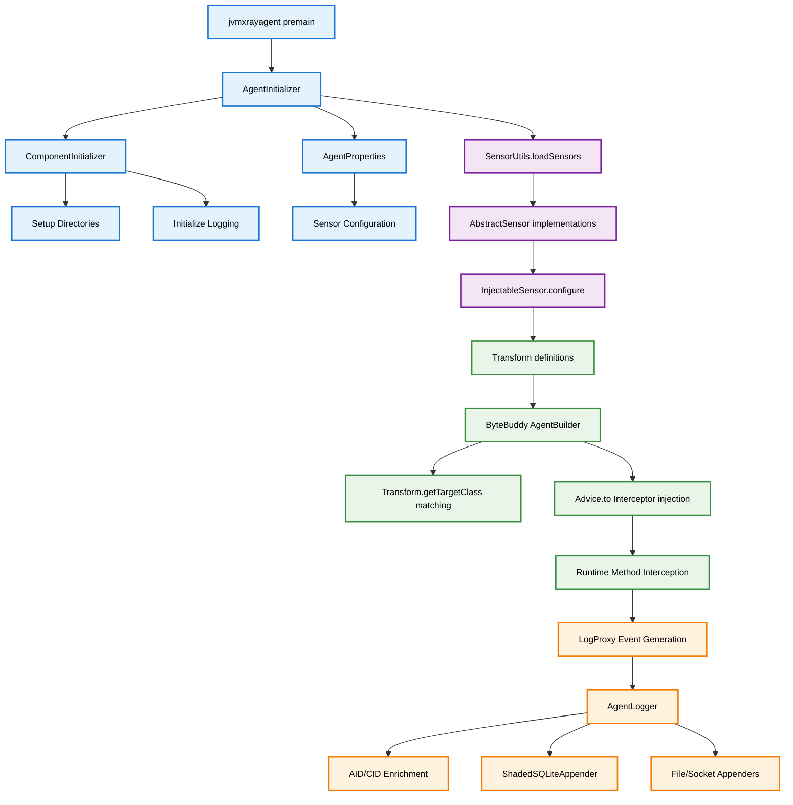
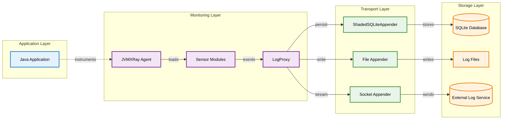
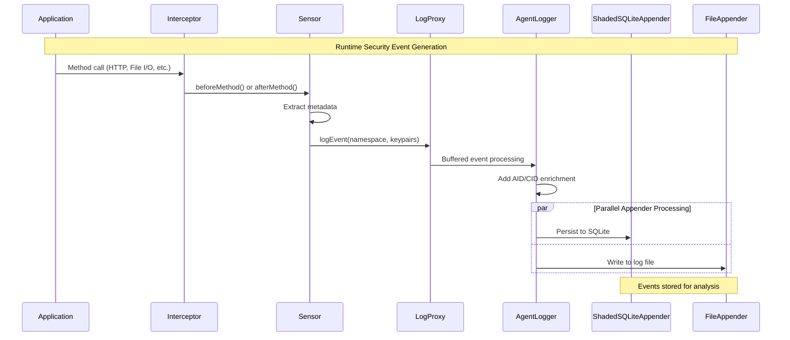

 # JVMXRay Agent

## Table of Contents

1. [Background and Purpose](#background-and-purpose)
2. [Architecture](#architecture)
3. [CLI Commands](#cli-commands)
4. [Properties](#properties)
   - 4.1 [Environment Variables](#environment-variables)
   - 4.2 [System Properties](#system-properties)
   - 4.3 [Component Properties](#component-properties)
   - 4.4 [Logback XML Settings](#logback-xml-settings)
5. [Sensor Reference](#sensor-reference)
   - 5.1 [Common Fields](#common-fields)
   - 5.2 [Configuration Sensor](#configuration-sensor)
   - 5.3 [Crypto Sensor](#crypto-sensor)
   - 5.4 [HTTP Sensor](#http-sensor)
   - 5.5 [File I/O Sensor](#file-io-sensor)
   - 5.6 [Monitor Sensor](#monitor-sensor)
   - 5.7 [Socket (Network) Sensor](#socket-network-sensor)
   - 5.8 [Serialization Sensor](#serialization-sensor)
   - 5.9 [SQL Sensor](#sql-sensor)
   - 5.10 [Authentication Sensor](#authentication-sensor)
   - 5.11 [APICall Sensor](#apicall-sensor)
   - 5.12 [Reflection Sensor](#reflection-sensor)
   - 5.13 [Script Engine Sensor](#script-engine-sensor)
   - 5.14 [Process Sensor](#process-sensor)
   - 5.15 [Library Sensor](#library-sensor)
   - 5.16 [Uncaught Exception Sensor](#uncaught-exception-sensor)
   - 5.17 [App Init Sensor](#app-init-sensor)
   - 5.18 [Risk Level Classification](#risk-level-classification)
6. [Database Tables](#database-tables)
7. [Common Errors](#common-errors)
8. [Developer Guide](#developer-guide)
9. [Unresolved](#unresolved)

---

## Background and Purpose

### Project Overview
The JVMXRay Agent is a runtime security monitoring tool that uses bytecode injection to instrument Java applications without requiring code changes. It monitors file access, network connections, system calls, and other security-relevant operations in real-time.

### Core Mission
Monitor Java application behavior through transparent bytecode injection with zero application modifications. JVMXRay is a source of structured security events — analysis is performed by your centralized logging solution, AI tooling, or SIEM.

### Key Capabilities
- 18 modular sensors monitoring different aspects of application behavior (see status table below)
- Real-time bytecode injection using ByteBuddy framework
- Structured event generation compatible with AI analysis tools and centralized logging
- Logging integration (Logback/SLF4J) with Splunk/ELK compatibility
- Configurable sensor activation with tunable overhead via standard Logback properties

### Sensor status

18 sensors ship with the agent. Most are enabled by default; three are conditionally disabled for the reasons noted.

| Sensor | Default state | Notes |
|---|---|---|
| API Call, App Init, Authentication, Configuration, Crypto, Data Transfer, File I/O, HTTP, Library, Monitor, Network (Socket), Process, Script Engine, Serialization, SQL, Uncaught Exception | enabled | wired in `agent.properties` and active in default `logback.xml` |
| Reflection | disabled by default | commented out in `agent.properties` (`#jvmxray.sensor.reflection=...`); high overhead; enable per environment |
| Memory | wired, disabled in logback | recursive-logging issue; logger removed from default `logback.xml`. Aggregate memory metrics over time are still emitted by `MonitorSensor`. |
| Thread | wired, disabled in logback | recursive-logging issue; logger removed from default `logback.xml` |

---

## Architecture

### Module Structure
```
+------------------+------------------------------------------------------+----------------------------+
| Package          | Purpose                                              | Dependencies               |
+------------------+------------------------------------------------------+----------------------------+
| agent            | Java agent with bytecode injection sensors           | ByteBuddy, platform.shared |
| sensor packages  | Modular monitoring components for different ops      | Agent core, LogProxy       |
| interceptors     | Method interception classes for bytecode injection   | Sensors, ByteBuddy Advice  |
| LogProxy         | Agent-safe logging proxy for bootloader context      | ShadedSQLiteAppender       |
+------------------+------------------------------------------------------+----------------------------+
```

### Component Relationships

#### Initialization Flow

```mermaid
%%{init: {'themeVariables': {'fontSize': '13px'}, 'flowchart': {'width': '900px'}}}%%
flowchart TD
    A[jvmxrayagent premain] --> B[AgentInitializer]
    B --> C[ComponentInitializer]
    B --> D[AgentProperties]
    B --> E[SensorUtils.loadSensors]

    C --> F[Setup Directories]
    C --> G[Initialize Logging]
    D --> H[Sensor Configuration]

    E --> I[AbstractSensor implementations]
    I --> J[InjectableSensor.configure]
    J --> K[Transform definitions]

    K --> L[ByteBuddy AgentBuilder]
    L --> M[Transform.getTargetClass matching]
    L --> N[Advice.to Interceptor injection]

    N --> O[Runtime Method Interception]
    O --> P[LogProxy Event Generation]

    P --> Q[AgentLogger]
    Q --> R[AID/CID Enrichment]
    Q --> S[ShadedSQLiteAppender]
    Q --> T[File/Socket Appenders]

    classDef initClass fill:#e3f2fd,stroke:#1976d2,stroke-width:2px,color:#000000
    classDef sensorClass fill:#f3e5f5,stroke:#7b1fa2,stroke-width:2px,color:#000000
    classDef bytecodeClass fill:#e8f5e8,stroke:#388e3c,stroke-width:2px,color:#000000
    classDef loggingClass fill:#fff3e0,stroke:#f57c00,stroke-width:2px,color:#000000

    class A,B,C,D,F,G,H initClass
    class E,I,J sensorClass
    class K,L,M,N,O bytecodeClass
    class P,Q,R,S,T loggingClass
```

#### Agent Architecture Overview

```mermaid
%%{init: {'themeVariables': {'fontSize': '13px'}, 'flowchart': {'width': '1000px'}}}%%
flowchart LR
    subgraph "Application Layer"
        A[Java Application]
    end

    subgraph "Monitoring Layer"
        B[JVMXRay Agent]
        C[Sensor Modules]
        D[LogProxy]
    end

    subgraph "Transport Layer"
        E[ShadedSQLiteAppender]
        F[File Appender]
        G[Socket Appender]
    end

    subgraph "Storage Layer"
        H[(SQLite Database)]
        I[Log Files]
        J[(External Log Service)]
    end

    A -.->|instruments| B
    B -->|loads| C
    C -->|events| D
    D -->|persist| E
    D -->|write| F
    D -->|stream| G
    E -->|stores| H
    F -->|writes| I
    G -->|sends| J

    classDef appLayer fill:#e3f2fd,stroke:#1976d2,stroke-width:2px,color:#000000
    classDef monitorLayer fill:#f3e5f5,stroke:#7b1fa2,stroke-width:2px,color:#000000
    classDef transportLayer fill:#e8f5e8,stroke:#388e3c,stroke-width:2px,color:#000000
    classDef storageLayer fill:#fff3e0,stroke:#f57c00,stroke-width:2px,color:#000000

    class A appLayer
    class B,C,D monitorLayer
    class E,F,G transportLayer
    class H,I,J storageLayer
```

### Data Flow
1. Agent premain() initializes sensors from properties
2. InjectableSensor.inject() adds classes to bootstrap classloader
3. ByteBuddy transforms target classes with method interceptors
4. Interceptors generate structured events via LogProxy
5. Events flow to specialized appenders (file, database, socket)

#### Runtime Event Flow Sequence

```mermaid
%%{init: {'themeVariables': {'fontSize': '13px'}}}%%
sequenceDiagram
    participant A as Application
    participant I as Interceptor
    participant S as Sensor
    participant L as LogProxy
    participant AG as AgentLogger
    participant DB as ShadedSQLiteAppender
    participant F as FileAppender

    Note over A,F: Runtime Security Event Generation

    A->>I: Method call (HTTP, File I/O, etc.)
    I->>S: beforeMethod() or afterMethod()
    S->>S: Extract metadata
    S->>L: logEvent(namespace, keypairs)

    L->>AG: Buffered event processing
    AG->>AG: Add AID/CID enrichment

    par Parallel Appender Processing
        AG->>DB: Persist to SQLite
        and
        AG->>F: Write to log file
    end

    Note over DB,F: Events stored for analysis
```

### Sensor discovery

Sensors are not hard-coded into the agent and are not discovered via Java SPI. Instead, the agent uses a property-driven registry: at premain time, `SensorUtils.loadSensors(properties, "jvmxray.sensor.")` enumerates every entry in `agent.properties` whose key starts with `jvmxray.sensor.` and instantiates the class named by the value.

```properties
# Each line names one sensor. The suffix after "jvmxray.sensor." is the
# property suffix passed to the sensor constructor.
jvmxray.sensor.http=org.jvmxray.agent.sensor.http.HttpSensor
jvmxray.sensor.io=org.jvmxray.agent.sensor.io.FileIOSensor
jvmxray.sensor.sql=org.jvmxray.agent.sensor.sql.SQLSensor

# Comment a line out to disable the sensor.
#jvmxray.sensor.reflection=org.jvmxray.agent.sensor.reflection.ReflectionSensor
```

Each sensor class must expose a public single-argument constructor that takes the property suffix as a `String`. `SensorUtils` resolves the class with `Class.forName(...).getDeclaredConstructor(String.class).newInstance(suffix)`. Failures during one sensor's construction are logged and the next sensor is attempted, so a malformed entry does not stop the agent.

Practical consequences:

- **Add a sensor** in deployment: drop a JAR with your sensor class on the agent's classpath and add a `jvmxray.sensor.<suffix>=<fqcn>` line.
- **Disable a sensor**: comment out its property line. Restart required.
- **Reorder**: order in `agent.properties` is the load order, but the agent does not depend on it for correctness.

The discovery mechanism is the bridge between configuration and code: every sensor that participates in monitoring shows up here.

---

## CLI Commands

### Command Reference

#### JVMXRay Agent Attachment
**Purpose:** Attach agent to JVM for runtime security monitoring

**Usage:**
```bash
# Basic agent attachment
java -javaagent:target/jvmxray-0.0.1-agent.jar MyApplication

# With agent arguments
java -javaagent:target/jvmxray-0.0.1-agent.jar=config-override MyApplication

# With custom JVMXRay home
java -Djvmxray.home=/opt/jvmxray -javaagent:target/jvmxray-0.0.1-agent.jar MyApplication
```

**Options:**

| Option | Description | Default |
|--------|-------------|---------|
| agentArgs | Optional configuration override arguments | null |
| -Djvmxray.home | Production mode base directory | ${user.dir}/.jvmxray |
| -Djvmxray.test.home | Test mode base directory (does NOT append /jvmxray/ subdirectory) | null |

**Examples:**
```bash
# Example 1: Basic monitoring with default sensors
java -javaagent:target/jvmxray-0.0.1-agent.jar -cp myapp.jar com.example.Application

# Example 2: Test mode with custom directory
java -Djvmxray.test.home=/tmp/jvmxray-test -javaagent:target/jvmxray-0.0.1-agent.jar MyApp

# Example 3: Production deployment
java -Djvmxray.home=/opt/security -javaagent:/opt/jvmxray/jvmxray-0.0.1-agent.jar -jar application.jar
```

---

## Properties

### Precedence

The agent reads configuration from four sources. When the same value is set in more than one, this is the order that wins (highest priority first):

1. **JVM system properties** (`-D...` on the `java` command line) — read first by the bootstrap and treated as authoritative.
2. **Agent arguments** (the string after `=` in `-javaagent:agent.jar=arg1,arg2`) — sensor-specific tuning like `lib.interval=30`.
3. **`agent.properties`** file in the agent config directory — durable per-deployment configuration; this is the typical place to enable or disable sensors.
4. **Built-in defaults** baked into each sensor class — used when none of the above set a value.

Logback configuration (`logback.xml`) controls which loggers and appenders are active, which is a separate axis from the four above. It can disable a sensor's *output* even when the sensor itself is wired in `agent.properties`.

### Environment Variables

#### Runtime Environment

**Common Variables:**

| Variable | Description | Default | Required |
|----------|-------------|---------|----------|
| JAVA_HOME | Path to JDK/JRE installation | system default | No |
| PATH | System path including java binary | system default | No |

### System Properties

#### JVM System Properties

**Location:** Set via `-D` flag at JVM startup

**Core Properties:**

| Property | Description | Default | Required |
|----------|-------------|---------|----------|
| -Djvmxray.home | Production mode base directory (creates ${home}/jvmxray/agent/logs/) | ${user.dir}/.jvmxray | No |
| -Djvmxray.test.home | Test mode base directory (creates ${test.home}/agent/logs/ directly) | null | No |
| -Djvmxray.agent.logs | Agent logs directory path | auto-detected | No |
| -Djvmxray.agent.config | Agent config directory path | auto-detected | No |
| -Dlogback.agent.configurationFile | Override logback config path | auto-detected | No |
| -Dorg.jvmxray.agent.mcc.ttl.seconds | MCC ThreadLocal cleanup TTL (seconds) - defensive cleanup for leaked scopes | 300 | No |

**Directory Structure Examples:**
```bash
# Production mode (-Djvmxray.home=/opt/jvmxray)
/opt/jvmxray/jvmxray/agent/logs/          # Note: extra /jvmxray/ subdirectory
/opt/jvmxray/jvmxray/agent/config/

# Test mode (-Djvmxray.test.home=/tmp/jvmxray-test)
/tmp/jvmxray-test/agent/logs/             # Note: no extra subdirectory
/tmp/jvmxray-test/agent/config/
```

### Component Properties

#### agent.properties

**Location:** `src/main/resources/agent.properties`

**Core Settings:**

| Property | Description | Default Value | Required |
|----------|-------------|---------------|----------|
| AID | Agent Instance ID - Unique identifier for this agent instance, essential for cloud deployments to distinguish events from different servers/containers | ${generated.aid} | Yes |
| CID | Configuration ID - Identifies the configuration profile (production, staging, development) for operational categorization and event filtering | production | Yes |
| log.message.encoding | Enable log message encoding for special characters and binary data | true | No |
| monitor.interval | Interval (milliseconds) for logging periodic system metrics including memory usage, thread counts, GC statistics, CPU load, and other application health indicators | 60000 | No |

**Monitoring Metrics:**

The MonitorSensor logs comprehensive system and sensor statistics every 60 seconds (configurable via monitor.interval). Metrics are aggregated from multiple sources:

**MCC (Mapped Correlation Context) Metrics:**
- `mcc_contexts_created`: Total correlation contexts created (lifetime counter)
- `mcc_active_contexts`: Current active contexts across all threads
- `mcc_max_context_size`: Largest context size ever seen (max fields in any context)
- `mcc_ttl_cleanups`: Defensive cleanups triggered (**should be 0** - non-zero indicates sensor bugs)
- `mcc_ttl_seconds`: Configured TTL value for defensive cleanup

**LibSensor (JAR Loading) Metrics:**
- `lib_static_loaded`: Number of static classpath JARs detected at startup
- `lib_dynamic_loaded`: Number of dynamically loaded JARs detected at runtime
- `lib_total_packages`: Total unique Java packages discovered across all JARs
- `lib_cache_size`: Current size of known JARs cache (bounded to 10,000 entries)

**System Metrics:**
- Memory: MemoryTotal, MemoryFree, MemoryMax, NonHeapUsed
- Threads: ThreadNew, ThreadRunnable, ThreadBlocked, ThreadWaiting, ThreadTerminated
- GC: GCCount, GCTime
- CPU: ProcessCpuLoad
- Files: OpenFiles (Unix systems only)
- Deadlocks: DeadlockedThreads

**LogProxy Metrics:**
- LogBufferUtilization, LogQueueSize, LogDiscardCount
- LogFlushRate, LogFlushTime, LogOverflowStrategy, LogTotalEvents

**Sensor Configuration:**

| Property | Description | Default Value | Required |
|----------|-------------|---------------|----------|
| jvmxray.sensor.http | HTTP request monitoring | org.jvmxray.agent.sensor.http.HttpSensor | No |
| jvmxray.sensor.fileio | File I/O operations | org.jvmxray.agent.sensor.io.FileIOSensor | No |
| jvmxray.sensor.monitor | System monitoring | org.jvmxray.agent.sensor.monitor.MonitorSensor | No |
| jvmxray.sensor.sql | Database queries | org.jvmxray.agent.sensor.sql.SQLSensor | No |
| jvmxray.sensor.socket | Network operations | org.jvmxray.agent.sensor.net.SocketSensor | No |
| jvmxray.sensor.crypto | Cryptographic ops | org.jvmxray.agent.sensor.crypto.CryptoSensor | No |
| jvmxray.sensor.serialization | Object serialization | org.jvmxray.agent.sensor.serialization.SerializationSensor | No |
| jvmxray.sensor.reflection | Reflection API calls | org.jvmxray.agent.sensor.reflection.ReflectionSensor | No |
| jvmxray.sensor.configuration | Configuration access | org.jvmxray.agent.sensor.configuration.ConfigurationSensor | No |
| jvmxray.sensor.auth | Authentication events | org.jvmxray.agent.sensor.auth.AuthenticationSensor | No |
| jvmxray.sensor.script | Script engine execution | org.jvmxray.agent.sensor.script.ScriptEngineSensor | No |
| jvmxray.sensor.uncaughtexception | Uncaught exceptions | org.jvmxray.agent.sensor.uncaughtexception.UncaughtExceptionSensor | No |

**File I/O Aggregate Statistics Configuration:**

The File I/O sensor uses a three-tier filtering strategy to reduce log noise while maintaining visibility into security-relevant file operations.

| Property | Description | Default Value | Required |
|----------|-------------|---------------|----------|
| jvmxray.agent.sensor.fileio.captures | Operations to capture: C=Create, R=Read, U=Update, D=Delete | CUD | No |
| jvmxray.io.threshold.bytes.read | Minimum bytes read to log (Tier 3) | 10485760 (10MB) | No |
| jvmxray.io.threshold.bytes.write | Minimum bytes written to log (Tier 3) | 10485760 (10MB) | No |
| jvmxray.io.monitor.patterns | Case-insensitive regex for sensitive files (Tier 2 - always logged) | (?i).\*(password\|credential\|secret\|token\|key\|auth\|private).\* | No |
| jvmxray.io.ignore.patterns | Case-insensitive regex for files to ignore (Tier 1 - never logged) | (?i).\*[\\\\\\/](temp\|tmp\|cache)[\\\\\\/].\*\|.\*\\.(tmp\|cache\|swp)$ | No |

**Filtering Strategy:**
1. **Tier 1 (Ignore)**: Files matching `jvmxray.io.ignore.patterns` are never tracked or logged (e.g., temp files, cache files)
2. **Tier 2 (Monitor)**: Files matching `jvmxray.io.monitor.patterns` are always logged regardless of size (e.g., credential files, private keys)
3. **Tier 3 (Threshold)**: All other files are logged only if they exceed read/write thresholds

**Platform-Agnostic Patterns:**
- Patterns use `[\\\\\\/]` to match both Windows (`\`) and Unix (`/`) path separators
- Case-insensitive matching with `(?i)` prefix ensures consistent behavior across operating systems
- Default patterns cover common temporary and cache file locations on all platforms

**Aggregate Statistics:**
Instead of logging every byte read/write operation, the sensor tracks:
- Total bytes read/written
- Number of read/write operations
- Operation duration (from file open to close)
- File operation type (create, read, write, read_write, open)
- Sensitive file flag based on monitor patterns

Events are logged when files are closed, providing complete operation statistics in a single log entry.

**LogProxy Configuration:**

| Property | Description | Default Value | Required |
|----------|-------------|---------------|----------|
| org.jvmxray.agent.logproxy.buffer.size | LogProxy buffer size | 10000 | No |
| org.jvmxray.agent.logproxy.buffer.flush.interval | Flush interval (seconds) | 10 | No |
| org.jvmxray.agent.logproxy.buffer.overflow.strategy | Buffer overflow handling | wait | No |

### Logback XML Settings

#### Agent Logback Configuration

**Location:** `src/main/resources/agent-logback-production.xml2`

**Key Appenders:**

| Appender | Purpose | Log File |
|----------|---------|----------|
| IOEVENTS | File I/O operations | agent-IO-events.log |
| HTTPEVENTS | HTTP requests | agent-HTTP-events.log |
| MONITOREVENTS | System monitoring | agent-MONITOR-events.log |
| NETEVENTS | Network operations | agent-NET-events.log |
| SQLEVENTS | Database queries | agent-SQL-events.log |
| CRYPTOEVENTS | Cryptographic operations | agent-CRYPTO-events.log |
| AUTHEVENTS | Authentication events | agent-AUTH-events.log |
| APILEVENTS | API calls | agent-API-events.log |
| CONFIGEVENTS | Configuration access | agent-CONFIG-events.log |
| EXCEPTIONEVENTS | Exception handling | agent-EXCEPTION-events.log |
| REFLECTIONEVENTS | Reflection operations | agent-REFLECTION-events.log |
| SCRIPTEVENTS | Script execution | agent-SCRIPT-events.log |
| SERIALIZATIONEVENTS | Serialization operations | agent-SERIALIZATION-events.log |
| SYSTEMEVENTS | System operations | agent-SYSTEM-events.log |
| THREADEVENTS | Thread operations | agent-THREAD-events.log |
| PLATFORM | Platform/agent logs | agent-PLATFORM.log |

**Properties:**

| Property | Description | Example |
|----------|-------------|---------|
| LOG_HOME | Agent logs directory | ${jvmxray.agent.logs} |
| MSG_FMT_LG | Message format | C:AP \| %d{YYYY.MM.dd 'at' HH:mm:ss z} \| %thread \| %5level \| %logger \| %X \| %msg%n |

---

## Sensor Reference

One section per sensor that ships with the agent. Each entry names the implementing class, the sensor's default operational status, the namespace(s) it emits events under, and the log file its events land in by default, followed by sample log entries and a per-field reference for the events the sensor produces. The sensor is the unit of interest; the log message it emits is described as its output.

Sensors that are not currently operational are listed under [Unresolved](#unresolved) at the end of this document with the reason and a sketch of possible fixes.

### Common Fields

The following fields appear across multiple log message types:

#### Automatically Added by LogProxy

These fields are automatically enriched by LogProxy for every log message:

| Field | Type | Log Level | Description | Format/Example |
|-------|------|-----------|-------------|----------------|
| `caller` | String | all | Application code location that triggered the event. Automatically captured from the stack trace, filtering out JDK, ByteBuddy, and JVMXRay framework classes to identify the actual application caller. | `com.example.MyClass:42` (className:lineNumber)<br>`unknown:0` if no application frame found |
| `AID` | String | all | Agent Instance ID - unique identifier for this agent instance, configured in agent.properties | `agent-001`, `prod-server-1` |
| `CID` | String | all | Configuration ID - identifies the configuration profile, configured in agent.properties | `production`, `staging`, `development` |

#### Event Correlation Fields

These fields are automatically maintained by MCC (Mapped Correlation Context) and appear in events from all sensors that participate in correlation.

**Note:** The Memory and Thread sensors are currently disabled due to recursive logging issues. When re-enabled, they will not include MCC correlation fields (`trace_id`, `scope_chain`, `parent_scope`, `scope_depth`) — MCC scoping is not yet implemented for these sensors.

| Field | Type | Log Level | Description | Example Values |
|-------|------|-----------|-------------|----------------|
| `trace_id` | String | all | Unique correlation ID linking all events within the same execution context. Generated on first scope entry, inherited by nested scopes. Also stored as dedicated TRACE_ID column in STAGE0_EVENT. | `a1b2c3d4e5f6` |
| `scope_chain` | String | all | Nested sensor activation path from root to current scope, delimited by `>`. Shows how execution flowed through sensors — the "security stacktrace". | `HTTP>SQL>FileIO`, `HTTP>Serialization>Reflection>Process` |
| `parent_scope` | String | all | Name of the immediate parent sensor scope. Enables event tree reconstruction. | `HTTP`, `SQL`, `none` (for root scope) |
| `scope_depth` | String | all | Integer nesting level. Normal requests nest 2-3 deep; depth 6+ warrants investigation as potential attack chain. | `1`, `3`, `6` |

**Correlation example:** An HTTP request triggers a SQL query which triggers file I/O:
```
trace_id=ABC123, scope_chain=HTTP,                 scope_depth=1, parent_scope=none
trace_id=ABC123, scope_chain=HTTP>SQL,              scope_depth=2, parent_scope=HTTP
trace_id=ABC123, scope_chain=HTTP>SQL>FileIO,       scope_depth=3, parent_scope=SQL
```

All three events share `trace_id=ABC123` and can be queried efficiently via the TRACE_ID index:
```sql
SELECT * FROM STAGE0_EVENT WHERE TRACE_ID = 'ABC123' ORDER BY TIMESTAMP;
```

#### Sensor-Specific Common Fields

| Field | Type | Log Level | Description | Example Values |
|-------|------|-----------|-------------|----------------|
| `error` | String | INFO, ERROR | Exception class name when an error occurs. Most sensors emit at INFO; SQL emits at ERROR. | `IOException`, `SecurityException` |
| `error_message` | String | INFO, ERROR | Detailed error message when an exception is thrown. Level matches `error`. | `Permission denied` |
| `risk_level` | String | INFO | Security risk classification for the event | `CRITICAL`, `HIGH`, `MEDIUM`, `LOW` |

#### Caller Field Details

The `caller` field uses stack trace analysis to identify the application code that triggered a security event:

**Filtered Out (Framework Code):**
- JDK packages: `java.*`, `javax.*`, `sun.*`, `jdk.*`
- ByteBuddy framework: `net.bytebuddy.*`
- JVMXRay agent code: `org.jvmxray.*` (except test/integration packages)

**Kept (Application Code):**
- User application classes
- Test code: `org.jvmxray` packages containing `.test.` or `.integration.`

**Format:** `fullyQualifiedClassName:lineNumber`

**Example Values:**
- `com.example.service.UserService:127` - Method at line 127
- `org.myapp.security.AuthFilter:45` - Security filter at line 45
- `unknown:0` - No application frame found (all frames were framework code)

---

### Configuration Sensor

**Class:** `org.jvmxray.agent.sensor.configuration.ConfigurationSensor`
**Status:** Active by default.
**Namespace(s):** `org.jvmxray.events.config.property`, `.environment`, `.file`, `.preferences`
**Log file:** `agent-CONFIG-events.log`

Monitors system property access and modifications, environment variable access, and configuration file operations.

#### Sample Log Entry
```
C:AP | 2024.09.15 at 14:30:25 EDT | main | INFO | org.jvmxray.events.config.property |
operation=system_getProperty|property_key=java.security.policy|value_retrieved=true|
sensitive_property=true|risk_level=HIGH|security_property_access=true
```

#### Field Reference

| Field | Type | Log Level | Description | Possible Values |
|-------|------|-----------|-------------|-----------------|
| `operation` | String | INFO | Type of configuration operation performed | `system_getProperty` - Reading a system property<br>`system_setProperty` - Modifying a system property<br>`system_getenv` - Reading an environment variable |
| `property_key` | String | INFO | Name of the system property being accessed | Any Java system property name (e.g., `java.home`, `user.dir`, `java.security.policy`) |
| `value_retrieved` | Boolean | INFO | Whether a value was successfully retrieved (not null) | `true` - Property exists and has a value<br>`false` - Property does not exist or is null |
| `property_value` | String | INFO | The value of the property (truncated to 100 chars). **Omitted for sensitive properties** | Property value or `...[truncated]` if over 100 chars |
| `sensitive_property` | Boolean | INFO | Whether this is classified as a sensitive property | `true` - Property is security-sensitive (contains password, secret, key, token, or is in SENSITIVE_PROPERTIES list) |
| `security_property_access` | Boolean | INFO | Whether this is a security-related property | `true` - Property name contains "security" or "policy" |
| `modification_success` | Boolean | INFO | Whether a setProperty operation succeeded | `true` - Property was successfully set<br>`false` - Operation failed (exception thrown) |
| `new_value` | String | INFO | The new value being set (truncated). **Omitted for sensitive properties** | New property value |
| `previous_value_existed` | Boolean | INFO | Whether the property had a previous value before modification | `true` - Property existed before setProperty call |
| `sensitive_property_modification` | Boolean | INFO | Indicates modification of a sensitive property | `true` - A sensitive property was modified |
| `critical_security_modification` | Boolean | INFO | Indicates modification of critical security properties | `true` - Modification of `java.security.manager` or `java.security.policy` |
| `path_modification` | Boolean | INFO | Indicates modification of path-related properties | `true` - Property name contains "path" or "dir" |
| `threat_type` | String | INFO | Classification of potential threat | `privilege_escalation` - Attempting to modify security boundaries |

#### Sensitive Properties List
The following properties are automatically classified as sensitive:
- `java.security.policy`, `java.security.manager`, `java.security.auth.login.config`
- `java.library.path`, `java.class.path`, `java.ext.dirs`, `java.endorsed.dirs`
- `user.dir`, `user.home`, `java.io.tmpdir`
- Any property containing: `password`, `secret`, `key`, `token`

---

### Crypto Sensor

**Class:** `org.jvmxray.agent.sensor.crypto.CryptoSensor`
**Status:** Active by default.
**Namespace(s):** `org.jvmxray.events.crypto.cipher`, `.cipher_init`, `.digest`, `.keystore`, `.ssl`
**Log file:** `agent-CRYPTO-events.log`

Monitors cryptographic operations including cipher instantiation, key configuration, message digest, keystore loading, and SSL/TLS socket setup.

#### Sample Log Entries

**Cipher Operation:**
```
C:AP | 2024.09.15 at 14:30:25 EDT | main | INFO | org.jvmxray.events.crypto.cipher |
operation=cipher_getInstance|transformation=DES/ECB/PKCS5Padding|algorithm=DES|
weak_algorithm=true|risk_level=HIGH|weakness_type=deprecated_algorithm|
cipher_class=javax.crypto.Cipher
```

**Message Digest Operation:**
```
C:AP | 2024.09.15 at 14:30:25 EDT | main | INFO | org.jvmxray.events.crypto.digest |
operation=messageDigest_getInstance|algorithm=MD5|weak_algorithm=true|
risk_level=CRITICAL|weakness_type=collision_vulnerable|
digest_class=java.security.MessageDigest
```

**KeyStore Operation:**
```
C:AP | 2024.09.15 at 14:30:25 EDT | main | INFO | org.jvmxray.events.crypto.keystore |
operation=keyStore_load|keystore_class=java.security.KeyStore|has_inputstream=true|
has_password=true|keystore_file=/etc/pki/java/cacerts|weak_password=true|risk_level=HIGH
```

#### Field Reference

| Field | Type | Log Level | Description | Possible Values |
|-------|------|-----------|-------------|-----------------|
| `operation` | String | INFO | Type of cryptographic operation | `cipher_getInstance` - Creating a Cipher instance<br>`messageDigest_getInstance` - Creating a MessageDigest<br>`keyStore_load` - Loading a KeyStore |
| `transformation` | String | INFO | Full cipher transformation string | `AES/CBC/PKCS5Padding`, `DES/ECB/NoPadding`, etc. |
| `algorithm` | String | INFO | Cryptographic algorithm name (uppercase) | `AES`, `DES`, `RSA`, `MD5`, `SHA-256`, etc. |
| `weak_algorithm` | Boolean | INFO | Whether the algorithm is considered cryptographically weak | `true` - Algorithm is deprecated or vulnerable |
| `weakness_type` | String | INFO | Specific type of cryptographic weakness | `deprecated_algorithm` - Algorithm is outdated (DES, RC4, 3DES)<br>`collision_vulnerable` - Hash has known collisions (MD5)<br>`deprecated_hash` - Hash is no longer recommended (SHA1) |
| `incomplete_transformation` | Boolean | INFO | Whether the cipher transformation is missing mode or padding | `true` - Transformation has fewer than 3 parts (missing mode or padding) |
| `cipher_class` | String | INFO | Fully qualified class name of the Cipher implementation | `javax.crypto.Cipher`, provider-specific class |
| `digest_class` | String | INFO | Fully qualified class name of the MessageDigest implementation | `java.security.MessageDigest` |
| `keystore_class` | String | INFO | Fully qualified class name of the KeyStore implementation | `java.security.KeyStore` |
| `has_inputstream` | Boolean | INFO | Whether keystore load was called with an InputStream | `true` - Loading from a file/stream<br>`false` - Creating an empty keystore |
| `has_password` | Boolean | INFO | Whether a password was provided for keystore operations | `true` - Password provided<br>`false` - No password (security concern) |
| `keystore_file` | String | INFO | Fully qualified path to the keystore file (when loaded from FileInputStream) | `/etc/pki/java/cacerts`, `/app/config/keystore.jks` |
| `stream_class` | String | INFO | Class name of the InputStream (when file path unavailable) | `java.io.BufferedInputStream`, `java.io.ByteArrayInputStream` |
| `weak_password` | Boolean | INFO | Whether the provided password is considered weak | `true` - Password length is less than 8 characters |

#### Weak Algorithm Detection
The following algorithms trigger `weak_algorithm=true`:
- **Ciphers:** DES, RC4, 3DES, DESede, RC2, ARCFOUR
- **Digests:** MD5 (CRITICAL), SHA1/SHA (HIGH)

#### Compliance Framework Fields

The CRYPTO sensor now includes regulatory compliance metadata:

| Field | Type | Log Level | Description | Example Values |
|-------|------|-----------|-------------|----------------|
| `fips_140_compliant` | Boolean | INFO | Whether the algorithm meets FIPS 140-2/3 requirements | `true`, `false` |
| `fips_140_status` | String | INFO | Detailed FIPS compliance status | `approved`, `deprecated`, `not_approved` |
| `pci_dss_compliant` | Boolean | INFO | Whether the configuration meets PCI-DSS requirements | `true`, `false` |
| `pci_dss_notes` | String | INFO | PCI-DSS compliance notes | `Minimum 128-bit key required`, `Algorithm prohibited` |
| `nist_status` | String | INFO | NIST recommendation status | `current`, `deprecated`, `prohibited` |
| `nist_deprecation_year` | String | INFO | Year algorithm was deprecated by NIST | `2015`, `2020`, etc. |
| `suggested_replacement` | String | INFO | Recommended alternative algorithm | `AES-256-GCM`, `SHA-256` |
| `key_length_bits` | Integer | INFO | Key length in bits (for cipher operations) | `128`, `256` |
| `digest_length_bits` | Integer | INFO | Digest output length in bits | `256`, `512` |
| `mode` | String | INFO | Cipher mode of operation | `CBC`, `GCM`, `ECB` |
| `padding` | String | INFO | Cipher padding scheme | `PKCS5Padding`, `NoPadding` |

#### Compliance Status Reference

| Algorithm | FIPS 140 | PCI-DSS | NIST Status |
|-----------|----------|---------|-------------|
| AES-128/192/256 | Approved | Compliant (128+ bits) | Current |
| SHA-256/384/512 | Approved | Compliant | Current |
| RSA (2048+ bits) | Approved | Compliant | Current |
| DES | Not Approved | Non-Compliant | Prohibited (2015) |
| 3DES/DESede | Deprecated | Non-Compliant | Deprecated (2020) |
| MD5 | Not Approved | Non-Compliant | Prohibited (2010) |
| SHA-1 | Deprecated | Non-Compliant | Deprecated (2015) |
| RC4 | Not Approved | Non-Compliant | Prohibited (2015) |

---

### HTTP Sensor

**Class:** `org.jvmxray.agent.sensor.http.HttpSensor`
**Status:** Active by default.
**Namespace(s):** `org.jvmxray.events.http.request`, `org.jvmxray.events.http.response`
**Log file:** `agent-HTTP-events.log`

Monitors HTTP servlet request/response cycles, capturing client information, URIs, status codes, and headers.

#### Sample Log Entries

**Request Event:**
```
C:AP | 2024.09.15 at 14:30:25 EDT | http-nio-8080-exec-1 | INFO | org.jvmxray.events.http.request |
request_id=a1b2c3|client_ip=192.168.1.100|uri=/api/users|user-agent=Mozilla/5.0
```

**Response Event:**
```
C:AP | 2024.09.15 at 14:30:25 EDT | http-nio-8080-exec-1 | INFO | org.jvmxray.events.http.response |
request_id=a1b2c3|request_uri=/api/users|status=200
```

#### Field Reference

| Field | Type | Log Level | Description | Possible Values |
|-------|------|-----------|-------------|-----------------|
| `request_id` | String | INFO | Unique identifier for this request/response pair | Short GUID (e.g., `a1b2c3d4`) |
| `client_ip` | String | INFO | IP address of the requesting client | IPv4 or IPv6 address |
| `uri` | String | INFO | Request URI path (without query string) | `/api/users`, `/login`, etc. |
| `request_uri` | String | INFO | Request URI (used in response to correlate back to request) | Same as `uri` |
| `user-agent` | String | INFO | Client's User-Agent header (INFO level only) | Browser/client identification string |
| `status` | Integer | INFO | HTTP response status code | `200`, `404`, `500`, etc. |
| `Content-Type` | String | DEBUG | Response Content-Type header | `application/json`, `text/html` |
| `Content-Length` | String | DEBUG | Response Content-Length header | Numeric string (bytes) |

**Note:** At DEBUG log level, every HTTP header is added as a dynamic field on both request and response events (typically prefixed `hdr_<headername>`). These fields are not itemized in the table because the set is open-ended — anything the client or server sends.

#### Enhanced Request Analysis Fields

| Field | Type | Log Level | Description | Example Values |
|-------|------|-----------|-------------|----------------|
| `request_method` | String | INFO | HTTP method of the request | `GET`, `POST`, `PUT`, `DELETE` |
| `query_string_present` | Boolean | INFO | Whether the request has a query string | `true`, `false` |
| `request_size_bytes` | Long | INFO | Size of the request body in bytes | `0`, `1024`, etc. |
| `response_time_ms` | Long | INFO | Time to process the request in milliseconds | `125`, `1500`, etc. |
| `status_class` | String | INFO | HTTP status classification | `success`, `redirect`, `client_error`, `server_error` |
| `sensitive_content_type` | Boolean | INFO | Whether response contains sensitive data type | `true` for JSON, XML, form data |

#### Security Headers Analysis Fields

| Field | Type | Log Level | Description | Example Values |
|-------|------|-----------|-------------|----------------|
| `csp_present` | Boolean | INFO | Content-Security-Policy header present | `true`, `false` |
| `hsts_present` | Boolean | INFO | Strict-Transport-Security header present | `true`, `false` |
| `xss_protection_present` | Boolean | INFO | X-XSS-Protection header present | `true`, `false` |
| `content_type_options` | String | INFO | X-Content-Type-Options header value | `nosniff`, `missing` |
| `frame_options` | String | INFO | X-Frame-Options header value | `DENY`, `SAMEORIGIN`, `missing` |
| `security_headers_missing` | String | INFO | Comma-separated list of missing security headers | `Content-Security-Policy,Strict-Transport-Security` |
| `security_headers_missing_count` | Integer | INFO | Number of missing security headers | `0` to `7` |

#### Attack Pattern Detection Fields

| Field | Type | Log Level | Description | Example Values |
|-------|------|-----------|-------------|----------------|
| `suspicious_user_agent` | Boolean | INFO | User-Agent matches known attack tool | `true` - Detected sqlmap, nikto, burp, etc. |
| `path_traversal_attempt` | Boolean | INFO | Path contains traversal patterns (../) | `true` - Path traversal detected |
| `sql_injection_pattern` | Boolean | INFO | Input contains SQL injection patterns | `true` - SQL keywords detected |
| `xss_pattern` | Boolean | INFO | Input contains XSS attack patterns | `true` - Script tags or event handlers detected |
| `command_injection_pattern` | Boolean | INFO | Input contains command injection patterns | `true` - Shell metacharacters detected |
| `attack_patterns_detected` | String | INFO | Comma-separated list of detected patterns | `path_traversal,sql_injection,xss` |
| `risk_indicators_count` | Integer | INFO | Number of attack patterns detected | `0` to `5` |

#### Detected Attack Tools
The HTTP sensor detects user agents from known security/attack tools:
- sqlmap, nikto, nessus, nmap, burp, dirbuster, gobuster
- wfuzz, havij, acunetix, appscan, webscarab, paros
- w3af, arachni, skipfish, zaproxy, metasploit, hydra, openvas

#### MCC (Mapped Correlation Context) Fields
The HTTP sensor enriches the correlation context with:
- `user_id` - Authenticated user name (from Principal or RemoteUser)
- `session_id` - HTTP session ID (if session exists)
- `client_ip` - Client IP address
- `request_uri` - Request URI path
- `request_method` - HTTP method (GET, POST, etc.)

---

### File I/O Sensor

**Class:** `org.jvmxray.agent.sensor.io.FileIOSensor`
**Status:** Active by default.
**Namespace(s):** `org.jvmxray.events.io.fileio`
**Log file:** `agent-IO-events.log`

Monitors file system operations including create, read, update, and delete operations. Supports aggregate statistics for high-volume operations.

#### Sample Log Entries

**File Operation Event:**
```
C:AP | 2024.09.15 at 14:30:25 EDT | main | INFO | org.jvmxray.events.io.fileio |
operation=CREATE|file=/tmp/data/output.txt|status=created
```

**Aggregate Statistics Event:**
```
C:AP | 2024.09.15 at 14:30:25 EDT | main | INFO | org.jvmxray.events.io.fileio |
operation=read_write|file=/var/log/app.log|is_new_file=false|is_sensitive=false|
bytes_read=1048576|bytes_written=0|read_operations=15|write_operations=0|duration_ms=125
```

#### Field Reference

| Field | Type | Log Level | Description | Possible Values |
|-------|------|-----------|-------------|-----------------|
| `operation` | String | INFO | Type of file operation performed | `CREATE` - File or directory creation<br>`DELETE` - File deletion<br>`READ` - File read access<br>`UPDATE` - File write access<br>`RENAME` - File rename operation<br>`MOVE` - File move operation<br>`SYMLINK_CREATE` - Symbolic link creation<br>`CHMOD` - Permission change<br>`CHOWN` - Owner change<br>`read` - Aggregate read stats<br>`write` - Aggregate write stats<br>`read_write` - Mixed read/write stats<br>`open` - File opened without R/W |
| `file` | String | INFO | Absolute path to the file | Full filesystem path |
| `status` | String | INFO | Result of the operation | `created` - File successfully created<br>`created_dir` - Directory created<br>`deleted` - File successfully deleted<br>`create_failed` - Creation failed<br>`delete_failed` - Deletion failed<br>`read_access` - Read stream opened<br>`write_access` - Write stream opened<br>`read_string` - String read via Files.readString<br>`read_bytes` - Bytes read via Files.readAllBytes<br>`written` - Written via Files.write<br>`copied_from` / `copied_to` - Copy operation<br>`renamed`, `moved`, `symlink_created`, `permissions_changed`, `owner_changed` |
| `is_new_file` | Boolean | INFO | Whether this was a newly created file | `true` - File did not exist before operation |
| `is_sensitive` | Boolean | INFO | Whether file matches sensitive patterns | `true` - Matches monitor patterns (password, credential, key, etc.) |
| `bytes_read` | Long | INFO | Total bytes read from the file | Numeric value (0 to file size) |
| `bytes_written` | Long | INFO | Total bytes written to the file | Numeric value |
| `read_operations` | Integer | INFO | Number of individual read() calls | Count of read operations |
| `write_operations` | Integer | INFO | Number of individual write() calls | Count of write operations |
| `duration_ms` | Long | INFO | Time from file open to close in milliseconds | Numeric value |

#### Path Resolution Fields

| Field | Type | Log Level | Description | Example Values |
|-------|------|-----------|-------------|----------------|
| `original_path` | String | INFO | Path as provided by the application | `./config/../secrets/key.pem` |
| `absolute_path` | String | INFO | Absolute path (may contain ../) | `/app/config/../secrets/key.pem` |
| `canonical_path` | String | INFO | Fully resolved path (symlinks and ../ resolved) | `/app/secrets/key.pem` |
| `path_normalized` | Boolean | INFO | Whether path normalization changed the path | `true` - Path traversal sequences were resolved |
| `is_symlink` | Boolean | INFO | Whether the file is a symbolic link | `true`, `false` |
| `symlink_target` | String | INFO | Target of the symbolic link | `/etc/passwords` |
| `file_name` | String | INFO | File name without directory | `key.pem` |
| `parent_directory` | String | INFO | Parent directory path | `/app/secrets` |
| `file_extension` | String | INFO | File extension (lowercase) | `pem`, `xml`, `properties` |

#### File Metadata Fields

| Field | Type | Log Level | Description | Example Values |
|-------|------|-----------|-------------|----------------|
| `file_exists` | Boolean | INFO | Whether the file exists | `true`, `false` |
| `is_directory` | Boolean | INFO | Whether the path is a directory | `true`, `false` |
| `is_regular_file` | Boolean | INFO | Whether the path is a regular file | `true`, `false` |
| `is_readable` | Boolean | INFO | Whether the file is readable | `true`, `false` |
| `is_writable` | Boolean | INFO | Whether the file is writable | `true`, `false` |
| `is_executable` | Boolean | INFO | Whether the file is executable | `true`, `false` |
| `is_hidden` | Boolean | INFO | Whether the file is hidden | `true`, `false` |
| `file_size_bytes` | Long | INFO | File size in bytes | `0`, `1048576`, etc. |
| `last_modified_time` | String | INFO | Last modification timestamp | `2024-09-15T14:30:25Z` |
| `creation_time` | String | INFO | File creation timestamp | `2024-09-15T10:00:00Z` |
| `last_access_time` | String | INFO | Last access timestamp | `2024-09-15T14:30:25Z` |
| `posix_permissions` | String | INFO | POSIX permission string (Unix/Linux/Mac) | `rwxr-xr-x`, `rw-r--r--` |
| `world_writable` | Boolean | INFO | Whether file is world-writable (security risk) | `true` - Others have write permission |
| `file_owner` | String | INFO | File owner username | `root`, `appuser` |

#### Rename/Move Operation Fields

| Field | Type | Log Level | Description | Example Values |
|-------|------|-----------|-------------|----------------|
| `source_path` | String | INFO | Original file path | `/tmp/data/old.txt` |
| `target_path` | String | INFO | Destination file path | `/var/data/new.txt` |
| `source_canonical_path` | String | INFO | Resolved source path | `/tmp/data/old.txt` |
| `target_canonical_path` | String | INFO | Resolved destination path | `/var/data/new.txt` |
| `source_file_name` | String | INFO | Original file name | `old.txt` |
| `target_file_name` | String | INFO | New file name | `new.txt` |
| `extension_changed` | Boolean | INFO | Whether file extension changed | `true` - e.g., `.txt` to `.exe` |
| `source_extension` | String | INFO | Original file extension | `txt` |
| `target_extension` | String | INFO | New file extension | `exe` |
| `directory_changed` | Boolean | INFO | Whether file was moved to different directory | `true` |
| `source_directory` | String | INFO | Original parent directory | `/tmp/data` |
| `target_directory` | String | INFO | New parent directory | `/var/data` |

#### Filtering Tiers
1. **Tier 1 (Ignore):** Files matching `jvmxray.io.ignore.patterns` are never logged
2. **Tier 2 (Monitor):** Files matching `jvmxray.io.monitor.patterns` are always logged regardless of size
3. **Tier 3 (Threshold):** Other files are logged only if bytes exceed configured thresholds

---

### Monitor Sensor

**Class:** `org.jvmxray.agent.sensor.monitor.MonitorSensor`
**Status:** Active by default. Emits one event every 60 seconds.
**Namespace(s):** `org.jvmxray.events.monitor`
**Log file:** `agent-MONITOR-events.log`

Collects and logs JVM health metrics every 60 seconds including memory, threads, CPU, garbage collection, and sensor statistics.

#### Sample Log Entry
```
C:AP | 2024.09.15 at 14:30:25 EDT | jvmxray.monitor-1 | INFO | org.jvmxray.events.monitor |
MemoryTotal=512MB|MemoryFree=256MB|MemoryMax=1GB|ThreadNew=0|ThreadRunnable=15|
ThreadBlocked=0|ThreadWaiting=8|ThreadTerminated=0|OpenFiles=42|ProcessCpuLoad=12.5%|
GCCount=25|GCTime=150ms|NonHeapUsed=64MB|DeadlockedThreads=0|
LogBufferUtilization=5%|LogQueueSize=50|LogDiscardCount=0|
mcc_contexts_created=1250|mcc_active_contexts=3|mcc_ttl_cleanups=0|
lib_static_loaded=45|lib_dynamic_loaded=2|lib_total_packages=128|lib_cache_size=47
```

#### Field Reference

**Memory Metrics:**

| Field | Type | Log Level | Description | Format/Range |
|-------|------|-----------|-------------|--------------|
| `MemoryTotal` | String | INFO | Total memory allocated to JVM | `NNNmb` or `N.Ngb` |
| `MemoryFree` | String | INFO | Free memory available in JVM heap | `NNNmb` or `N.Ngb` |
| `MemoryMax` | String | INFO | Maximum memory JVM can allocate | `NNNmb` or `N.Ngb` |
| `NonHeapUsed` | String | INFO | Non-heap memory usage (metaspace, code cache) | `NNNmb` or `N.Ngb` |

**Thread Metrics:**

| Field | Type | Log Level | Description | Range |
|-------|------|-----------|-------------|-------|
| `ThreadNew` | Integer | INFO | Threads in NEW state (created but not started) | 0+ |
| `ThreadRunnable` | Integer | INFO | Threads in RUNNABLE state (executing) | 0+ |
| `ThreadBlocked` | Integer | INFO | Threads in BLOCKED state (waiting for monitor) | 0+ (high values indicate contention) |
| `ThreadWaiting` | Integer | INFO | Threads in WAITING or TIMED_WAITING state | 0+ |
| `ThreadTerminated` | Integer | INFO | Threads in TERMINATED state | 0+ |
| `DeadlockedThreads` | Integer | INFO | Number of threads in deadlock | 0 (should always be 0 in healthy systems) |

**System Metrics:**

| Field | Type | Log Level | Description | Range |
|-------|------|-----------|-------------|-------|
| `ProcessCpuLoad` | String | INFO | CPU usage percentage for JVM process | `0%` to `100%` (or multiple of 100% for multi-core) |
| `OpenFiles` | String | INFO | Open file descriptor count (Unix only) | Numeric or `Unavailable` on Windows |
| `GCCount` | Integer | INFO | Total garbage collection events since JVM start | 0+ (cumulative) |
| `GCTime` | String | INFO | Total time spent in garbage collection | `NNNms` (cumulative) |

**LogProxy Buffer Metrics:**

| Field | Type | Log Level | Description | Range |
|-------|------|-----------|-------------|-------|
| `LogBufferUtilization` | String | INFO | Percentage of log buffer currently in use | `0%` to `100%` |
| `LogQueueSize` | String | INFO | Current number of events in buffer | 0 to buffer size (default 10000) |
| `LogDiscardCount` | String | INFO | Number of events discarded due to buffer overflow | 0+ (should be 0 in healthy systems) |
| `LogFlushRate` | String | INFO | Rate of log flushes per interval | Events per second |
| `LogFlushTime` | String | INFO | Average time to flush log buffer | Milliseconds |
| `LogOverflowStrategy` | String | INFO | Current overflow handling strategy | `wait`, `discard` |
| `LogTotalEvents` | String | INFO | Total events processed since start | Cumulative count |

**MCC (Correlation Context) Metrics:**

| Field | Type | Log Level | Description | Expected Values |
|-------|------|-----------|-------------|-----------------|
| `mcc_contexts_created` | Integer | INFO | Total correlation contexts created (lifetime) | Cumulative count |
| `mcc_active_contexts` | Integer | INFO | Currently active contexts across all threads | 0+ (matches concurrent requests) |
| `mcc_max_context_size` | Integer | INFO | Largest context seen (max fields in any context) | Typically 5-20 |
| `mcc_ttl_cleanups` | Integer | INFO | Defensive cleanups triggered for leaked contexts | **Should be 0** - non-zero indicates sensor bugs |
| `mcc_ttl_seconds` | Integer | INFO | Configured TTL for defensive cleanup | Default: 300 |

**LibSensor (JAR Loading) Metrics:**

| Field | Type | Log Level | Description | Range |
|-------|------|-----------|-------------|-------|
| `lib_static_loaded` | Integer | INFO | Static classpath JARs detected at startup | Count of JARs on classpath |
| `lib_dynamic_loaded` | Integer | INFO | JARs loaded dynamically at runtime | 0+ (runtime additions) |
| `lib_total_packages` | Integer | INFO | Unique Java packages discovered | Count across all JARs |
| `lib_cache_size` | Integer | INFO | Current size of known JARs cache | 0-10000 (bounded) |

**Classloader Metrics:**

| Field | Type | Log Level | Description | Range |
|-------|------|-----------|-------------|-------|
| `classloader_loaded_count` | Integer | INFO | Currently loaded class count | 0+ |
| `classloader_total_loaded` | Long | INFO | Total classes loaded since JVM start | Cumulative count |
| `classloader_unloaded_count` | Long | INFO | Total classes unloaded since JVM start | Cumulative count |

**Native Memory Metrics:**

| Field | Type | Log Level | Description | Range |
|-------|------|-----------|-------------|-------|
| `native_memory_used_bytes` | Long | INFO | Total native (direct + mapped) memory used | Bytes |
| `direct_buffer_count` | Long | INFO | Number of direct byte buffers | 0+ |
| `direct_buffer_memory_bytes` | Long | INFO | Memory used by direct buffers | Bytes |
| `mapped_buffer_count` | Long | INFO | Number of memory-mapped buffers | 0+ |
| `mapped_buffer_memory_bytes` | Long | INFO | Memory used by mapped buffers | Bytes |

**Rate-Based Metrics:**

| Field | Type | Log Level | Description | Range |
|-------|------|-----------|-------------|-------|
| `gc_frequency_per_minute` | String | INFO | Garbage collections per minute | `0.00` to `N.NN` |
| `gc_time_percent` | String | INFO | Percentage of time spent in GC | `0.00` to `100.00` |
| `thread_creation_rate_per_minute` | String | INFO | New threads created per minute | `0.00` to `N.NN` |
| `total_threads_started` | Long | INFO | Total threads started since JVM start | Cumulative count |

**Anomaly Detection Metrics:**

| Field | Type | Log Level | Description | Range |
|-------|------|-----------|-------------|-------|
| `baseline_status` | String | INFO | Baseline establishment status | `establishing`, `established` |
| `memory_leak_indicator` | String | INFO | Possible memory leak detected | `possible` if consistent heap growth |
| `memory_increase_percent` | String | INFO | Heap increase percentage | `0.00` to `N.NN%` |
| `memory_baseline_deviation` | String | INFO | Deviation from baseline heap usage | `0.00%` to `N.NN%` |
| `cpu_baseline_deviation` | String | INFO | Deviation from baseline CPU load | `0.00%` to `N.NN%` |
| `thread_baseline_deviation` | String | INFO | Deviation from baseline thread count | `0.00%` to `N.NN%` |
| `anomaly_detected` | Boolean | INFO | Whether any anomaly was detected | `true`, `false` |
| `anomaly_type` | String | INFO | Types of anomalies detected | `memory_spike`, `cpu_spike`, `thread_anomaly` |

**Security Metrics:**

| Field | Type | Log Level | Description | Range |
|-------|------|-----------|-------------|-------|
| `security_manager_present` | Boolean | INFO | Whether a SecurityManager is active | `true`, `false` |
| `security_manager_class` | String | INFO | SecurityManager implementation class | Fully qualified class name |
| `jmx_remote_enabled` | Boolean | INFO | Whether JMX remote access is enabled | `true`, `false` |
| `debug_mode_enabled` | Boolean | INFO | Whether JVM debug mode is active | `true`, `false` |

**Agent Health Metrics:**

| Field | Type | Log Level | Description | Range |
|-------|------|-----------|-------------|-------|
| `agent_health_score` | Integer | INFO | Overall agent health score | `0` to `100` |
| `agent_health_status` | String | INFO | Health status classification | `healthy` (80+), `degraded` (50-79), `critical` (<50) |
| `agent_health_issues` | String | INFO | Comma-separated list of health issues | `high_memory_pressure`, `deadlocks_detected`, `high_gc_overhead`, `high_thread_count` |
| `peak_thread_count` | Integer | INFO | Peak thread count since JVM start | 0+ |
| `heap_utilization_percent` | String | INFO | Current heap utilization | `0.0` to `100.0` |

---

### Socket (Network) Sensor

**Class:** `org.jvmxray.agent.sensor.net.SocketSensor`
**Status:** Active by default.
**Namespace(s):** `org.jvmxray.events.net.socket.bind`, `.connect`, `.accept`, `.close`
**Log file:** `agent-NET-events.log`

Monitors network socket operations including bind, connect, accept, and close.

#### Sample Log Entries

**Connect Event:**
```
C:AP | 2024.09.15 at 14:30:25 EDT | main | INFO | org.jvmxray.events.net.socket.connect |
bind_src=192.168.1.10:54321|dst=93.184.216.34:443|status=connected
```

**Bind Event:**
```
C:AP | 2024.09.15 at 14:30:25 EDT | main | INFO | org.jvmxray.events.net.socket.bind |
bind_src=0.0.0.0:8080|status=accepted
```

**Close Event:**
```
C:AP | 2024.09.15 at 14:30:25 EDT | main | INFO | org.jvmxray.events.net.socket.close |
bind_src=192.168.1.10:54321|dst=93.184.216.34:443|status=closed
```

#### Field Reference

| Field | Type | Log Level | Description | Format |
|-------|------|-----------|-------------|--------|
| `bind_src` | String | INFO | Local address and port | `<ip_address>:<port>` or `localhost:0` if not bound |
| `dst` | String | INFO | Remote/destination address and port | `<ip_address>:<port>` or `unknown:0` if not connected |
| `status` | String | INFO | Result of the socket operation | `connected` - Successfully connected<br>`bound` - Server socket bound<br>`accepted` - Ready to accept connections<br>`closed` - Socket closed successfully<br>`threw <ExceptionClass>: <message>` - Operation failed |

#### Enhanced Socket Metadata Fields

| Field | Type | Log Level | Description | Example Values |
|-------|------|-----------|-------------|----------------|
| `operation_type` | String | INFO | Type of socket operation | `CONNECT`, `BIND`, `ACCEPT` |
| `protocol` | String | INFO | Network protocol | `TCP`, `SSL/TLS` |
| `local_address` | String | INFO | Local IP address | `192.168.1.10` |
| `local_port` | Integer | INFO | Local port number | `54321` |
| `remote_address` | String | INFO | Remote IP address | `93.184.216.34` |
| `remote_port` | Integer | INFO | Remote port number | `443`, `8080` |
| `remote_hostname` | String | INFO | Remote hostname | `api.example.com` |
| `connection_direction` | String | INFO | Direction of the connection | `OUTBOUND`, `INBOUND` |
| `connection_time_ms` | Long | INFO | Time to establish connection | `150`, `2500` |
| `socket_timeout_ms` | Integer | INFO | Socket timeout setting | `30000` |

#### IP Classification Fields

| Field | Type | Log Level | Description | Example Values |
|-------|------|-----------|-------------|----------------|
| `is_loopback` | Boolean | INFO | Connection to localhost | `true`, `false` |
| `is_private_ip` | Boolean | INFO | Connection to RFC 1918 private address | `true` for 10.x, 172.16-31.x, 192.168.x |
| `is_ipv6` | Boolean | INFO | IPv6 address | `true`, `false` |
| `is_multicast` | Boolean | INFO | Multicast address | `true`, `false` |

#### TLS/SSL Metadata Fields

| Field | Type | Log Level | Description | Example Values |
|-------|------|-----------|-------------|----------------|
| `ssl_protocol` | String | INFO | TLS/SSL protocol version | `TLSv1.3`, `TLSv1.2`, `SSLv3` |
| `ssl_protocol_deprecated` | Boolean | INFO | Whether protocol is deprecated | `true` for SSLv3, TLSv1, TLSv1.1 |
| `ssl_cipher_suite` | String | INFO | Negotiated cipher suite | `TLS_AES_256_GCM_SHA384` |
| `ssl_cipher_weak` | Boolean | INFO | Whether cipher is considered weak | `true` for NULL, EXPORT, DES, RC4, MD5 ciphers |
| `ssl_handshake_success` | Boolean | INFO | Whether SSL handshake completed | `true`, `false` |
| `ssl_peer_certificate_subject` | String | INFO | Peer certificate subject DN | `CN=example.com,O=Example Inc` |
| `ssl_peer_certificate_issuer` | String | INFO | Peer certificate issuer DN | `CN=DigiCert,O=DigiCert Inc` |
| `ssl_certificate_expiry` | String | INFO | Certificate expiration date | `Sat Dec 31 23:59:59 UTC 2025` |
| `ssl_certificate_expired` | Boolean | INFO | Whether certificate is expired | `true`, `false` |

#### Inbound Connection Fields (ACCEPT operations)

| Field | Type | Log Level | Description | Example Values |
|-------|------|-----------|-------------|----------------|
| `client_address` | String | INFO | Connecting client IP | `192.168.1.50` |
| `client_port` | Integer | INFO | Client source port | `51234` |
| `server_address` | String | INFO | Server's listening IP | `0.0.0.0` |
| `server_port` | Integer | INFO | Server's listening port | `8443` |
| `is_client_loopback` | Boolean | INFO | Client is localhost | `true`, `false` |
| `is_client_private_ip` | Boolean | INFO | Client is from private network | `true`, `false` |

---

### Serialization Sensor

**Class:** `org.jvmxray.agent.sensor.serialization.SerializationSensor`
**Status:** Active by default.
**Namespace(s):** `org.jvmxray.events.serialization.serialize`, `.deserialize`, `.resolve`, `.json`, `.gson`, `.xml`
**Log file:** `agent-SERIALIZATION-events.log`

Monitors serialization and deserialization operations to detect dangerous class loading and potential deserialization attacks.

#### Sample Log Entries

**Java Native Deserialization:**
```
C:AP | 2024.09.15 at 14:30:25 EDT | main | INFO | org.jvmxray.events.serialization.deserialize |
operation=deserialize|serialization_type=java_native|deserialized_class=com.example.UserData
```

**Dangerous Class Detection:**
```
C:AP | 2024.09.15 at 14:30:25 EDT | main | INFO | org.jvmxray.events.serialization.deserialize |
operation=deserialize|serialization_type=java_native|
deserialized_class=org.apache.commons.collections.functors.InvokerTransformer|
dangerous_class=org.apache.commons.collections.functors.InvokerTransformer|
risk_level=CRITICAL|suspicious_pattern=true
```

**Class Resolution Event:**
```
C:AP | 2024.09.15 at 14:30:25 EDT | main | INFO | org.jvmxray.events.serialization.resolve |
operation=resolve_class|class_name=java.util.HashMap serialVersionUID: 362498820763181265|
dangerous_class=null
```

**Jackson JSON Deserialization:**
```
C:AP | 2024.09.15 at 14:30:25 EDT | main | INFO | org.jvmxray.events.serialization.json |
operation=deserialize|serialization_type=json_jackson|input_type=String|
result_class=com.example.UserData
```

#### Field Reference

| Field | Type | Log Level | Description | Possible Values |
|-------|------|-----------|-------------|-----------------|
| `operation` | String | INFO | Type of serialization operation | `deserialize` - Reading object from stream/JSON<br>`serialize` - Writing object to stream<br>`resolve_class` - Resolving class during deserialization |
| `serialization_type` | String | INFO | Serialization framework being used | `java_native` - Java ObjectInputStream/ObjectOutputStream<br>`json_jackson` - Jackson ObjectMapper<br>`json_gson` - Google Gson<br>`xml_xstream` - XStream XML |
| `serialized_class` | String | INFO | Class being serialized (for serialize ops) | Fully qualified class name |
| `deserialized_class` | String | INFO | Class of the deserialized object | Fully qualified class name |
| `class_name` | String | INFO | Class being resolved (for resolve_class ops) | Class name with serialVersionUID |
| `dangerous_class` | String | INFO | Name of dangerous/gadget class detected | Known gadget chain class name or `null` |
| `suspicious_pattern` | Boolean | INFO | Whether class name matches suspicious patterns | `true` - Contains "Transformer", "Handler", or "Factory" |
| `polymorphic_deserialization` | Boolean | INFO | JSON contains type info (@type or @class) | `true` - Polymorphic type handling detected (security risk) |
| `dangerous_class_reference` | String | INFO | Dangerous class reference found in JSON input | Class name pattern matched |
| `input_type` | String | INFO | Type of input being deserialized | `String`, `InputStream`, etc. |
| `result_class` | String | INFO | Class of the deserialized result object | Fully qualified class name |
| `potential_attack` | String | INFO | Classification of potential attack type | `gadget_chain_attempt` - ClassNotFoundException during deserialization (possible attack probe) |
| `threat_type` | String | INFO | Specific threat classification | `deserialization_gadget` - Known gadget chain class |

#### Dangerous Classes Detected
The sensor detects known deserialization gadget chain classes including:
- Apache Commons Collections transformers
- Spring framework objects
- Apache Xalan templates
- Hibernate objects
- JBoss/Wildfly components
- And many more (see `SerializationUtils.DANGEROUS_CLASSES`)

#### CVE and Gadget Chain Reference Fields

| Field | Type | Log Level | Description | Example Values |
|-------|------|-----------|-------------|----------------|
| `cve_id` | String | INFO | Associated CVE identifier | `CVE-2015-4852`, `CVE-2017-9805` |
| `gadget_chain_name` | String | INFO | ysoserial payload name | `CommonsCollections1`, `Spring1`, `Hibernate1` |
| `ysoserial_payload` | String | INFO | Associated ysoserial payload identifier | `CommonsCollections1-7`, `Spring1-2`, `Hibernate1-2` |
| `is_jdk_class` | Boolean | INFO | Whether class is from JDK | `true`, `false` |
| `class_package` | String | INFO | Package name of the class | `org.apache.commons.collections.functors` |
| `untrusted_source` | String | INFO | Likely source of untrusted data | `network_stream`, `file_input`, `unknown` |

#### CVE Mapping Reference

| Dangerous Class | CVE ID | Gadget Chain |
|-----------------|--------|--------------|
| `InvokerTransformer` | CVE-2015-4852 | CommonsCollections1-7 |
| `InstantiateTransformer` | CVE-2015-4852 | CommonsCollections1-7 |
| `ChainedTransformer` | CVE-2015-4852 | CommonsCollections1-7 |
| `ConstantTransformer` | CVE-2015-4852 | CommonsCollections1-7 |
| `TemplatesImpl` | CVE-2015-4852 | Various chains |
| `AbstractTranslet` | CVE-2015-4852 | Various chains |
| `JdbcRowSetImpl` | CVE-2017-3248 | JRMP/RMI attacks |
| `SpringBeanWrapper` | CVE-2017-9805 | Spring1-2 |
| `BeanComparator` | CVE-2015-6420 | CommonsBeanutils1 |
| `XStream` classes | CVE-2020-26217 | XStream attacks |
| `ObjectFactoryDelegatingInvocationHandler` | CVE-2018-1273 | Spring attacks |

#### Threat Classification

| Field Value | Description | Severity |
|-------------|-------------|----------|
| `deserialization_gadget` | Known gadget chain class detected | CRITICAL |
| `gadget_chain_attempt` | ClassNotFoundException during deserialization | HIGH |
| `polymorphic_type_handling` | JSON @type/@class annotations detected | HIGH |
| `dangerous_class_reference` | Dangerous class name in JSON input | HIGH |
| `suspicious_pattern` | Class name matches risky patterns | MEDIUM |

---

### SQL Sensor

**Class:** `org.jvmxray.agent.sensor.sql.SQLSensor`
**Status:** Active by default. Emits separate entry / exit-success / exit-error events tied by `correlation_id`; optional DEBUG event for parameter values.
**Namespace(s):** `org.jvmxray.events.sql.query`
**Log file:** `agent-SQL-events.log`

Monitors JDBC PreparedStatement executions including query metadata, execution duration, and results.

#### Sample Log Entries

**Query Start:**
```
C:AP | 2024.09.15 at 14:30:25 EDT | main | INFO | org.jvmxray.events.sql.query |
correlation_id=abc123|class=com.mysql.jdbc.PreparedStatement|
query=com.mysql.jdbc.PreparedStatement@7e3b0b0e|db_url=jdbc:mysql://localhost:3306/mydb|
db_user=appuser
```

**Query Completion:**
```
C:AP | 2024.09.15 at 14:30:25 EDT | main | INFO | org.jvmxray.events.sql.query |
correlation_id=abc123|class=com.mysql.jdbc.PreparedStatement|duration_ms=12.50|
status=success|result_type=ResultSet
```

**Query Error:**
```
C:AP | 2024.09.15 at 14:30:25 EDT | main | ERROR | org.jvmxray.events.sql.query |
correlation_id=abc123|class=com.mysql.jdbc.PreparedStatement|duration_ms=5.25|
status=error|error_message=Table 'users' doesn't exist
```

#### Field Reference

| Field | Type | Log Level | Description | Possible Values |
|-------|------|-----------|-------------|-----------------|
| `correlation_id` | String | INFO | Unique ID linking query start and completion events | GUID string |
| `class` | String | INFO | JDBC PreparedStatement implementation class | Driver-specific class name |
| `query` | String | INFO | Query representation from PreparedStatement | **Note:** Currently logs object reference, not SQL text |
| `db_url` | String | INFO | JDBC connection URL | `jdbc:mysql://host:port/db`, etc. |
| `db_user` | String | INFO | Database username from connection metadata | Database user name |
| `duration_ms` | String | INFO | Query execution time in milliseconds | Decimal value (e.g., `12.50`) |
| `status` | String | INFO | Query execution result | `success` - Query completed normally<br>`error` - Query threw exception |
| `result_type` | String | INFO | Type of result returned (for successful queries) | `ResultSet` - Query returned a result set |
| `update_count` | String | INFO | Number of rows affected (for DML statements) | Numeric string |
| `error_message` | String | ERROR | Exception message for failed queries | Database error message |
| `parameters` | String | DEBUG | Bound parameter values | `unavailable` or parameter details |

#### Enhanced SQL Metadata Fields

The SQL sensor now captures actual SQL text and provides enhanced analysis:

| Field | Type | Log Level | Description | Example Values |
|-------|------|-----------|-------------|----------------|
| `sql_text` | String | INFO | The actual SQL statement text | `SELECT * FROM users WHERE id = ?` |
| `sql_operation_type` | String | INFO | Type of SQL operation | `SELECT`, `INSERT`, `UPDATE`, `DELETE`, `DDL`, `CALL`, `UNKNOWN` |
| `is_parameterized` | Boolean | INFO | Whether statement uses parameters | `true` for PreparedStatement with `?` placeholders |
| `parameter_count` | Integer | INFO | Number of parameter placeholders | `0`, `3`, `10`, etc. |
| `sql_hash` | String | INFO | SHA-256 hash of SQL text (first 16 chars) | `a1b2c3d4e5f6g7h8` |
| `schema_name` | String | INFO | Database schema/catalog name | `mydb`, `information_schema` |
| `batch_size` | Integer | INFO | Number of statements in batch execution | `1`, `100`, etc. |

#### Error Analysis Fields

| Field | Type | Log Level | Description | Example Values |
|-------|------|-----------|-------------|----------------|
| `error_class` | String | ERROR | Exception class name | `SQLException`, `SQLSyntaxErrorException` |
| `sql_state` | String | ERROR | SQLSTATE error code | `42S02`, `23505` |
| `error_code` | Integer | ERROR | Vendor-specific error code | `1045`, `1146` |

#### SQL Text Capture Mechanism

The SQL sensor uses a caching mechanism to capture SQL text:

1. **PrepareStatement Interception**: When `Connection.prepareStatement(sql)` is called, the SQL text is captured and associated with the PreparedStatement instance
2. **Execute Correlation**: When `PreparedStatement.executeQuery()` or `executeUpdate()` is called, the cached SQL text is retrieved
3. **Statement Close Cleanup**: When `Statement.close()` is called, the cached SQL is removed to prevent memory leaks

#### SQL Operation Types

| Operation Type | Detected Keywords |
|----------------|-------------------|
| `SELECT` | SELECT, SHOW, DESCRIBE, EXPLAIN |
| `INSERT` | INSERT |
| `UPDATE` | UPDATE |
| `DELETE` | DELETE |
| `DDL` | CREATE, ALTER, DROP, TRUNCATE |
| `CALL` | CALL, EXECUTE |
| `UNKNOWN` | Unrecognized statements |

---


---

### Authentication Sensor

**Class:** `org.jvmxray.agent.sensor.auth.AuthenticationSensor`
**Status:** Active by default. Six sub-interceptors: SessionSet, SessionGet, SessionInvalidate, Login, Authenticate, Principal.
**Namespace(s):** `org.jvmxray.events.auth`, `org.jvmxray.events.auth.session`
**Log file:** `agent-AUTH-events.log`

Monitors authentication operations including JAAS login, Spring Security authentication, session operations, and principal lookups.

#### Sample Log Entries

**JAAS Login:**
```
C:AP | 2024.09.15 at 14:30:25 EDT | main | INFO | org.jvmxray.events.auth.session |
auth_action=login|auth_mechanism=jaas|auth_success=true
```

**Spring Security Authentication (Success):**
```
C:AP | 2024.09.15 at 14:30:25 EDT | http-nio-8080-exec-3 | INFO | org.jvmxray.events.auth.session |
auth_action=authenticate|auth_mechanism=spring_security|auth_success=true|principal_name=admin
```

**Spring Security Authentication (Failure):**
```
C:AP | 2024.09.15 at 14:30:25 EDT | http-nio-8080-exec-5 | INFO | org.jvmxray.events.auth.session |
auth_action=authenticate|auth_mechanism=spring_security|auth_success=false|auth_failure_reason=BadCredentialsException
```

**Principal Lookup:**
```
C:AP | 2024.09.15 at 14:30:25 EDT | http-nio-8080-exec-3 | INFO | org.jvmxray.events.auth.session |
auth_action=get_principal|principal_name=admin
```

#### Field Reference

| Field | Type | Log Level | Description | Possible Values |
|-------|------|-----------|-------------|-----------------|
| `auth_action` | String | INFO | Type of authentication operation | `login` - JAAS login attempt<br>`authenticate` - Spring Security authentication<br>`get_principal` - Principal name lookup |
| `auth_mechanism` | String | INFO | Authentication framework used | `jaas` - Java Authentication and Authorization Service<br>`spring_security` - Spring Security framework |
| `auth_success` | Boolean | INFO | Whether authentication succeeded | `true`, `false` |
| `auth_failure_reason` | String | INFO | Exception class on failure | Exception simple name (e.g., `BadCredentialsException`, `LoginException`) |
| `principal_name` | String | INFO | Authenticated user identity | Username or principal name |

---

### APICall Sensor

**Class:** `org.jvmxray.agent.sensor.api.APICallSensor`
**Status:** Active by default.
**Namespace(s):** `org.jvmxray.events.api.call`
**Log file:** `agent-APICALL-events.log`

Monitors Java 11+ HttpClient.send() operations, capturing request details, response status, and timing.

#### Sample Log Entries

**Successful API Call:**
```
C:AP | 2024.09.15 at 14:30:25 EDT | main | INFO | org.jvmxray.events.api.call |
operation=http_client_send|request_uri=https://api.example.com/v1/users|request_host=api.example.com|
request_scheme=https|uses_tls=true|request_method=GET|response_time_ms=142|
response_status=200|status_class=success|content_type=application/json|status=completed
```

**Failed API Call:**
```
C:AP | 2024.09.15 at 14:30:25 EDT | pool-2-thread-1 | INFO | org.jvmxray.events.api.call |
operation=http_client_send|request_uri=https://internal-service:8443/health|request_host=internal-service|
request_scheme=https|uses_tls=true|request_method=GET|status=failed|
error_class=ConnectException|error_message=Connection refused
```

#### Field Reference

| Field | Type | Log Level | Description | Possible Values |
|-------|------|-----------|-------------|-----------------|
| `operation` | String | INFO | Type of API operation | `http_client_send` - HttpClient.send() call |
| `request_uri` | String | INFO | Full request URI | Any valid URI (e.g., `https://api.example.com/v1/users`) |
| `request_host` | String | INFO | Target hostname | Hostname from the URI |
| `request_scheme` | String | INFO | Protocol scheme | `http`, `https` |
| `request_port` | Integer | INFO | Target port | Port number (e.g., `443`, `8080`) |
| `request_method` | String | INFO | HTTP method | `GET`, `POST`, `PUT`, `DELETE`, `PATCH`, `HEAD`, `OPTIONS` |
| `uses_tls` | Boolean | INFO | Whether connection uses TLS | `true` for HTTPS, `false` for HTTP |
| `response_time_ms` | Double | INFO | Response time in milliseconds | Execution duration (e.g., `142`) |
| `response_status` | Integer | INFO | HTTP status code | `200`, `404`, `500`, etc. |
| `status_class` | String | INFO | Response status classification | `success` - 2xx<br>`redirect` - 3xx<br>`client_error` - 4xx<br>`server_error` - 5xx |
| `content_type` | String | INFO | Response Content-Type header | MIME type (e.g., `application/json`, `text/html`) |
| `status` | String | INFO | Operation completion status | `completed` - Request finished normally<br>`failed` - Exception thrown |
| `error_class` | String | INFO | Exception class on failure | Exception simple name (e.g., `ConnectException`, `SocketTimeoutException`) |
| `error_message` | String | INFO | Error description | Exception message text |

---

### Reflection Sensor

**Class:** `org.jvmxray.agent.sensor.reflection.ReflectionSensor`
**Status:** Disabled by default — commented out in `agent.properties` because of high overhead intercepting every reflective call. Enable per environment if reflection-based attacks are in scope.
**Namespace(s):** `org.jvmxray.events.reflection.class_forname`, `.method_invoke`, `.constructor_invoke`, `.constructor_newInstance`, `.field_get`, `.field_set`, `.set_accessible`
**Log file:** `agent-REFLECTION-events.log`

Monitors reflective operations that can be used for code injection, privilege escalation, and access control bypass.

#### Sample Log Entries

**Class Loading (Suspicious):**
```
C:AP | 2024.09.15 at 14:30:25 EDT | main | INFO | org.jvmxray.events.reflection.class_forname |
operation=class_forName|class_name=java.lang.ProcessBuilder|loaded_successfully=true|
suspicious_class=true|risk_level=HIGH|threat_type=privilege_escalation|
class_loader=sun.misc.Launcher$AppClassLoader
```

**Method Invocation:**
```
C:AP | 2024.09.15 at 14:30:25 EDT | main | INFO | org.jvmxray.events.reflection.method_invoke |
operation=method_invoke|method_name=exec|declaring_class=java.lang.Runtime|
instance_provided=true|arg_count=1|command_execution=true|risk_level=CRITICAL
```

**Access Control Bypass:**
```
C:AP | 2024.09.15 at 14:30:25 EDT | pool-1-thread-2 | INFO | org.jvmxray.events.reflection.setAccessible |
operation=setAccessible|target_info=java.lang.reflect.Field|access_control_bypass=true|
risk_level=HIGH
```

#### Field Reference

| Field | Type | Log Level | Description | Possible Values |
|-------|------|-----------|-------------|-----------------|
| `operation` | String | INFO | Type of reflective operation | `class_forName`, `method_invoke`, `constructor_newInstance`, `field_get`, `field_set`, `setAccessible` |
| `class_name` | String | INFO | Class being loaded via reflection | Fully qualified class name |
| `method_name` | String | INFO | Method being invoked | Method name |
| `declaring_class` | String | INFO | Class that declares the method/field | Fully qualified class name |
| `field_name` | String | INFO | Field being accessed or modified | Field name |
| `suspicious_class` | Boolean | INFO | Whether class matches known dangerous patterns | `true` for classes like `ProcessBuilder`, `Runtime`, `TemplatesImpl` |
| `suspicious_method` | Boolean | INFO | Whether method is potentially dangerous | `true` for methods like `exec`, `invoke` |
| `risk_level` | String | INFO | Threat risk assessment | `MEDIUM`, `HIGH`, `CRITICAL` |
| `threat_type` | String | INFO | Classification of potential threat | `privilege_escalation`, `code_injection` |
| `access_control_bypass` | Boolean | INFO | Whether setAccessible(true) was called | `true` if bypassing access control |
| `command_execution` | Boolean | INFO | Whether Runtime.exec was detected | `true` if executing system commands |
| `bytecode_framework` | Boolean | INFO | Whether a bytecode framework class was detected | `true` for ASM, ByteBuddy, CGLib, Javassist classes |
| `loaded_successfully` | Boolean | INFO | Whether Class.forName succeeded | `true`, `false` |
| `class_loader` | String | INFO | ClassLoader used to load the class | Class loader name or `bootstrap` |
| `instance_provided` | Boolean | INFO | Whether an object instance was passed to invoke | `true`, `false` |
| `arg_count` | Integer | INFO | Number of arguments passed | Argument count |
| `error` | String | INFO | Exception class on failure | Exception simple name |
| `error_message` | String | INFO | Error description | Exception message text |

---

### Script Engine Sensor

**Class:** `org.jvmxray.agent.sensor.script.ScriptEngineSensor`
**Status:** Active by default. Emits at INFO on successful eval, ERROR on failure.
**Namespace(s):** `org.jvmxray.events.script.execution`
**Log file:** `agent-SCRIPT-events.log`

Monitors ScriptEngine.eval() operations and engine lookups, detecting suspicious script content and tracking execution.

#### Sample Log Entries

**Script Evaluation (Suspicious):**
```
C:AP | 2024.09.15 at 14:30:25 EDT | main | INFO | org.jvmxray.events.script.execution |
operation=script_eval|engine_name=Oracle Nashorn|script_language=JavaScript|
script_length=156|script_hash=a1b2c3d4e5f6a7b8|
script_snippet=var r = java.lang.Runtime.getRuntime(); r.exec("whoami");|
suspicious_patterns=Runtime.exec|risk_level=HIGH|status=success|duration_ms=23.5
```

**Script Evaluation (Normal):**
```
C:AP | 2024.09.15 at 14:30:25 EDT | main | INFO | org.jvmxray.events.script.execution |
operation=script_eval|engine_name=GraalVM JavaScript|script_language=JavaScript|
script_length=42|script_hash=f0e1d2c3b4a59687|risk_level=LOW|status=success|duration_ms=8.2
```

**Engine Lookup:**
```
C:AP | 2024.09.15 at 14:30:25 EDT | main | INFO | org.jvmxray.events.script.execution |
operation=engine_lookup|engine_lookup=javascript
```

#### Field Reference

| Field | Type | Log Level | Description | Possible Values |
|-------|------|-----------|-------------|-----------------|
| `operation` | String | INFO, ERROR | Type of script operation | `script_eval` - Script execution<br>`engine_lookup` - Engine resolution by name/extension |
| `engine_name` | String | INFO, ERROR | Script engine implementation name | `Oracle Nashorn`, `GraalVM JavaScript`, etc. |
| `script_language` | String | INFO, ERROR | Scripting language | `JavaScript`, `Python`, `Groovy`, etc. |
| `script_length` | Integer | INFO, ERROR | Script content length in characters | Character count |
| `script_hash` | String | INFO, ERROR | SHA-256 hash prefix of script content | First 16 hex characters of hash |
| `script_snippet` | String | INFO, ERROR | Script content preview (truncated to 200 chars) | Beginning of script text |
| `suspicious_patterns` | String | INFO, ERROR | Detected dangerous patterns | Comma-separated list (e.g., `Runtime.exec,ProcessBuilder,Class.forName`) |
| `risk_level` | String | INFO, ERROR | Threat risk assessment | `LOW` - No suspicious patterns<br>`HIGH` - Suspicious patterns detected |
| `script_source` | String | INFO, ERROR | Input source type | `reader` if script provided via Reader |
| `engine_lookup` | String | INFO | Engine name or extension being looked up | Engine identifier (e.g., `javascript`, `js`) |
| `duration_ms` | Double | INFO, ERROR | Execution time in milliseconds | Execution duration |
| `status` | String | INFO, ERROR | Execution result. Successful evals emit at INFO; failed evals emit at ERROR. | `success`, `error` |
| `error_class` | String | ERROR | Exception class on failure | Exception simple name |
| `error_message` | String | ERROR | Error description | Exception message text |

---

### Process Sensor

**Class:** `org.jvmxray.agent.sensor.system.ProcessSensor`
**Status:** Active by default. Hooks `ProcessBuilder.start()` and `Runtime.exec()`.
**Namespace(s):** `org.jvmxray.events.system.process`
**Log file:** `agent-SYSTEM-events.log`

Monitors process execution via ProcessBuilder.start() and Runtime.exec(), capturing commands, arguments, and execution details.

#### Sample Log Entries

**Process Execution:**
```
C:AP | 2024.09.15 at 14:30:25 EDT | main | INFO | org.jvmxray.events.system.process |
operation=EXECUTE|command=/bin/sh|args=-c whoami|working_dir=/opt/app|
execution_time_ms=45|status=started
```

**Process Execution Failure:**
```
C:AP | 2024.09.15 at 14:30:25 EDT | pool-1-thread-1 | INFO | org.jvmxray.events.system.process |
operation=EXECUTE|command=/usr/bin/curl|args=https://malicious-site.com/payload|
status=failed|error_class=IOException|error_message=Cannot run program "/usr/bin/curl"
```

#### Field Reference

| Field | Type | Log Level | Description | Possible Values |
|-------|------|-----------|-------------|-----------------|
| `operation` | String | INFO | Type of process operation | `EXECUTE` - Process execution |
| `command` | String | INFO | Executable path or name | Path to executable (e.g., `/bin/sh`, `cmd.exe`) |
| `args` | String | INFO | Command-line arguments | Space-separated arguments |
| `working_dir` | String | INFO | Process working directory (if specified) | Absolute directory path |
| `execution_time_ms` | Long | INFO | Execution time in milliseconds | Duration value |
| `status` | String | INFO | Process launch result | `started` - Process launched successfully<br>`failed` - Exception during launch |
| `error_class` | String | INFO | Exception class on failure | Exception simple name (e.g., `IOException`) |
| `error_message` | String | INFO | Error description | Exception message text |

---

### Library Sensor

**Class:** `org.jvmxray.agent.sensor.system.LibSensor`
**Status:** Active by default. See [Unresolved](#unresolved) for the polling-based dynamic detection gap.
**Namespace(s):** `org.jvmxray.events.system.lib`
**Log file:** `agent-SYSTEM-events.log`

Monitors JAR library loading on the classpath, capturing SHA-256 hashes, Maven coordinates, and package inventories for supply chain security.

#### Static vs dynamic loading

LibSensor reports each JAR with a `load_type` of `static` or `dynamic`. The distinction reflects *when* and *how* the JAR was detected, and the two paths have different characteristics worth understanding:

- **Static (`load_type=static`)** — JARs present on the JVM's classpath at startup. LibSensor reads `System.getProperty("java.class.path")` once during `initialize()` and processes every `.jar` entry. Detection is deterministic: every classpath entry is reported exactly once, before any application code runs.

- **Dynamic (`load_type=dynamic`)** — JARs that appear after startup, typically loaded by plugin frameworks, OSGi containers, custom classloaders, or `URLClassLoader.addURL(...)`. LibSensor runs a background daemon thread that polls every 60 seconds via `Instrumentation.getAllLoadedClasses()`, derives each class's source JAR from `ProtectionDomain.getCodeSource()`, and emits a `dynamic` event for any JAR not seen previously.

The poll interval is tunable through the agent argument `lib.interval=<seconds>`:

```bash
java -javaagent:jvmxray-0.0.1-agent.jar=lib.interval=30 -jar app.jar
```

**Tradeoff to be aware of.** Dynamic detection is poll-based, not event-based. A JAR loaded and fully unloaded between two polls — for example a short-lived classloader inside a test harness — will not be reported. Reducing `lib.interval` narrows but does not close this window. For workloads that load and unload classes frequently, treat the dynamic event stream as a *sample*, not a complete trace.

Both event types carry the same field schema below. Static events are typically followed by complete Maven coordinates (from `META-INF/maven/.../pom.properties`); dynamic events from custom JARs often have only `jar_path`, `sha256`, and `packages`.

#### Sample Log Entries

**Static Classpath JAR:**
```
C:AP | 2024.09.15 at 14:30:25 EDT | jvmxray.libsensor-1 | INFO | org.jvmxray.events.system.lib |
load_type=static|jar_path=/home/user/.m2/repository/org/springframework/spring-core/6.1.0/spring-core-6.1.0.jar|
sha256=a1b2c3d4e5f6a7b8c9d0e1f2a3b4c5d6e7f8a9b0c1d2e3f4a5b6c7d8e9f0a1b2|
groupId=org.springframework|artifactId=spring-core|version=6.1.0|
implTitle=Spring Core|implVendor=Spring Framework|packages=org.springframework.core,org.springframework.util
```

**Dynamic JAR (No Maven Coordinates):**
```
C:AP | 2024.09.15 at 14:30:28 EDT | jvmxray.libsensor-1 | INFO | org.jvmxray.events.system.lib |
load_type=dynamic|jar_path=/opt/app/plugins/custom-plugin.jar|
sha256=f0e1d2c3b4a5968778695a4b3c2d1e0fa9b8c7d6e5f4a3b2c1d0e9f8a7b6c5d4|
packages=com.example.plugin
```

#### Field Reference

| Field | Type | Log Level | Description | Possible Values |
|-------|------|-----------|-------------|-----------------|
| `load_type` | String | INFO | How the JAR was loaded | `static` - Present on initial classpath<br>`dynamic` - Loaded at runtime |
| `jar_path` | String | INFO | Absolute path to the JAR file | File system path |
| `sha256` | String | INFO | SHA-256 hash of the JAR file | 64 hex character hash |
| `groupId` | String | INFO | Maven group ID (if available from META-INF) | Maven group (e.g., `org.springframework`) |
| `artifactId` | String | INFO | Maven artifact ID (if available) | Maven artifact name |
| `version` | String | INFO | Maven version (if available) | Version string (e.g., `6.1.0`) |
| `implTitle` | String | INFO | Implementation-Title from MANIFEST.MF | JAR title |
| `implVersion` | String | INFO | Implementation-Version from MANIFEST.MF | Version string |
| `implVendor` | String | INFO | Implementation-Vendor from MANIFEST.MF | Vendor name |
| `packages` | String | INFO | Java packages found in the JAR | Comma-separated package names |

---

### Uncaught Exception Sensor

**Class:** `org.jvmxray.agent.sensor.uncaughtexception.UncaughtExceptionSensor`
**Status:** Active by default. Fires once per uncaught throwable on any thread.
**Namespace(s):** `org.jvmxray.events.system.uncaughtexception`
**Log file:** `agent-SYSTEM-events.log`

Captures crash diagnostics when threads terminate with uncaught exceptions, including stack traces, memory state, and incident identification.

#### Sample Log Entry
```
C:AP | 2024.09.15 at 14:30:25 EDT | pool-1-thread-3 | INFO | org.jvmxray.events.system.uncaughtexception |
thread_name=pool-1-thread-3|thread_id=42|thread_state=RUNNABLE|thread_priority=5|
thread_daemon=false|thread_group=main|exception_type=java.lang.NullPointerException|
exception_message=Cannot invoke method on null reference|
exception_location=com.example.service.OrderService:127|exception_method=processOrder|
stack_depth=15|incident_id=c3a1b2d4-e5f6-7890-abcd-ef1234567890|
root_cause_type=java.lang.NullPointerException|root_cause_message=Cannot invoke method on null reference|
stack_trace=com.example.service.OrderService.processOrder(OrderService.java:127) > com.example.controller.OrderController.submit(OrderController.java:45)
```

#### Field Reference

UncaughtExceptionSensor emits one event per uncaught throwable. The `priority` field on the log line is either `INFO` or `DEBUG` depending on which loggers are enabled. INFO carries the minimum useful diagnostic; DEBUG adds substantial system-state and forensic detail. Fields below are grouped by the level at which they first appear.

**Always present (INFO and DEBUG)**

| Field | Type | Log Level | Description | Possible Values |
|-------|------|-----------|-------------|-----------------|
| `thread_name` | String | INFO | Name of thread where exception occurred | Thread name (e.g., `main`, `pool-1-thread-3`) |
| `thread_id` | Long | INFO | Thread ID | Numeric thread identifier |
| `thread_state` | String | INFO | Thread state at time of exception | `RUNNABLE`, `WAITING`, `TIMED_WAITING`, `BLOCKED` |
| `thread_priority` | Integer | INFO | Thread priority | `1`-`10` (default `5`) |
| `thread_daemon` | Boolean | INFO | Whether thread is a daemon thread | `true`, `false` |
| `thread_group` | String | INFO | Thread group name | Thread group (e.g., `main`, `system`) |
| `exception_type` | String | INFO | Fully qualified exception class | Exception class name (e.g., `java.lang.NullPointerException`) |
| `exception_message` | String | INFO | Exception message | Exception detail text |
| `exception_location` | String | INFO | First non-JDK stack frame | `ClassName:lineNumber` format |
| `exception_method` | String | INFO | Method where exception occurred | Method name |
| `stack_depth` | Integer | INFO | Total stack trace depth | Number of frames |
| `stack_trace` | String | INFO, DEBUG | Simplified stack trace. Field appears at both levels but content differs by verbosity. | First 10 frames at INFO; all frames at DEBUG; separated by ` > ` |
| `root_cause_type` | String | INFO | Root cause exception class (only when chained) | Exception class name |
| `root_cause_message` | String | INFO | Root cause message (only when chained) | Exception detail text |
| `command_line` | String | INFO | Full command line that started this JVM | Reconstructed from `RuntimeMXBean.getInputArguments()` |
| `main_class` | String | INFO | Main class from `sun.java.command` | Fully qualified class name or `unknown` |
| `heap_used_mb` | Double | INFO | Heap memory currently used | MB, formatted to 2 decimals (e.g., `412.34`) |
| `heap_max_mb` | Double | INFO | Heap maximum size | MB |
| `heap_committed_mb` | Double | INFO | Heap committed by the JVM | MB |
| `heap_utilization_pct` | Double | INFO | Heap used as a percentage of max | `0.00`-`100.00` |
| `non_heap_used_mb` | Double | INFO | Non-heap (metaspace, code cache) used | MB |
| `non_heap_committed_mb` | Double | INFO | Non-heap committed | MB |
| `thread_count` | Integer | INFO | Live thread count at time of exception | Numeric |
| `peak_thread_count` | Integer | INFO | Peak thread count since JVM start | Numeric |
| `daemon_thread_count` | Integer | INFO | Live daemon thread count | Numeric |
| `total_started_threads` | Long | INFO | Lifetime count of threads ever started | Numeric |
| `jvm_uptime_ms` | Long | INFO | JVM uptime at time of exception | Milliseconds |
| `incident_id` | String | INFO | Unique incident identifier | UUID string |
| `timestamp` | Long | INFO | Time of exception (epoch milliseconds) | Milliseconds since epoch |

**Added only at DEBUG**

When the namespace's logger is at DEBUG, the sensor adds an extensive system-state and forensic dump. Fields below appear *only* when DEBUG is enabled.

| Field | Type | Log Level | Description | Possible Values |
|-------|------|-----------|-------------|-----------------|
| `cause_N_type` | String | DEBUG | Exception class at depth `N` in the cause chain (`N` = 1..10) | Exception class name |
| `cause_N_message` | String | DEBUG | Exception message at depth `N` | Exception detail text |
| `cause_N_location` | String | DEBUG | First stack frame at depth `N` | `ClassName.method(File.java:42)` |
| `cause_chain_length` | Integer | DEBUG | Number of nested causes traversed (max 10) | `0`-`10` |
| `suppressed_count` | Integer | DEBUG | Count of suppressed exceptions on the throwable | Numeric |
| `suppressed_exceptions` | String | DEBUG | Class + message for up to 5 suppressed exceptions | Semicolon-separated |
| `pool_<poolname>_used_mb` | Double | DEBUG | Per-pool memory usage (dynamic field per memory pool) | One field per pool: `pool_g1_eden_space_used_mb`, `pool_metaspace_used_mb`, etc. |
| `memory_pools_error` | String | DEBUG | Set only if collecting pool stats throws | Exception message |
| `gc_<gcname>_collections` | Long | DEBUG | Per-collector collection count (dynamic field per GC) | One field per collector: `gc_g1 young generation_collections`, etc. |
| `gc_<gcname>_time_ms` | Long | DEBUG | Per-collector total GC time in ms | Numeric |
| `gc_stats_error` | String | DEBUG | Set only if collecting GC stats throws | Exception message |
| `loaded_class_count` | Integer | DEBUG | Currently loaded class count | Numeric |
| `total_loaded_class_count` | Long | DEBUG | Lifetime loaded class count | Numeric |
| `unloaded_class_count` | Long | DEBUG | Lifetime unloaded class count | Numeric |
| `os_name` | String | DEBUG | OS name from `OperatingSystemMXBean` | `Linux`, `Mac OS X`, `Windows 10` |
| `os_version` | String | DEBUG | OS version | OS-specific |
| `os_arch` | String | DEBUG | OS architecture | `amd64`, `aarch64`, `x86` |
| `available_processors` | Integer | DEBUG | CPU count visible to JVM | Numeric |
| `system_load_average` | Double | DEBUG | 1-minute load average (`-1` if unavailable) | Numeric or `-1.00` |
| `security_manager` | String | DEBUG | Installed SecurityManager class, or `none` | FQCN or `none` |
| `java_security_policy` | String | DEBUG | Value of `java.security.policy` system property | Policy file path or `default` |
| `temp_dir_free_space_mb` | Double | DEBUG | Free space on `java.io.tmpdir` partition | MB |
| `temp_dir_total_space_mb` | Double | DEBUG | Total space on `java.io.tmpdir` partition | MB |
| `target_thread_group` | String | DEBUG | Thread group of the failing thread | Group name or `null` |
| `target_thread_context_classloader` | String | DEBUG | Context classloader class of the failing thread | FQCN |
| `target_thread_interrupted` | Boolean | DEBUG | Whether the failing thread had been interrupted | `true`, `false` |
| `current_thread_cpu_time_ms` | Long | DEBUG | CPU time consumed by the current thread (when supported) | Milliseconds |
| `jvm_name` | String | DEBUG | JVM implementation name | `OpenJDK 64-Bit Server VM`, etc. |
| `jvm_vendor` | String | DEBUG | JVM vendor | `Eclipse Adoptium`, `Oracle Corporation` |
| `java_version` | String | DEBUG | Java runtime version | `17.0.10`, `21.0.2` |
| `uptime_ms` | Long | DEBUG | JVM uptime (alternate key paired with `jvm_uptime_ms` at INFO) | Milliseconds |
| `start_time` | Long | DEBUG | JVM start time (epoch milliseconds) | Numeric |
| `system_*` | String | DEBUG | Open-ended set of management-bean fields prefixed `system_` (process info, threads, etc., contributed by `ManagementProxy`) | Field names vary by JVM and OS |
| `management_error` | String | DEBUG | Set only if `ManagementProxy.getManagementInfo()` throws | Exception class summary |

---

### App Init Sensor

**Class:** `org.jvmxray.agent.sensor.system.AppInitSensor`
**Status:** Active by default. Fires once at agent premain time.
**Namespace(s):** `org.jvmxray.events.system.settings`
**Log file:** `agent-SYSTEM-events.log`

One-time startup capture of JVM version, OS details, container detection, environment variables (with sensitive value redaction), and system properties.

#### Sample Log Entries

**System Context:**
```
C:AP | 2024.09.15 at 14:30:25 EDT | main | INFO | org.jvmxray.events.system.settings |
event_type=system_context|jvm_version=17.0.8|jvm_vendor=Eclipse Adoptium|
os_name=Linux|os_arch=amd64|is_container=true|container_type=docker
```

**Environment Variable:**
```
C:AP | 2024.09.15 at 14:30:25 EDT | main | INFO | org.jvmxray.events.system.settings |
message=JAVA_HOME=/usr/lib/jvm/java-17-openjdk
```

**Sensitive Variable (Redacted):**
```
C:AP | 2024.09.15 at 14:30:25 EDT | main | INFO | org.jvmxray.events.system.settings |
message=DB_PASSWORD=***REDACTED***|is_redacted=true
```

#### Field Reference

| Field | Type | Log Level | Description | Possible Values |
|-------|------|-----------|-------------|-----------------|
| `event_type` | String | INFO | Type of initialization event | `system_context` - JVM and environment snapshot |
| `message` | String | INFO | Individual environment variable or system property | `KEY=VALUE` format (e.g., `JAVA_HOME=/usr/lib/jvm/java-17-openjdk`) |
| `is_redacted` | Boolean | INFO | Whether the value was redacted for security | `true` for variables containing PASSWORD, SECRET, TOKEN, API_KEY, PRIVATE_KEY, CREDENTIAL |

---

### Risk Level Classification

All sensors use a consistent risk level classification:

| Level | Description | Action Required |
|-------|-------------|-----------------|
| `CRITICAL` | Immediate security threat, potential RCE | Immediate investigation and remediation |
| `HIGH` | Significant security risk, likely exploitable | Priority investigation within 24 hours |
| `MEDIUM` | Potential risk, context-dependent | Review and remediate in normal cycle |
| `LOW` | Informational, best practice deviation | Document and address as capacity allows |

---

## Database Tables

The agent emits every event as a Logback log record, so persistence is whatever Logback appenders you wire up — rolling files, sockets to a remote log server, syslog, JDBC, Kafka, or any other Logback-compatible sink. **There is no required database.**

JVMXRay ships with a `ShadedSQLiteAppender` and a `SchemaManager` CLI that handles SQLite, MySQL, and Cassandra schemas. These exist for **testing and demos**: they let you spin up a working event store locally without standing up a log pipeline first. Production deployments typically route events through existing log infrastructure (Splunk, ELK, Datadog, OpenSearch) via Logback appenders rather than the bundled SQL stores.

### Schema reference

If you do use the bundled SQL appender, the single table written by the agent is `STAGE0_EVENT`, holding raw events with metadata and a `KEYPAIRS` payload. Indexes on `TIMESTAMP`, `NAMESPACE`, `AID`/`CID`, and `TRACE_ID` support time-based, sensor-type, agent-instance, and correlation queries.

The full schema — column types, indexes, and the parallel `STAGE0_EVENT_KEYPAIR` table for parsed pipelines — is documented in [docs/prj-common.md](prj-common.md) alongside the `SchemaManager` CLI. Read that doc if you are setting up storage; this section exists only to point you to it.

### Event format

Every emitted log line follows: `CONFIG_FILE | timestamp | thread | priority | namespace | keypairs`. The `KEYPAIRS` segment is pipe-separated `key=value` pairs whose contents depend on the sensor — see [Sensor Reference](#sensor-reference) for per-sensor field documentation.

---

## Common Errors

### Error Reference

#### Configuration Errors

**Error Message:**
```
Unable to determine a working directory. Set -Djvmxray.home=/path/to/home or -Djvmxray.test.home=/path/to/test/home
```

**Cause:** Neither jvmxray.home nor jvmxray.test.home system properties are set

**Resolution:**
```bash
# For production use
java -Djvmxray.home=/opt/jvmxray -javaagent:jvmxray-0.0.1-agent.jar MyApp

# For testing
java -Djvmxray.test.home=/tmp/test -javaagent:jvmxray-0.0.1-agent.jar MyApp
```

**Prevention:** Always set exactly one of the home directory properties

#### Logging Initialization Errors

**Error Message:**
```
AgentLogger singleton failed to initialize. Check startup logs.
```

**Cause:** LogProxy initialization failed during agent startup

**Resolution:**
```bash
# Check agent logs directory permissions
chmod 755 /path/to/jvmxray/agent/logs/
```

**Prevention:** Ensure agent has write permissions to logs directory

#### Property Conflicts

**Error Message:**
```
Both jvmxray.test.home and jvmxray.home are set. Only one should be specified.
```

**Cause:** Conflicting system properties set simultaneously

**Resolution:**
```bash
# Remove one property - keep only production OR test
java -Djvmxray.home=/opt/jvmxray -javaagent:agent.jar MyApp
```

**Prevention:** Set only one home directory property per JVM instance

#### Sensor Loading Errors

**Error Message:**
```
Class resource not found: org/jvmxray/agent/sensor/SensorClass.class
```

**Cause:** Missing sensor dependency or corrupted agent JAR

**Resolution:**
```bash
# Rebuild agent with all dependencies
mvn clean install
```

**Prevention:** Use the agent JAR (jvmxray-0.0.1-agent.jar) for deployments

---

## Developer Guide

This guide is for developers writing new sensors or modifying existing ones. It assumes you have read the [Architecture](#architecture) section, particularly [Sensor discovery](#sensor-discovery), and are comfortable with Java instrumentation concepts.

### Writing a sensor

A sensor is a Java class that JVMXRay loads at agent startup. Sensors fall into two flavors based on what they do:

- **Standalone sensors** observe the JVM externally (timers, polling daemons, JMX scrapes, classpath walks). They implement `Sensor` and use their `initialize()` hook to start whatever work they need.
- **Injectable sensors** observe specific Java methods by inserting bytecode-level advice into them. They implement `InjectableSensor` and declare their target methods via `Transform[]`.

`LibSensor` is a standalone sensor (polls `Instrumentation.getAllLoadedClasses()`). `FileIOSensor`, `SQLSensor`, and `HttpSensor` are injectable.

#### Required contract: `Sensor`

Every sensor implements four methods from the `Sensor` interface (`src/main/java/org/jvmxray/agent/sensor/Sensor.java`):

```java
public interface Sensor {
    String getIdentity();
    String getDisplayName();
    void initialize(AgentProperties props, String agentArgs, Instrumentation inst);
    void shutdown();
}
```

- `getIdentity()` — return a **hardcoded GUID** that uniquely identifies this sensor across versions and deployments. Hardcoded means a literal string in the source, not a runtime-generated value; it lets event sinks deduplicate and tag events by sensor identity.
- `getDisplayName()` — return a human-readable name (typically derived from the property suffix passed in the constructor).
- `initialize(...)` — runs once at agent premain. Read agent arguments, parse properties, start background threads, register with `StatsRegistry`.
- `shutdown()` — runs on JVM shutdown. Stop threads, flush state. Default implementation is a no-op.

#### Required constructor

Sensors are instantiated by the registry via reflection. Every sensor class **must** expose a single-argument constructor that takes its property suffix as a `String`:

```java
public class MyCustomSensor extends AbstractSensor {
    public MyCustomSensor(String propertySuffix) {
        super(propertySuffix);
    }
    // ...
}
```

The suffix is the part of the property key after `jvmxray.sensor.` — e.g., `mycustom` in `jvmxray.sensor.mycustom=org.example.MyCustomSensor`. If this constructor is missing, the agent logs a discovery error and skips the sensor.

#### Base class: `AbstractSensor`

In practice you extend `AbstractSensor` rather than implementing `Sensor` directly. It provides:

- No-op defaults for `initialize()` and `shutdown()` so you only override what you need.
- A `displayName` derived from the property suffix.
- The **sensor guard** — `executeSafely(BooleanSupplier)` — described below.

#### The sensor guard

Sensors monitor JVM activity, which means they themselves run inside the JVM and can trigger other sensors. Without protection, a sensor that, say, opens a log file would fire the FileIO sensor, whose own logging would fire FileIO again, ad infinitum.

`AbstractSensor.executeSafely(BooleanSupplier work)` sets a thread-local flag for the duration of the call. Any sensor advice running inside that scope is short-circuited. Use it whenever your sensor performs an operation that another sensor might be watching:

```java
private void persistMetadata(String jarPath) {
    executeSafely(() -> {
        try (var out = new FileOutputStream(getCacheFile())) {
            out.write(jarPath.getBytes(StandardCharsets.UTF_8));
        } catch (IOException e) {
            return false;
        }
        return true;
    });
}
```

If you skip the guard and your sensor touches files, sockets, reflection, or scripts, you will produce a recursive cascade and the JVM will OOM. `MemorySensor` and `ThreadSensor` are currently disabled in the default `logback.xml` for precisely this reason.

#### Injectable sensors: bytecode advice

If your sensor needs to fire when application code calls specific Java methods (`File.delete`, `Socket.connect`, `Class.forName`...), implement `InjectableSensor` and use ByteBuddy advice.

```java
public interface InjectableSensor extends Sensor {
    Class<?>[] inject();       // classes pushed into the bootstrap classloader
    Transform[] configure();   // class+method patterns and advice
}
```

`inject()` returns the advice classes (and any helper classes they reference) that must be visible from the bootstrap classloader. The bootstrap classloader is the only one capable of seeing both JDK classes and the agent's helpers, which is why standard reflection-based loading does not work for advice code.

`configure()` returns one `Transform` per target class. Each `Transform` names a class and an array of `MethodSpec`s; each `MethodSpec` names a method (and optionally its parameter types) plus the advice class to apply. ByteBuddy rewrites the target classes' bytecode at class-load time to call your advice at method entry, exit, or both.

A minimal example, modelled on `FileIOSensor`:

```java
public class MyIOSensor extends AbstractSensor implements InjectableSensor {
    public MyIOSensor(String propertySuffix) { super(propertySuffix); }

    @Override public String getIdentity() { return "C0FFEE00-...-..."; }

    @Override public Class<?>[] inject() {
        return new Class<?>[] { MyDeleteInterceptor.class };
    }

    @Override public Transform[] configure() {
        return new Transform[] {
            new Transform(
                "java.io.File",
                new MethodSpec[] {
                    new MethodSpec("delete", MyDeleteInterceptor.class)
                }
            )
        };
    }
}

// Advice runs at method entry/exit. Use ByteBuddy's @Advice annotations.
public class MyDeleteInterceptor {
    @Advice.OnMethodEnter
    public static void onEnter(@Advice.This File self) {
        MCC.enterScope("MyIO");
        try {
            LogProxy.logMessage(NAMESPACE, "INFO",
                Map.of("op", "delete", "path", self.getAbsolutePath()));
        } catch (Throwable ignored) { }
    }

    @Advice.OnMethodExit
    public static void onExit() {
        MCC.exitScope("MyIO");
    }
}
```

A few things this example illustrates:

- The interceptor is a plain class with `static` methods annotated with `@Advice.OnMethodEnter` / `@Advice.OnMethodExit`. ByteBuddy inlines them; the methods cannot reference instance state.
- Always wrap event emission in `try { ... } catch (Throwable ignored) { }`. A throw from advice corrupts the application's stack — there is no safe way to recover.
- Always pair `MCC.enterScope` / `MCC.exitScope` (see [MCC correlation](#mcc-correlation) below).

The shipped sensors are the best reference. Read `FileIOSensor` and its `*Interceptor` classes for a complete worked example.

### MCC correlation

`MCC` (Mapped Correlation Context, at `src/main/java/org/jvmxray/platform/shared/util/MCC.java`) is what makes the "security stacktrace" feature work — `trace_id`, `scope_chain`, `parent_scope`, and `scope_depth` fields that appear on every event are maintained by MCC.

For sensor authors there are two patterns:

- **Spanning scope** — your sensor wraps an entire method call (most injectable sensors). Call `MCC.enterScope("YourSensorName")` in `@OnMethodEnter` advice and `MCC.exitScope("YourSensorName")` in `@OnMethodExit`, paired symmetrically. The scope name appears in `scope_chain`.
- **Degenerate scope** — your sensor emits a single event with no nested work (`AppInitSensor`, `ConfigurationSensor`). Call `enterScope` and `exitScope` back-to-back inside one advice method, with the event emission between them.

The two scope names are reserved: `>` is the chain delimiter and may not appear in a scope name.

If you forget to call `exitScope`, MCC's TTL-based defensive cleanup (default 300 seconds) will eventually collect the leaked ThreadLocal — but the `mcc_ttl_cleanups` metric will increment and your events between the leak and the cleanup will be miscorrelated. Watch that metric in `MonitorSensor` output during sensor development.

### Utility Classes

#### StatsRegistry

`src/main/java/org/jvmxray/agent/util/StatsRegistry.java` is a centralized, thread-safe registry for sensor statistics. Sensors register named string values; `MonitorSensor` reads a snapshot every 60 seconds and emits one consolidated metrics event.

Key methods:

| Method | Returns | Description |
|--------|---------|-------------|
| `StatsRegistry.register(String key, String value)` | `void` | Set or update a metric, thread-safe |
| `StatsRegistry.getSnapshot()` | `Map<String, String>` | Immutable snapshot of all current metrics |
| `StatsRegistry.clear()` | `void` | Remove all entries |

Pattern: increment a counter inside your advice or sensor loop, then push the new value to `StatsRegistry`:

```java
private final AtomicLong opCount = new AtomicLong(0);

@Advice.OnMethodEnter
public static void onEnter() {
    long n = opCount.incrementAndGet();
    StatsRegistry.register("my_sensor_ops", String.valueOf(n));
}
```

Choose metric names with your sensor's prefix (`my_sensor_*`) so they're easy to grep in `MonitorSensor` output.

**Registered metrics shipped with the agent:**

- *MCC* — `mcc_contexts_created`, `mcc_active_contexts`, `mcc_max_context_size`, `mcc_ttl_cleanups`, `mcc_ttl_seconds`
- *LibSensor* — `lib_static_loaded`, `lib_dynamic_loaded`, `lib_total_packages`, `lib_cache_size`

Non-zero `mcc_ttl_cleanups` is the canonical signal of a sensor with mismatched `enterScope` / `exitScope` calls.

---

---

## Unresolved

Open issues and known gaps that ship with the agent. Each entry names the
code that owns the problem, what currently happens, why it matters, and
sketches possible fixes. Update or remove an entry as the issue is closed.

### MemorySensor — recursive logging

**Where:** `src/main/java/org/jvmxray/agent/sensor/memory/MemorySensor.java`
and its interceptors.

**Behavior today:** The sensor is wired in `agent.properties` and would
emit events for `ByteBuffer.allocateDirect`, `sun.misc.Unsafe`
allocate/free calls, `System.gc()` invocations, and `Runtime.totalMemory`
queries. Its logger is removed from the default `logback.xml` so events
never reach an appender.

**Gap:** Memory operations performed by the agent's own logging pipeline
(allocation of byte buffers in appenders, GC induced by event objects)
re-enter the sensor, which emits another event, which allocates more
memory, and so on — a feedback loop that can OOM the JVM. MCC scope
guards are not yet implemented for this sensor.

**Why it matters:** Without MemorySensor, per-event memory diagnostics
are unavailable. Aggregate memory metrics over time are still emitted
by `MonitorSensor` every 60 seconds, which covers most operational
needs but not per-allocation forensics.

**Possible fixes:**
- Apply the `executeSafely(...)` sensor guard to all advice paths and
  any code the sensor calls inside event emission.
- Move event emission off the allocating thread (queue + worker thread
  bypassing the sensor scope).
- Document the sensor as informational-only and route its events to a
  separate, non-Logback sink that does not allocate on the hot path.

**Status:** Open.

### ThreadSensor — recursive logging

**Where:** `src/main/java/org/jvmxray/agent/sensor/thread/ThreadSensor.java`
and its interceptor.

**Behavior today:** The sensor is wired in `agent.properties` and would
emit events for thread lifecycle operations (`Thread.start()`,
`Thread.interrupt()`, etc.). Its logger is removed from the default
`logback.xml` so events never reach an appender.

**Gap:** Same shape as MemorySensor — the logging pipeline itself
creates and uses threads (worker pool inside `AgentLogger`,
asynchronous flush threads in appenders). Those thread operations
re-enter the sensor and produce another event, which spawns or
schedules more thread work, and so on. MCC scope guards are not yet
implemented for this sensor.

**Why it matters:** Without ThreadSensor, per-thread lifecycle
forensics are unavailable. Thread counts and basic stats over time
are still emitted by `MonitorSensor`.

**Possible fixes:** Same approaches as MemorySensor — apply the sensor
guard everywhere the logging path touches threads, or move emission
off-thread.

**Status:** Open.

### LibSensor — dynamic JAR detection is polling-based, not event-driven

**Where:** `src/main/java/org/jvmxray/agent/sensor/system/LibSensor.java`,
`detectDynamicJars()` (around line 240), called on an interval by a
background thread (see line 100–114).

**Behavior today:** Detection works by periodically calling
`instrumentation.getAllLoadedClasses()`, walking each class's
`ProtectionDomain → CodeSource → location`, and emitting a
`load_type=dynamic` event for any JAR path not already in `knownJars`.
Interval is configured by `DYNAMIC_JAR_CHECK_INTERVAL_SECONDS` (line 44)
and is tunable via the `lib.interval=<seconds>` agent argument.

**Gap:** Between the moment the JVM loads a class from a new JAR and
the next poll tick, there is an observability window in which:
1. Code from the new JAR can execute without LibSensor having logged
   its presence, SHA-256, Maven coordinates, or package inventory.
2. Other sensors emitting events caused by that code will reference
   classes whose backing JAR has no corresponding `Lib` event yet —
   telemetry consumers correlating runtime events to library
   provenance will see a temporary "unknown origin" state.
3. If the JAR is loaded and its classes are GC'd before the next
   poll, the JAR may never be observed at all (depends on whether
   `getAllLoadedClasses()` still surfaces it; worth verifying).

**Why it matters:** Polling means the runtime telemetry stream is
*eventually consistent* with the artifact inventory, not strictly
consistent. For most use cases this is fine; for incident response
where the question is "what JAR was responsible for the action at
timestamp T," it is a soft edge.

**Possible fixes:**
- Instrument `ClassLoader.defineClass` (or `URLClassLoader.addURL`)
  via bytecode transformation so JAR appearance is event-driven.
- Keep polling but tighten the interval, accepting the CPU cost.
- Hybrid: keep the polling sweep as a backstop, add an instrumented
  hook for the common dynamic-load paths (URLClassLoader, Spring Boot
  `LaunchedURLClassLoader`, OSGi, Tomcat `WebappClassLoader`).

**Status:** Open. Found 2026-05-13.
