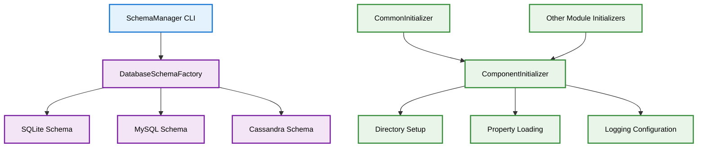
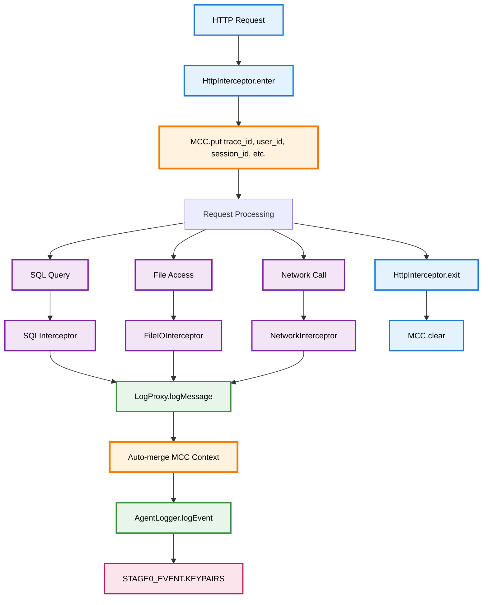
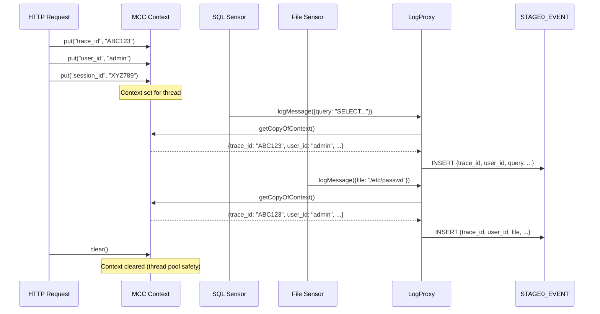
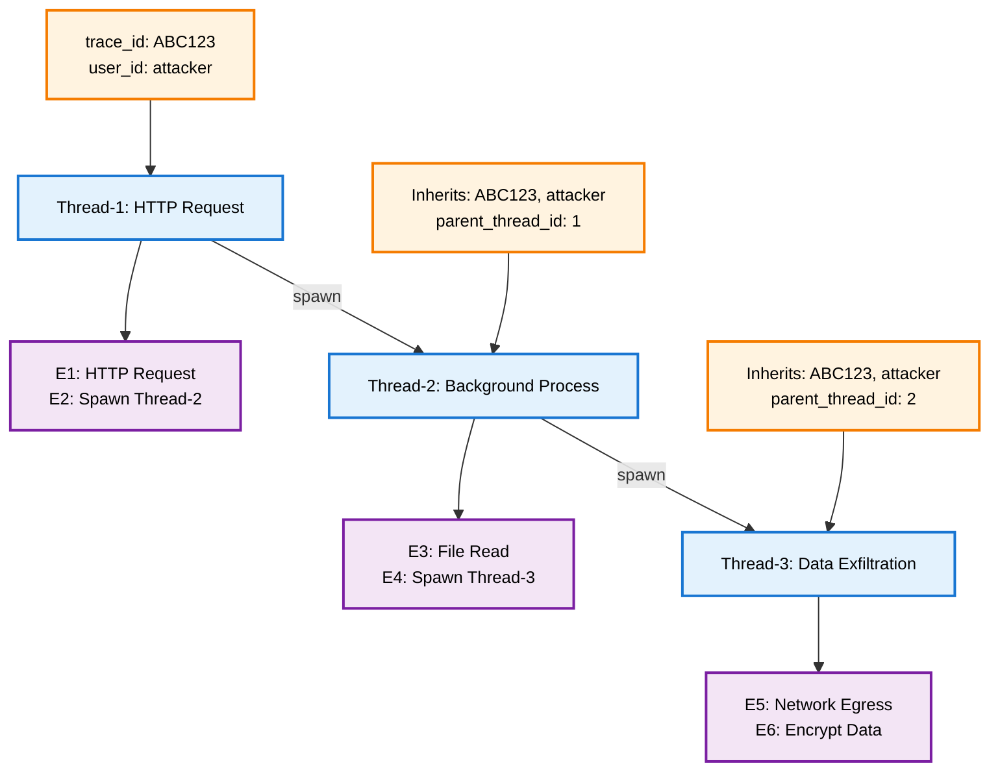

# JVMXRay Common Components (prj-common)

## Table of Contents

1. [Background and Purpose](#background-and-purpose)
2. [Architecture](#architecture)
3. [MCC - Mapped Correlation Context](#mcc---mapped-correlation-context)
   - 3.1 [Overview](#overview)
   - 3.2 [Architecture and Data Flow](#architecture-and-data-flow)
   - 3.3 [Standard Correlation Fields](#standard-correlation-fields)
   - 3.4 [Usage Examples](#usage-examples)
   - 3.5 [Thread Propagation](#thread-propagation)
   - 3.6 [Security and Forensics](#security-and-forensics)
4. [CLI Commands](#cli-commands)
5. [Properties](#properties)
   - 5.1 [Environment Variables](#environment-variables)
   - 5.2 [System Properties](#system-properties)
   - 5.3 [Component Properties](#component-properties)
   - 5.4 [Logback XML Settings](#logback-xml-settings)
6. [REST API Endpoints](#rest-api-endpoints)
7. [Database Tables](#database-tables)
8. [Common Errors](#common-errors)

---

## Background and Purpose

### Project Overview
JVMXRay Common Components provide shared utilities and infrastructure used across all JVMXRay modules. This includes database schema management, component initialization, and common configuration utilities.

### Core Mission
Enable consistent database setup, component initialization, and configuration management across the JVMXRay platform.

### Key Capabilities
- Multi-database schema management (SQLite, MySQL, Cassandra)
- Standardized component initialization framework
- Shared configuration and property management
- Common utilities for GUID generation and logging
- Database connection management and schema validation

---

## Architecture

### Module Structure

| Module | Purpose | Dependencies |
|--------|---------|--------------|
| prj-common | Shared utilities and schema management | Apache Commons CLI, Jackson, SLF4J |
| bin package | CLI tools for database and data management | Schema implementations, Commons CLI |
| schema package | Database schema creation and validation | JDBC drivers, database-specific implementations |
| init package | Component initialization framework | Property management, logging configuration |

### Component Relationships



### Data Flow
1. SchemaManager CLI creates database schemas based on type
2. ComponentInitializer sets up standardized directory structure
3. Components use common properties and logging configuration
4. All modules share database schema definitions and connection patterns

---

## MCC - Mapped Correlation Context

### Overview

**MCC (Mapped Correlation Context)** is JVMXRay's thread-local correlation system that enables tracking and grouping of security events across entire execution paths, including multi-threaded operations.

**Purpose:**
- Correlate all events (HTTP, SQL, File I/O, Network) within a single request or transaction
- Track execution across thread boundaries for complete attack chain visibility
- Enable forensic analysis and security investigation
- Support DDOS detection through resource consumption pattern analysis

**Key Features:**
- Thread-local key-value storage for correlation metadata
- Automatic integration with LogProxy (all sensors inherit correlation context)
- Thread propagation support for multi-threaded execution flows
- Zero schema changes (uses existing KEYPAIRS column)
- Security-focused design for attack chain reconstruction

**Class Location:** `org.jvmxray.platform.shared.util.MCC`

---

### Architecture and Data Flow

#### MCC Integration Architecture



#### Event Correlation Data Flow



---

### Sensor-Managed MCC Lifecycle

JVMXRay implements a **scope-based MCC lifecycle** where sensors manage correlation context through entry/exit points. This design enables **any sensor to be the correlation root** - HTTP, SQL, File I/O, or any other sensor can be the first to fire and establish the trace_id.

#### Core Concept: Nested Scope Ownership

**MCC uses a scope stack to track nested sensor execution:**

```java
// First sensor to fire becomes correlation root
FileIO.enter()  → MCC.enterScope("FileIO")   // Stack: [FileIO] - Generates trace_id
  SQL.enter()   → MCC.enterScope("SQL")      // Stack: [FileIO, SQL] - Inherits trace_id
  SQL.exit()    → MCC.exitScope("SQL")       // Stack: [FileIO] - Keeps context
FileIO.exit()   → MCC.exitScope("FileIO")    // Stack: [] - Clears all context
```

**Key Characteristics:**
- **First Entry Wins:** Whichever sensor fires first generates trace_id
- **Nested Inheritance:** Downstream sensors inherit trace_id from parent scope
- **Automatic Cleanup:** Context clears when last scope exits (thread pool safety)
- **Entry Point Agnostic:** HTTP, batch jobs, CLI tools - all work the same way

---

#### Sensor Entry/Exit Pattern

**Standard Sensor Implementation:**

```java
// Example: SQLInterceptor with MCC scope management
public class SQLInterceptor {
    @Advice.OnMethodEnter
    public static void enter(@Advice.This Object preparedStatement) {
        // Enter correlation scope
        MCC.enterScope("SQL");

        // Add SQL-specific enrichment
        MCC.put("query", extractQuery(preparedStatement));
        MCC.put("db_url", extractDbUrl(preparedStatement));

        // Log event - automatically includes trace_id from MCC
        Map<String, String> metadata = new HashMap<>();
        metadata.put("operation", "executeQuery");
        logProxy.logMessage("org.jvmxray.events.sql", "INFO", metadata);
    }

    @Advice.OnMethodExit
    public static void exit() {
        // Exit correlation scope
        MCC.exitScope("SQL");  // Clears context if last scope
    }
}
```

**HTTP Sensor with User Enrichment:**

```java
// HttpInterceptor adds authenticated user context
@Advice.OnMethodEnter
public static void enter(@Advice.Argument(0) Object request) {
    MCC.enterScope("HTTP");  // First entry → generates trace_id

    // Enrich with HTTP-specific correlation fields
    MCC.put("user_id", extractUser(request));
    MCC.put("session_id", extractSession(request));
    MCC.put("client_ip", request.getRemoteAddr());
    MCC.put("request_uri", request.getRequestURI());
    MCC.put("request_method", request.getMethod());

    // All downstream sensors (SQL, File, Network) inherit this context
}

@Advice.OnMethodExit
public static void exit() {
    MCC.exitScope("HTTP");  // Last exit → clears all context
}
```

---

#### Execution Flow Examples

**Example 1: HTTP Request → SQL Queries**

```
HTTP Request arrives
  → HttpInterceptor.enter()
    → MCC.enterScope("HTTP")           // Stack: [HTTP], trace_id=abc123
    → MCC.put("user_id", "admin")
    → Log HTTP request event           // trace_id=abc123, user_id=admin

  Application executes SQL query
    → SQLInterceptor.enter()
      → MCC.enterScope("SQL")          // Stack: [HTTP, SQL], inherits trace_id=abc123
      → MCC.put("query", "SELECT...")
      → Log SQL event                  // trace_id=abc123, user_id=admin, query=SELECT...
    → SQLInterceptor.exit()
      → MCC.exitScope("SQL")           // Stack: [HTTP], context preserved

  → HttpInterceptor.exit()
    → MCC.exitScope("HTTP")            // Stack: [], clears all context
```

**Example 2: Batch Job → File Access**

```
Batch job starts
  → FileIO sensor reads config file
    → FileIOInterceptor.enter()
      → MCC.enterScope("FileIO")       // Stack: [FileIO], trace_id=xyz789
      → MCC.put("file", "/config.xml")
      → Log file read event            // trace_id=xyz789, file=/config.xml
    → FileIOInterceptor.exit()
      → MCC.exitScope("FileIO")        // Stack: [], clears context

  → SQL sensor queries database
    → SQLInterceptor.enter()
      → MCC.enterScope("SQL")          // Stack: [SQL], NEW trace_id=def456
      → Log SQL event                  // trace_id=def456 (different transaction)
    → SQLInterceptor.exit()
      → MCC.exitScope("SQL")           // Stack: [], clears context
```

**Example 3: Integration Test (No Target Code Modification)**

```
TurtleIntegrationTest runs
  → Test code calls file operations
    → FileIOInterceptor.enter()
      → MCC.enterScope("FileIO")       // First sensor → generates trace_id
      → Log file event                 // trace_id available
    → FileIOInterceptor.exit()
      → MCC.exitScope("FileIO")        // Clears context

  → Test code calls crypto operations
    → CryptoInterceptor.enter()
      → MCC.enterScope("Crypto")       // New root → NEW trace_id
      → Log crypto event               // Different trace_id (separate transaction)
    → CryptoInterceptor.exit()
```

**Note:** Test events get correlation when sensors fire, no test code modification needed.

---

#### Design Principles

| Principle | Description | Benefit |
|-----------|-------------|---------|
| **Entry Point Agnostic** | ANY sensor can be first - HTTP, File, SQL, Network | Works for all deployment types |
| **Automatic Lifecycle** | Sensors manage scope via enter/exit | No manual cleanup needed |
| **Nested Correlation** | Child sensors inherit parent trace_id | Complete execution chain visibility |
| **Thread Pool Safety** | Last exit clears context | No data leakage between requests |
| **Zero Target Changes** | Target code doesn't initialize MCC | True zero-code-change monitoring |

---

#### MCC API Methods

**Scope Management:**
```java
MCC.enterScope(String scopeId)  // Enter correlation scope, init if first
MCC.exitScope(String scopeId)   // Exit scope, clear if last
MCC.isInScope()                 // Check if any scope active
```

**Context Manipulation:**
```java
MCC.put(String key, String value)         // Add correlation field
MCC.get(String key)                       // Retrieve field
MCC.remove(String key)                    // Remove field
MCC.clear()                               // Clear all (use exitScope instead)
MCC.getCopyOfContext()                    // Get immutable copy
```

**Thread Propagation:**
```java
MCC.captureContext()                      // Capture for thread spawning
MCC.restoreContext(Map<String, String>)   // Restore in child thread
MCC.wrap(Runnable)                        // Auto-propagating wrapper
MCC.wrap(Callable<V>)                     // Auto-propagating wrapper
```

---

### Standard Correlation Fields

MCC supports any key-value pairs, but these standard fields are recommended for consistency:

#### Core Correlation Fields

| Field | Type | Description | Example |
|-------|------|-------------|---------|
| **trace_id** | String | Unique identifier for request/transaction chain | "a1b2c3d4" |
| **parent_thread_id** | String | ID of thread that spawned current thread | "42" |
| **user_id** | String | Authenticated user identifier | "admin" |
| **session_id** | String | HTTP session or equivalent identifier | "JSESSIONID=xyz..." |

#### Request Context Fields

| Field | Type | Description | Example |
|-------|------|-------------|---------|
| **client_ip** | String | Source IP address | "192.168.1.100" |
| **request_uri** | String | HTTP request URI | "/api/users" |
| **request_method** | String | HTTP method | "GET", "POST" |

#### Application Context Fields

| Field | Type | Description | Example |
|-------|------|-------------|---------|
| **component_id** | String | Application component identifier | "user-service" |
| **environment** | String | Deployment environment | "production", "dev" |
| **instance_id** | String | Container/pod identifier | "pod-abc123" |

#### Security Context Fields

| Field | Type | Description | Example |
|-------|------|-------------|---------|
| **auth_method** | String | Authentication method used | "oauth", "basic" |
| **permission_level** | String | User role/permission | "admin", "read-only" |
| **data_classification** | String | Sensitivity of accessed data | "confidential", "public" |

---

### Usage Examples

#### Example 1: HTTP Request Correlation

**Automatic Initialization (HttpInterceptor):**
```java
// HttpInterceptor automatically initializes MCC for all HTTP requests
// Users don't need to manually manage MCC in this case

// Internally, HttpInterceptor does:
MCC.clear();  // Thread pool safety
MCC.put("trace_id", GUID.generateShort());
MCC.put("user_id", extractUser(request));
MCC.put("session_id", extractSessionId(request));
MCC.put("client_ip", request.getRemoteAddr());
MCC.put("request_uri", request.getRequestURI());

// All downstream sensors automatically include this context
// SQL queries, file access, network calls, etc.
```

#### Example 2: Manual MCC Usage (Custom Entry Points)

**Scheduled Task Correlation:**
```java
public class DailyReportGenerator {
    public void generateReport() {
        try {
            // Initialize MCC for this task
            MCC.clear();
            MCC.put("trace_id", GUID.generate());
            MCC.put("task_name", "DailyReportGenerator");
            MCC.put("trigger", "cron");
            MCC.put("environment", System.getProperty("env", "dev"));

            // All operations now have correlation context
            fetchDataFromDatabase();
            processReportData();
            sendReportEmail();

        } finally {
            // Always clean up
            MCC.clear();
        }
    }
}
```

#### Example 3: Custom Correlation Fields

**Adding Application-Specific Context:**
```java
public void processPayment(Payment payment) {
    try {
        // Add custom correlation data
        MCC.put("payment_id", payment.getId());
        MCC.put("merchant_id", payment.getMerchantId());
        MCC.put("payment_method", payment.getMethod());
        MCC.put("amount", String.valueOf(payment.getAmount()));

        // Process payment - all events include payment context
        validatePayment(payment);
        chargeCustomer(payment);
        recordTransaction(payment);

    } finally {
        // Remove sensitive data
        MCC.remove("payment_method");
        MCC.remove("amount");
    }
}
```

---

### Thread Propagation

#### Automatic Propagation with MCC.wrap()

**Executor Service Integration:**
```java
// Parent thread sets context
MCC.put("trace_id", "ABC123");
MCC.put("user_id", "admin");

// Option 1: Wrap Runnable (automatic propagation)
executor.submit(MCC.wrap(() -> {
    // Child thread automatically inherits:
    // - trace_id=ABC123
    // - user_id=admin
    // All events in this thread include parent's correlation data

    performBackgroundTask();
}));

// Option 2: Wrap Callable (with return value)
Future<String> result = executor.submit(MCC.wrap(() -> {
    // Inherited context + return value
    return processData();
}));
```

#### Manual Propagation

**Explicit Context Capture/Restore:**
```java
// Parent thread
MCC.put("trace_id", "ABC123");
Map<String, String> parentContext = MCC.captureContext();

// Spawn child thread
new Thread(() -> {
    try {
        // Restore parent's context
        MCC.restoreContext(parentContext);
        MCC.put("parent_thread_id", String.valueOf(parentThreadId));

        // Child thread work with inherited correlation
        performWork();

    } finally {
        MCC.clear();
    }
}).start();
```

#### Multi-Level Thread Spawning

**Attack Chain Across Multiple Threads:**


**Query to Reconstruct Attack:**
```sql
-- All events share trace_id=ABC123
SELECT * FROM STAGE0_EVENT
WHERE JSON_EXTRACT(KEYPAIRS, '$.trace_id') = 'ABC123'
ORDER BY TIMESTAMP;

-- Result shows complete chain:
-- E1 (HTTP) → E2 (spawn) → E3 (file) → E4 (spawn) → E5 (network) → E6 (encrypt)
```

---

### Security and Forensics

#### Attack Chain Reconstruction

**Scenario: Multi-Threaded Data Exfiltration**
```sql
-- Find all events for suspicious trace
SELECT
    EVENT_ID,
    TIMESTAMP,
    NAMESPACE,
    JSON_EXTRACT(KEYPAIRS, '$.trace_id') as trace_id,
    JSON_EXTRACT(KEYPAIRS, '$.user_id') as user_id,
    JSON_EXTRACT(KEYPAIRS, '$.current_thread_id') as thread_id,
    JSON_EXTRACT(KEYPAIRS, '$.parent_thread_id') as parent_thread,
    KEYPAIRS
FROM STAGE0_EVENT
WHERE JSON_EXTRACT(KEYPAIRS, '$.trace_id') = 'suspicious_trace'
ORDER BY TIMESTAMP;
```

#### DDOS Detection via MCC

**Identify Resource Consumption Patterns:**
```sql
-- Find requests with unusual memory allocation patterns
SELECT
    JSON_EXTRACT(KEYPAIRS, '$.trace_id') as trace_id,
    JSON_EXTRACT(KEYPAIRS, '$.client_ip') as client_ip,
    COUNT(*) as event_count,
    SUM(CASE WHEN NAMESPACE = 'org.jvmxray.events.memory'
        THEN 1 ELSE 0 END) as memory_events
FROM STAGE0_EVENT
WHERE TIMESTAMP > (UNIX_TIMESTAMP() - 300) * 1000  -- Last 5 minutes
GROUP BY trace_id, client_ip
HAVING memory_events > 100  -- Unusual memory activity
ORDER BY memory_events DESC;
```

#### User Activity Tracking

**Forensic Analysis by User:**
```sql
-- All actions by specific user across sessions
SELECT
    JSON_EXTRACT(KEYPAIRS, '$.trace_id') as trace_id,
    JSON_EXTRACT(KEYPAIRS, '$.session_id') as session,
    NAMESPACE,
    TIMESTAMP,
    KEYPAIRS
FROM STAGE0_EVENT
WHERE JSON_EXTRACT(KEYPAIRS, '$.user_id') = 'admin'
ORDER BY TIMESTAMP DESC
LIMIT 1000;
```

#### Cross-Thread Attribution

**Track Spawned Thread Activities:**
```sql
-- Find what spawned threads did
SELECT
    e1.EVENT_ID as spawn_event,
    e1.TIMESTAMP as spawn_time,
    e2.NAMESPACE as child_action,
    e2.KEYPAIRS as child_details
FROM STAGE0_EVENT e1
JOIN STAGE0_EVENT e2
    ON JSON_EXTRACT(e1.KEYPAIRS, '$.child_thread_id') =
       JSON_EXTRACT(e2.KEYPAIRS, '$.current_thread_id')
WHERE JSON_EXTRACT(e1.KEYPAIRS, '$.trace_id') = 'attack_trace'
ORDER BY e2.TIMESTAMP;
```

#### Benefits for Security Analysis

**MCC enables:**
1. **Complete Attack Visibility** - See entire attack chain from entry to exfiltration
2. **Thread-Aware Analysis** - Track malicious activity across spawned threads
3. **User Attribution** - Link all actions to specific users/sessions
4. **Pattern Detection** - Identify unusual resource usage or behavior patterns
5. **Forensic Evidence** - Tamper-evident event chains for investigation

---

## CLI Commands

### Command Reference

#### SchemaManager
**Purpose:** Database schema creation, validation, and management tool

**Usage:**
```bash
# Run via Maven classpath
java -cp "prj-common/target/classes:$(mvn dependency:build-classpath -q -Dmdep.outputFile=/dev/stdout -f prj-common/pom.xml)" org.jvmxray.platform.shared.bin.SchemaManager [options]
```

**Options:**

| Option | Description | Default |
|--------|-------------|---------|
| --create-schema | Create database schema | none |
| --drop-schema | Drop existing schema (destroys data) | none |
| --validate-schema | Validate schema exists and is correct | none |
| --database-type | Database type (sqlite¹\|mysql\|cassandra) | required |
| --connection-url | JDBC connection URL | required for JDBC |
| --host | Database host | required for Cassandra |
| --port | Database port | required for Cassandra |
| --username | Database username | optional |
| --password | Database password | optional |
| --database-name | Database/keyspace name | required |
| --datacenter | Cassandra datacenter | optional |
| --replication | Cassandra replication factor | 1 |
| --help | Display usage information | none |

**Examples:**
```bash
# Create SQLite schema for testing
java SchemaManager --create-schema --database-type sqlite --connection-url jdbc:sqlite:/tmp/test.db

# Create MySQL schema
java SchemaManager --create-schema --database-type mysql --connection-url jdbc:mysql://localhost:3306/jvmxray --username root --password secret --database-name jvmxray

# Create Cassandra schema
java SchemaManager --create-schema --database-type cassandra --host localhost --port 9042 --username cassandra --password cassandra --database-name jvmxray --datacenter datacenter1

# Validate existing schema
java SchemaManager --validate-schema --database-type sqlite --connection-url jdbc:sqlite:/tmp/test.db
```

**¹** *SQLite is used for development and testing. Production deployments support MySQL and Cassandra databases.*

---

#### VersionTool
**Purpose:** Display version information from JVMXRay JAR files including git commit, build time, and implementation version.

**Usage:**
```bash
# Run standalone with shaded JAR
java -jar prj-common/target/prj-common-0.0.1-shaded.jar --target <jar-file>
```

**Options:**

| Option | Description | Default |
|--------|-------------|---------|
| --target | Path to JAR file to inspect | required |
| --help | Display usage information | none |

**Examples:**
```bash
# Display version info from agent JAR
java -jar prj-common/target/prj-common-0.0.1-shaded.jar --target prj-agent/target/prj-agent-0.0.1-shaded.jar

# Display help
java -jar prj-common/target/prj-common-0.0.1-shaded.jar --help
```

**Sample Output:**
```
JVMXRay Version Information
===========================

JAR File: prj-agent/target/prj-agent-0.0.1-shaded.jar

  Version           : 0.0.1
  Git Commit        : c0d2187
  Build Time        : 2025-10-08T19:11:18Z
  Agent Class       : org.jvmxray.agent.bootstrap.AgentBootstrap
  Can Redefine      : true
  Can Retransform   : true
  Build JDK         : 21
  Created By        : Maven Jar Plugin 3.2.0

GitHub Source: https://github.com/spoofzu/jvmxray/commit/c0d2187
```

**Use Cases:**
- Verify deployed JAR version matches expected source code
- Trace production issues back to exact git commit
- Audit deployment history and build timestamps
- Confirm agent capabilities (redefine/retransform)

---

## Properties

### Environment Variables

#### Runtime Environment

**Common Variables:**

| Variable | Description | Default | Required |
|----------|-------------|---------|----------|
| JAVA_HOME | Path to JDK/JRE installation | system default | No |

### System Properties

#### JVM System Properties

**Location:** Set via `-D` flag at JVM startup

**Core Properties:**

| Property | Description | Default | Required |
|----------|-------------|---------|----------|
| -Djvmxray.home | Production mode base directory | ${user.home} | No |
| -Djvmxray.test.home | Test mode base directory | null | No |
| -Djvmxray.common.logs | Common logs directory path | auto-detected | No |
| -Djvmxray.common.config | Common config directory path | auto-detected | No |

### Component Properties

#### common.properties

**Location:** `.jvmxray/common/config/common.properties`

**Core Settings:**

| Property | Description | Default Value | Required |
|----------|-------------|---------------|----------|
| jvmxray.common.database.jdbc.connection | Database JDBC connection URL | jdbc:sqlite:.jvmxray/common/data/jvmxray-test.db | Yes |
| jvmxray.common.database.type | Database type | sqlite | Yes |
| jvmxray.common.database.host | Database host | localhost | No |
| jvmxray.common.database.port | Database port | varies by type | No |

### Logback XML Settings

#### Common Logback Configuration

**Location:** `.jvmxray/common/config/logback.xml`

**Key Appenders:**

| Appender | Purpose | Log File |
|----------|---------|----------|
| FILE | Common component logging | common.log |
| CONSOLE | Console output | stdout |

**Properties:**

| Property | Description | Example |
|----------|-------------|---------|
| LOG_HOME | Common logs directory | ${jvmxray.common.logs} |

---

## REST API Endpoints

**[Not Applicable]**

The Common Components module does not expose REST API endpoints. It provides shared utilities and CLI tools for other modules.

---

## Database Tables

### Schema Overview
The common module defines the core database schema used by all JVMXRay components for storing security events and metadata.

### Table Definitions

#### STAGE0_EVENT

**Purpose:** Raw security events from agents with structured metadata

**Columns:**
```
+-------------+------------------+------+-----+---------+-------+
| Field       | Type             | Null | Key | Default | Extra |
+-------------+------------------+------+-----+---------+-------+
| EVENT_ID    | uuid             | NO   | PRI | NULL    |       |
| CONFIG_FILE | varchar(255)     | YES  |     | NULL    |       |
| TIMESTAMP   | timestamp        | NO   |     | NULL    |       |
| CURRENT_THREAD_ID | varchar(100) | YES  |     | NULL    |       |
| PRIORITY    | varchar(10)      | YES  |     | NULL    |       |
| NAMESPACE   | varchar(255)     | NO   |     | NULL    |       |
| AID         | varchar(50)      | NO   |     | NULL    |       |
| CID         | varchar(50)      | NO   |     | NULL    |       |
| IS_STABLE   | boolean          | NO   |     | false   |       |
| KEYPAIRS    | text             | YES  |     | NULL    |       |
+-------------+------------------+------+-----+---------+-------+
```

#### STAGE1_EVENT_KEYPAIR

**Purpose:** Parsed key-value pairs from security events

**Columns:**
```
+-------------+------------------+------+-----+---------+-------+
| Field       | Type             | Null | Key | Default | Extra |
+-------------+------------------+------+-----+---------+-------+
| EVENT_ID    | uuid             | NO   | FK  | NULL    |       |
| KEY         | varchar(255)     | NO   |     | NULL    |       |
| VALUE       | text             | YES  |     | NULL    |       |
+-------------+------------------+------+-----+---------+-------+
```

#### API_KEY

**Purpose:** REST API authentication keys

**Columns:**
```
+-------------+------------------+------+-----+---------+-------+
| Field       | Type             | Null | Key | Default | Extra |
+-------------+------------------+------+-----+---------+-------+
| API_KEY     | varchar(255)     | NO   | PRI | NULL    |       |
| APP_NAME    | varchar(255)     | NO   |     | NULL    |       |
| IS_SUSPENDED| boolean          | NO   |     | false   |       |
| CREATED_AT  | timestamp        | NO   |     | NULL    |       |
| LAST_USED   | timestamp        | YES  |     | NULL    |       |
+-------------+------------------+------+-----+---------+-------+
```

---

## Common Errors

### Error Reference

#### Database Connection Errors

**Error Message:**
```
No suitable driver found for jdbc:sqlite:/path/to/database.db
```

**Cause:** SQLite JDBC driver not found in classpath

**Resolution:**
```bash
# Ensure SQLite driver is included in classpath
mvn clean install -f prj-common/pom.xml
```

**Prevention:** Use Maven-generated classpath or shaded JARs

#### Schema Creation Errors

**Error Message:**
```
Unable to create schema: Table 'STAGE0_EVENT' already exists
```

**Cause:** Attempting to create schema when tables already exist

**Resolution:**
```bash
# Validate existing schema instead
java SchemaManager --validate-schema --database-type sqlite --connection-url jdbc:sqlite:database.db
```

**Prevention:** Check existing schema before creation

#### Configuration Errors

**Error Message:**
```
Unable to determine a working directory. Set -Djvmxray.home or -Djvmxray.test.home
```

**Cause:** Neither home directory property is set

**Resolution:**
```bash
# Set appropriate system property
java -Djvmxray.test.home=/tmp/jvmxray SchemaManager [options]
```

**Prevention:** Always set exactly one home directory property

---