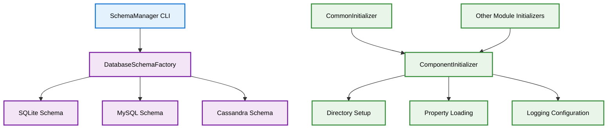

# JVMXRay Common Components (prj-common)

## Table of Contents

1. [Background and Purpose](#background-and-purpose)
2. [Architecture](#architecture)
3. [CLI Commands](#cli-commands)
4. [Properties](#properties)
   - 4.1 [Environment Variables](#environment-variables)
   - 4.2 [System Properties](#system-properties)
   - 4.3 [Component Properties](#component-properties)
   - 4.4 [Logback XML Settings](#logback-xml-settings)
5. [REST API Endpoints](#rest-api-endpoints)
6. [Database Tables](#database-tables)
7. [Common Errors](#common-errors)

---

## Background and Purpose

### Project Overview
JVMXRay Common Components provide shared utilities and infrastructure used across all JVMXRay modules. This includes database schema management, component initialization, and common configuration utilities.

### Core Mission
Enable consistent database setup, component initialization, and configuration management across the JVMXRay platform.

### Key Capabilities
- Multi-database schema management (SQLite, MySQL, Cassandra)
- Standardized component initialization framework
- Shared configuration and property management
- Common utilities for GUID generation and logging
- Database connection management and schema validation

---

## Architecture

### Module Structure

| Module | Purpose | Dependencies |
|--------|---------|--------------|
| prj-common | Shared utilities and schema management | Apache Commons CLI, Jackson, SLF4J |
| bin package | CLI tools for database and data management | Schema implementations, Commons CLI |
| schema package | Database schema creation and validation | JDBC drivers, database-specific implementations |
| init package | Component initialization framework | Property management, logging configuration |

### Component Relationships



### Data Flow
1. SchemaManager CLI creates database schemas based on type
2. ComponentInitializer sets up standardized directory structure
3. Components use common properties and logging configuration
4. All modules share database schema definitions and connection patterns

---

## CLI Commands

### Command Reference

#### SchemaManager
**Purpose:** Database schema creation, validation, and management tool

**Usage:**
```bash
# Run via Maven classpath
java -cp "prj-common/target/classes:$(mvn dependency:build-classpath -q -Dmdep.outputFile=/dev/stdout -f prj-common/pom.xml)" org.jvmxray.platform.shared.bin.SchemaManager [options]
```

**Options:**

| Option | Description | Default |
|--------|-------------|---------|
| --create-schema | Create database schema | none |
| --drop-schema | Drop existing schema (destroys data) | none |
| --validate-schema | Validate schema exists and is correct | none |
| --database-type | Database type (sqlite¹\|mysql\|cassandra) | required |
| --connection-url | JDBC connection URL | required for JDBC |
| --host | Database host | required for Cassandra |
| --port | Database port | required for Cassandra |
| --username | Database username | optional |
| --password | Database password | optional |
| --database-name | Database/keyspace name | required |
| --datacenter | Cassandra datacenter | optional |
| --replication | Cassandra replication factor | 1 |
| --help | Display usage information | none |

**Examples:**
```bash
# Create SQLite schema for testing
java SchemaManager --create-schema --database-type sqlite --connection-url jdbc:sqlite:/tmp/test.db

# Create MySQL schema
java SchemaManager --create-schema --database-type mysql --connection-url jdbc:mysql://localhost:3306/jvmxray --username root --password secret --database-name jvmxray

# Create Cassandra schema
java SchemaManager --create-schema --database-type cassandra --host localhost --port 9042 --username cassandra --password cassandra --database-name jvmxray --datacenter datacenter1

# Validate existing schema
java SchemaManager --validate-schema --database-type sqlite --connection-url jdbc:sqlite:/tmp/test.db
```

**¹** *SQLite is used for development and testing. Production deployments support MySQL and Cassandra databases.*

---

## Properties

### Environment Variables

#### Runtime Environment

**Common Variables:**

| Variable | Description | Default | Required |
|----------|-------------|---------|----------|
| JAVA_HOME | Path to JDK/JRE installation | system default | No |

### System Properties

#### JVM System Properties

**Location:** Set via `-D` flag at JVM startup

**Core Properties:**

| Property | Description | Default | Required |
|----------|-------------|---------|----------|
| -Djvmxray.home | Production mode base directory | ${user.home} | No |
| -Djvmxray.test.home | Test mode base directory | null | No |
| -Djvmxray.common.logs | Common logs directory path | auto-detected | No |
| -Djvmxray.common.config | Common config directory path | auto-detected | No |

### Component Properties

#### common.properties

**Location:** `.jvmxray/common/config/common.properties`

**Core Settings:**

| Property | Description | Default Value | Required |
|----------|-------------|---------------|----------|
| jvmxray.common.database.jdbc.connection | Database JDBC connection URL | jdbc:sqlite:.jvmxray/common/data/jvmxray-test.db | Yes |
| jvmxray.common.database.type | Database type | sqlite | Yes |
| jvmxray.common.database.host | Database host | localhost | No |
| jvmxray.common.database.port | Database port | varies by type | No |

### Logback XML Settings

#### Common Logback Configuration

**Location:** `.jvmxray/common/config/logback.xml`

**Key Appenders:**

| Appender | Purpose | Log File |
|----------|---------|----------|
| FILE | Common component logging | common.log |
| CONSOLE | Console output | stdout |

**Properties:**

| Property | Description | Example |
|----------|-------------|---------|
| LOG_HOME | Common logs directory | ${jvmxray.common.logs} |

---

## REST API Endpoints

**[Not Applicable]**

The Common Components module does not expose REST API endpoints. It provides shared utilities and CLI tools for other modules.

---

## Database Tables

### Schema Overview
The common module defines the core database schema used by all JVMXRay components for storing security events and metadata.

### Table Definitions

#### STAGE0_EVENT

**Purpose:** Raw security events from agents with structured metadata

**Columns:**
```
+-------------+------------------+------+-----+---------+-------+
| Field       | Type             | Null | Key | Default | Extra |
+-------------+------------------+------+-----+---------+-------+
| EVENT_ID    | uuid             | NO   | PRI | NULL    |       |
| CONFIG_FILE | varchar(255)     | YES  |     | NULL    |       |
| TIMESTAMP   | timestamp        | NO   |     | NULL    |       |
| THREAD_ID   | varchar(100)     | YES  |     | NULL    |       |
| PRIORITY    | varchar(10)      | YES  |     | NULL    |       |
| NAMESPACE   | varchar(255)     | NO   |     | NULL    |       |
| AID         | varchar(50)      | NO   |     | NULL    |       |
| CID         | varchar(50)      | NO   |     | NULL    |       |
| IS_STABLE   | boolean          | NO   |     | false   |       |
| KEYPAIRS    | text             | YES  |     | NULL    |       |
+-------------+------------------+------+-----+---------+-------+
```

#### STAGE1_EVENT_KEYPAIR

**Purpose:** Parsed key-value pairs from security events

**Columns:**
```
+-------------+------------------+------+-----+---------+-------+
| Field       | Type             | Null | Key | Default | Extra |
+-------------+------------------+------+-----+---------+-------+
| EVENT_ID    | uuid             | NO   | FK  | NULL    |       |
| KEY         | varchar(255)     | NO   |     | NULL    |       |
| VALUE       | text             | YES  |     | NULL    |       |
+-------------+------------------+------+-----+---------+-------+
```

#### API_KEY

**Purpose:** REST API authentication keys

**Columns:**
```
+-------------+------------------+------+-----+---------+-------+
| Field       | Type             | Null | Key | Default | Extra |
+-------------+------------------+------+-----+---------+-------+
| API_KEY     | varchar(255)     | NO   | PRI | NULL    |       |
| APP_NAME    | varchar(255)     | NO   |     | NULL    |       |
| IS_SUSPENDED| boolean          | NO   |     | false   |       |
| CREATED_AT  | timestamp        | NO   |     | NULL    |       |
| LAST_USED   | timestamp        | YES  |     | NULL    |       |
+-------------+------------------+------+-----+---------+-------+
```

---

## Common Errors

### Error Reference

#### Database Connection Errors

**Error Message:**
```
No suitable driver found for jdbc:sqlite:/path/to/database.db
```

**Cause:** SQLite JDBC driver not found in classpath

**Resolution:**
```bash
# Ensure SQLite driver is included in classpath
mvn clean install -f prj-common/pom.xml
```

**Prevention:** Use Maven-generated classpath or shaded JARs

#### Schema Creation Errors

**Error Message:**
```
Unable to create schema: Table 'STAGE0_EVENT' already exists
```

**Cause:** Attempting to create schema when tables already exist

**Resolution:**
```bash
# Validate existing schema instead
java SchemaManager --validate-schema --database-type sqlite --connection-url jdbc:sqlite:database.db
```

**Prevention:** Check existing schema before creation

#### Configuration Errors

**Error Message:**
```
Unable to determine a working directory. Set -Djvmxray.home or -Djvmxray.test.home
```

**Cause:** Neither home directory property is set

**Resolution:**
```bash
# Set appropriate system property
java -Djvmxray.test.home=/tmp/jvmxray SchemaManager [options]
```

**Prevention:** Always set exactly one home directory property

---