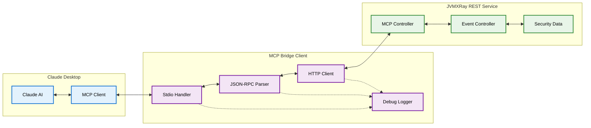

# JVMXRay MCP Client (prj-mcp-client)

## Table of Contents

1. [Background and Purpose](#background-and-purpose)
2. [Architecture](#architecture)
3. [CLI Commands](#cli-commands)
4. [Claude Desktop Integration](#claude-desktop-integration)
5. [Properties](#properties)
   - 5.1 [Environment Variables](#environment-variables)
   - 5.2 [System Properties](#system-properties)
   - 5.3 [Component Properties](#component-properties)
   - 5.4 [Logback XML Settings](#logback-xml-settings)
6. [REST API Endpoints](#rest-api-endpoints)
7. [Database Tables](#database-tables)
8. [Common Errors](#common-errors)

---

## Background and Purpose

### Project Overview
The JVMXRay MCP Client provides bridge functionality for integrating JVMXRay security monitoring with Claude Desktop through the Model Context Protocol (MCP). It acts as a bidirectional translation layer between Claude Desktop's stdio-based MCP protocol and JVMXRay's REST API endpoints.

### Core Mission
Enable Claude Desktop to access and analyze JVMXRay security event data through standardized MCP protocol communications.

### Key Capabilities
- Bidirectional protocol translation between MCP stdio and REST HTTP
- Real-time message forwarding with JSON-RPC 2.0 compliance
- X-API-Key authentication with JVMXRay REST service
- Comprehensive debug logging for troubleshooting integration issues
- Standalone executable JAR for easy deployment with Claude Desktop

---

## Architecture

### Module Structure

| Module | Purpose | Dependencies |
|--------|---------|--------------|
| prj-mcp-client | MCP protocol bridge client | prj-common, Apache HttpClient 4.5.14, Jackson |
| McpStdioToRestBridge | Main bridge implementation | Commons CLI 1.5.0, HTTP Core 4.4.16 |
| Standalone Assembly | Self-contained executable | Maven Assembly Plugin |

### Component Relationships



### Data Flow
Claude Desktop sends MCP requests via stdio to the bridge client, which translates them to HTTP REST calls with X-API-Key authentication, forwards to JVMXRay's MCP endpoint at `/api/mcp`, receives responses, converts back to JSON-RPC 2.0 format, and returns via stdio to Claude Desktop. All communications support bidirectional message flow with comprehensive error handling.

---

## CLI Commands

### Command Reference

**⚠️ Note:** Users typically don't execute the MCP bridge directly from command line. These options are configured in Claude Desktop's MCP settings. See [Claude Desktop Integration](#claude-desktop-integration) for typical usage.

#### McpStdioToRestBridge
**Purpose:** Bridge between Claude Desktop MCP stdio and JVMXRay REST API

**Usage:**
```bash
# Basic syntax (configured in Claude Desktop, not executed directly)
java -jar prj-mcp-client-bridge.jar [options]
```

**Options:**

| Option | Description | Default |
|--------|-------------|---------|
| -h, --help | Show help message and exit | N/A |
| --host HOST | Server hostname for JVMXRay REST API | localhost |
| -p, --port PORT | Server port for JVMXRay REST API | 8080 |
| --api-key KEY | API key for authentication | N/A |
| --debug FILE | Debug file path for detailed logging | N/A |

**Configuration:** See [Claude Desktop Integration](#claude-desktop-integration) section below for complete setup examples.

---

## Claude Desktop Integration

### MCP Server Configuration

#### claude_desktop_config.json Setup

**Purpose:** Configure Claude Desktop to use JVMXRay MCP bridge for security event analysis

**Configuration File Location:**
- **macOS:** `~/Library/Application Support/Claude/claude_desktop_config.json`
- **Windows:** `%APPDATA%\Claude\claude_desktop_config.json`
- **Linux:** `~/.config/Claude/claude_desktop_config.json`

#### Recommended Configuration

**Option 1: Direct JAR Execution (Recommended)**
```json
{
  "mcpServers": {
    "jvmxray": {
      "command": "java",
      "args": [
        "-jar",
        "/absolute/path/to/prj-mcp-client-bridge.jar",
        "--host=localhost",
        "--port=8080",
        "--api-key=jvmx_your_api_key_here",
        "--debug=/tmp/jvmxray-mcp-debug.log"
      ]
    }
  }
}
```

**Option 2: Using Environment Variables (Recommended for Security)**
```json
{
  "mcpServers": {
    "jvmxray": {
      "command": "java",
      "args": [
        "-jar",
        "/absolute/path/to/prj-mcp-client-bridge.jar",
        "--host=localhost",
        "--port=8080",
        "--debug=/tmp/jvmxray-mcp-debug.log"
      ],
      "env": {
        "JVMXRAY_API_KEY": "jvmx_your_api_key_here"
      }
    }
  }
}
```

**Enhanced Security:** For additional security, consider setting `JVMXRAY_API_KEY` in shell configuration (`~/.bashrc`, `~/.zshrc`) rather than the JSON config file.

#### Configuration Parameters

| Parameter | Description | Example Value | Required |
|-----------|-------------|---------------|----------|
| command | Path to Java executable or script | `java` or `/path/to/script.sh` | Yes |
| args | Command line arguments array | `["-jar", "bridge.jar", "--api-key=key"]` | Yes |
| env | Environment variables | `{"JVMXRAY_API_KEY": "key"}` | No |

#### Setup Instructions

**Step 1: Generate API Key**
```bash
# Generate API key for Claude Desktop integration
./script/bin/security/generate-api-key claude-desktop
```

**Step 2: Locate Configuration File**
```bash
# Create configuration directory if it doesn't exist
mkdir -p ~/Library/Application\ Support/Claude  # macOS
mkdir -p ~/.config/Claude                        # Linux
mkdir -p %APPDATA%\Claude                        # Windows
```

**Step 3: Create Configuration**
```bash
# Example configuration creation (macOS/Linux)
cat > ~/Library/Application\ Support/Claude/claude_desktop_config.json << 'EOF'
{
  "mcpServers": {
    "jvmxray": {
      "command": "java",
      "args": [
        "-jar",
        "/Users/your-username/path/to/prj-mcp-client-bridge.jar",
        "--host=localhost",
        "--port=8080",
        "--api-key=your_generated_api_key",
        "--debug=/tmp/jvmxray-mcp-debug.log"
      ]
    }
  }
}
EOF
```

**Step 4: Start JVMXRay REST Service**
```bash
# Start the REST service that the MCP bridge connects to
./script/bin/services/rest-service --start -p 8080
```

**Step 5: Restart Claude Desktop**
```bash
# Restart Claude Desktop to load the new MCP server configuration
# The JVMXRay tools should appear in Claude Desktop's available tools
```

#### Available Tools in Claude Desktop

Once configured, Claude Desktop will have access to these JVMXRay security analysis tools:

| Tool Name | Purpose | Key Parameters |
|-----------|---------|----------------|
| `query_events` | Search security events | namespace, timeRange, aid, cid, limit |
| `query_keypairs` | Search event key-value pairs | key, value, eventId, limit |
| `get_event_details` | Get complete event information | eventId |

#### Verification

**Test MCP Bridge Manually:**
```bash
# Test the bridge configuration outside of Claude Desktop
java -jar /path/to/prj-mcp-client-bridge.jar \
  --host=localhost \
  --port=8080 \
  --api-key=your_api_key \
  --debug=/tmp/test-debug.log
```

**Check Claude Desktop Logs:**
```bash
# Monitor Claude Desktop logs for MCP server status
tail -f ~/Library/Logs/Claude/claude_desktop.log  # macOS
tail -f ~/.config/Claude/logs/claude_desktop.log   # Linux
```

**Verify Tool Availability:**
- Open Claude Desktop
- Start a new conversation
- Type: "What JVMXRay security tools do you have available?"
- Claude should list the three security analysis tools

#### Troubleshooting Claude Desktop Integration

**Common Issues:**

1. **MCP Server Failed to Start**
   - Verify absolute paths in configuration
   - Check Java is available in PATH
   - Ensure JVMXRay REST service is running on port 8080

2. **API Key Authentication Errors**
   - Regenerate API key: `./script/bin/security/generate-api-key claude-desktop`
   - Verify API key format starts with `jvmx_`

3. **Connection Timeouts**
   - Confirm REST service is running: `curl -H "X-API-Key: your_key" http://localhost:8080/api/mcp/health`
   - Check firewall settings for port 8080

---

## Properties

### Environment Variables

#### Runtime Environment

**Common Variables:**

| Variable | Description | Default | Required |
|----------|-------------|---------|----------|
| JVMXRAY_API_KEY | API key for JVMXRay REST API authentication | N/A | Yes (if not provided via --api-key) |
| JAVA_OPTS | JVM options for bridge client | N/A | No |

### System Properties

#### JVM System Properties

**Location:** Set via `-D` flag at JVM startup

**Core Properties:**

| Property | Description | Default | Required |
|----------|-------------|---------|----------|
| -Dfile.encoding | Character encoding for stdio communication | UTF-8 | No |
| -Djvmxray.base | Base directory for JVMXRay components | N/A | No |

### Component Properties

#### Bridge Configuration

**Location:** Command-line arguments only (no properties file)

**Core Settings:**

| Property | Description | Default Value | Required |
|----------|-------------|---------------|----------|
| server.host | JVMXRay REST API server hostname | localhost | No |
| server.port | JVMXRay REST API server port | 8080 | No |
| api.key | Authentication key for REST API access | N/A | Yes |
| debug.enabled | Enable detailed debug logging | false | No |
| debug.file.path | Path to debug log file | N/A | No |

### Logback XML Settings

#### [Not Applicable]
The MCP client uses custom debug logging rather than Logback configuration. Debug output is controlled via the `--debug` command-line option.

---

## REST API Endpoints

### API Reference

#### MCP Protocol Bridge

**Endpoint:** `/api/mcp`

```yaml
method: POST
authentication: required
description: Forward MCP protocol messages to JVMXRay MCP server
parameters:
  - name: X-API-Key
    type: string
    required: true
    location: header
    description: API key for authentication
  - name: Content-Type
    type: string
    required: true
    location: header
    description: application/json
  - name: body
    type: object
    required: true
    location: body
    description: JSON-RPC 2.0 MCP message payload
responses:
  200:
    description: Success - MCP response
    schema:
      type: object
      properties:
        jsonrpc: string
        id: string|number|null
        result: object
        error: object
  400:
    description: Bad Request - Invalid message format
  401:
    description: Unauthorized - Invalid API key
  403:
    description: Forbidden - Insufficient permissions
  404:
    description: Not Found - MCP endpoint not available
  500:
    description: Internal Server Error
```

**Example Request:**
```bash
curl -X POST \
  'http://localhost:8080/api/mcp' \
  -H 'X-API-Key: jvmxray_abc123def456' \
  -H 'Content-Type: application/json' \
  -d '{
    "jsonrpc": "2.0",
    "id": 1,
    "method": "tools/list",
    "params": {}
  }'
```

**Example Response:**
```json
{
  "jsonrpc": "2.0",
  "id": 1,
  "result": {
    "tools": [
      {
        "name": "query_events",
        "description": "Search and filter JVMXRay security events by namespace, time range, and IDs",
        "inputSchema": {
          "type": "object",
          "properties": {
            "namespace": {"type": "string"},
            "startTime": {"type": "integer"},
            "endTime": {"type": "integer"},
            "aid": {"type": "string"},
            "cid": {"type": "string"},
            "limit": {"type": "integer", "default": 100}
          }
        }
      },
      {
        "name": "query_keypairs",
        "description": "Search key-value pairs from JVMXRay events",
        "inputSchema": {
          "type": "object",
          "properties": {
            "key": {"type": "string"},
            "value": {"type": "string"},
            "eventId": {"type": "string"},
            "limit": {"type": "integer", "default": 100}
          }
        }
      },
      {
        "name": "get_event_details",
        "description": "Get detailed information about a specific JVMXRay security event including its key-value pairs",
        "inputSchema": {
          "type": "object",
          "properties": {
            "eventId": {"type": "string"}
          },
          "required": ["eventId"]
        }
      }
    ]
  }
}
```

#### Health Check

**Endpoint:** `/api/mcp/health`

```yaml
method: GET
authentication: required
description: Test server connectivity and authentication
parameters:
  - name: X-API-Key
    type: string
    required: true
    location: header
    description: API key for authentication
responses:
  200:
    description: Server is healthy and accessible
    schema:
      type: object
      properties:
        status: string
        service: string
  401:
    description: Authentication failed
  403:
    description: Access denied
  404:
    description: Health endpoint not found
```

**Example Request:**
```bash
curl -X GET \
  'http://localhost:8080/api/mcp/health' \
  -H 'X-API-Key: jvmxray_abc123def456' \
  -H 'Accept: application/json'
```

**Example Response:**
```json
{
  "status": "healthy",
  "service": "JVMXRay MCP Bridge"
}
```

---

## Database Tables

### [Not Applicable]
The MCP client is a stateless bridge component that does not directly access or manage database tables. It forwards requests to the JVMXRay REST API, which handles all database interactions.

---

## Common Errors

### Error Reference

#### Connection Errors

**Error Message:**
```
Cannot connect to server at localhost:8080. Please ensure the server is running.
```

**Cause:** JVMXRay REST API server is not running or unreachable

**Resolution:**
```bash
# Start the JVMXRay REST service first
./script/bin/services/rest-service --start -p 8080
# Then start the MCP bridge
java -jar prj-mcp-client-bridge.jar --api-key your_key
```

**Prevention:** Ensure JVMXRay REST service is running before starting MCP bridge

#### Authentication Errors

**Error Message:**
```
Authentication failed: Invalid API key. Please check your API key and try again.
```

**Cause:** API key is missing, incorrect, or expired

**Resolution:**
```bash
# Generate a new API key using REST service
./script/bin/security/generate-api-key claude-desktop
# Use the generated key
export JVMXRAY_API_KEY=jvmxray_newkey123
java -jar prj-mcp-client-bridge.jar
```

**Prevention:** Verify API key validity and permissions before starting bridge

#### Protocol Errors

**Error Message:**
```
Failed to process message: Invalid JSON-RPC format
```

**Cause:** Malformed MCP message or JSON parsing error

**Resolution:**
```bash
# Enable debug logging to inspect messages
java -jar prj-mcp-client-bridge.jar --api-key your_key --debug /tmp/mcp-debug.log
# Check debug log for message details
tail -f /tmp/mcp-debug.log
```

**Prevention:** Ensure Claude Desktop is properly configured and using compatible MCP version

#### Network Timeout Errors

**Error Message:**
```
Connection timeout. Please check network connectivity and server status.
```

**Cause:** Network latency or server overload causing request timeouts

**Resolution:**
```bash
# Check server responsiveness
curl -H "X-API-Key: your_api_key" http://localhost:8080/api/mcp/health
# Restart bridge with retry logic
java -jar prj-mcp-client-bridge.jar --api-key your_key
```

**Prevention:** Monitor network connectivity and server performance

#### Port Binding Errors

**Error Message:**
```
Unknown host: invalid-hostname. Please check the hostname and try again.
```

**Cause:** Invalid hostname specified in connection parameters

**Resolution:**
```bash
# Use correct hostname
java -jar prj-mcp-client-bridge.jar --host localhost --port 8080 --api-key your_key
# For remote servers, verify DNS resolution
nslookup your-server-hostname
```

**Prevention:** Verify hostname and network configuration before starting bridge

#### Claude Desktop Integration Errors

**Error Message:**
```
MCP server jvmxray failed to start
```

**Cause:** Claude Desktop cannot execute bridge JAR or missing dependencies

**Resolution:**
```bash
# Test bridge manually first
java -jar /path/to/prj-mcp-client-bridge.jar --help
# Verify Claude Desktop config
{
  "mcpServers": {
    "jvmxray": {
      "command": "java",
      "args": ["-jar", "/absolute/path/to/prj-mcp-client-bridge.jar", "--api-key", "your_key"]
    }
  }
}
```

**Prevention:** Use absolute paths in Claude Desktop configuration and test bridge independently

#### Debug Logging Issues

**Error Message:**
```
Warning: Failed to initialize debug logging: Permission denied
```

**Cause:** Insufficient permissions to write to debug log file location

**Resolution:**
```bash
# Use writable directory for debug logs
java -jar prj-mcp-client-bridge.jar --api-key your_key --debug ~/mcp-debug.log
# Or create directory with proper permissions
mkdir -p /tmp/mcp-logs
chmod 755 /tmp/mcp-logs
java -jar prj-mcp-client-bridge.jar --api-key your_key --debug /tmp/mcp-logs/debug.log
```

**Prevention:** Ensure debug log directory exists and is writable before starting bridge