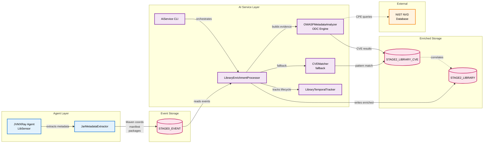

# AI Service (prj-service-ai)

## Table of Contents

1. [Background and Purpose](#background-and-purpose)
2. [Architecture](#architecture)
3. [CLI Commands](#cli-commands)
4. [Properties](#properties)
   - 4.1 [Environment Variables](#environment-variables)
   - 4.2 [System Properties](#system-properties)
   - 4.3 [Component Properties](#component-properties)
   - 4.4 [Logback XML Settings](#logback-xml-settings)
5. [REST API Endpoints](#rest-api-endpoints)
6. [Database Tables](#database-tables)
7. [Common Errors](#common-errors)

---

## Background and Purpose

### Project Overview
The AI Service is an intelligent enrichment engine that processes security events from the JVMXRay agent to provide enhanced context, vulnerability correlation, and supply chain analysis. It transforms raw library loading events into structured intelligence by calculating cryptographic hashes, tracking library lifecycles, and identifying vulnerabilities using OWASP Dependency Check (ODC) integration with NIST's National Vulnerability Database.

### Core Mission
Enrich agent-collected security events with AI-driven intelligence to detect vulnerabilities, track library changes, and identify supply chain risks in real-time.

### Key Capabilities
- **OWASP Dependency Check (ODC) integration** for metadata-based vulnerability analysis against NIST NVD
- **Hybrid CVE detection**: ODC primary analysis with CVEMatcher pattern-matching fallback
- **Metadata-driven architecture**: Agent extracts Maven coordinates, manifest attributes, and package names for server-side ODC analysis (~50ms agent overhead vs 5-10s full ODC)
- **Evidence-based CPE matching**: ODC builds vendor/product/version evidence buckets from metadata for NVD queries
- Library event enrichment with SHA-256 hashing and temporal tracking
- Supply chain change detection (library additions/removals)
- Batch and continuous processing modes with configurable intervals
- Multi-database support (SQLite, MySQL, Cassandra)

---

## Architecture

### Module Structure

| Module | Purpose | Dependencies |
|--------|---------|--------------|
| prj-service-ai | AI enrichment service | prj-common, Logback, Jackson, Commons CLI |
| prj-common | Shared database schema and utilities | Core dependency |

### Component Relationships



### Security Architecture: Defense-in-Depth

JVMXRay employs a **multi-sensor defense-in-depth strategy** where different sensors provide overlapping coverage for attack detection:

**LibSensor Coverage:**
- ✅ Static JAR-based class loading.  Loading jars from classpath.
- ✅ Dynamic JAR-based class loading.  Loading jars outside the classpath like...
  - URLCLassLoader, like plugin systems, Jenkins, Eclipse, Intelij.
  - ServiceLoader/SPI, JDBC Drivers, etc.
  - OSGI Bundles, Eclipse Platform.
  - Java Agents, Runtime agent attachment (like JVMXRay)
  - Scripting Engines, Groovy/Jython loading external libraries.
  - Build Tools, like Maven/Gradle plugin JARs loaded at runtime.
- ❌ Bytecode injection attacks (no JAR file involved), assigning binary image to a class.  Other sensors fill gaps like...
  - ✅ **FileIOSensor**: Detects reading bytecode `.class` files
  - ✅ **ReflectionSensor**: Detects suspicious reflection operations:
    - `Method.setAccessible(true)` on `ClassLoader.defineClass`
    - `Method.invoke()` with `defineClass` target (flagged as SUSPICIOUS)
- Bytecode injection attacks visible through complementary sensors.

### Data Flow

**Agent-Side Metadata Extraction:**
1. **JAR Detection**: LibSensor detects all JARs loaded in the JVM:
   - Static classpath JARs (direct and transitive dependencies resolved by Maven/Gradle)
   - Dynamically loaded JARs (URLClassLoader, runtime loading)
   - **Limitation**: Does NOT detect bytecode injection attacks (byte arrays loaded via `ClassLoader.defineClass()`) - these are detected by ReflectionSensor and FileIOSensor via defense-in-depth architecture
2. **Metadata Extraction**: JarMetadataExtractor reads (~50ms overhead per JAR):
   - Maven coordinates from `META-INF/maven/*/pom.properties` (groupId, artifactId, version)
   - Manifest attributes (Implementation-Title, Implementation-Version, Implementation-Vendor)
   - Top-level package names from `.class` files
3. **Event Transmission**: Metadata sent via logback keypairs to STAGE0_EVENT

**Server-Side ODC Analysis Pipeline:**
1. **Batch Processing**: AI Service reads unprocessed library events from STAGE0_EVENT
2. **Metadata Reconstruction**: Extracts Maven coordinates, manifest data, packages from event keypairs
3. **ODC Evidence Building**: OWASPMetadataAnalyzer creates virtual Dependency:
   - Vendor Evidence: groupId (HIGHEST), implementationVendor (HIGH), package namespace (MEDIUM)
   - Product Evidence: artifactId (HIGHEST), implementationTitle (HIGH)
   - Version Evidence: version (HIGHEST), implementationVersion (HIGH)
4. **CPE Matching**: ODC engine matches evidence against NVD CPE index
5. **CVE Extraction**: Retrieves CVE records with CVSS scores, severity, CWE IDs
6. **Fallback**: If ODC disabled/failed, CVEMatcher uses pattern matching
7. **Storage**: Writes to STAGE2_LIBRARY (library metadata) and STAGE2_LIBRARY_CVE (vulnerabilities)
8. **Temporal Tracking**: LibraryTemporalTracker updates first seen, last seen timestamps

### OWASP Dependency Check Integration

#### Architecture Overview

The ODC integration uses a **metadata-driven architecture** to avoid the performance overhead of running full ODC analysis on 100k+ deployed agents:

**Agent-Side (Lightweight):**
- Extract metadata from JAR files (~50ms overhead)
- No ODC dependency on agents
- Minimal network/storage overhead

**Server-Side (Centralized):**
- Run ODC Engine with NVD database
- Build evidence buckets from agent metadata
- Leverage ODC's CPE matching engine
- Query NIST NVD for vulnerabilities

#### Evidence-Based CPE Matching

ODC does NOT use file hashes for identification. Instead, it uses an **evidence-based system**:

1. **Evidence Collection**: Gather vendor/product/version clues from multiple sources
2. **Confidence Weighting**:
   - HIGHEST: Maven coordinates (groupId → vendor, artifactId → product, version)
   - HIGH: Manifest attributes (Implementation-*)
   - MEDIUM: Package namespaces (e.g., "org.apache" → vendor)
3. **CPE Generation**: Combine evidence to generate CPE candidates (e.g., `cpe:/a:apache:log4j:2.14.1`)
4. **NVD Query**: Match CPE against NIST National Vulnerability Database
5. **Result Ranking**: Score matches by evidence confidence

**Example Evidence Flow:**
```
JAR: log4j-core-2.14.1.jar
└─ Maven Coordinates (pom.properties)
   ├─ groupId: org.apache.logging.log4j → Vendor Evidence (HIGHEST)
   ├─ artifactId: log4j-core → Product Evidence (HIGHEST)
   └─ version: 2.14.1 → Version Evidence (HIGHEST)
└─ Manifest (MANIFEST.MF)
   ├─ Implementation-Vendor: Apache Software Foundation → Vendor Evidence (HIGH)
   └─ Implementation-Title: Apache Log4j Core → Product Evidence (HIGH)
└─ Package Names
   └─ org.apache.logging → Vendor Evidence (MEDIUM)

→ CPE: cpe:/a:apache:log4j:2.14.1
→ NVD Match: CVE-2021-44228 (Log4Shell, CVSS 10.0)
```

#### ODC Configuration

**Data Directory Structure:**
```
.jvmxray/aiservice/data/odc/
├─ nist/              # NVD data cache
├─ cpe/               # CPE index files
└─ updates/           # Update metadata
```

**NVD API Key (Optional):**
Without API key: ~4 hours for initial NVD download, rate-limited to 5 requests/30s
With API key: ~30 minutes, rate-limited to 50 requests/30s

Get API key: https://nvd.nist.gov/developers/request-an-api-key

**Update Frequency:**
- First run: Full NVD database download (2-4 hours)
- Subsequent runs: Incremental updates (5-10 minutes)
- Recommended: Daily cron job for NVD updates

#### Hybrid CVE Detection Strategy

The service uses a **two-tier approach**:

1. **Primary: ODC Analysis** (when enabled)
   - Comprehensive NVD coverage
   - CPE-based matching
   - CVSS scoring
   - CWE classification

2. **Fallback: CVEMatcher Pattern Matching**
   - Activates when ODC disabled/failed
   - Uses STAGE2_LIBRARY_CVE pattern matching
   - Glob-based library name matching
   - Manual CVE database population

**Decision Flow:**
```
Library Event → Metadata Available?
    ├─ Yes → ODC Enabled?
    │   ├─ Yes → Run ODC Analysis → CVEs Found?
    │   │   ├─ Yes → Store CVE Results ✓
    │   │   └─ No → Run CVEMatcher Fallback
    │   └─ No → Run CVEMatcher Pattern Matching
    └─ No → Skip CVE Analysis (metadata required)
```

---

## CLI Commands

### Command Reference

#### AiService

**Purpose:** Main entry point for running AI enrichment processing

**Usage:**
```bash
# Run from project root
java -jar prj-service-ai/target/prj-service-ai-0.0.1-shaded.jar [OPTIONS]

# Or using Maven
mvn exec:java -Dexec.mainClass="org.jvmxray.service.ai.bin.AiService" -pl prj-service-ai
```

**Options:**

| Option | Description | Default |
|--------|-------------|---------|
| -h, --help | Show help message | N/A |
| -v, --version | Show version information | N/A |
| -l, --library-enrichment | Run library enrichment processing | Default mode |
| -d, --daemon | Run in daemon mode (continuous background processing) | N/A |
| -c, --continuous | Run continuously until interrupted | N/A |
| -b, --batch-size SIZE | Batch size for processing events | 1000 |
| -i, --interval SECONDS | Processing interval in daemon/continuous mode | 60 |

**Examples:**
```bash
# Single pass library enrichment (default)
java -jar prj-service-ai/target/prj-service-ai-0.0.1-shaded.jar

# Process with custom batch size
java -jar prj-service-ai/target/prj-service-ai-0.0.1-shaded.jar --batch-size 500

# Run in daemon mode with 30-second intervals
java -jar prj-service-ai/target/prj-service-ai-0.0.1-shaded.jar --daemon --interval 30

# Continuous processing until Ctrl+C
java -jar prj-service-ai/target/prj-service-ai-0.0.1-shaded.jar --continuous

# Show help
java -jar prj-service-ai/target/prj-service-ai-0.0.1-shaded.jar --help
```

---

### Operational Procedures

#### Initial Setup with OWASP Dependency Check

**First-Time Execution:**

The first run of AI Service will download the complete NIST NVD database (~2GB). This process can take 2-4 hours without an API key, or 30-60 minutes with an API key.

```bash
# Step 1: Ensure adequate disk space
df -h .jvmxray/aiservice/data

# Step 2: (Optional but recommended) Set NVD API key
# Edit .jvmxray/aiservice/config/aiservice.properties
aiservice.odc.nvd.api.key=YOUR_API_KEY_HERE

# Step 3: Run initial setup (be patient, this takes time)
java -jar prj-service-ai/target/prj-service-ai-0.0.1-shaded.jar

# Step 4: Monitor progress
tail -f .jvmxray/aiservice/logs/aiservice.log | grep -E "ODC|NVD"
```

**Expected Output:**
```
INFO  OWASP Dependency Check engine initialized successfully
WARN  ODC integration is experimental - using default configuration
INFO  Downloading NVD data feeds (this may take several hours)...
INFO  Downloaded CVE-2023-XXXXX (1000/50000)
INFO  NVD database download complete
```

#### Production Deployment

**Recommended Configuration:**

```properties
# .jvmxray/aiservice/config/aiservice.properties

# Enable ODC (default)
aiservice.odc.enabled=true

# Set NVD API key for faster updates
aiservice.odc.nvd.api.key=YOUR_API_KEY_FROM_NVD

# ODC data directory (ensure 2GB+ free space)
aiservice.odc.data.directory=.jvmxray/aiservice/data/odc

# Batch processing
aiservice.batch.size=1000
aiservice.processing.interval.seconds=60
```

**Daemon Mode Setup:**

```bash
# Run as background service
nohup java -jar prj-service-ai/target/prj-service-ai-0.0.1-shaded.jar \
  --daemon --interval 60 \
  > /var/log/jvmxray-aiservice.log 2>&1 &

# Save PID for management
echo $! > /var/run/jvmxray-aiservice.pid

# Stop service
kill $(cat /var/run/jvmxray-aiservice.pid)
```

**Systemd Service (Recommended for Production):**

```ini
# /etc/systemd/system/jvmxray-aiservice.service
[Unit]
Description=JVMXRay AI Service
After=network.target

[Service]
Type=simple
User=jvmxray
WorkingDirectory=/opt/jvmxray
ExecStart=/usr/bin/java -jar prj-service-ai/target/prj-service-ai-0.0.1-shaded.jar --daemon --interval 60
Restart=on-failure
RestartSec=30
StandardOutput=journal
StandardError=journal

[Install]
WantedBy=multi-user.target
```

```bash
# Enable and start service
sudo systemctl enable jvmxray-aiservice
sudo systemctl start jvmxray-aiservice

# Check status
sudo systemctl status jvmxray-aiservice

# View logs
sudo journalctl -u jvmxray-aiservice -f
```

#### NVD Database Maintenance

**Daily Update Cron Job:**

```bash
# Add to crontab (crontab -e)
# Update NVD data daily at 2 AM
0 2 * * * cd /opt/jvmxray && java -jar prj-service-ai/target/prj-service-ai-0.0.1-shaded.jar >> /var/log/jvmxray-aiservice-cron.log 2>&1
```

**Manual NVD Update:**

```bash
# Trigger immediate NVD update
java -jar prj-service-ai/target/prj-service-ai-0.0.1-shaded.jar

# Force complete re-download (use sparingly)
rm -rf .jvmxray/aiservice/data/odc/nist
rm -rf .jvmxray/aiservice/data/odc/updates
java -jar prj-service-ai/target/prj-service-ai-0.0.1-shaded.jar
```

**Verify NVD Data Freshness:**

```bash
# Check last update timestamp
ls -ltr .jvmxray/aiservice/data/odc/updates/

# Monitor update logs
tail -100 .jvmxray/aiservice/logs/aiservice.log | grep NVD
```

#### Disabling ODC (Fallback to Pattern Matching)

If ODC causes issues or is not desired:

```properties
# .jvmxray/aiservice/config/aiservice.properties
aiservice.odc.enabled=false
```

This will activate CVEMatcher pattern-based fallback for all vulnerability analysis.

---

## Properties

### Environment Variables

#### Runtime Environment

**Common Variables:**

| Variable | Description | Default | Required |
|----------|-------------|---------|----------|
| MAVEN_OPTS | Maven JVM options (for build/test) | N/A | No |
| JAVA_HOME | Java installation directory | System default | No |

### System Properties

#### JVM System Properties

**Location:** Set via `-D` flag at JVM startup

**Core Properties:**

| Property | Description | Default | Required |
|----------|-------------|---------|----------|
| -Djvmxray.home | Production mode base directory | N/A | No |
| -Djvmxray.test.home | Test mode base directory | N/A | No |
| -Dlogback.aiservice.configurationFile | Logback configuration file path | {component}/config/logback.xml | No |
| -Djvmxray.aiservice.logs | AI Service logs directory | {jvmxray.home}/jvmxray/aiservice/logs | No |
| -Djvmxray.aiservice.config | AI Service config directory | {jvmxray.home}/jvmxray/aiservice/config | No |

### Component Properties

#### aiservice.properties

**Location:** `{jvmxray.home}/jvmxray/aiservice/config/aiservice.properties`

**Core Settings:**

| Property | Description | Default Value | Required |
|----------|-------------|---------------|----------|
| AID | Application ID for AI Service instance | aiservice-{timestamp} | Yes |
| CID | Component ID | aiservice | Yes |
| log.message.encoding | Enable log message encoding | true | No |
| aiservice.batch.size | Number of events to process per batch | 1000 | No |
| aiservice.processing.interval.seconds | Seconds between processing cycles in daemon mode | 60 | No |
| aiservice.library.hash.algorithm | Hash algorithm for library identification | SHA-256 | No |
| aiservice.library.tracking.enabled | Enable library temporal tracking | true | No |
| aiservice.cve.database.enabled | Enable CVE vulnerability correlation | true | No |
| aiservice.cve.update.interval.hours | Hours between CVE database cache refresh | 24 | No |
| **aiservice.odc.enabled** | **Enable OWASP Dependency Check analysis** | **true** | **No** |
| **aiservice.odc.data.directory** | **ODC data directory for NVD database** | **.jvmxray/aiservice/data/odc** | **No** |
| **aiservice.odc.nvd.api.key** | **NVD API key for faster updates** | **(empty)** | **No** |
| aiservice.database.url | JDBC connection URL | jdbc:sqlite:.jvmxray/common/data/jvmxray-test.db | Yes |
| aiservice.database.connection.pool.size | Database connection pool size | 10 | No |
| aiservice.database.batch.size | Database batch operation size | 100 | No |

### Logback XML Settings

#### AI Service Logback Configuration

**Location:** `{jvmxray.home}/jvmxray/aiservice/config/logback.xml`

**Key Appenders:**

| Appender | Purpose | Log File |
|----------|---------|----------|
| CONSOLE | Interactive mode console output | stdout |
| FILE | General AI service logs | aiservice.log |
| LIBRARY_ENRICHMENT | Library enrichment processing logs | library-enrichment.log |
| CVE_MATCHING | CVE correlation logs | cve-matching.log |
| ASYNC_FILE | Async wrapper for FILE appender | aiservice.log |
| ASYNC_LIBRARY_ENRICHMENT | Async wrapper for LIBRARY_ENRICHMENT | library-enrichment.log |

**Properties:**

| Property | Description | Example |
|----------|-------------|---------|
| LOG_HOME | Base directory for log files | ${jvmxray.aiservice.logs:-./logs} |
| maxFileSize | Maximum size before rotation | 100MB |
| maxHistory | Days of log history to retain | 30 |
| totalSizeCap | Total size cap for all logs | 5GB (aiservice), 3GB (library), 2GB (cve) |

**Logger Levels:**

- `org.jvmxray.service.ai.bin.AiService`: INFO
- `org.jvmxray.service.ai.processor.LibraryEnrichmentProcessor`: INFO
- `org.jvmxray.service.ai.util.CVEMatcher`: INFO
- `org.jvmxray.service.ai.util.LibraryHashCalculator`: WARN
- `org.jvmxray.service.ai.util.LibraryTemporalTracker`: INFO

---

## REST API Endpoints

**[Not Applicable]**

The AI Service is a command-line processing service that operates directly on the database. It does not expose REST API endpoints. For querying enriched data, use the JVMXRay REST service (prj-service-rest).

---

## Database Tables

### Schema Overview

The AI Service reads raw events from STAGE0_EVENT and writes enriched library intelligence to STAGE2_LIBRARY. It correlates libraries against the STAGE2_LIBRARY_CVE vulnerability database to identify security risks.

### Table Definitions

#### STAGE0_EVENT (Input)

**Purpose:** Raw security events from JVMXRay agent (read-only for AI Service)

**Columns:**
```
+---------------+---------------+--------------------------------------------------+-------------+
| Column Name   | Type          | Description                                      | Constraints |
+---------------+---------------+--------------------------------------------------+-------------+
| EVENT_ID      | VARCHAR(255)  | Unique event identifier (GUID)                   | PRIMARY KEY |
| CONFIG_FILE   | VARCHAR(255)  | Agent configuration file path                    |             |
| TIMESTAMP     | BIGINT        | Event timestamp (epoch milliseconds)             | NOT NULL    |
| THREAD_ID     | VARCHAR(255)  | Thread identifier                                |             |
| PRIORITY      | VARCHAR(255)  | Log priority level                               |             |
| NAMESPACE     | VARCHAR(255)  | Event namespace (filter: "jvmxray.lib")          | NOT NULL    |
| AID           | VARCHAR(255)  | Application ID                                   | NOT NULL    |
| CID           | VARCHAR(255)  | Component ID                                     | NOT NULL    |
| KEYPAIRS      | TEXT          | Structured key-value pairs (JSON format)         |             |
+---------------+---------------+--------------------------------------------------+-------------+
```

**Key Keypairs for Library Events:**
- `jarPath`: Full path to loaded JAR file
- `method`: Loading method (static or dynamic)
- `sha256`: SHA-256 hash of JAR file content
- `groupId`: Maven groupId (if available)
- `artifactId`: Maven artifactId (if available)
- `version`: Maven version (if available)
- `implTitle`: Implementation-Title from manifest (if available)
- `implVersion`: Implementation-Version from manifest (if available)
- `implVendor`: Implementation-Vendor from manifest (if available)
- `packages`: Comma-separated list of top-level package names (if available)

**Sample Query:**
```sql
-- Find unprocessed library events
SELECT EVENT_ID, TIMESTAMP, AID, KEYPAIRS
FROM STAGE0_EVENT
WHERE NAMESPACE = 'jvmxray.lib'
  AND EVENT_ID NOT IN (SELECT EVENT_ID FROM STAGE2_LIBRARY)
ORDER BY TIMESTAMP ASC
LIMIT 1000;
```

---

#### STAGE2_LIBRARY (Output)

**Purpose:** Enriched library intelligence with hashing, temporal tracking, Maven coordinates, and lifecycle metadata

**Columns:**
```
+---------------+---------------+--------------------------------------------------+-------------+
| Column Name   | Type          | Description                                      | Constraints |
+---------------+---------------+--------------------------------------------------+-------------+
| LIBRARY_ID    | VARCHAR(255)  | Unique library identifier (SHA-256 hash)         | PRIMARY KEY |
| EVENT_ID      | VARCHAR(255)  | Source event ID from STAGE0_EVENT                | NOT NULL    |
| AID           | VARCHAR(255)  | Application ID that loaded the library           | NOT NULL    |
| CID           | VARCHAR(255)  | Component ID                                     | NOT NULL    |
| JARPATH       | TEXT          | Full path to JAR file                            | NOT NULL    |
| LIBRARY_NAME  | VARCHAR(255)  | Extracted library name (e.g., "commons-lang3")   |             |
| SHA256_HASH   | VARCHAR(255)  | SHA-256 hash of JAR file content                 | NOT NULL    |
| METHOD        | VARCHAR(255)  | Loading method (static or dynamic)               | NOT NULL    |
| GROUP_ID      | VARCHAR(255)  | Maven groupId from pom.properties                |             |
| ARTIFACT_ID   | VARCHAR(255)  | Maven artifactId from pom.properties             |             |
| VERSION       | VARCHAR(255)  | Maven version from pom.properties                |             |
| IMPL_TITLE    | VARCHAR(255)  | Implementation-Title from manifest               |             |
| IMPL_VENDOR   | VARCHAR(255)  | Implementation-Vendor from manifest              |             |
| PACKAGE_NAMES | TEXT          | Comma-separated top-level package names          |             |
| FIRST_SEEN    | BIGINT        | Timestamp when library first appeared            | NOT NULL    |
| LAST_SEEN     | BIGINT        | Timestamp of most recent observation             | NOT NULL    |
| REMOVED_ON    | BIGINT        | Timestamp when library was removed (if inactive) |             |
| IS_ACTIVE     | BOOLEAN       | Whether library is currently active              | DEFAULT 1   |
+---------------+---------------+--------------------------------------------------+-------------+
```

**Indexes:**

| Index Name | Columns | Purpose |
|------------|---------|---------|
| idx_aid_active | AID, IS_ACTIVE | Query active libraries by application |
| idx_event_id | EVENT_ID | Link back to source events |
| idx_sha256_hash | SHA256_HASH | Detect duplicate/known libraries |
| idx_maven_coords | GROUP_ID, ARTIFACT_ID, VERSION | Maven coordinate lookups for ODC |
| idx_first_seen | FIRST_SEEN | Temporal queries and supply chain analysis |
| idx_jarpath | JARPATH | Path-based library lookups |

**Sample Query:**
```sql
-- Find all active libraries with Maven coordinates
SELECT LIBRARY_NAME, GROUP_ID, ARTIFACT_ID, VERSION, SHA256_HASH, FIRST_SEEN
FROM STAGE2_LIBRARY
WHERE AID = 'my-app-123' AND IS_ACTIVE = 1
ORDER BY FIRST_SEEN DESC;

-- Find libraries missing Maven coordinates (potential ODC analysis gaps)
SELECT LIBRARY_NAME, JARPATH, IMPL_TITLE, IMPL_VENDOR
FROM STAGE2_LIBRARY
WHERE GROUP_ID IS NULL AND IS_ACTIVE = 1;

-- Detect recently added libraries (potential supply chain changes)
SELECT LIBRARY_NAME, GROUP_ID, ARTIFACT_ID, VERSION, FIRST_SEEN
FROM STAGE2_LIBRARY
WHERE FIRST_SEEN > (EXTRACT(EPOCH FROM NOW()) * 1000) - (24 * 3600 * 1000)
ORDER BY FIRST_SEEN DESC;
```

---

#### STAGE2_LIBRARY_CVE (Output)

**Purpose:** CVE vulnerability records identified by ODC analysis or pattern matching

**Columns:**
```
+---------------------+---------------+--------------------------------------------------+-------------+
| Column Name         | Type          | Description                                      | Constraints |
+---------------------+---------------+--------------------------------------------------+-------------+
| CVE_ID              | VARCHAR(255)  | CVE identifier (e.g., "CVE-2021-44228")          | PRIMARY KEY |
| CVE_NAME            | VARCHAR(255)  | CVE name/title                                   | NOT NULL    |
| CVSS_SEVERITY       | VARCHAR(255)  | Severity level (CRITICAL/HIGH/MEDIUM/LOW)        | NOT NULL    |
| CVSS_V3             | DECIMAL(3,1)  | CVSS v3 base score (0.0-10.0)                    | NOT NULL    |
| DESCRIPTION         | TEXT          | Vulnerability description from NVD               | NOT NULL    |
| CWE_IDS             | VARCHAR(255)  | Comma-separated CWE identifiers (e.g., CWE-502)  |             |
+---------------------+---------------+--------------------------------------------------+-------------+
```

**Data Sources:**
- **ODC Analysis**: Automatically populated from NIST NVD via OWASP Dependency Check
- **CVEMatcher Fallback**: Manual population for pattern-based matching (requires custom scripts)

**Indexes:**

| Index Name | Columns | Purpose |
|------------|---------|---------|
| idx_cvss_severity | CVSS_SEVERITY | Filter by severity level |
| idx_cvss_v3 | CVSS_V3 | Score-based queries |

**Sample Data (ODC-Populated):**
```sql
-- Example CVE record from ODC analysis of log4j-core-2.14.1.jar
-- This is automatically inserted by OWASPMetadataAnalyzer.storeCVERecord()
INSERT INTO STAGE2_LIBRARY_CVE VALUES (
  'CVE-2021-44228',
  'CVE-2021-44228',
  'CRITICAL',
  10.0,
  'Apache Log4j2 2.0-beta9 through 2.15.0 (excluding security releases 2.12.2, 2.12.3, and 2.3.1) JNDI features...',
  'CWE-502, CWE-917'
);
```

**Linking CVEs to Libraries:**
```sql
-- Find libraries with critical vulnerabilities (via Maven coordinates)
SELECT l.LIBRARY_NAME, l.GROUP_ID, l.ARTIFACT_ID, l.VERSION,
       c.CVE_ID, c.CVSS_SEVERITY, c.CVSS_V3
FROM STAGE2_LIBRARY l
JOIN STAGE2_LIBRARY_CVE c
  ON l.GROUP_ID = 'org.apache.logging.log4j'
  AND l.ARTIFACT_ID = 'log4j-core'
  AND l.VERSION = '2.14.1'
WHERE c.CVSS_SEVERITY = 'CRITICAL';
```

---

## Common Errors

### Error Reference

#### Database Connection Failures

**Error Message:**
```
AI Service failed: No suitable driver found for jdbc:sqlite:...
```

**Cause:** JDBC driver not in classpath or incorrect connection URL

**Resolution:**
```bash
# Ensure using shaded JAR with all dependencies
java -jar prj-service-ai/target/prj-service-ai-0.0.1-shaded.jar

# Verify database file exists
ls -la .jvmxray/common/data/jvmxray-test.db
```

**Prevention:** Always use the `-shaded.jar` artifact for deployment; verify database exists before running

---

#### Library Hash Calculation Failures

**Error Message:**
```
Failed to calculate hash for /path/to/library.jar: File does not exist
```

**Cause:** JAR file was removed or path is incorrect in STAGE0_EVENT

**Resolution:**
Service automatically falls back to path-based hashing (SHA-256 of file path string) when file is inaccessible. Check logs:
```bash
tail -f {jvmxray.aiservice.logs}/library-enrichment.log | grep "path hash"
```

**Prevention:** Ensure agent captures full absolute paths; monitor for transient libraries

---

#### Empty Batch Processing

**Error Message:**
```
Processed 0 library events
```

**Cause:** No unprocessed library events in STAGE0_EVENT table or all events already enriched

**Resolution:**
```sql
-- Verify library events exist
SELECT COUNT(*) FROM STAGE0_EVENT WHERE NAMESPACE = 'jvmxray.lib';

-- Check if already processed
SELECT COUNT(*) FROM STAGE2_LIBRARY;
```

**Prevention:** Normal operation when queue is empty; use `--continuous` or `--daemon` mode for ongoing processing

---

#### CVE Matcher Pattern Errors

**Error Message:**
```
Invalid pattern in CVE CVE-2021-XXXX: [invalid regex]
```

**Cause:** Malformed glob pattern in STAGE2_LIBRARY_CVE.AFFECTED_LIBRARIES JSON

**Resolution:**
```sql
-- Fix malformed patterns in CVE database
UPDATE STAGE2_LIBRARY_CVE
SET AFFECTED_LIBRARIES = '["log4j*", "log4j-core*"]'
WHERE CVE_ID = 'CVE-2021-XXXX';
```

**Prevention:** Validate AFFECTED_LIBRARIES JSON format when populating CVE database; use simple glob patterns (`*`, `?`)

---

#### Initialization Failures

**Error Message:**
```
AI Service initialization failed: Failed to setup directories
```

**Cause:** Insufficient permissions to create component directory structure

**Resolution:**
```bash
# Create directories manually with proper permissions
mkdir -p .jvmxray/aiservice/{config,logs}
chmod 755 .jvmxray/aiservice/{config,logs}

# Verify permissions
ls -la .jvmxray/aiservice/
```

**Prevention:** Ensure write permissions in jvmxray.home or jvmxray.test.home directory before running service

---

#### OWASP Dependency Check Errors

**Error Message:**
```
Failed to initialize OWASP Dependency Check, falling back to pattern matching
org.owasp.dependencycheck.exception.InitializationException
```

**Cause:** ODC initialization failed (NVD download timeout, disk space, network issues)

**Resolution:**
```bash
# Check disk space (ODC requires ~2GB for NVD data)
df -h .jvmxray/aiservice/data/odc

# Increase timeout for initial NVD download (can take 2-4 hours)
# Run with patience on first execution

# Check ODC data directory permissions
ls -la .jvmxray/aiservice/data/odc/

# Verify network connectivity to NVD
curl -I https://nvd.nist.gov/feeds/json/cve/1.1/nvdcve-1.1-recent.json.gz

# Optional: Set NVD API key for faster downloads
# Edit .jvmxray/aiservice/config/aiservice.properties:
aiservice.odc.nvd.api.key=YOUR_API_KEY_HERE
```

**Prevention:** Ensure 2GB+ free disk space; run initial ODC setup during off-hours; consider NVD API key for production

---

**Error Message:**
```
ODC analysis failed for commons-lang3-3.12.0, falling back to pattern matching
```

**Cause:** ODC could not match library metadata to NVD CPE (missing Maven coordinates, unknown library)

**Resolution:**
```bash
# Check if library has Maven coordinates in events
tail -f {jvmxray.aiservice.logs}/library-enrichment.log | grep "groupId"

# Verify agent is extracting metadata properly
# Check prj-agent logs for JarMetadataExtractor output

# This is expected behavior - ODC cannot identify all JARs
# CVEMatcher fallback will activate automatically
```

**Prevention:** Ensure JARs have Maven `pom.properties` files; ODC works best with Maven-managed dependencies

---

**Error Message:**
```
NVD data is outdated (last update: 30 days ago)
```

**Cause:** NVD database hasn't been updated in configured refresh interval

**Resolution:**
```bash
# Run AI Service to trigger NVD update
java -jar prj-service-ai/target/prj-service-ai-0.0.1-shaded.jar

# Set up daily cron job for updates
# Add to crontab:
0 2 * * * cd /path/to/jvmxray && java -jar prj-service-ai/target/prj-service-ai-0.0.1-shaded.jar --continuous &

# Force manual update by removing update metadata
rm -rf .jvmxray/aiservice/data/odc/updates
```

**Prevention:** Schedule daily AI Service runs; enable daemon mode with `--daemon` option

---

## Related Documentation

- **[prj-common](../prj-common/README.md)**: Database schema management and shared utilities
- **[prj-agent](../prj-agent/README.md)**: Event collection and sensor architecture
- **[CLAUDE.md](../CLAUDE.md)**: Project-wide development guidelines

## External References

- **[OWASP Dependency Check](https://jeremylong.github.io/DependencyCheck/)**: Official ODC documentation and usage guide
- **[NIST NVD](https://nvd.nist.gov/)**: National Vulnerability Database (NVD) data source
- **[NVD API Key Request](https://nvd.nist.gov/developers/request-an-api-key)**: Request API key for faster NVD downloads
- **[CPE Dictionary](https://nvd.nist.gov/products/cpe)**: Common Platform Enumeration naming standard
- **[CVSS Scoring](https://www.first.org/cvss/)**: Common Vulnerability Scoring System specification