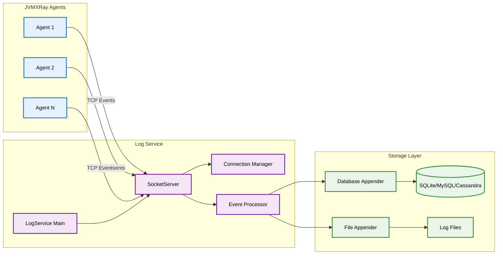

# JVMXRay Log Service (prj-service-log)

## Table of Contents

1. [Background and Purpose](#background-and-purpose)
2. [Architecture](#architecture)
3. [CLI Commands](#cli-commands)
4. [Properties](#properties)
   - 4.1 [Environment Variables](#environment-variables)
   - 4.2 [System Properties](#system-properties)
   - 4.3 [Component Properties](#component-properties)
   - 4.4 [Logback XML Settings](#logback-xml-settings)
5. [REST API Endpoints](#rest-api-endpoints)
6. [Database Tables](#database-tables)
7. [Common Errors](#common-errors)

---

## Background and Purpose

### Project Overview
The JVMXRay Log Service provides centralized log aggregation for collecting security events from distributed JVMXRay agents. It operates as a socket-based server that receives, processes, and persists logging events in real-time.

### Core Mission
Aggregate security events from multiple JVMXRay agents into centralized storage for analysis, reporting, and AI-enhanced security monitoring.

### Key Capabilities
- High-performance socket-based log collection
- Multi-agent connection management with lifecycle tracking
- Real-time event processing and persistence
- Daemon mode operation with PID file management
- Integration with existing Logback appender infrastructure
- Support for database and file-based event storage

---

## Architecture

### Module Structure

| Module | Purpose | Dependencies |
|--------|---------|--------------|
| prj-service-log | Socket-based log aggregation service | prj-common, Logback Classic, Apache Commons CLI |
| LogService | Main service daemon with lifecycle management | SocketServer, LogServiceInitializer |
| SocketServer | Enhanced socket server for agent connections | Logback SimpleSocketServer, SLF4J |
| LogServiceInitializer | Component initialization and configuration | ComponentInitializer framework |

### Component Relationships



### Data Flow
1. JVMXRay agents connect to LogService via TCP sockets
2. SocketServer accepts connections and manages client lifecycle
3. Events are deserialized and processed through Logback framework
4. Processed events are routed to configured appenders (database, files)
5. Service maintains connection state and provides graceful shutdown

---

## CLI Commands

### Command Reference

#### LogService
**Purpose:** Start, stop, and manage the JVMXRay log aggregation service

**Usage:**
```bash
# Basic syntax
java org.jvmxray.service.log.bin.LogService [action] [options]
```

**Options:**

| Option | Description | Default |
|--------|-------------|---------|
| --start | Start the log service (default action) | default |
| --stop | Stop a running log service instance | none |
| --restart | Restart the service (stop if running, then start) | none |
| --help | Display usage information and exit | none |
| -p, --port | Port for agent event listener | 9876 |
| -d, --daemon | Run in daemon mode (background process) | false |

**Examples:**
```bash
# Example 1: Start service with default settings
java org.jvmxray.service.log.bin.LogService --start

# Example 2: Start on custom port
java org.jvmxray.service.log.bin.LogService --start -p 8765

# Example 3: Start in daemon mode
java org.jvmxray.service.log.bin.LogService --start --daemon -p 9876

# Example 4: Stop running service
java org.jvmxray.service.log.bin.LogService --stop

# Example 5: Restart service
java org.jvmxray.service.log.bin.LogService --restart
```

#### Script Wrapper
**Purpose:** Simplified service management via script wrapper

**Usage:**
```bash
# Using script wrapper (if available)
./script/bin/services/log-service [start|stop|restart] [--port=PORT]
```

---

## Properties

### Environment Variables

#### Runtime Environment

**Common Variables:**

| Variable | Description | Default | Required |
|----------|-------------|---------|----------|
| JAVA_HOME | Path to JDK/JRE installation | system default | No |
| PATH | System path including java binary | system default | No |

### System Properties

#### JVM System Properties

**Location:** Set via `-D` flag at JVM startup

**Core Properties:**

| Property | Description | Default | Required |
|----------|-------------|---------|----------|
| -Djvmxray.home | Production mode base directory | ${user.home} | No |
| -Djvmxray.test.home | Test mode base directory | null | No |
| -Djvmxray.logservice.logs | Log service logs directory | auto-detected | No |
| -Djvmxray.logservice.config | Log service config directory | auto-detected | No |
| -Dlogback.configurationFile | Override logback config path | auto-detected | No |

### Component Properties

#### logservice.properties

**Location:** `.jvmxray/logservice/config/logservice.properties`

**Core Settings:**

| Property | Description | Default Value | Required |
|----------|-------------|---------------|----------|
| logservice.agent.port | Default port for agent connections | 9876 | No |
| logservice.daemon.mode | Enable daemon mode by default | false | No |
| logservice.connection.timeout | Client connection timeout (ms) | 30000 | No |
| logservice.max.connections | Maximum concurrent agent connections | 100 | No |

### Logback XML Settings

#### Log Service Logback Configuration

**Location:** `.jvmxray/logservice/config/logback.xml`

**Key Appenders:**

| Appender | Purpose | Log File |
|----------|---------|----------|
| LOGSERVICE | Service operational logs | logservice.log |
| AGENT_EVENTS | Aggregated agent events | agent-events.log |
| CONSOLE | Console output | stdout |

**Properties:**

| Property | Description | Example |
|----------|-------------|---------|
| LOG_HOME | Log service logs directory | ${jvmxray.logservice.logs} |
| AGENT_PORT | Port for agent listener | ${logservice.agent.port:-9876} |

---

## REST API Endpoints

**[Not Applicable]**

The Log Service operates as a socket-based aggregation service and does not expose REST API endpoints. Agent events are received via TCP socket connections on the configured port.

---

## Database Tables

### Schema Overview
The Log Service receives events from agents and persists them to database tables defined in the common schema. Events flow through configured Logback appenders.

### Table Integration

#### STAGE0_EVENT (via Database Appender)

**Purpose:** Receives raw security events from agents via log service

**Event Flow:**
1. Agent sends structured log event via socket
2. Log Service receives and deserializes event
3. Database appender processes event
4. Event inserted into STAGE0_EVENT table

**Sample Event Processing:**
```sql
-- Example event received from agent and processed by log service
INSERT INTO STAGE0_EVENT (EVENT_ID, CONFIG_FILE, TIMESTAMP, THREAD_ID, PRIORITY, NAMESPACE, AID, CID, IS_STABLE, KEYPAIRS)
VALUES (
  'agent-generated-uuid',
  'C:AP',
  CURRENT_TIMESTAMP,
  'agent-thread-1',
  'INFO',
  'org.jvmxray.agent.sensor.http.HttpSensor',
  'agent-001',
  'production',
  true,
  'method=GET|url=https://api.example.com|statusCode=200'
);
```

---

## Common Errors

### Error Reference

#### Service Startup Errors

**Error Message:**
```
java.net.BindException: Address already in use (port 9876)
```

**Cause:** Another process is already using the configured port

**Resolution:**
```bash
# Check what's using the port
lsof -i :9876

# Use different port
java LogService --start -p 8765
```

**Prevention:** Ensure ports are available before starting service

#### PID File Errors

**Error Message:**
```
Failed to create PID file: Permission denied
```

**Cause:** Insufficient permissions to write PID file to default location

**Resolution:**
```bash
# Set system property for writable directory
java -Djava.io.tmpdir=/path/to/writable/dir LogService --start
```

**Prevention:** Ensure service has write access to temp directory

#### Connection Errors

**Error Message:**
```
IOException: Connection reset by peer
```

**Cause:** Agent connection dropped unexpectedly

**Resolution:**
```bash
# Check agent configuration and network connectivity
# Verify agent is using correct log service port
```

**Prevention:** Ensure stable network connectivity and proper agent configuration

#### Initialization Errors

**Error Message:**
```
Failed to initialize LogService: CommonInitializer not found
```

**Cause:** Missing prj-common dependency or initialization order issue

**Resolution:**
```bash
# Ensure all dependencies are in classpath
mvn clean install

# Verify classpath includes prj-common
```

**Prevention:** Use proper build artifacts and dependency management

#### Configuration Errors

**Error Message:**
```
Logback configuration error: File not found
```

**Cause:** Missing or invalid logback configuration file

**Resolution:**
```bash
# Ensure LogServiceInitializer creates config files
# Check .jvmxray/logservice/config/logback.xml exists
```

**Prevention:** Run LogServiceInitializer before starting service

---