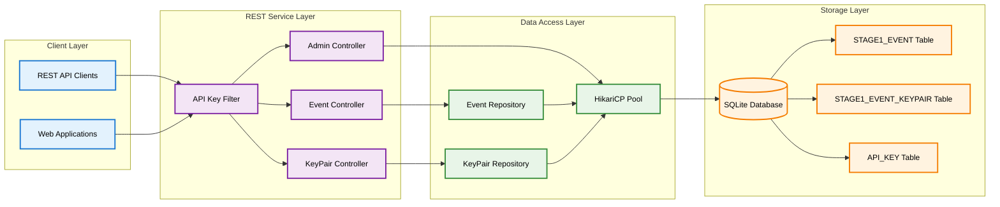

# JVMXRay REST Service (prj-service-rest)

## Table of Contents

1. [Background and Purpose](#background-and-purpose)
2. [Architecture](#architecture)
3. [CLI Commands](#cli-commands)
4. [Properties](#properties)
   - 4.1 [Environment Variables](#environment-variables)
   - 4.2 [System Properties](#system-properties)
   - 4.3 [Component Properties](#component-properties)
   - 4.4 [Logback XML Settings](#logback-xml-settings)
5. [REST API Endpoints](#rest-api-endpoints)
6. [Database Tables](#database-tables)
7. [Common Errors](#common-errors)

---

## Background and Purpose

### Project Overview
The JVMXRay REST Service provides a RESTful API for querying security event data collected by the JVMXRay monitoring platform. It exposes endpoints for searching, filtering, and retrieving security events and their associated key-value pairs stored in the database.

### Core Mission
Provide programmatic access to JVMXRay security event data through a standards-based REST API with authentication, pagination, and filtering capabilities.

### Key Capabilities
- Query security events with advanced filtering (namespace, time range, application/correlation IDs)
- Retrieve individual events and their key-value pairs
- Paginated responses with configurable limits to handle large datasets
- API key-based authentication and management
- Administrative endpoints for API key lifecycle management
- Cross-origin resource sharing (CORS) support for web applications

---

## Architecture

### Module Structure

| Module | Purpose | Dependencies |
|--------|---------|--------------|
| prj-service-rest | REST API service | prj-common, Spring Boot 2.7.18, HikariCP 5.0.1 |
| Controllers | REST endpoint handlers | EventController, KeyPairController, AdminController |
| Repositories | Data access layer | EventRepository, KeyPairRepository |
| Configuration | Service configuration | RestServiceConfig, API authentication filter |

### Component Relationships



### Data Flow
Client requests are authenticated via API key filter, routed to appropriate controllers, which use repositories to query the SQLite database¹ through HikariCP connection pooling. Responses are paginated and formatted as JSON with metadata including query performance metrics.

**¹** *SQLite is used for development and testing. Production deployments support MySQL and Cassandra databases.*

---

## CLI Commands

### Command Reference

#### RestService
**Purpose:** Start, stop, restart, and manage the JVMXRay REST API service

**Usage:**
```bash
# Basic syntax
java -jar prj-service-rest-0.0.1.jar [options]
./script/bin/services/rest-service [options]
```

**Options:**

| Option | Description | Default |
|--------|-------------|---------|
| --start | Start the REST service (default action) | N/A |
| --stop | Stop a running REST service instance | N/A |
| --restart | Restart the REST service (stop if running, then start) | N/A |
| --help | Display help message and exit | N/A |
| -p, --port PORT | Port to run the REST service on | 8080 |
| --generate-api-key APP_NAME | Generate an API key for the specified application | N/A |

**Examples:**
```bash
# Example 1: Start service on default port 8080
./script/bin/services/rest-service --start

# Example 2: Start service on custom port
./script/bin/services/rest-service --start -p 9090

# Example 3: Stop running service
./script/bin/services/rest-service --stop

# Example 4: Restart service
./script/bin/services/rest-service --restart

# Example 5: Generate API key for application
./script/bin/services/rest-service --generate-api-key myapp
```

---

## Properties

### Environment Variables

#### Runtime Environment

**Common Variables:**

| Variable | Description | Default | Required |
|----------|-------------|---------|----------|
| MAVEN_OPTS | JVM options for Maven builds | -Xmx1g -XX:MaxMetaspaceSize=256m | No |

### System Properties

#### JVM System Properties

**Location:** Set via `-D` flag at JVM startup

**Core Properties:**

| Property | Description | Default | Required |
|----------|-------------|---------|----------|
| -Djvmxray.test.home | Test mode base directory for .jvmxray structure | .jvmxray | No |
| -Djvmxray.home | Production mode base directory | /jvmxray | No |
| -Dlogback.configurationFile | Logback configuration file path | .jvmxray/restservice/config/logback.xml | No |
| -Drest.service.database.url | Database connection URL | jdbc:sqlite:.jvmxray/common/data/jvmxray-test.db | No |
| -Dserver.port | Spring Boot server port | 8080 | No |

### Component Properties

#### restservice.properties

**Location:** `.jvmxray/restservice/config/restservice.properties`

**Core Settings:**

| Property | Description | Default Value | Required |
|----------|-------------|---------------|----------|
| rest.service.port | REST service port number | 8080 | No |
| rest.service.max.page.size | Maximum number of results per page | 1000 | No |
| rest.service.default.page.size | Default page size for queries | 100 | No |
| rest.service.max.result.size | Maximum total results allowed | 100000 | No |
| rest.service.database.url | SQLite database connection URL | jdbc:sqlite:.jvmxray/common/data/jvmxray-test.db | No |

### Logback XML Settings

#### RestService Logback Configuration

**Location:** `.jvmxray/restservice/config/logback.xml`

**Key Appenders:**

| Appender | Purpose | Log File |
|----------|---------|----------|
| FILE | Application logging | .jvmxray/restservice/logs/restservice.log |
| CONSOLE | Console output | stdout |

**Properties:**

| Property | Description | Example |
|----------|-------------|---------|
| jvmxray.restservice.logs | Log file directory | .jvmxray/restservice/logs |
| LOG_LEVEL | Logging level | INFO |

---

## REST API Endpoints

### API Reference

#### Events

**Endpoint:** `/api/v1/events`

```yaml
method: GET
authentication: required
description: Query security events with filtering and pagination
parameters:
  - name: namespace
    type: string
    required: false
    description: Namespace pattern (supports wildcards with *)
  - name: startTime
    type: long
    required: false
    description: Start timestamp (inclusive, milliseconds since epoch)
  - name: endTime
    type: long
    required: false
    description: End timestamp (inclusive, milliseconds since epoch)
  - name: aid
    type: string
    required: false
    description: Application ID filter
  - name: cid
    type: string
    required: false
    description: Correlation ID filter
  - name: page
    type: integer
    required: false
    default: 0
    description: Page number (0-based)
  - name: size
    type: integer
    required: false
    default: 100
    description: Page size (max 1000)
  - name: estimateOnly
    type: boolean
    required: false
    default: false
    description: Return only count without data
responses:
  200:
    description: Success
    schema:
      type: object
      properties:
        data: array
        pagination: object
        metadata: object
  400:
    description: Bad Request - Query too broad
    schema:
      type: object
      properties:
        error: string
        total_elements: integer
        max_allowed: integer
  401:
    description: Unauthorized - Invalid API key
```

**Example Request:**
```bash
curl -X GET \
  'http://localhost:8080/api/v1/events?namespace=IO.*&startTime=1640995200000&page=0&size=50' \
  -H 'X-API-Key: jvmxray_abc123def456...' \
  -H 'Accept: application/json'
```

**Example Response:**
```json
{
  "data": [
    {
      "event_id": "evt_123456789",
      "config_file": "agent.properties",
      "timestamp": 1640995260123,
      "thread_id": "main",
      "priority": "INFO",
      "namespace": "IO.FILE.READ",
      "aid": "app-001",
      "cid": "corr-001",
      "is_stable": true
    }
  ],
  "pagination": {
    "page": 0,
    "size": 50,
    "total_elements": 1250,
    "total_pages": 25
  },
  "metadata": {
    "query_time_ms": 45,
    "estimated": false
  }
}
```

#### Single Event

**Endpoint:** `/api/v1/events/{eventId}`

```yaml
method: GET
authentication: required
description: Retrieve a single event by its ID
parameters:
  - name: eventId
    type: string
    required: true
    description: The unique event identifier
responses:
  200:
    description: Success
    schema:
      type: object
      properties:
        event_id: string
        config_file: string
        timestamp: integer
        thread_id: string
        priority: string
        namespace: string
        aid: string
        cid: string
        is_stable: boolean
  404:
    description: Event not found
    schema:
      type: object
      properties:
        error: string
  401:
    description: Unauthorized
```

**Example Request:**
```bash
curl -X GET \
  'http://localhost:8080/api/v1/events/evt_123456789' \
  -H 'X-API-Key: jvmxray_abc123def456...' \
  -H 'Accept: application/json'
```

#### Key-Value Pairs

**Endpoint:** `/api/v1/keypairs`

```yaml
method: GET
authentication: required
description: Query key-value pairs with filtering and pagination
parameters:
  - name: key
    type: string
    required: false
    description: Key filter (exact match or pattern with *)
  - name: value
    type: string
    required: false
    description: Value filter (exact match or pattern with *)
  - name: eventId
    type: string
    required: false
    description: Filter by specific event ID
  - name: page
    type: integer
    required: false
    default: 0
    description: Page number (0-based)
  - name: size
    type: integer
    required: false
    default: 100
    description: Page size (max 1000)
  - name: estimateOnly
    type: boolean
    required: false
    default: false
    description: Return only count without data
responses:
  200:
    description: Success
    schema:
      type: object
      properties:
        data: array
        pagination: object
        metadata: object
  400:
    description: Bad Request
  401:
    description: Unauthorized
```

**Example Request:**
```bash
curl -X GET \
  'http://localhost:8080/api/v1/keypairs?key=file.path&page=0&size=20' \
  -H 'X-API-Key: jvmxray_abc123def456...' \
  -H 'Accept: application/json'
```

#### Event Key-Value Pairs

**Endpoint:** `/api/v1/keypairs/{eventId}`

```yaml
method: GET
authentication: required
description: Get all key-value pairs for a specific event
parameters:
  - name: eventId
    type: string
    required: true
    description: The event ID
responses:
  200:
    description: Success - returns array of key-value pairs
    schema:
      type: array
      items:
        type: object
        properties:
          event_id: string
          key: string
          value: string
  401:
    description: Unauthorized
```

#### Create API Key

**Endpoint:** `/api/v1/admin/apikeys`

```yaml
method: POST
authentication: required
description: Create a new API key for an application
parameters:
  - name: app_name
    type: string
    required: true
    description: Name of the application requesting the API key
    location: body
responses:
  201:
    description: API key created successfully
    schema:
      type: object
      properties:
        api_key: string
        app_name: string
        created_at: integer
  400:
    description: Bad Request - app_name required
  401:
    description: Unauthorized
  500:
    description: Internal Server Error
```

**Example Request:**
```bash
curl -X POST \
  'http://localhost:8080/api/v1/admin/apikeys' \
  -H 'X-API-Key: jvmxray_admin_key...' \
  -H 'Content-Type: application/json' \
  -H 'Accept: application/json' \
  -d '{"app_name": "monitoring-dashboard"}'
```

#### Manage API Key Suspension

**Endpoint:** `/api/v1/admin/apikeys/{apiKey}/suspend`

```yaml
method: PUT
authentication: required
description: Suspend or unsuspend an API key
parameters:
  - name: apiKey
    type: string
    required: true
    description: The API key to update
    location: path
  - name: suspend
    type: boolean
    required: true
    description: True to suspend, false to unsuspend
    location: body
responses:
  200:
    description: API key updated successfully
    schema:
      type: object
      properties:
        api_key: string
        is_suspended: boolean
  400:
    description: Bad Request
  404:
    description: API key not found
  401:
    description: Unauthorized
```

#### List API Keys

**Endpoint:** `/api/v1/admin/apikeys`

```yaml
method: GET
authentication: required
description: List all API keys with their metadata
responses:
  200:
    description: Success
    schema:
      type: array
      items:
        type: object
        properties:
          api_key: string
          app_name: string
          is_suspended: boolean
          created_at: integer
          last_used: integer
  401:
    description: Unauthorized
  500:
    description: Internal Server Error
```

#### Delete API Key

**Endpoint:** `/api/v1/admin/apikeys/{apiKey}`

```yaml
method: DELETE
authentication: required
description: Delete an API key permanently
parameters:
  - name: apiKey
    type: string
    required: true
    description: The API key to delete
    location: path
responses:
  200:
    description: API key deleted successfully
    schema:
      type: object
      properties:
        message: string
  404:
    description: API key not found
  401:
    description: Unauthorized
  500:
    description: Internal Server Error
```

---

## Database Tables

### Schema Overview
The REST service accesses the JVMXRay database schema, specifically querying processed events and their normalized key-value pairs. The service also manages its own API key authentication table.

### Table Definitions

#### STAGE1_EVENT

**Purpose:** Stores processed security events with stability flag for consistency

**Columns:**
```
+-------------+-------------+------+-----+---------+-------+
| Column Name | Type        | Null | Key | Default | Extra |
+-------------+-------------+------+-----+---------+-------+
| EVENT_ID    | TEXT        | NO   | PRI | NULL    |       |
| CONFIG_FILE | TEXT        | YES  |     | NULL    |       |
| TIMESTAMP   | INTEGER     | YES  | MUL | NULL    |       |
| THREAD_ID   | TEXT        | YES  |     | NULL    |       |
| PRIORITY    | TEXT        | YES  |     | NULL    |       |
| NAMESPACE   | TEXT        | YES  | MUL | NULL    |       |
| AID         | TEXT        | YES  | MUL | NULL    |       |
| CID         | TEXT        | YES  | MUL | NULL    |       |
| IS_STABLE   | INTEGER     | YES  | MUL | 1       |       |
+-------------+-------------+------+-----+---------+-------+
```

**Indexes:**

| Index Name | Columns | Purpose |
|------------|---------|---------|
| idx_stage1_event_timestamp | TIMESTAMP | Time-based queries |
| idx_stage1_event_namespace | NAMESPACE | Namespace filtering |
| idx_stage1_event_aid | AID | Application ID filtering |
| idx_stage1_event_cid | CID | Correlation ID filtering |
| idx_stage1_event_stable | IS_STABLE | Consistency queries |

**Sample Data:**
```sql
-- Query recent IO events
SELECT * FROM STAGE1_EVENT
WHERE NAMESPACE LIKE 'IO.%'
AND TIMESTAMP > 1640995200000
ORDER BY TIMESTAMP DESC
LIMIT 10;
```

#### STAGE1_EVENT_KEYPAIR

**Purpose:** Normalized key-value pairs extracted from processed events

**Columns:**
```
+-------------+------+------+-----+---------+-------+
| Column Name | Type | Null | Key | Default | Extra |
+-------------+------+------+-----+---------+-------+
| EVENT_ID    | TEXT | NO   | PRI | NULL    |       |
| KEY         | TEXT | NO   | PRI | NULL    |       |
| VALUE       | TEXT | YES  |     | NULL    |       |
+-------------+------+------+-----+---------+-------+
```

**Indexes:**

| Index Name | Columns | Purpose |
|------------|---------|---------|
| PRIMARY | EVENT_ID, KEY | Composite primary key |

**Sample Data:**
```sql
-- Get file paths from IO events
SELECT EVENT_ID, VALUE as file_path
FROM STAGE1_EVENT_KEYPAIR
WHERE KEY = 'file.path'
LIMIT 5;
```

#### API_KEY

**Purpose:** Manages API key authentication for REST service access

**Columns:**
```
+--------------+---------+------+-----+---------+-------+
| Column Name  | Type    | Null | Key | Default | Extra |
+--------------+---------+------+-----+---------+-------+
| API_KEY      | TEXT    | NO   | PRI | NULL    |       |
| APP_NAME     | TEXT    | NO   |     | NULL    |       |
| IS_SUSPENDED | INTEGER | YES  |     | 0       |       |
| CREATED_AT   | INTEGER | YES  |     | NULL    |       |
| LAST_USED    | INTEGER | YES  |     | NULL    |       |
+--------------+---------+------+-----+---------+-------+
```

**Indexes:**

| Index Name | Columns | Purpose |
|------------|---------|---------|
| PRIMARY | API_KEY | Primary key lookup |

**Sample Data:**
```sql
-- List active API keys
SELECT API_KEY, APP_NAME, CREATED_AT
FROM API_KEY
WHERE IS_SUSPENDED = 0
ORDER BY CREATED_AT DESC;
```

---

## Common Errors

### Error Reference

#### Connection Errors

**Error Message:**
```
Failed to start REST Service: Cannot connect to database
```

**Cause:** SQLite database file doesn't exist or is inaccessible

**Resolution:**
```bash
# Create database schema first
java -cp "prj-common/target/classes:$(mvn dependency:build-classpath -q -Dmdep.outputFile=/dev/stdout -f prj-common/pom.xml)" org.jvmxray.platform.shared.bin.SchemaManager --create-schema --database-type sqlite --connection-url jdbc:sqlite:.jvmxray/common/data/jvmxray-test.db
```

**Prevention:** Ensure database schema is created before starting REST service

#### Authentication Errors

**Error Message:**
```
HTTP 401 Unauthorized
```

**Cause:** Missing or invalid X-API-Key header in request

**Resolution:**
```bash
# Generate a new API key
./script/bin/services/rest-service --generate-api-key myapp
# Use the generated key in X-API-Key header
```

**Prevention:** Always include valid API key in X-API-Key header

#### Query Size Errors

**Error Message:**
```
Query would return too many results (total: 150000, max: 100000)
```

**Cause:** Query results exceed configured maximum result size

**Resolution:**
```bash
# Use more specific filters or estimate-only mode
curl -X GET 'http://localhost:8080/api/v1/events?namespace=IO.FILE.*&estimateOnly=true' -H 'X-API-Key: ...'
```

**Prevention:** Use specific filters to limit result sets or adjust max.result.size property

#### Port Binding Errors

**Error Message:**
```
Port 8080 is already in use
```

**Cause:** Another service is using the configured port

**Resolution:**
```bash
# Use different port
./script/bin/services/rest-service --start -p 9090
```

**Prevention:** Check port availability before starting service or configure unique port