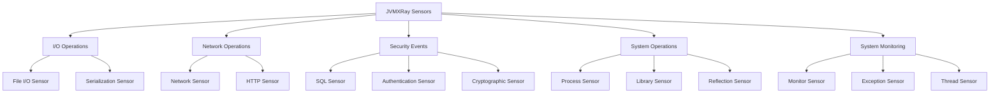
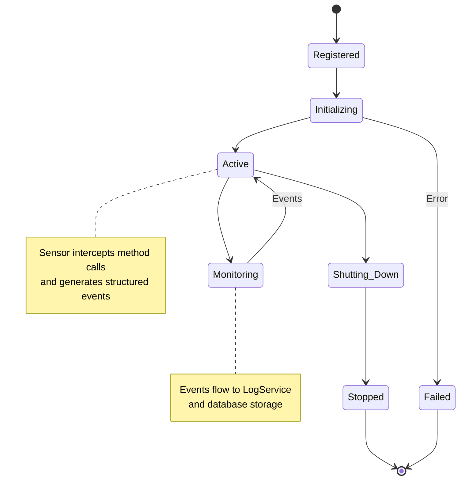

# Complete Sensor Reference

## Overview
JVMXRay includes 15+ sensor types that monitor different aspects of Java application behavior. Each sensor uses bytecode injection to intercept method calls and generate structured security events.

## Sensor Categories


## File I/O Operations

### File I/O Sensor
**Namespace**: `org.jvmxray.events.io.*`

#### File Read Event
```yaml
event: org.jvmxray.events.io.fileread
format: "caller={class}:{line}, target={path}, status={result}"
example: "caller=java.io.FileInputStream:189, target=/etc/passwd, status=success"
fields:
  caller:
    type: string
    description: "Calling class and line number"
    required: true
  target:
    type: string
    description: "Absolute file path being accessed"
    required: true
  status:
    type: enum[success|denied|error]
    description: "Operation result"
    required: true
security:
  cwe: ["CWE-22", "CWE-200"]
  mitre: ["T1005", "T1083"]
  severity: medium
```

#### File Write Event
```yaml
event: org.jvmxray.events.io.filewrite
format: "caller={class}:{line}, target={path}, size={bytes}, status={result}"
example: "caller=java.io.FileOutputStream:245, target=/tmp/output.log, size=1024, status=success"
fields:
  caller:
    type: string
    description: "Calling class and line number"
    required: true
  target:
    type: string
    description: "Absolute file path being written"
    required: true
  size:
    type: integer
    description: "Bytes written"
    required: false
  status:
    type: enum[success|denied|error]
    description: "Operation result"
    required: true
security:
  cwe: ["CWE-22", "CWE-732"]
  mitre: ["T1005", "T1565"]
  severity: medium
```

#### File Delete Event
```yaml
event: org.jvmxray.events.io.filedelete
format: "caller={class}:{line}, target={path}, status={result}"
example: "caller=java.io.File:1075, target=/tmp/sensitive.data, status=successfully deleted"
fields:
  caller:
    type: string
    description: "Calling class and line number"
    required: true
  target:
    type: string
    description: "Absolute file path being deleted"
    required: true
  status:
    type: enum[successfully deleted|deletion failed|access denied]
    description: "Deletion result"
    required: true
security:
  cwe: ["CWE-22", "CWE-732"]
  mitre: ["T1485", "T1070"]
  severity: high
```

### Serialization Sensor
**Namespace**: `org.jvmxray.events.serialization.*`

#### Object Deserialization Event
```yaml
event: org.jvmxray.events.serialization.deserialize
format: "caller={class}:{line}, target={object_class}, source={input_source}, status={result}"
example: "caller=ObjectInputStream:123, target=UserData.class, source=network, status=deserialized"
fields:
  caller:
    type: string
    description: "Calling class and line number"
    required: true
  target:
    type: string
    description: "Class being deserialized"
    required: true
  source:
    type: enum[file|network|memory]
    description: "Data source for deserialization"
    required: true
  status:
    type: enum[deserialized|failed|blocked]
    description: "Deserialization result"
    required: true
security:
  cwe: ["CWE-502"]
  mitre: ["T1055", "T1027"]
  severity: high
```

## Network Operations

### Network Sensor
**Namespace**: `org.jvmxray.events.net.*`

#### Network Connection Event
```yaml
event: org.jvmxray.events.net.connect
format: "caller={class}:{line}, destination={host}:{port}, status={result}"
example: "caller=java.net.Socket:189, destination=malicious-site.com:443, status=connected"
fields:
  caller:
    type: string
    description: "Calling class and line number"
    required: true
  destination:
    type: string
    description: "Target host and port"
    required: true
  protocol:
    type: enum[tcp|udp|ssl]
    description: "Network protocol used"
    required: false
  status:
    type: enum[connected|failed|blocked|timeout]
    description: "Connection result"
    required: true
security:
  cwe: ["CWE-200", "CWE-601"]
  mitre: ["T1071", "T1090"]
  severity: medium
```

#### Socket Bind Event
```yaml
event: org.jvmxray.events.net.bind
format: "caller={class}:{line}, address={host}:{port}, status={result}"
example: "caller=java.net.ServerSocket:67, address=0.0.0.0:8080, status=bound"
fields:
  caller:
    type: string
    description: "Calling class and line number"
    required: true
  address:
    type: string
    description: "Bind address and port"
    required: true
  status:
    type: enum[bound|failed|denied]
    description: "Bind operation result"
    required: true
security:
  cwe: ["CWE-200"]
  mitre: ["T1572", "T1090"]
  severity: low
```

### HTTP Sensor
**Namespace**: `org.jvmxray.events.http.*`

#### HTTP Request Event
```yaml
event: org.jvmxray.events.http.request
format: "caller={class}:{line}, method={http_method}, url={target_url}, status={response_code}"
example: "caller=HttpURLConnection:456, method=POST, url=https://api.example.com/data, status=200"
fields:
  caller:
    type: string
    description: "Calling class and line number"
    required: true
  method:
    type: enum[GET|POST|PUT|DELETE|PATCH|HEAD|OPTIONS]
    description: "HTTP method"
    required: true
  url:
    type: string
    description: "Target URL"
    required: true
  headers:
    type: object
    description: "Request headers (security-relevant only)"
    required: false
  status:
    type: integer
    description: "HTTP response code"
    required: true
security:
  cwe: ["CWE-601", "CWE-352"]
  mitre: ["T1071", "T1573"]
  severity: medium
```

## Security Operations

### SQL Sensor
**Namespace**: `org.jvmxray.events.sql.*`

#### SQL Query Event
```yaml
event: org.jvmxray.events.sql.query
format: "caller={class}:{line}, query={sql_statement}, database={db_name}, status={result}"
example: "caller=PreparedStatement:189, query=SELECT * FROM users WHERE id = ?, database=userdb, status=executed"
fields:
  caller:
    type: string
    description: "Calling class and line number"
    required: true
  query:
    type: string
    description: "SQL query (sanitized for logging)"
    required: true
  database:
    type: string
    description: "Target database name"
    required: false
  parameters:
    type: array
    description: "Query parameters (sanitized)"
    required: false
  status:
    type: enum[executed|failed|blocked|potential_injection]
    description: "Query execution result"
    required: true
security:
  cwe: ["CWE-89", "CWE-200"]
  mitre: ["T1552", "T1083"]
  severity: high
```

### Authentication Sensor
**Namespace**: `org.jvmxray.events.auth.*`

#### Login Attempt Event
```yaml
event: org.jvmxray.events.auth.login
format: "caller={class}:{line}, username={user}, method={auth_method}, status={result}"
example: "caller=AuthenticationManager:123, username=admin, method=password, status=success"
fields:
  caller:
    type: string
    description: "Calling class and line number"
    required: true
  username:
    type: string
    description: "Username attempt (hashed if sensitive)"
    required: true
  method:
    type: enum[password|token|certificate|biometric]
    description: "Authentication method"
    required: true
  source_ip:
    type: string
    description: "Source IP address"
    required: false
  status:
    type: enum[success|failed|locked|expired]
    description: "Authentication result"
    required: true
security:
  cwe: ["CWE-307", "CWE-287"]
  mitre: ["T1078", "T1110"]
  severity: high
```

### Cryptographic Sensor
**Namespace**: `org.jvmxray.events.crypto.*`

#### Encryption Operation Event
```yaml
event: org.jvmxray.events.crypto.encrypt
format: "caller={class}:{line}, algorithm={cipher_algorithm}, key_size={bits}, status={result}"
example: "caller=Cipher:234, algorithm=AES/GCM/NoPadding, key_size=256, status=encrypted"
fields:
  caller:
    type: string
    description: "Calling class and line number"
    required: true
  algorithm:
    type: string
    description: "Encryption algorithm and mode"
    required: true
  key_size:
    type: integer
    description: "Key size in bits"
    required: false
  data_size:
    type: integer
    description: "Data size in bytes"
    required: false
  status:
    type: enum[encrypted|decrypted|failed]
    description: "Cryptographic operation result"
    required: true
security:
  cwe: ["CWE-327", "CWE-326"]
  mitre: ["T1027", "T1573"]
  severity: low
```

## System Operations

### Process Sensor
**Namespace**: `org.jvmxray.events.system.*`

#### Process Execution Event
```yaml
event: org.jvmxray.events.system.exec
format: "caller={class}:{line}, command={command}, args={arguments}, status={result}"
example: "caller=ProcessBuilder:1029, command=/bin/sh, args=[-c, ls -la], status=executed"
fields:
  caller:
    type: string
    description: "Calling class and line number"
    required: true
  command:
    type: string
    description: "Executable command"
    required: true
  args:
    type: array
    description: "Command arguments"
    required: false
  working_directory:
    type: string
    description: "Process working directory"
    required: false
  status:
    type: enum[executed|failed|blocked|denied]
    description: "Process execution result"
    required: true
security:
  cwe: ["CWE-78", "CWE-77"]
  mitre: ["T1059", "T1106"]
  severity: critical
```

### Library Loading Sensor
**Namespace**: `org.jvmxray.events.system.*`

#### Dynamic Library Loading Event
```yaml
event: org.jvmxray.events.system.lib
format: "caller={class}:{line}, method={load_method}, jarPath={library_path}, status={result}"
example: "caller=URLClassLoader:123, method=dynamic, jarPath=/tmp/suspicious.jar, status=loaded"
fields:
  caller:
    type: string
    description: "Calling class and line number"
    required: true
  method:
    type: enum[dynamic|static|reflection]
    description: "Library loading method"
    required: true
  jarPath:
    type: string
    description: "Path to loaded library"
    required: true
  checksum:
    type: string
    description: "Library file checksum"
    required: false
  status:
    type: enum[loaded|failed|blocked]
    description: "Loading operation result"
    required: true
security:
  cwe: ["CWE-829", "CWE-426"]
  mitre: ["T1055", "T1129"]
  severity: high
```

### Reflection Sensor
**Namespace**: `org.jvmxray.events.reflection.*`

#### Reflection Access Event
```yaml
event: org.jvmxray.events.reflection.access
format: "caller={class}:{line}, target={target_class}, member={field_or_method}, operation={access_type}"
example: "caller=ReflectionUtils:67, target=SecurityManager.class, member=checkPermission, operation=invoke"
fields:
  caller:
    type: string
    description: "Calling class and line number"
    required: true
  target:
    type: string
    description: "Target class being accessed"
    required: true
  member:
    type: string
    description: "Field or method name"
    required: true
  operation:
    type: enum[get_field|set_field|invoke_method|instantiate]
    description: "Type of reflection operation"
    required: true
  accessibility:
    type: boolean
    description: "Whether setAccessible was called"
    required: false
security:
  cwe: ["CWE-470", "CWE-266"]
  mitre: ["T1055", "T1027"]
  severity: medium
```

## System Monitoring

### Monitor Sensor
**Namespace**: `org.jvmxray.events.monitor.*`

#### System Health Event
```yaml
event: org.jvmxray.events.monitor
format: "GCCount={gc_count}, ThreadRunnable={active_threads}, MemoryFree={free_memory}MB, ProcessCpuLoad={cpu_percent}%, OpenFiles={file_descriptors}"
example: "GCCount=1, ThreadRunnable=2, MemoryFree=566.3MB, ProcessCpuLoad=0%, OpenFiles=163"
fields:
  GCCount:
    type: integer
    description: "Garbage collection count since last measurement"
    required: true
  ThreadRunnable:
    type: integer
    description: "Number of runnable threads"
    required: true
  MemoryFree:
    type: string
    description: "Free memory in MB"
    required: true
  ProcessCpuLoad:
    type: string
    description: "CPU load percentage"
    required: true
  OpenFiles:
    type: integer
    description: "Number of open file descriptors"
    required: true
security:
  cwe: ["CWE-400"]
  mitre: ["T1083", "T1057"]
  severity: low
```

### Exception Sensor
**Namespace**: `org.jvmxray.events.system.*`

#### Uncaught Exception Event
```yaml
event: org.jvmxray.events.system.uncaughtexception
format: "thread_name={thread}, thread_id={id}, exception_type={class}, exception_location={location}, exception_message={message}, memory_pressure={level}, incident_id={uuid}"
example: "thread_name=payment-processor-1, thread_id=42, exception_type=java.lang.NullPointerException, exception_location=com.example.PaymentProcessor:145, exception_message=Cannot process null payment, memory_pressure=HIGH, incident_id=f3d4e5a6-b7c8-4d9e-a1b2-3c4d5e6f7a8b"
fields:
  thread_name:
    type: string
    description: "Name of the thread that threw exception"
    required: true
  thread_id:
    type: integer
    description: "Thread ID"
    required: true
  thread_group:
    type: string
    description: "Thread group name"
    required: false
  exception_type:
    type: string
    description: "Exception class name"
    required: true
  exception_location:
    type: string
    description: "Class and line where exception occurred"
    required: true
  exception_method:
    type: string
    description: "Method name where exception occurred"
    required: false
  exception_message:
    type: string
    description: "Exception message (sanitized)"
    required: false
  stack_depth:
    type: integer
    description: "Stack trace depth"
    required: false
  memory_pressure:
    type: enum[LOW|MEDIUM|HIGH|CRITICAL]
    description: "System memory pressure level"
    required: false
  heap_used_mb:
    type: number
    description: "Heap memory used in MB"
    required: false
  command_line:
    type: string
    description: "JVM command line arguments"
    required: false
  jvm_uptime_minutes:
    type: integer
    description: "JVM uptime in minutes"
    required: false
  incident_id:
    type: string
    description: "Unique incident identifier"
    required: true
security:
  cwe: ["CWE-248", "CWE-754"]
  mitre: ["T1083", "T1057"]
  severity: medium
```

### Thread Sensor
**Namespace**: `org.jvmxray.events.thread.*`

#### Thread Lifecycle Event
```yaml
event: org.jvmxray.events.thread.lifecycle
format: "caller={class}:{line}, thread_name={name}, thread_id={id}, operation={lifecycle_event}, status={result}"
example: "caller=ThreadPool:89, thread_name=worker-thread-1, thread_id=123, operation=start, status=success"
fields:
  caller:
    type: string
    description: "Calling class and line number"
    required: true
  thread_name:
    type: string
    description: "Thread name"
    required: true
  thread_id:
    type: integer
    description: "Thread ID"
    required: true
  operation:
    type: enum[start|stop|interrupt|join|sleep]
    description: "Thread operation"
    required: true
  priority:
    type: integer
    description: "Thread priority (1-10)"
    required: false
  status:
    type: enum[success|failed|interrupted]
    description: "Operation result"
    required: true
security:
  cwe: ["CWE-362", "CWE-821"]
  mitre: ["T1057"]
  severity: low
```

## Sensor Management


## Performance Impact by Sensor

| Sensor Type | Typical Overhead | Memory Usage | Recommendations |
|-------------|------------------|--------------|-----------------|
| File I/O | <1% | Low | Enable for all environments |
| Network | <2% | Low | Enable for production |
| SQL | <3% | Medium | Monitor query complexity |
| HTTP | <2% | Medium | Consider sampling for high traffic |
| Process | <1% | Low | Critical for security monitoring |
| Monitor | <1% | Low | Enable for health monitoring |
| Exception | <0.5% | Low | Always enable |
| Reflection | <2% | Medium | Consider for security-critical apps |
| Authentication | <1% | Low | Enable for all auth systems |
| Cryptographic | <2% | Medium | Monitor key operations |

## See Also
- [Event Format Specification](all-events.md)
- [Sensor Development Guide](../guides/sensor-development.md)
- [Performance Tuning](../guides/performance-tuning.md)
- [Security Analysis](../guides/security-analysis.md)