# JVMXRay Agent Architecture

## Overview
The JVMXRay Agent is a Java agent that uses bytecode injection to install sensors for monitoring application security events in real-time without requiring code changes.

## Agent Lifecycle
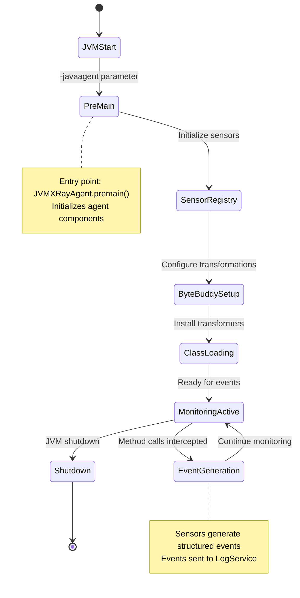

## Bytecode Injection Architecture
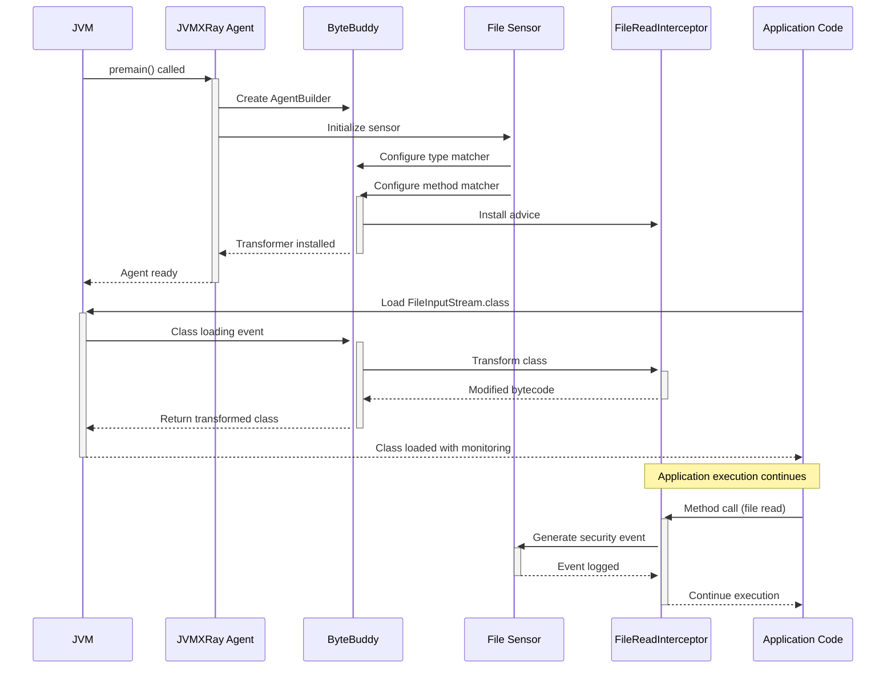

## Sensor Framework Architecture
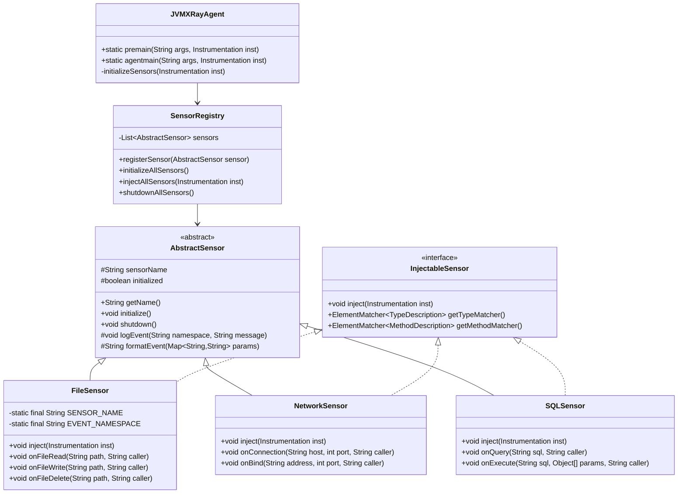

## Method Interception Pattern
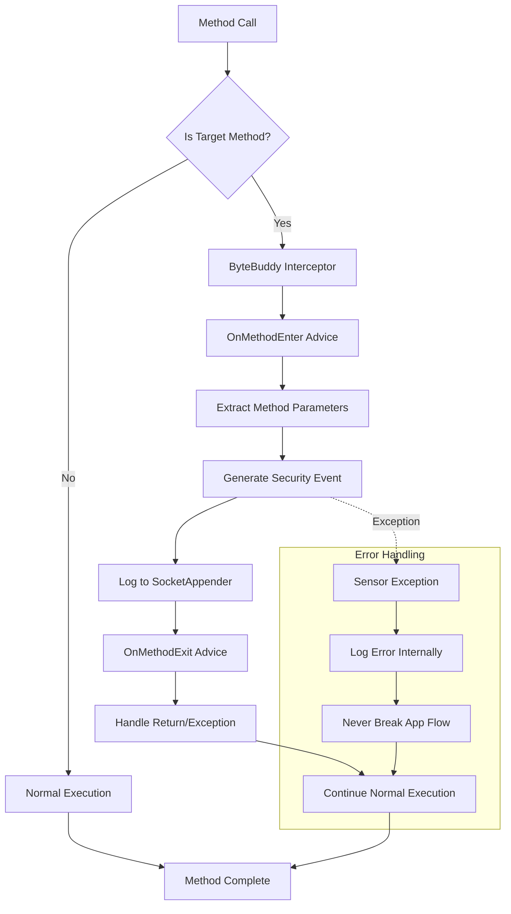

## Event Generation Flow
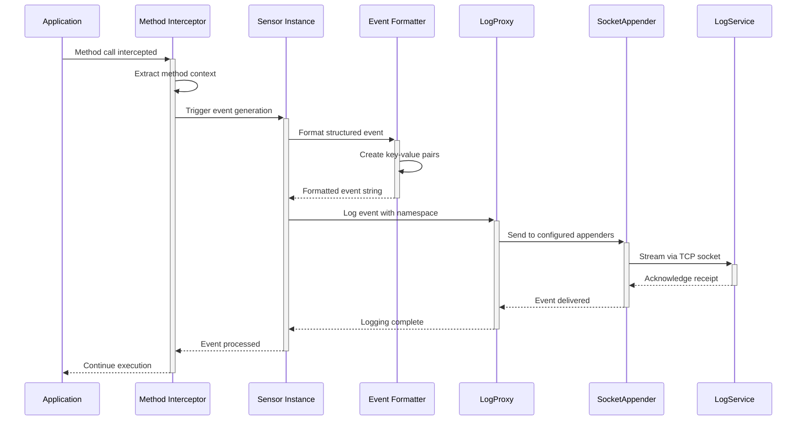

## Component Directory Structure
```
prj-agent/
├── src/main/java/org/jvmxray/agent/
│   ├── bin/
│   │   └── JVMXRayAgent.java          # Main agent entry point
│   ├── core/
│   │   ├── AbstractSensor.java        # Base sensor implementation
│   │   ├── InjectableSensor.java      # Sensor injection interface
│   │   ├── SensorRegistry.java       # Sensor management
│   │   └── EventFormatter.java       # Event formatting utilities
│   ├── sensors/
│   │   ├── io/
│   │   │   ├── FileSensor.java        # File I/O monitoring
│   │   │   └── SerializationSensor.java # Object serialization
│   │   ├── net/
│   │   │   ├── NetworkSensor.java     # Network connections
│   │   │   └── HttpSensor.java        # HTTP requests
│   │   ├── sql/
│   │   │   └── SQLSensor.java         # Database queries
│   │   ├── system/
│   │   │   ├── ProcessSensor.java     # System processes
│   │   │   ├── LibrarySensor.java     # Dynamic loading
│   │   │   └── ReflectionSensor.java  # Reflection operations
│   │   ├── monitor/
│   │   │   └── MonitorSensor.java     # System monitoring
│   │   └── uncaughtexception/
│   │       └── UncaughtExceptionSensor.java # Exception handling
│   ├── interceptors/
│   │   ├── FileInterceptor.java       # File I/O interception
│   │   ├── NetworkInterceptor.java    # Network interception
│   │   └── SQLInterceptor.java        # SQL interception
│   └── util/
│       ├── LogProxy.java              # Agent logging proxy
│       ├── StackTraceUtil.java        # Call stack analysis
│       └── AgentInitializer.java      # Agent initialization
├── src/main/resources/
│   └── logback.xml2                   # Logback template
└── src/test/java/
    └── org/jvmxray/agent/
        ├── sensors/                   # Sensor unit tests
        └── integration/               # Integration tests
```

## Sensor Implementation Details

### File I/O Sensor
```mermaid
graph TD
    A[File I/O Operations] --> B{Operation Type}
    B -->|Read| C[FileInputStream Interception]
    B -->|Write| D[FileOutputStream Interception]
    B -->|Delete| E[File.delete() Interception]
    
    C --> F[Extract File Path]
    D --> F
    E --> F
    
    F --> G[Extract Caller Context]
    G --> H[Generate Event]
    H --> I[Log to SocketAppender]
    
    subgraph "Event Format"
        J["caller=ClassName:lineNumber"]
        K["target=/path/to/file"]
        L["status=success|denied|error"]
        M["operation=read|write|delete"]
    end
    
    H --> J
    H --> K
    H --> L
    H --> M
```

### Network Sensor
```mermaid
graph TD
    A[Network Operations] --> B{Operation Type}
    B -->|Connect| C[Socket.connect() Interception]
    B -->|Bind| D[ServerSocket.bind() Interception]
    B -->|Accept| E[ServerSocket.accept() Interception]
    
    C --> F[Extract Destination]
    D --> G[Extract Bind Address]
    E --> H[Extract Client Info]
    
    F --> I[Generate Connection Event]
    G --> J[Generate Bind Event]
    H --> K[Generate Accept Event]
    
    I --> L[Log to SocketAppender]
    J --> L
    K --> L
```

### SQL Sensor
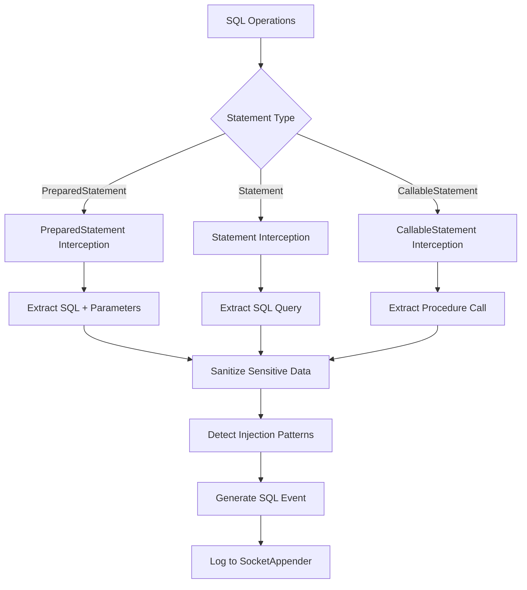

## Performance Optimization
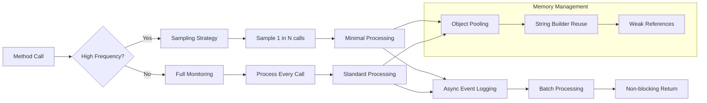

## Agent Configuration
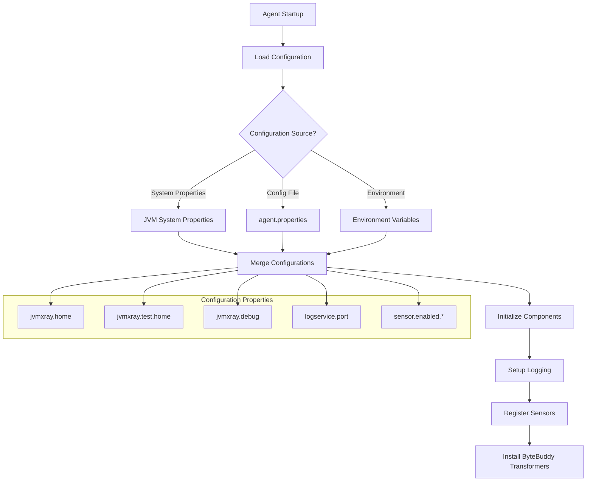

## Error Handling Strategy
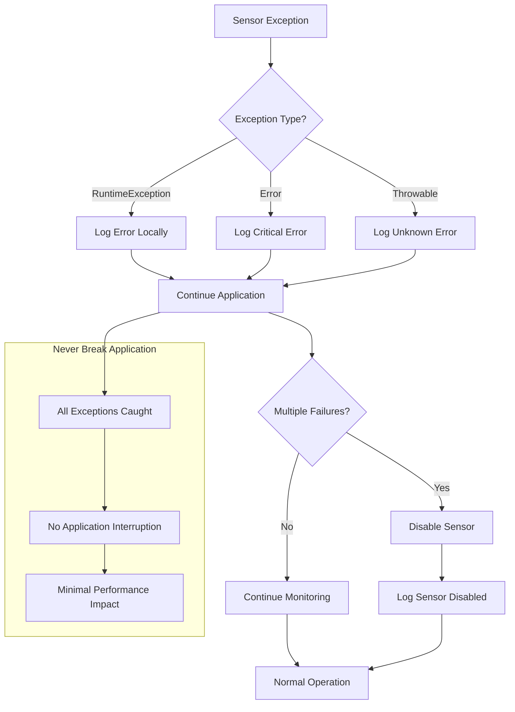

## Memory Management
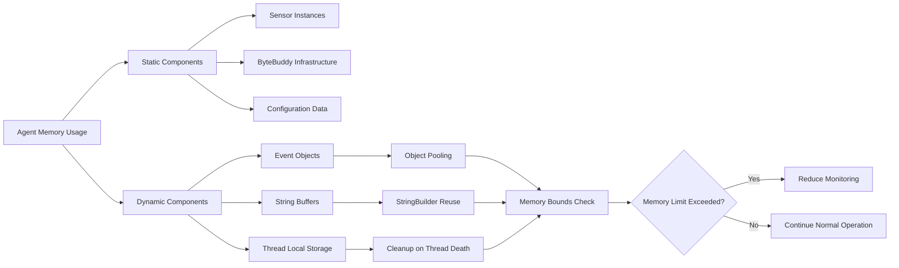

## Thread Safety Design
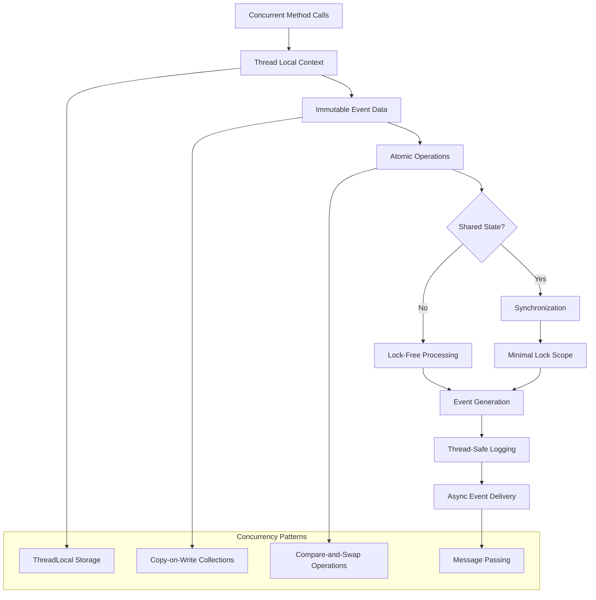

## See Also
- [Sensor Development Guide](../docs/guides/sensor-development.md)
- [Architecture Overview](../docs/architecture/README.md)
- [Event Data Flow](../docs/architecture/data-flow.md)
- [Performance Tuning](../docs/guides/performance-tuning.md)