# Common Module Architecture (prj-common)

## Overview
The prj-common module provides shared utilities, database schema management, event models, and component initialization patterns used across all JVMXRay modules.

## Module Architecture
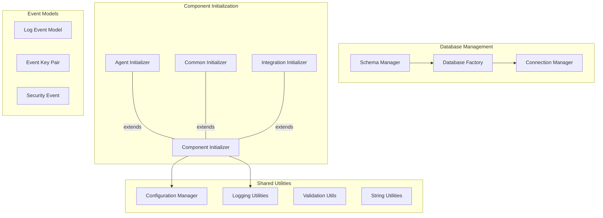

## Schema Management Architecture
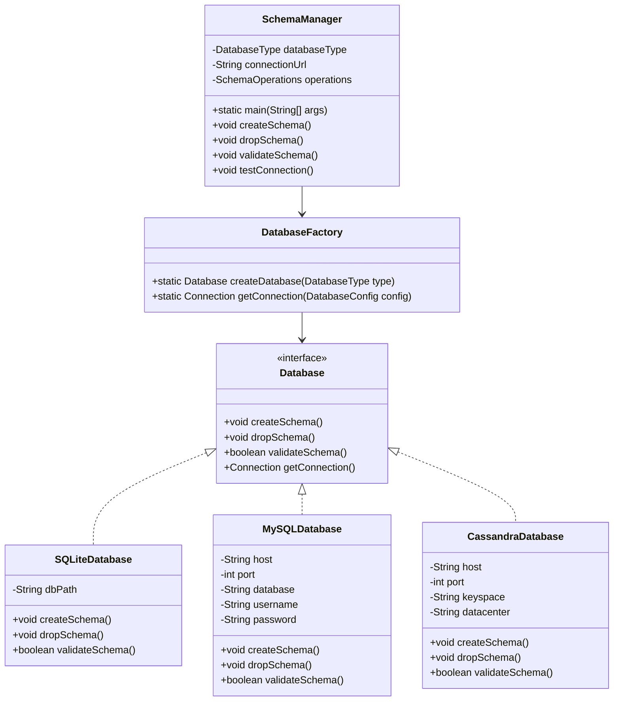

## Component Initialization System
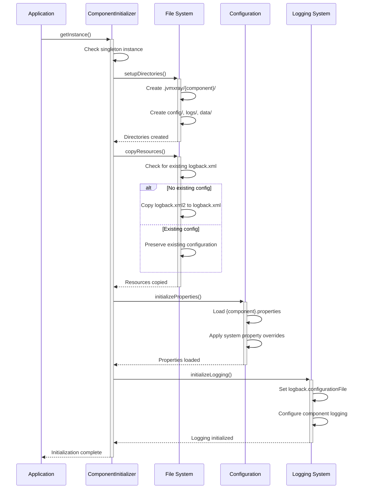

## Directory Structure Pattern
```mermaid
graph TD
    A[.jvmxray/] --> B[agent/]
    A --> C[common/]
    A --> D[integration/]
    
    B --> E[config/]
    B --> F[logs/]
    B --> G[data/]
    
    C --> H[config/]
    C --> I[logs/]
    C --> J[data/]
    
    D --> K[config/]
    D --> L[logs/]
    D --> M[data/]
    
    E --> N[logback.xml]
    E --> O[agent.properties]
    
    H --> P[logback.xml]
    H --> Q[common.properties]
    
    J --> R[jvmxray-test.db]
    
    subgraph "Component Initialization"
        S[ComponentInitializer.setupDirectories()]
        T[ComponentInitializer.copyResources()]
        U[ComponentInitializer.initializeProperties()]
    end
    
    S --> A
    T --> N
    T --> P
    U --> O
    U --> Q
```

## Database Schema Design
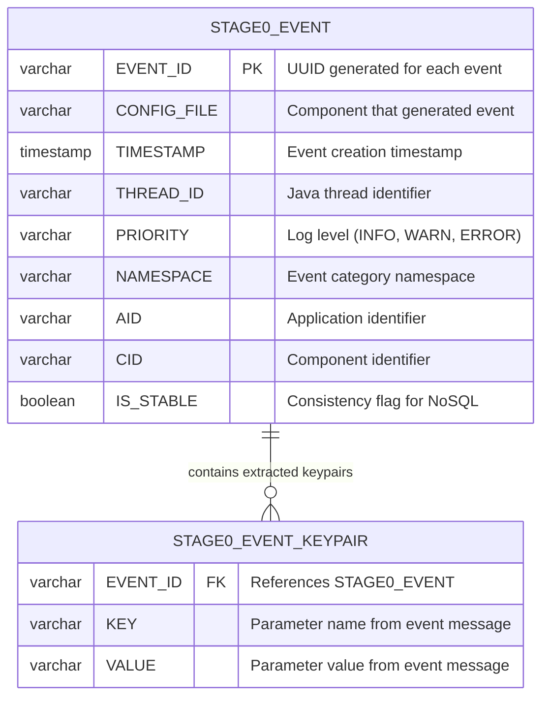

## Event Processing Flow
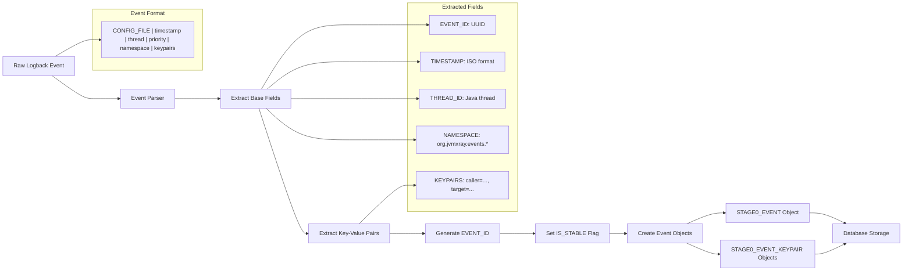

## Multi-Database Support
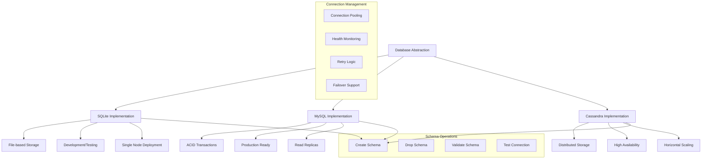

## Configuration Management
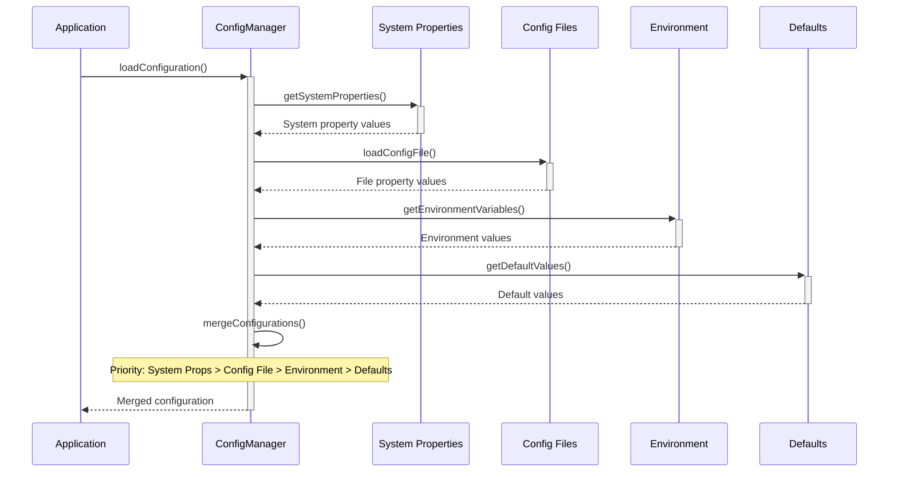

## Event Model Architecture
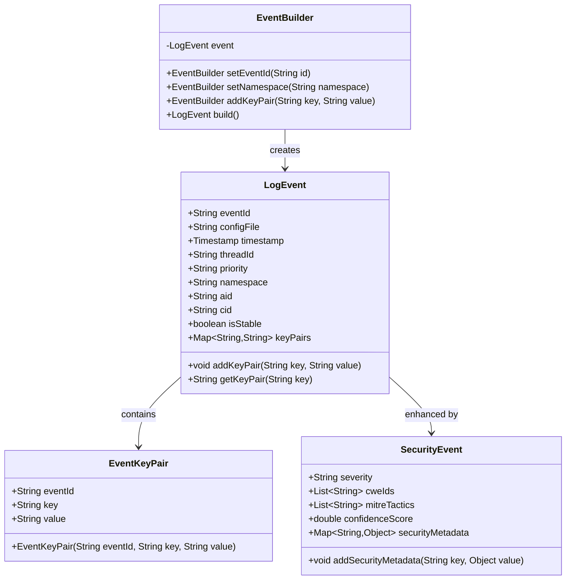

## Validation and Sanitization
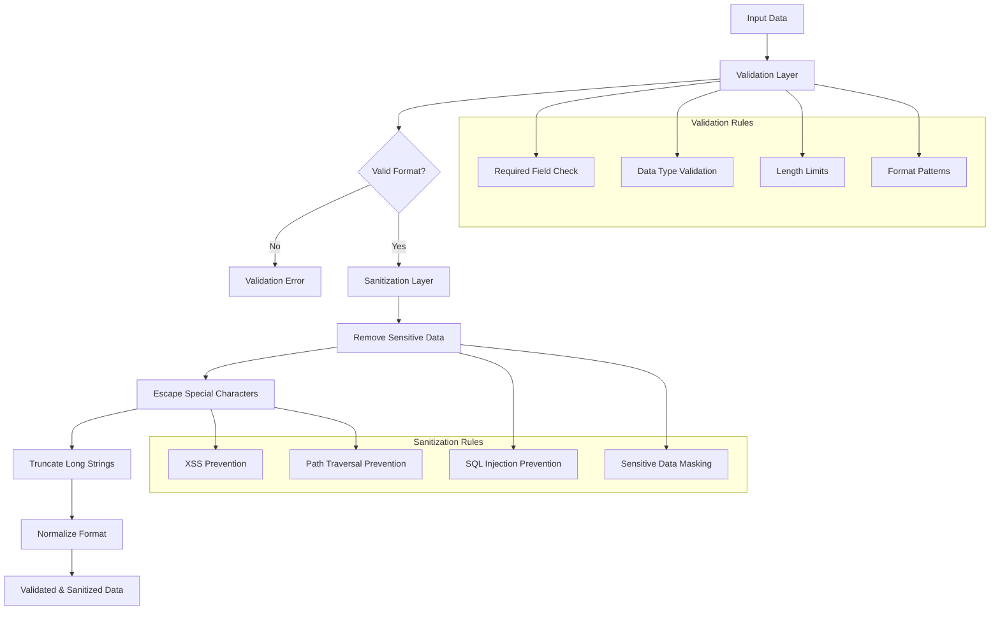

## Component Lifecycle Management
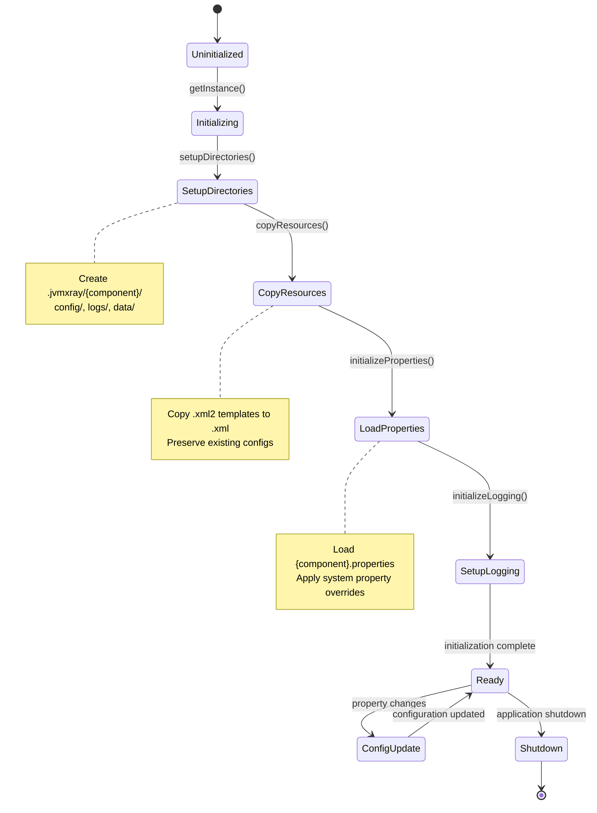

## System Properties Integration
```mermaid
graph LR
    A[System Properties] --> B{Property Type?}
    
    B -->|Home Directory| C[jvmxray.home]
    B -->|Test Directory| D[jvmxray.test.home]
    B -->|Component Logs| E[jvmxray.{component}.logs]
    B -->|Component Config| F[jvmxray.{component}.config]
    B -->|Database URL| G[jvmxray.database.url]
    
    C --> H[Production Mode]
    D --> I[Test Mode]
    
    H --> J[{jvmxray.home}/jvmxray/]
    I --> K[{jvmxray.test.home}/]
    
    E --> L[Override Default Paths]
    F --> L
    G --> M[Override Database Connection]
    
    subgraph "Validation"
        N[Mutual Exclusivity Check]
        O[Path Existence Check]
        P[Permission Check]
    end
    
    H --> N
    I --> N
    L --> O
    M --> P
```

## Module Directory Structure
```
prj-common/
├── src/main/java/org/jvmxray/platform/shared/
│   ├── bin/
│   │   └── SchemaManager.java        # CLI schema management
│   ├── database/
│   │   ├── Database.java             # Database interface
│   │   ├── DatabaseFactory.java     # Database factory
│   │   ├── SQLiteDatabase.java      # SQLite implementation
│   │   ├── MySQLDatabase.java       # MySQL implementation
│   │   └── CassandraDatabase.java   # Cassandra implementation
│   ├── model/
│   │   ├── LogEvent.java            # Event data model
│   │   ├── EventKeyPair.java        # Key-value pair model
│   │   ├── SecurityEvent.java       # Security metadata model
│   │   └── EventBuilder.java        # Event construction
│   ├── init/
│   │   ├── ComponentInitializer.java # Base initializer
│   │   ├── AgentInitializer.java    # Agent initialization
│   │   ├── CommonInitializer.java   # Common module init
│   │   └── IntegrationInitializer.java # Integration init
│   ├── config/
│   │   ├── ConfigurationManager.java # Configuration handling
│   │   ├── DatabaseConfig.java      # Database configuration
│   │   └── ComponentConfig.java     # Component configuration
│   ├── util/
│   │   ├── ValidationUtils.java     # Input validation
│   │   ├── SanitizationUtils.java   # Data sanitization
│   │   ├── StringUtils.java         # String utilities
│   │   └── LoggingUtils.java        # Logging helpers
│   └── exception/
│       ├── JVMXRayException.java    # Base exception
│       ├── DatabaseException.java   # Database errors
│       ├── ConfigurationException.java # Config errors
│       └── ValidationException.java # Validation errors
├── src/main/resources/
│   ├── schema/
│   │   ├── sqlite-schema.sql        # SQLite schema
│   │   ├── mysql-schema.sql         # MySQL schema
│   │   └── cassandra-schema.cql     # Cassandra schema
│   ├── logback.xml2                 # Logback template
│   └── common.properties            # Default properties
└── src/test/java/
    └── org/jvmxray/platform/shared/
        ├── database/                # Database implementation tests
        ├── init/                    # Initialization tests
        ├── model/                   # Model tests
        └── util/                    # Utility tests
```

## Error Handling Strategy
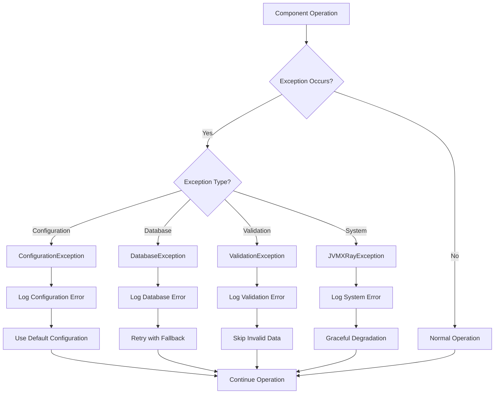

## Testing Infrastructure
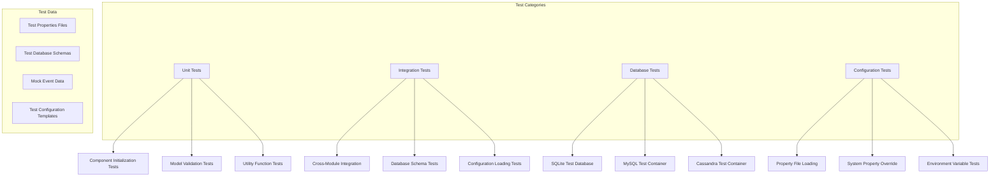

## Performance Considerations
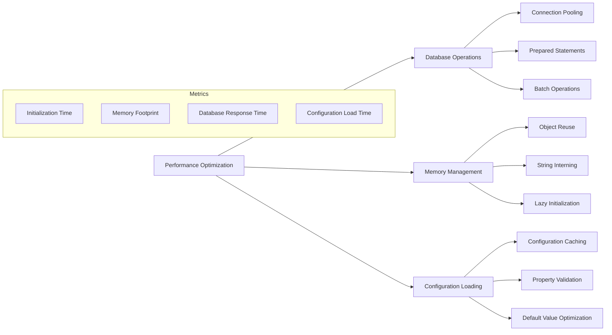

## See Also
- [Architecture Overview](../docs/architecture/README.md)
- [Database Schema Documentation](../docs/architecture/database-schema.md)
- [Component Initialization Guide](../docs/guides/component-initialization.md)
- [Configuration Reference](../docs/reference/configuration.md)