# LogService Architecture (prj-service-event-aggregator)

## Overview
The LogService is a real-time event aggregation server that receives structured security events from JVMXRay agents via TCP socket connections and stores them in the database for analysis.

## LogService Architecture
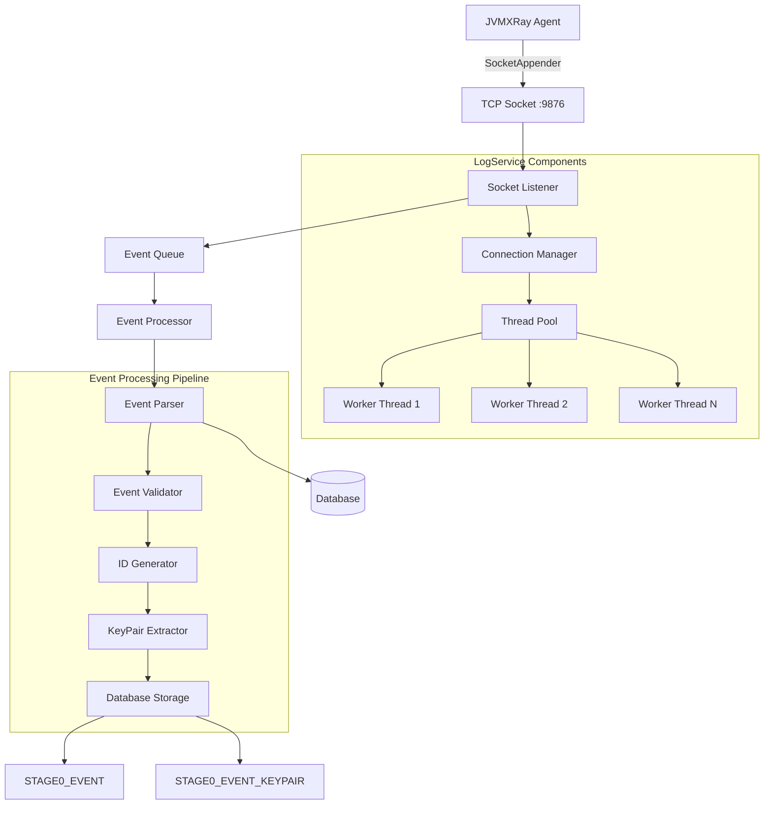

## Event Processing Flow
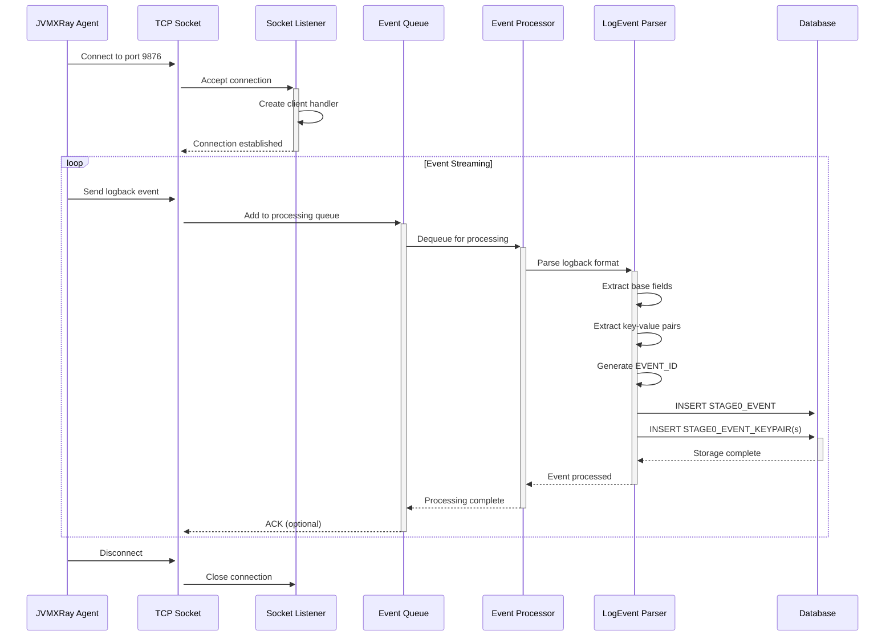

## Component Architecture
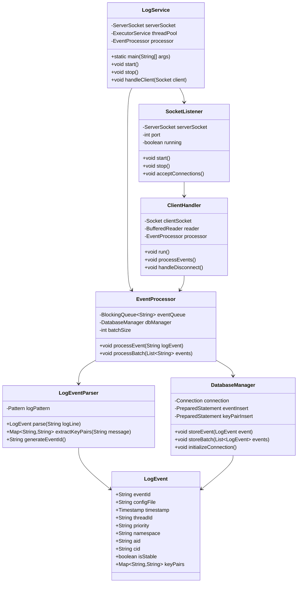

## Socket Connection Management
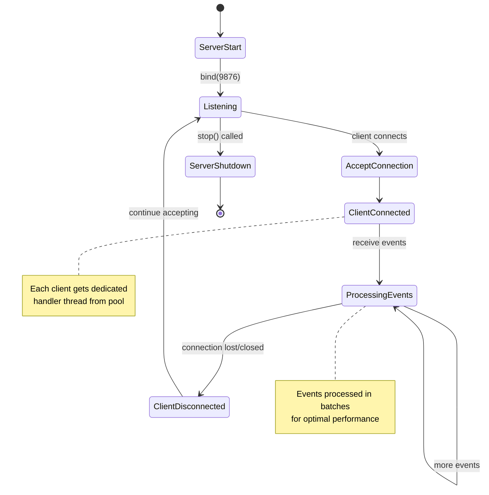

## Event Parsing Pipeline
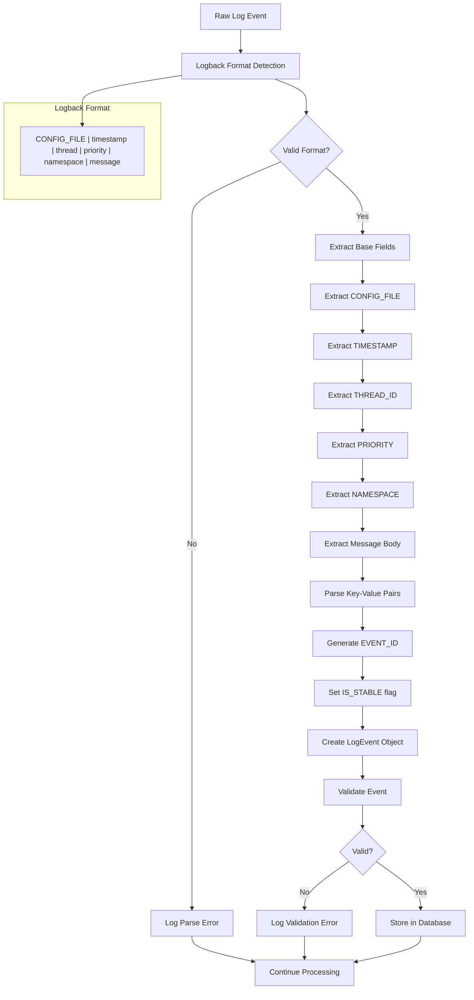

## Database Storage Strategy
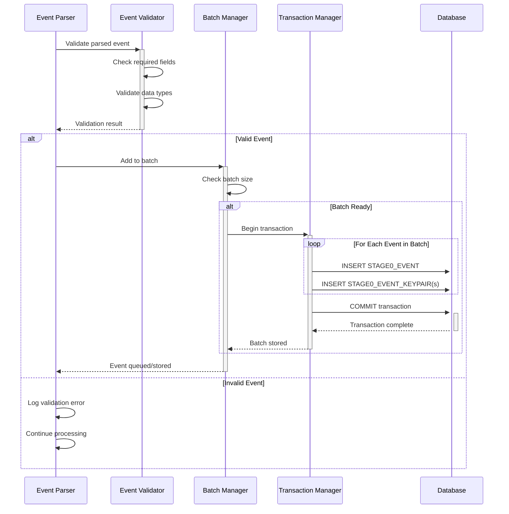

## Thread Pool Management
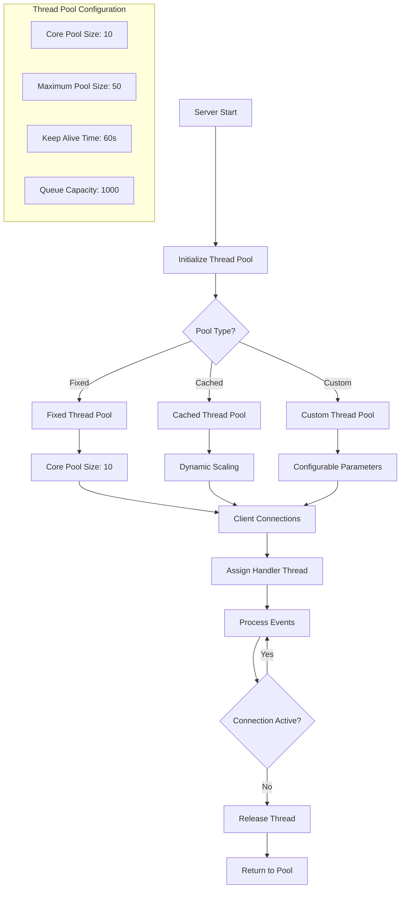

## Event Batching Strategy
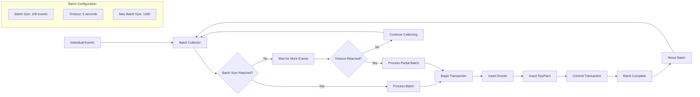

## Connection Lifecycle Management
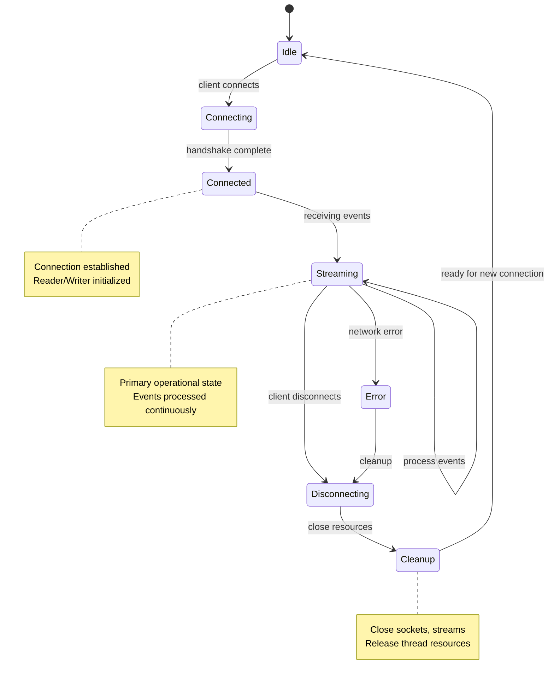

## Performance Optimization
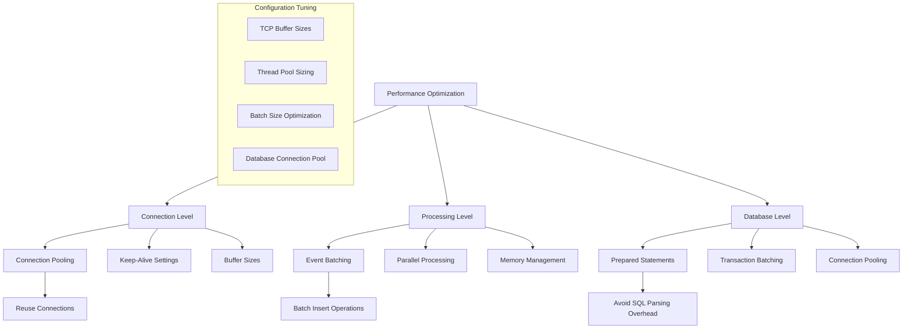

## Error Handling and Recovery
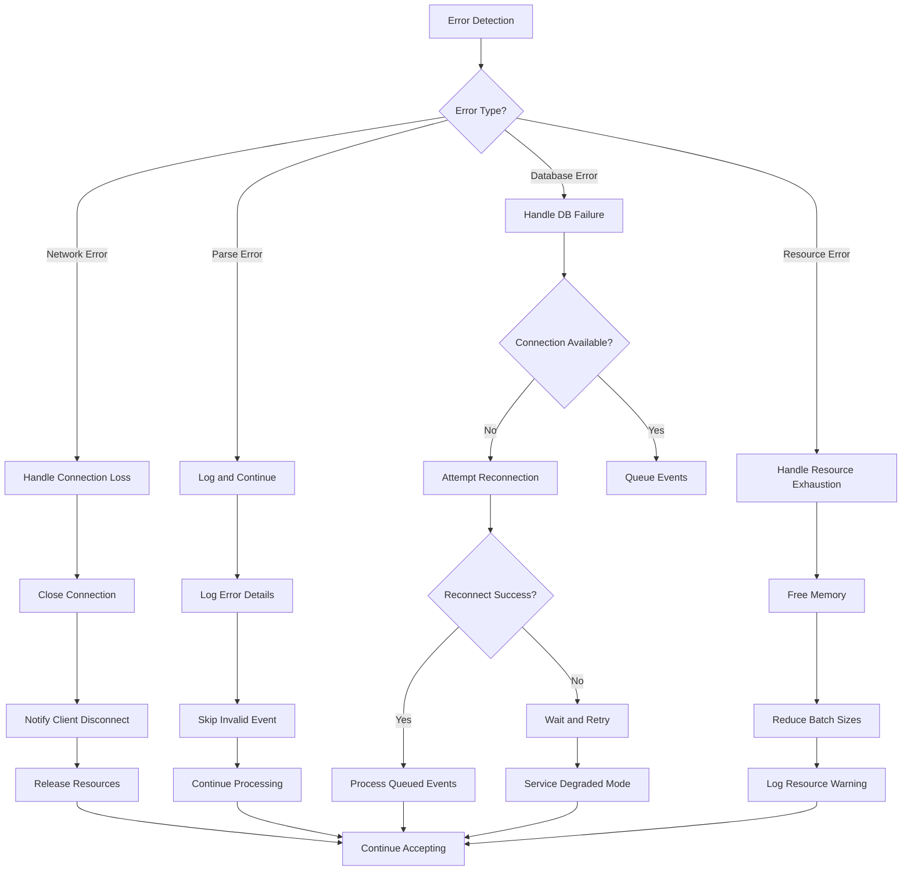

## Configuration Management
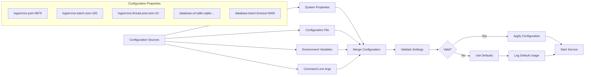

## Monitoring and Metrics
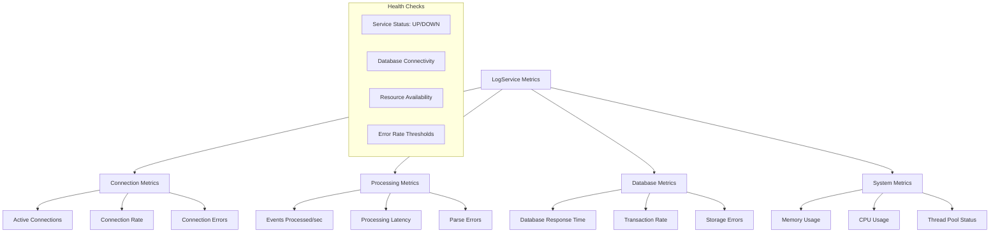

## Directory Structure
```
prj-service-event-aggregator/
├── src/main/java/org/jvmxray/service/eventAggregator/
│   ├── bin/
│   │   └── LogService.java           # Main service entry point
│   ├── server/
│   │   ├── SocketListener.java       # TCP socket management
│   │   ├── ClientHandler.java        # Client connection handling
│   │   └── ConnectionManager.java    # Connection pool management
│   ├── processor/
│   │   ├── EventProcessor.java       # Event processing pipeline
│   │   ├── LogEventParser.java       # Logback format parsing
│   │   ├── EventValidator.java       # Event validation
│   │   └── BatchProcessor.java       # Batch processing logic
│   ├── database/
│   │   ├── DatabaseManager.java      # Database operations
│   │   ├── EventStorage.java         # Event storage logic
│   │   └── ConnectionPoolManager.java # DB connection pooling
│   ├── config/
│   │   ├── ServiceConfiguration.java # Configuration management
│   │   └── MetricsConfiguration.java # Monitoring setup
│   └── util/
│       ├── ServiceInitializer.java   # Service initialization
│       ├── MetricsCollector.java     # Performance metrics
│       └── HealthChecker.java        # Service health monitoring
├── src/main/resources/
│   ├── logback.xml2                  # Logback template
│   └── service.properties            # Default configuration
└── src/test/java/
    └── org/jvmxray/service/eventAggregator/
        ├── server/                   # Server component tests
        ├── processor/                # Event processing tests
        └── integration/              # Integration tests
```

## Deployment Architecture
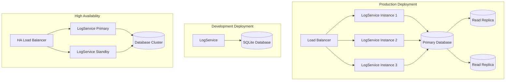

## See Also
- [Architecture Overview](../docs/architecture/README.md)
- [Data Flow Documentation](../docs/architecture/data-flow.md)
- [Database Schema](../docs/architecture/database-schema.md)
- [Performance Tuning](../docs/guides/performance-tuning.md)